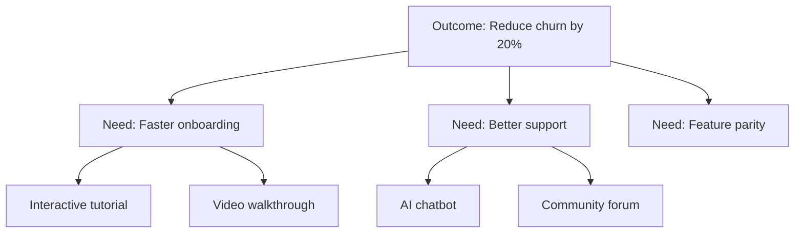

# Opportunity Solution Tree Mapping

## When to Use This Skill

Use this skill when:

- **Opportunity Mapping tasks** - Working on build opportunity solution trees using teresa torres' continuous discovery methodology. structure discovery from outcomes to opportunities to solutions to experiments
- **Planning or design** - Need guidance on Opportunity Mapping approaches
- **Best practices** - Want to follow established patterns and standards

## Overview

Opportunity Solution Trees (OST) are a visual framework developed by Teresa Torres for structuring continuous product discovery. They connect business outcomes to customer needs (opportunities) to solutions to experiments, creating clear traceability for product decisions.

## The Tree Structure

```text
                    ┌────────────────────┐
                    │      OUTCOME       │
                    │  (Business Goal)   │
                    └─────────┬──────────┘
                              │
          ┌───────────────────┼───────────────────┐
          │                   │                   │
    ┌─────┴─────┐       ┌─────┴─────┐       ┌─────┴─────┐
    │ Opportunity│       │ Opportunity│       │ Opportunity│
    │    (Need)  │       │   (Need)   │       │   (Need)   │
    └─────┬─────┘       └─────┬─────┘       └─────┬─────┘
          │                   │                   │
    ┌─────┼─────┐       ┌─────┼─────┐       ┌─────┼─────┐
    │     │     │       │     │     │       │     │     │
   Sol   Sol   Sol     Sol   Sol   Sol     Sol   Sol   Sol
    │     │     │       │     │     │       │     │     │
   Exp   Exp   Exp     Exp   Exp   Exp     Exp   Exp   Exp
```

## Layer Definitions

### Layer 1: Outcome

The measurable business goal the team is trying to achieve.

**Good outcomes are**:

- Measurable (specific metric)
- Achievable (team can influence)
- Timebound (has a deadline)
- Customer-focused (driven by customer value)

**Examples**:

- "Increase weekly active users by 20% in Q1"
- "Reduce time-to-first-value from 7 days to 1 day"
- "Improve NPS from 32 to 50 by end of year"

**Anti-patterns**:

- ❌ "Launch feature X" (output, not outcome)
- ❌ "Be the best product" (not measurable)
- ❌ "Increase revenue" (too vague)

### Layer 2: Opportunities

Customer needs, pain points, or desires that, if addressed, would drive the outcome.

**Good opportunities are**:

- Customer-focused (not company-focused)
- Generative (suggest multiple solutions)
- Solution-agnostic (don't imply specific solution)

**Discovery Methods**:

- Customer interviews
- Usability testing
- Support ticket analysis
- Survey responses
- Usage analytics
- Competitor analysis

**Opportunity Statement Template**:

```text
[Customer segment] needs a way to [need/desire]
because [context/reason].
```

**Example**:

```text
New developers need a way to understand unfamiliar codebases
because onboarding documentation is often outdated or incomplete.
```

### Layer 3: Solutions

Ideas for how to address opportunities. Multiple solutions per opportunity.

**Brainstorming Guidelines**:

- Generate at least 3 solutions per opportunity
- Include wild/creative ideas
- Consider low-effort solutions
- Look for multi-opportunity solutions

**Solution Types**:

- Feature additions
- UX improvements
- Content/documentation
- Integrations
- Workflow changes
- Automation

### Layer 4: Assumption Tests (Experiments)

Small, fast experiments to de-risk solutions before building.

**Assumption Categories**:

- **Desirability**: Will customers want this?
- **Viability**: Does this make business sense?
- **Feasibility**: Can we build this?
- **Usability**: Can customers use this?
- **Ethical**: Should we build this?

**Experiment Types**:

- Customer interviews
- Prototype tests
- Fake door tests
- Concierge tests
- A/B tests
- Surveys

## Building the Tree

### Step 1: Define Outcome

Work with leadership to clarify:

1. What metric are we trying to move?
2. What is the current baseline?
3. What is the target?
4. By when?
5. Why this metric?

### Step 2: Discover Opportunities

**Weekly Customer Interviews**:

- Interview 1-3 customers per week
- Use consistent interview structure
- Create "interview snapshots" (1-page summaries)
- Synthesize opportunities across interviews

**Interview Snapshot Template**:

```text
Date: [Date]
Customer: [Name/Type]
Context: [Their situation]

Key Insights:
1. [Insight]
2. [Insight]
3. [Insight]

Opportunities Identified:
- [Opportunity]
- [Opportunity]

Quotes:
- "[Notable quote]"
```

### Step 3: Map Opportunities

**Opportunity Mapping Session**:

1. Review recent interview snapshots
2. Cluster similar opportunities
3. Identify parent/child relationships
4. Place on tree under outcome
5. Prioritize by impact and frequency

**Prioritization Factors**:

- Frequency: How often does this come up?
- Intensity: How painful is this?
- Breadth: How many customers affected?
- Strategic fit: Does this align with company strategy?

### Step 4: Ideate Solutions

For each high-priority opportunity:

1. Set timer for 10 minutes
2. Generate 15-20 solution ideas
3. Don't evaluate during ideation
4. Mix incremental and radical ideas
5. Select top 3-5 for further exploration

### Step 5: Identify Assumptions

For each solution, list assumptions:

| Assumption Type | Question | Risk Level |
|-----------------|----------|------------|
| Desirability | Will users want this? | High |
| Usability | Can users figure this out? | Medium |
| Feasibility | Can we build this in 2 weeks? | Low |
| Viability | Will this cannibalize paid plan? | Medium |

### Step 6: Design Experiments

For each risky assumption:

1. What's the smallest test possible?
2. What would "success" look like?
3. What would "failure" look like?
4. How long will it take?

## Continuous Discovery Habits

### Weekly Rhythm

| Day | Activity |
|-----|----------|
| Monday | Interview prep, review upcoming interviews |
| Tuesday-Wednesday | Conduct 1-2 customer interviews |
| Thursday | Create interview snapshots, update tree |
| Friday | Team sync, decide next experiments |

### Interview Best Practices

**Do**:

- Ask about past behavior (not future intent)
- Use specific examples ("Tell me about the last time...")
- Ask follow-up "why" questions
- Let silence work
- Take verbatim notes

**Don't**:

- Lead with your solution
- Ask yes/no questions
- Ask about hypothetical future
- Interrupt stories
- Multi-task during interview

### Story-Based Interviewing

Instead of: "Would you use a feature that...?"

Ask: "Tell me about the last time you had to [job]. Walk me through what happened."

**Follow-up Probes**:

- "What happened next?"
- "How did that make you feel?"
- "What did you try?"
- "What was hard about that?"

## AI-Assisted Opportunity Mapping

### Tree Generation

Given an outcome and customer research, generate:

1. 5-7 opportunity clusters
2. Hierarchical opportunity structure
3. 3+ solution ideas per opportunity
4. Key assumptions per solution

### Interview Analysis

From interview transcripts:

1. Extract key insights
2. Identify opportunities
3. Capture notable quotes
4. Create interview snapshot

### Assumption Prioritization

For a solution, generate:

1. Complete assumption list (DVFUE)
2. Risk assessment per assumption
3. Suggested experiment types
4. Prioritized testing order

### Mermaid Visualization

Generate tree as Mermaid diagram:



## Integration Points

**Inputs from**:

- `jtbd-analysis` skill: Underserved outcomes → Opportunities
- `design-thinking` skill: User needs → Opportunities
- Customer research → Interview snapshots

**Outputs to**:

- `lean-startup` skill: Prioritized solutions → MVPs
- `assumption-testing` skill: Assumptions → Experiments
- Engineering backlog: Validated solutions → Stories

## References

For additional Opportunity Mapping resources, see:
