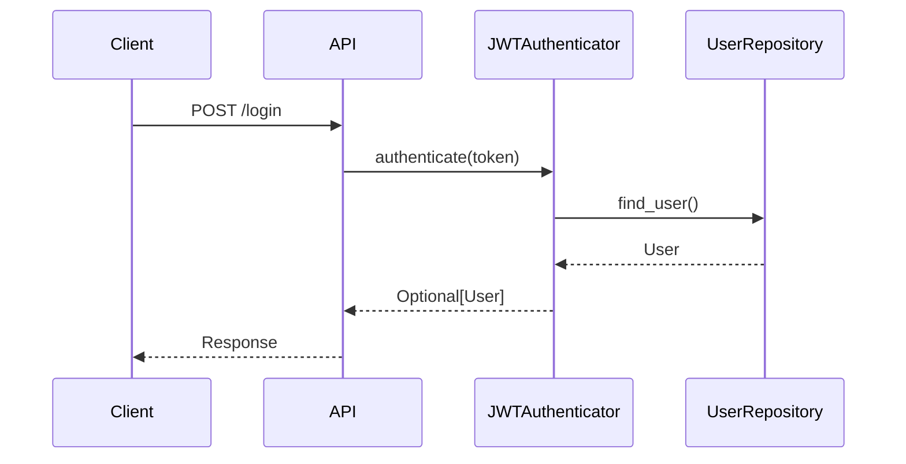

# PR Documentation with UML

This skill helps you generate high-quality Pull Request documentation by combining code diff analysis with UML visualization to clearly explain why changes were made, what was changed, and how they work.

## When to Use

- Preparing to submit a Pull Request
- Need to explain complex code changes
- Before Code Review, need detailed documentation
- Need to visualize architecture or process changes

## Workflow

### 1. Get Code Differences

First, use Git commands to get the diff between two commits or branches:

```bash
# Compare two commits
git diff <commit1> <commit2>

# Compare current branch with main branch
git diff main...HEAD

# Find branch point
git merge-base main feature-branch
```

### 2. Analyze Code Changes with Static Analysis

**This is the MOST CRITICAL step** - use static analysis tools to extract accurate code element information:

```bash
# Use the provided Python static analysis tool
python scripts/analyze_code.py <file_path>
```

The tool outputs structured information about:
- Module imports and dependencies
- Class definitions (names, bases, methods, attributes)
- Function definitions (names, parameters, return types)
- Type annotations
- Decorators

See `examples/analysis/` for detailed usage examples of how to analyze different code patterns.

### 3. Choose Appropriate UML Diagram Types

Select the most suitable UML diagram based on change type:

| Change Type | Recommended UML | Mermaid Type |
|-------------|-----------------|--------------|
| Architecture refactor, module dependencies | Package/Component diagram | `graph` |
| Add/modify class relationships | Class diagram | `classDiagram` |
| API interaction flow | Sequence diagram | `sequenceDiagram` |
| State change logic | State diagram | `stateDiagram-v2` |
| Business process changes | Flowchart | `flowchart` |
| Data model changes | ER diagram | `erDiagram` |

### 4. Generate PR Documentation

Use the provided document template (`references/PR_TEMPLATE.md`) with these sections:

1. **Change Overview** - Brief description of PR purpose
2. **Reason for Changes** - Explain why these modifications are needed
3. **Change Details** - List modified files and code
4. **Architecture/Flow Diagrams** - Visualize with Mermaid UML
5. **Implementation Details** - Explain key implementation logic
6. **Testing** - How to verify the changes
7. **Impact Scope** - List affected modules

## Critical Rules

### ⚠️ Ensure Accurate Code Element Names

This is the most critical requirement! All code elements (class names, function names, parameter names, module names) in PR docs and UML diagrams **must exactly match the actual code**.

**Correct Approach**:

1. **Always use `scripts/analyze_code.py` first** to extract actual code structure
2. Use `ReadFile` to read relevant files and verify names
3. Use `Grep` to search and confirm class/function definitions
4. Copy-paste the extracted names directly into UML diagrams

**Example Workflow**:

```bash
# 1. Analyze the modified file
python scripts/analyze_code.py src/auth/authenticator.py

# Output will show:
# Classes:
#   - JWTAuthenticator
#     Methods: authenticate(token: str) -> User
#              generate_token(user: User) -> str
#              verify_token(token: str) -> bool

# 2. Use these EXACT names in your Mermaid class diagram
```

**Wrong Approach**:
- ❌ Guess class or function names based on understanding
- ❌ Use simplified or generalized names
- ❌ Write UML code without verification

### Writing Mermaid Syntax

Check `references/MERMAID_SYNTAX.md` for complete Mermaid syntax reference including:

- Class diagram syntax and relationships
- Sequence diagram with interactions
- State diagram with transitions
- Flowchart with decision logic
- ER diagram with relationships
- Styling and annotations

## Static Analysis Tool Usage

The `scripts/analyze_code.py` tool is your primary interface for extracting accurate code information.

### Basic Usage

```bash
# Analyze a single file
python scripts/analyze_code.py path/to/file.py

# Analyze multiple files
python scripts/analyze_code.py src/module1.py src/module2.py

# Output as JSON for programmatic use
python scripts/analyze_code.py --format json path/to/file.py
```

### Output Format

The tool provides structured output including:

```
File: src/auth/authenticator.py

Imports:
  - from typing import Optional
  - from .models import User
  - import jwt

Classes:
  JWTAuthenticator(BaseAuthenticator)
    Attributes:
      - secret_key: str
      - algorithm: str
    Methods:
      + authenticate(token: str) -> Optional[User]
      + generate_token(user: User, expires_in: int = 3600) -> str
      + verify_token(token: str) -> bool
      - _decode_token(token: str) -> dict
    Decorators: []

Functions:
  create_authenticator(config: dict) -> JWTAuthenticator
    Parameters: config: dict
    Returns: JWTAuthenticator
```

### Analysis Examples

See `examples/` directory for executable examples:

- `01_basic_class_analysis.py` - Analyzing simple classes
- `02_inheritance_analysis.py` - Analyzing class hierarchies
- `03_decorator_analysis.py` - Handling decorators and properties

Each example can be run directly:

```bash
python3 examples/01_basic_class_analysis.py
```

Or imported as a module to use the analysis functions in your own code.

All examples have corresponding tests in `tests/` directory to verify correctness.

## Example Workflow

Suppose you're documenting a PR that adds user authentication:

```bash
# 1. View the diff
git diff main...feature/auth

# 2. Analyze the new authentication module
python scripts/analyze_code.py src/auth/authenticator.py

# Output shows:
# Classes:
#   JWTAuthenticator(BaseAuthenticator)
#     Methods: authenticate(token: str) -> Optional[User]

# 3. Create sequence diagram using EXACT names
```

In your PR documentation:

````markdown
## Authentication Flow

The new `JWTAuthenticator` class handles token-based authentication:


````

## Best Practices

1. **Analyze Before Drawing** - Always run static analysis first
2. **Verify Names** - Cross-check extracted names with `ReadFile` or `Grep`
3. **Choose Appropriate Granularity** - Don't show too many details in one diagram
4. **Use Multiple Diagrams** - Show changes from different angles (architecture → class → flow)
5. **Add Annotations** - Include key explanations in UML diagrams
6. **Maintain Consistency** - Keep naming consistent across diagrams
7. **Test Rendering** - Ensure Mermaid code renders correctly

## Reference Materials

- `references/PR_TEMPLATE.md` - PR documentation template
- `references/MERMAID_SYNTAX.md` - Complete Mermaid syntax reference
- `scripts/analyze_code.py` - Python code static analysis tool
- `examples/` - Executable Python examples demonstrating analysis usage
- `tests/` - Comprehensive test suite validating analysis accuracy

## Output Format

The generated PR documentation should be a Markdown file containing:

- Clear section structure
- Renderable Mermaid code blocks (using \`\`\`mermaid)
- Accurate code references (wrapped in backticks)
- Code snippets when necessary
- Well-illustrated explanations

The document should allow reviewers to:
1. Quickly understand the change intent
2. Understand architecture/flow changes through UML diagrams
3. Verify implementation is reasonable
4. Identify potential issues
5. Trust that all code element names are accurate
