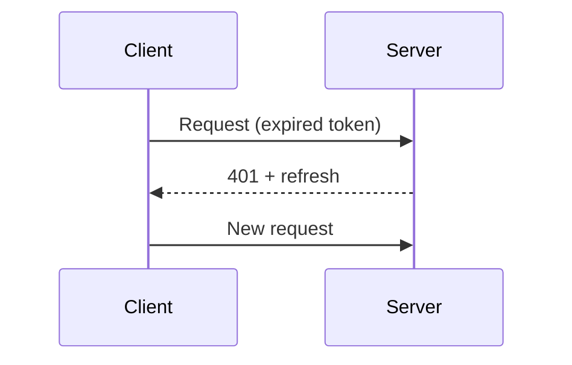

# DEVFLOW: Agent Development

5-phase workflow for coordinated multi-agent development.

## ⚠️ MANDATORY: 100% Issue/Task Coverage

**Every phase must verify that 100% of original issue/task requirements are being addressed.**

- Phase 1: Extract ALL requirements from original issue
- Phase 2: Dispatch agents with complete requirement lists
- Phase 3: Review must verify 100% coverage before quality check
- Phase 5: Cannot merge until 100% of original requirements implemented

**Incomplete implementations = SEND BACK, do not proceed.**

## Phase 1: Oracle Assessment

- Assess codebase state with Oracle
- Identify completed work, remaining work, dependencies
- **Extract ALL requirements from original issue/task** (`gh issue view <number>`)
- Break down into parallelizable tasks ensuring ALL requirements are covered

## Phase 2: Parallel Implementation

Dispatch Docker agents:
- Clone repo, format locally (`cargo +nightly fmt`)
- Branch as `feat/name` or `fix/name`
- Open PR to correct base branch with **`Closes #X` in body**
- Never push to existing branches

**PR MUST include issue links:**
- `Closes #X` or `Fixes #X` for issues being addressed
- "Related Issues" section in PR body
- Verify: `gh pr view --json closingIssuesReferences`

## Phase 3: Ultra-Critical Review

After CI passes, run 6-pass review:

| Pass | Focus |
|------|-------|
| **0.5** | **100% issue/task coverage verification (MANDATORY FIRST)** |
| 1 | Runtime/compile failures |
| 2 | Patterns, imports, dead code |
| 3 | Abstractions, hard-coded values |
| 4 | Environment compatibility |
| 5 | Verification commands |
| 6 | Context synthesis |

**CRITICAL**: Pass 0.5 (issue coverage) MUST pass before proceeding. If coverage < 100%, send agent back immediately.

### Review Escalation

1. **Escalate to coordinator first** — Architecture/tradeoff questions
2. **Coordinator applies good judgment** — Based on codebase patterns
3. **Escalate to human when needed** — Significant risk or uncertainty

### Review Timing

- **Pre-PR review**: After agent work, before PR creation
- **Post-PR review**: After PR creation, before merge

## Phase 4: Human Approval

**Pause for:** PR approval, complex decisions requiring human judgment.

**Continue through:** workstream setup, agent dispatch, CI fixes, review feedback.

## Phase 4.5: FINAL COVERAGE GATE

**MANDATORY**: Before any merge, perform LINE-BY-LINE requirement verification.

```bash
# Extract ALL requirements from issue
gh issue view <number> --json body --jq '.body' | grep -E "^\- \["
gh issue view <number>
```

**Create verification table:**

```markdown
| Requirement | Status | Evidence |
|-------------|--------|----------|
| [from issue] | ✅ | `file:line` |
| [from issue] | ❌ MISSING | Not in PR |
| [from issue] | ⚠️ PARTIAL | [what's missing] |

**Honest Assessment**: X% (Y of Z requirements)
```

| Coverage | Action |
|----------|--------|
| **100%** | ✅ Proceed to merge |
| **< 100%** | ❌ Return to Phase 2 with line-by-line gap list |

## Phase 5: Merge & Continue

**Before merge, verify issue linking:**
```bash
gh pr view <NUMBER> --json closingIssuesReferences
# Must show linked issues - if empty, send back to fix
```

Merge PRs in dependency order. **Only after Final Coverage Gate passes AND issues are linked.** Issues auto-close on merge.

---

## Mermaid Diagrams in Reviews and PRs

**Reviews and PRs SHOULD include Mermaid diagrams when changes involve flows, states, or architecture.**

| Change Type | Diagram |
|-------------|---------|
| Flow change | `flowchart` before/after |
| API modification | `sequenceDiagram` |
| State handling | `stateDiagram-v2` |
| Architecture change | `flowchart` with subgraphs |

Example in review:
````markdown
### New Token Flow

````

---

## Anti-Patterns

| Wrong | Right |
|-------|-------|
| **Merge with incomplete coverage** | **100% of issue requirements implemented first** |
| **PR without issue links** | **Every PR has `Closes #X` for related issues** |
| Push to branch | Feature branch + PR |
| Checkbox review | 6-pass analysis (starting with coverage check) |
| Coordinator implements | Dispatch agents |
| Pause every step | Pause for PR decisions |
| Skip CI | Wait for CI |
| **"Core requirements done"** | **ALL requirements done, no exceptions** |
| **Merge then close issue manually** | **Use `Closes #X` for auto-close on merge** |
| **Text-only complex changes** | **Mermaid diagrams for flows/states** |
