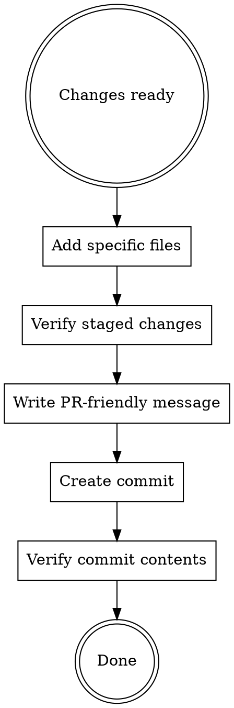

# Making Git Commits

## Overview

Create clean, PR-friendly commits with explicit file staging and verification. **Core principle:** Only commit files you modified, verify what's staged, and write commit messages suitable as GitHub PR titles.

**Following the letter IS following the spirit.** The workflow below is not negotiable—skipping steps to "save time" creates more work later.

## When to Use

Use this skill when:
- About to commit changes to git
- User asks you to create a commit
- Finished implementing a feature or fix
- Need to ensure clean, verifiable commits

## Best Practice Workflow



### Step-by-Step Process

1. **Stage only files you modified**
   ```bash
   # ✅ Explicitly list files
   git add path/to/file1.py path/to/file2.py

   # ❌ NEVER use these (includes unrelated changes)
   git add -A
   git add .
   git commit -a
   ```

2. **Verify what will be committed**
   ```bash
   # REQUIRED: Shows exactly WHAT changed, not just WHICH files
   git diff --cached
   ```

   **Never skip this step.** `git status` is NOT enough—it only shows file names, not actual changes.

3. **Create commit with PR-friendly message**
   ```bash
   git commit -m "$(cat <<'EOF'
   Short description (50-72 chars)

   - Highlight key features
   - Explain what and why
   - Be concise and clear
   EOF
   )"
   ```

4. **Verify commit after creation**
   ```bash
   # Confirm only your changes were included
   git show --stat
   ```

## Commit Message Format

### Structure

**First line:** (50-72 characters)
- Short, standalone description suitable as PR title
- Imperative mood ("Add feature" NOT "Added feature")
- Capitalize first letter
- NO period at end
- Check for project-specific prefixes (e.g., `[component]`, scope tags)

**Body:** (after blank line)
- Concise bullet points
- Highlight key features
- Explain "what" and "why" (not "how")
- Suitable for GitHub PR description

### Project-Specific Conventions

**ALWAYS check project documentation first:**
- CLAUDE.md - Project-specific guidelines
- AGENTS.md - Workflow and conventions
- CONTRIBUTING.md - Contribution guidelines
- README.md - May contain commit conventions

**Look for:**
- Scope prefixes (e.g., `[tool-name]`, `feat:`, `fix:`)
- Commit message templates
- Branch naming requirements
- Special tagging conventions

**When conventions exist, follow them exactly. When unsure, check documentation—don't guess.**

### Examples

✅ **Good - With scope prefix:**
```
[api] Add rate limiting middleware

- Implements token bucket algorithm
- Configurable per-endpoint limits
- Includes retry-after headers
```

✅ **Good - Without scope prefix:**
```
Add centralized error handling

- Creates unified error response format
- Adds logging for all errors
- Improves client error messages
```

✅ **Good - Conventional commits:**
```
feat(auth): add OAuth2 provider support

- Implements authorization code flow
- Adds token refresh mechanism
- Includes session management
```

❌ **Bad - Multiple violations:**
```
updated some files and fixed bugs.
```
Violations: Past tense, period at end, too vague, not PR-friendly

## Common Mistakes

| Mistake | Why Bad | Fix |
|---------|---------|-----|
| `git add -A` | Commits unrelated WIP | Stage files explicitly by path |
| `git add .` | Commits everything in directory | Stage specific files |
| `git commit -a` | Commits all tracked changes | Stage explicitly first |
| Skip `git diff --cached` | Don't see what you're committing | Always verify before commit |
| Past tense message | Not standard convention | Use imperative: "Add" not "Added" |
| Period at end of first line | Not PR title format | Remove trailing period |
| Long first line (>72 chars) | Hard to read in git log | Keep under 72 characters |
| No blank line before body | Formatting issue | Always add blank line |
| Vague descriptions | Unclear what changed | Be specific about changes |

## Red Flags - STOP and Fix

These thoughts mean you're about to violate the rules:
- "I'll just use `git add -A` to save time"
- "I don't need to verify, I know what I changed"
- "This is just a small change, message doesn't matter"
- "The user is in a hurry, I'll cut corners"
- "Verification is just bureaucracy"
- "`git status` is good enough for verification"
- "Simple commits don't need the full format"
- "The character limit is just a guideline"
- "I'll check for project conventions if I see them"
- "Following the spirit matters more than the letter"

**All of these mean: STOP. Follow the process exactly. No shortcuts, no exceptions.**

## The Iron Law

**NEVER skip verification.** Not for trivial commits, not under time pressure, not ever.

Every step in the workflow exists because skipping it causes problems:
- Skip explicit staging → commit unrelated files
- Skip `git diff --cached` → surprising changes in commits
- Skip message format → unclear git history, difficult reviews
- Skip `git show --stat` → don't know what you actually committed

## Why This Matters

**Time pressure is not an excuse.** This workflow takes 30-60 seconds and prevents:
- Committing unrelated WIP files
- Surprising changes in commits
- Unclear git history
- Difficult code reviews
- Hard-to-revert commits

**Evidence before assertions.** Before claiming "changes committed," verify exactly what went into the commit.

## Quick Reference

```bash
# 1. Stage specific files only
git add path/file1 path/file2

# 2. Verify what's staged
git diff --cached

# 3. Commit with proper message (check project conventions!)
git commit -m "$(cat <<'EOF'
Short description

- Key change 1
- Key change 2
EOF
)"

# 4. Verify commit
git show --stat
```

## Rationalizations Table

| Excuse | Reality |
|--------|---------|
| "Too simple to verify" | Verification takes 5 seconds, catches mistakes |
| "I know what I changed" | Memory is fallible, unrelated files sneak in |
| "User is in a hurry" | Bad commits create more work later |
| "It's just debugging code" | Debug code shouldn't be committed |
| "`git status` is enough" | `git diff --cached` shows WHAT changed, not just WHICH files |
| "Message doesn't matter for small commits" | Small commits accumulate, unclear history compounds |
| "Simple commits don't need body" | All commits need proper format for consistency |
| "Character limit is a suggestion" | It's a requirement—longer messages break tools |
| "I'll check conventions if needed" | ALWAYS check first, don't assume |
| "Following spirit > letter" | Following the letter IS following the spirit |
