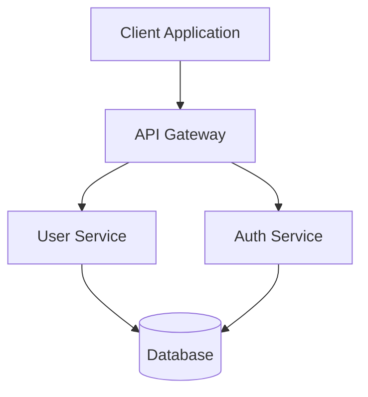
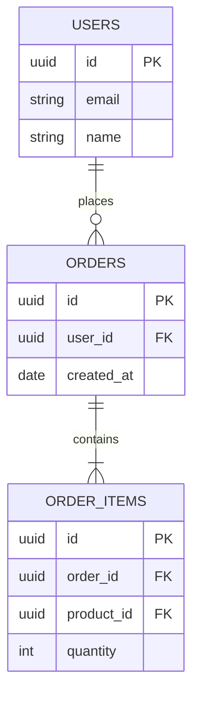
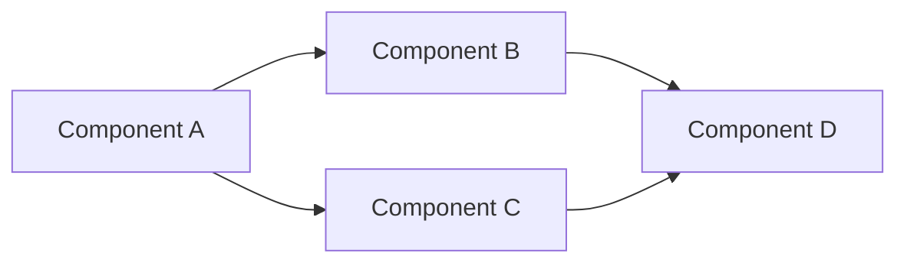
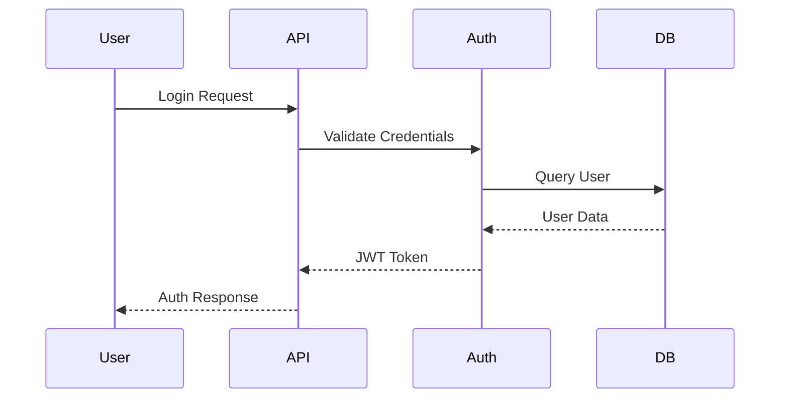

**References (archive):** [SCAFFOLD_SKILLS_ARCHIVE_MAP.md](../../docs/SCAFFOLD_SKILLS_ARCHIVE_MAP.md) — Mermaid/output patterns from claude-flow code-intelligence, everything-claude-code architect.

<identity>
Diagram Generator Skill - Generates architecture, database, and system diagrams using Mermaid syntax to visualize system structure, relationships, and flows.
</identity>

<capabilities>
- Creating architecture diagrams
- Documenting database schemas
- Visualizing component relationships
- Documenting data flows
- Creating sequence diagrams
- Generating system overviews
</capabilities>

## Processing Limits (Memory Safeguard)

Diagram generator can analyze large codebases. To prevent memory exhaustion:

- **File chunk limit: 1000 files per diagram (HARD LIMIT)**
- Each file: ~1-5 KB analysis overhead
- 1000 files × 2 KB = ~2 MB per diagram
- Keeps diagram generation memory-efficient

**Why the limit?**

- Analyzing 5000+ files → 10+ MB memory → context explosion
- Diagrams for 5000+ files → impossible to visualize
- Visual limit: ~100-200 nodes per diagram (human readable)

**Recommend:**

- 1000 files: OK, generates ~100-150 component nodes
- 2000 files: Consider splitting into 2 diagrams
- 5000+ files: MUST split into 5+ diagrams by module/subsystem

<instructions>
<execution_process>

### Step 1: Identify Diagram Type

Determine what type of diagram is needed:

- **Architecture Diagram**: System structure and components
- **Database Diagram**: Schema and relationships
- **Component Diagram**: Component interactions
- **Sequence Diagram**: Process flows
- **Flowchart**: Decision flows

### Step 2: Extract Structure

Analyze code and documentation (Use Parallel Read/Grep/Glob):

- Read architecture documents
- Analyze component structure
- Extract database schema
- Identify relationships
- Understand data flows

### Chunking Large Codebases

If codebase has >1000 files:

**Option 1: Split by subsystem**

```javascript
// Generate diagram for each major subsystem
generateDiagram({ files: 'src/auth/**', title: 'Authentication Module' });
generateDiagram({ files: 'src/api/**', title: 'API Module' });
generateDiagram({ files: 'src/ui/**', title: 'UI Module' });
```

**Option 2: Split by layer**

```javascript
generateDiagram({ files: 'src/models/**', title: 'Data Models' });
generateDiagram({ files: 'src/services/**', title: 'Business Logic' });
generateDiagram({ files: 'src/controllers/**', title: 'API Controllers' });
```

**Option 3: Generate overview first, then details**

```javascript
// 1. High-level architecture (10-20 files)
generateDiagram({ files: ["src/index.ts", "src/app.ts", ...], title: "Architecture" });
// 2. Detailed subsystems (500-1000 files each)
generateDiagram({ files: "src/auth/**", title: "Authentication Details" });
```

### Step 3: Generate Mermaid Diagram

Create diagram using Mermaid syntax:

- Use appropriate diagram type
- Define nodes and relationships
- Add labels and descriptions
- Include styling if needed

### Step 4: Embed in Documentation

Embed diagram in markdown:

- Use mermaid code blocks
- Add diagram description
- Reference in documentation

### Timeout Management

- Default timeout: 30 seconds per diagram
- 1000 files analysis: ~20 seconds (OK)
- 2000 files analysis: ~40 seconds (EXCEEDS TIMEOUT)
- If approaching timeout: Reduce file count or increase timeout

**Pattern for large codebases:**

- Split into 6-8 focused diagrams
- Each <1000 files, <30 seconds
- Total analysis time: 3-4 minutes

</execution_process>

<integration>
**Integration with Architect Agent**:
- Generates architecture diagrams
- Documents system structure
- Visualizes component relationships

**Integration with Database Architect Agent**:

- Generates database schema diagrams
- Documents table relationships
- Visualizes data models

**Integration with Technical Writer Agent**:

- Embeds diagrams in documentation
- Creates visual documentation
- Enhances documentation clarity
  </integration>

<best_practices>

1. **Use Mermaid**: Standard syntax for compatibility
2. **Keep Clear**: Simple, readable diagrams
3. **Show Relationships**: Include all important connections
4. **Add Labels**: Clear node and edge labels
5. **Update Regularly**: Keep diagrams current with code
   </best_practices>
   </instructions>

<examples>
<code_example>
**Architecture Diagram**



</code_example>

<code_example>
**Database Schema Diagram**



</code_example>

<code_example>
**Component Diagram**



</code_example>

<code_example>
**Sequence Diagram**



</code_example>
</examples>

<examples>
<usage_example>
**Example Commands**:

```bash
# Generate architecture diagram
node .claude/tools/diagram-generator/scripts/generate.mjs --type architecture "authentication system"

# Generate database schema diagram
node .claude/tools/diagram-generator/scripts/generate.mjs --type database "user management module"

# Generate component diagram
node .claude/tools/diagram-generator/scripts/generate.mjs --type component "API service relationships"

# Generate sequence diagram
node .claude/tools/diagram-generator/scripts/generate.mjs --type sequence "user login flow"
```

</usage_example>
</examples>

## Memory Protocol (MANDATORY)

**Before starting:**
Read `.claude/context/memory/learnings.md`

**After completing:**

- New pattern -> `.claude/context/memory/learnings.md`
- Issue found -> `.claude/context/memory/issues.md`
- Decision made -> `.claude/context/memory/decisions.md`

> ASSUME INTERRUPTION: If it's not in memory, it didn't happen.
