# Diagramming

## Overview

Create clear, maintainable technical diagrams using Mermaid syntax. This skill covers architecture diagrams, sequence diagrams, entity-relationship diagrams, flowcharts, and state diagrams for documenting software systems.

## Instructions

### 1. Choose the Right Diagram Type

| Diagram Type    | Use When                                |
| --------------- | --------------------------------------- |
| Architecture/C4 | Showing system structure and components |
| Sequence        | Showing interactions over time          |
| ERD             | Showing data models and relationships   |
| Flowchart       | Showing decision logic and processes    |
| State           | Showing state transitions               |

### 2. Mermaid Syntax Patterns

**Direction Control:**

- `flowchart TB` - Top to bottom
- `flowchart LR` - Left to right
- `sequenceDiagram` - Automatic top-down layout

**Node Shapes:**

- `[Rectangle]` - Process
- `(Rounded)` - Start/end
- `{Diamond}` - Decision
- `[(Database)]` - Storage
- `((Circle))` - Connection point

**Arrow Types:**

- `-->` Solid line (flow)
- `-.->` Dotted line (optional)
- `->>` Thick line (message)
- `-->>` Dotted message
- `==>` Extra thick (emphasis)

**Subgraphs for Grouping:**

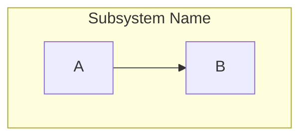

### 3. General Principles

- Keep diagrams focused on one concept
- Use consistent naming conventions
- Add descriptive labels to relationships
- Limit complexity (split large diagrams)
- Use comments for documentation

## Best Practices

- **Simplicity**: One diagram, one concept
- **Consistency**: Same naming across related diagrams
- **Readability**: Left-to-right or top-to-bottom flow
- **Labels**: Always label relationships and transitions
- **Context**: Include a title and brief description

## Examples

### Architecture Diagrams (C4 Model)

The C4 model provides hierarchical system visualization:

- **Level 1 (Context)**: System in its environment, external dependencies
- **Level 2 (Container)**: High-level technical building blocks (apps, databases, services)
- **Level 3 (Component)**: Internal structure of containers (classes, modules)

Use C4 for architecture documentation, onboarding new developers, and stakeholder communication.

#### Context Diagram (Level 1)

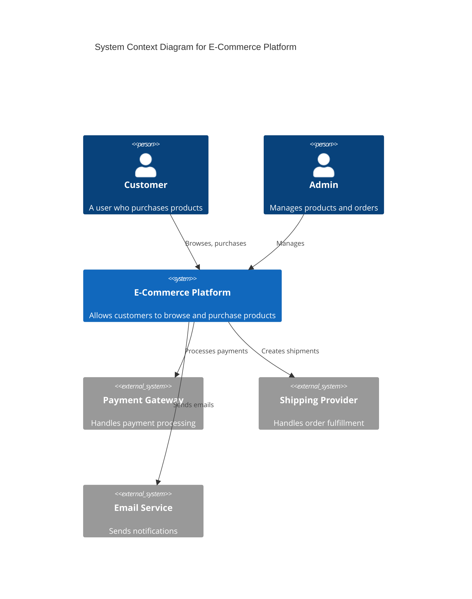

#### Container Diagram (Level 2)

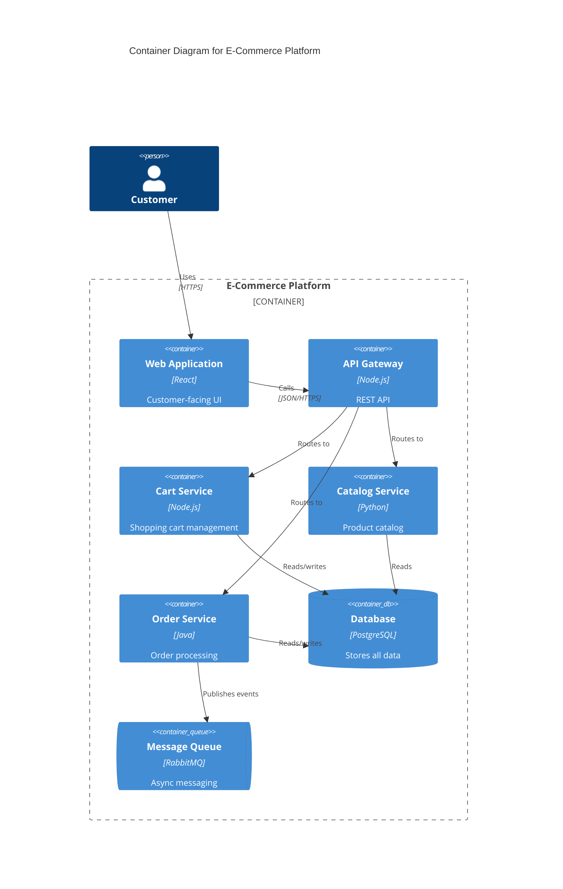

#### Component Diagram (Level 3)

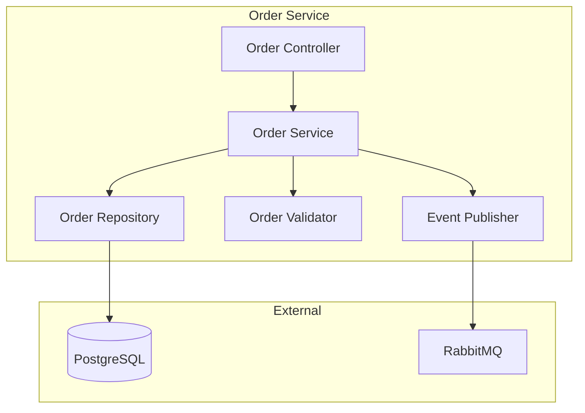

### Sequence Diagrams

Use for API flows, request/response cycles, distributed system interactions, and multi-service communication.

**Key Patterns:**

- `participant` - Define actors upfront
- `autonumber` - Add step numbers
- `alt/else/end` - Conditional flows
- `loop/end` - Repeated operations
- `par/end` - Parallel operations
- `Note over A,B` - Add explanatory notes

#### Basic Request Flow

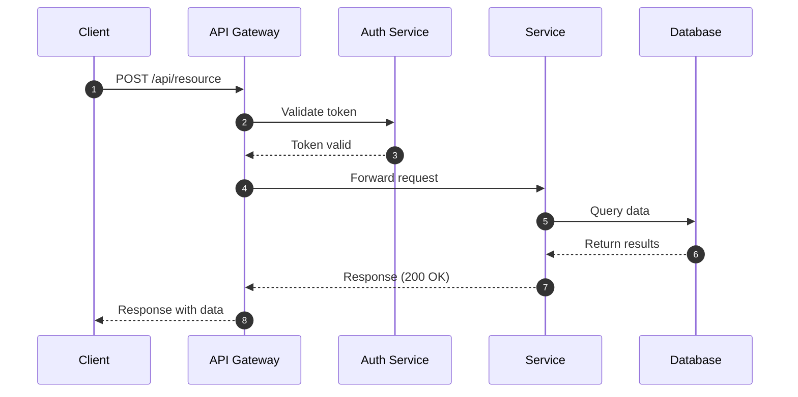

#### Error Handling Flow

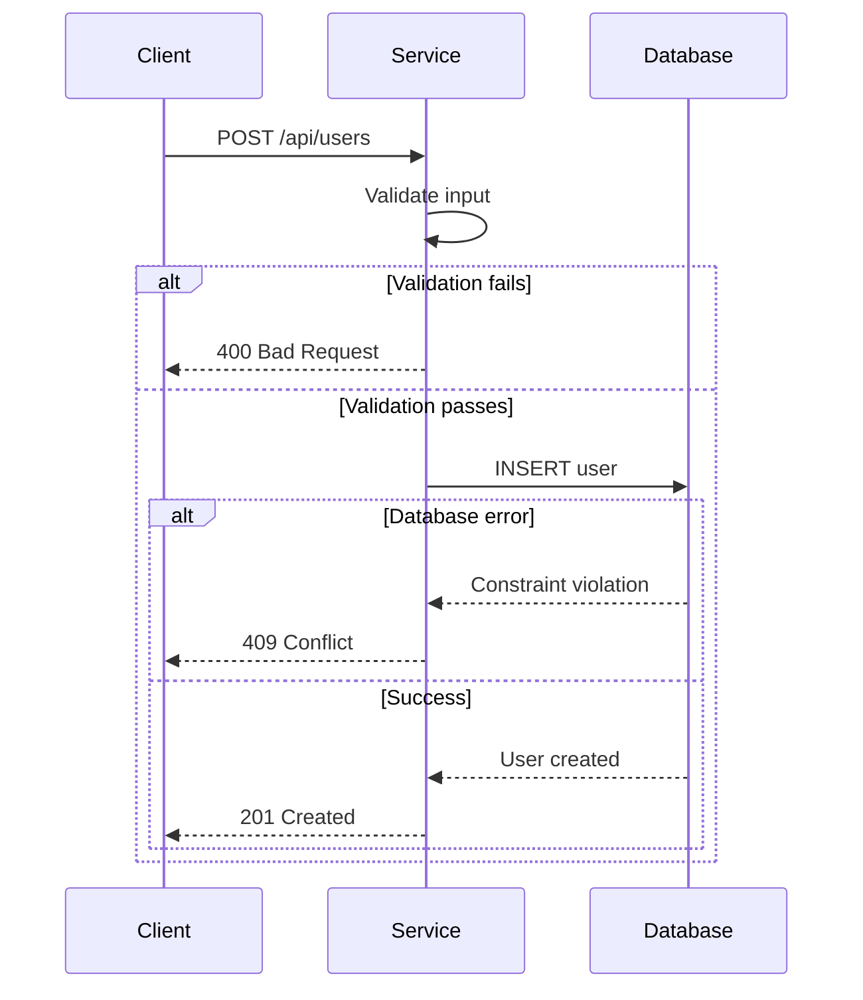

#### Async Processing

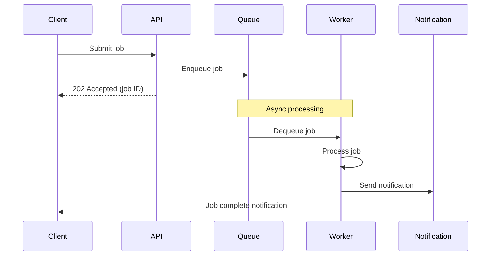

#### API Authentication Flow

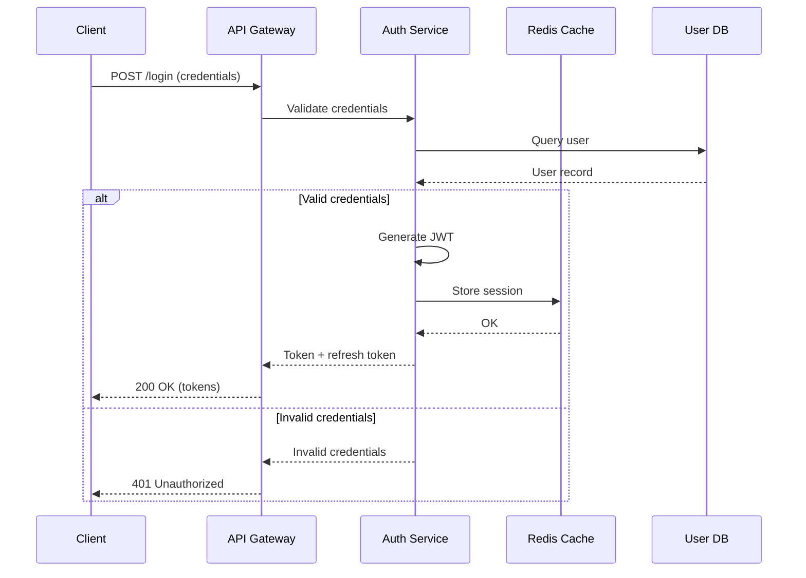

#### Microservices Communication

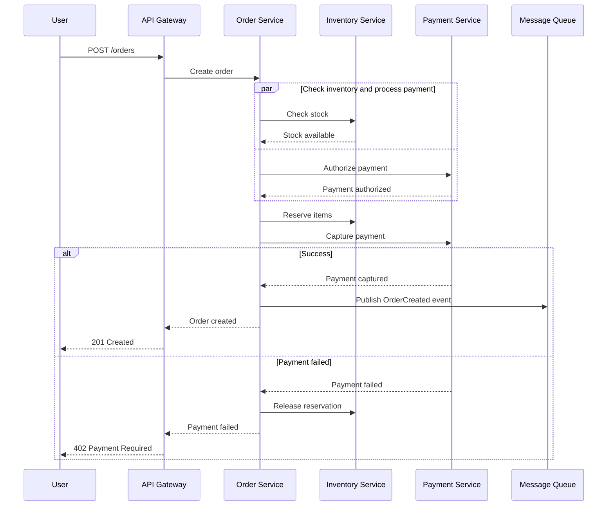

### Entity-Relationship Diagrams

Use for database schema design, data model documentation, and relationship mapping.

#### Basic ERD

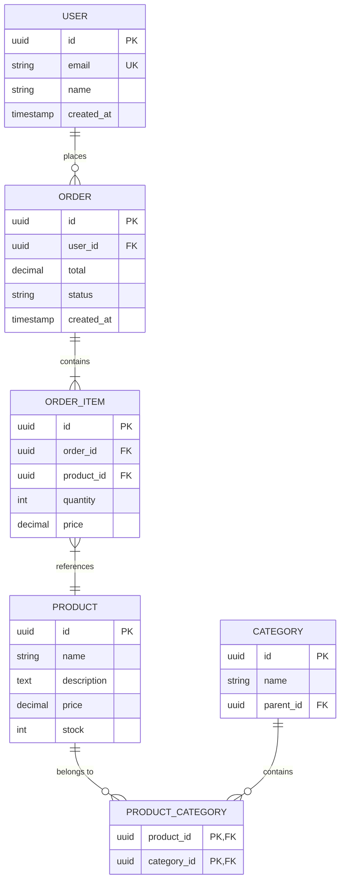

#### ERD with Relationships Explained

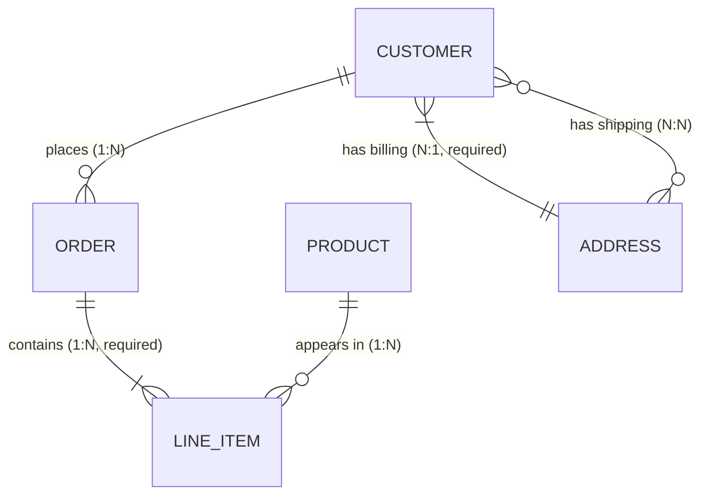

Relationship notation:

- `||` exactly one
- `o|` zero or one
- `}|` one or more
- `}o` zero or more

### Flowcharts

#### Decision Logic

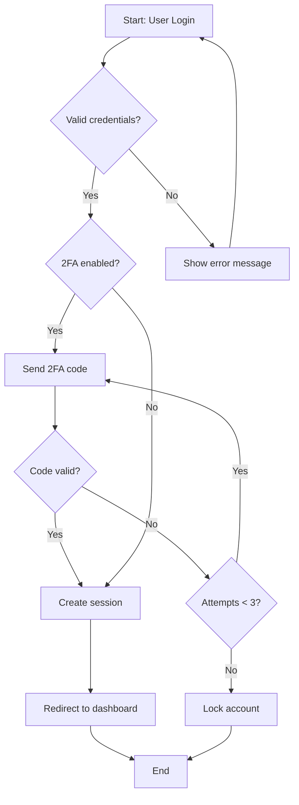

#### Process Flow

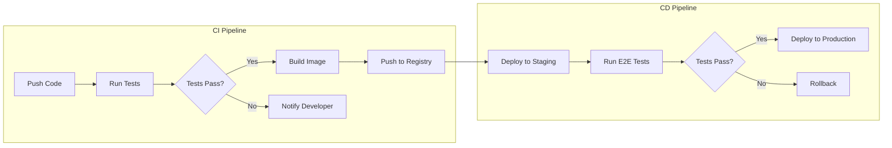

### State Diagrams

#### Order State Machine

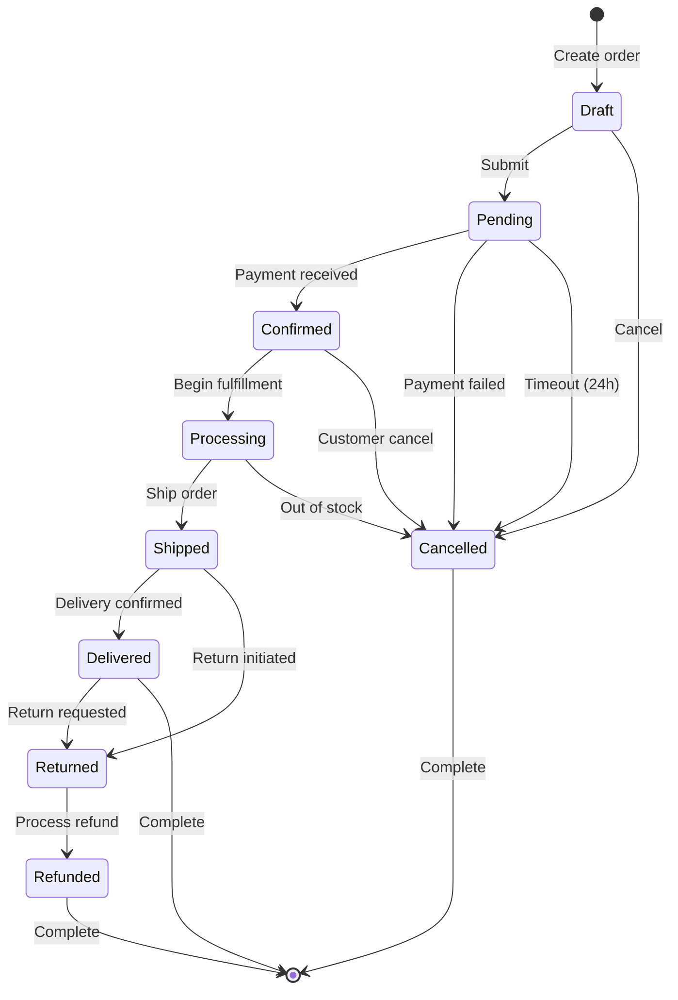

#### Connection State Machine

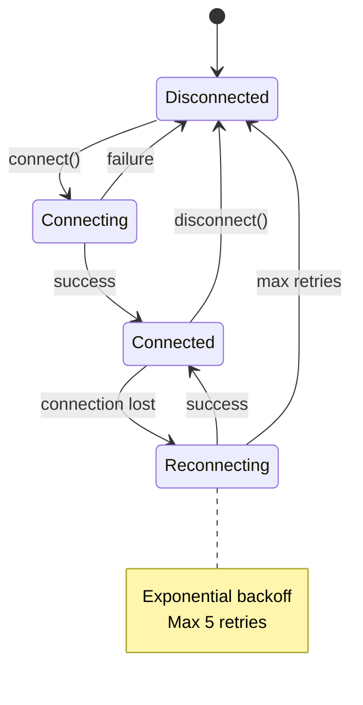

### Class Diagrams

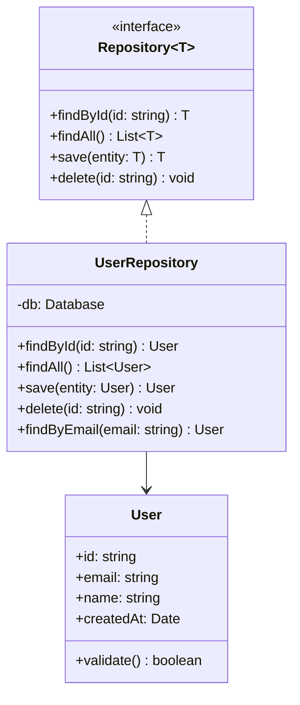
