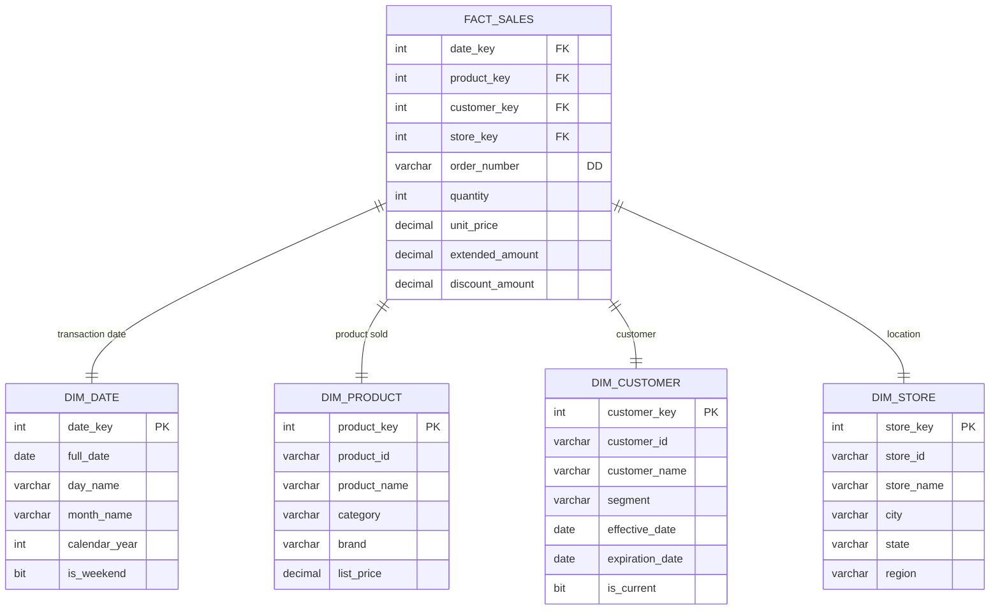

# Dimensional Modeling (Kimball Methodology)

## When to Use This Skill

Use this skill when:

- **Dimensional Modeling tasks** - Working on design kimball star/snowflake schemas for analytics and data warehousing with fact/dimension tables and scd patterns
- **Planning or design** - Need guidance on Dimensional Modeling approaches
- **Best practices** - Want to follow established patterns and standards

## Overview

Dimensional modeling organizes data for analytical queries using denormalized structures optimized for read performance. The Kimball methodology defines patterns for facts, dimensions, and slowly changing dimensions.

## Star vs Snowflake Schemas

```text
STAR SCHEMA (Recommended)
                    ┌──────────────┐
                    │  DIM_DATE    │
                    └──────┬───────┘
                           │
┌──────────────┐    ┌──────┴───────┐    ┌──────────────┐
│ DIM_PRODUCT  │────│  FACT_SALES  │────│ DIM_CUSTOMER │
└──────────────┘    └──────┬───────┘    └──────────────┘
                           │
                    ┌──────┴───────┐
                    │  DIM_STORE   │
                    └──────────────┘

SNOWFLAKE SCHEMA (Normalized Dimensions)
                    ┌──────────────┐
                    │  DIM_DATE    │
                    └──────┬───────┘
                           │
┌─────────────┐     ┌──────┴───────┐     ┌──────────────┐
│DIM_CATEGORY │     │  FACT_SALES  │     │ DIM_CUSTOMER │
└──────┬──────┘     └──────┬───────┘     └──────┬───────┘
       │                   │                    │
┌──────┴──────┐     ┌──────┴───────┐     ┌──────┴───────┐
│ DIM_PRODUCT │     │  DIM_STORE   │     │ DIM_GEOGRAPHY│
└─────────────┘     └──────────────┘     └──────────────┘
```

## Fact Table Design

### Fact Types

| Type | Description | Example |
|------|-------------|---------|
| Transaction | Individual events | Sales, Orders |
| Periodic Snapshot | State at regular intervals | Monthly inventory |
| Accumulating Snapshot | Lifecycle with milestones | Order fulfillment |
| Factless | Events without measures | Student attendance |

### Fact Table Template

```markdown
# Fact Table: fact_sales

## Grain
One row per order line item per day

## Dimensions
| FK | Dimension | Role |
|----|-----------|------|
| date_key | dim_date | Transaction date |
| product_key | dim_product | Product sold |
| customer_key | dim_customer | Purchasing customer |
| store_key | dim_store | Selling location |

## Measures
| Measure | Type | Aggregation |
|---------|------|-------------|
| quantity | Additive | SUM |
| unit_price | Non-additive | - |
| extended_amount | Additive | SUM |
| discount_amount | Additive | SUM |
| profit_margin | Semi-additive | AVG |

## Degenerate Dimensions
- order_number (from source system)
- line_number
```

### Additive vs Non-Additive Measures

| Type | Can SUM Across | Example |
|------|----------------|---------|
| Additive | All dimensions | Revenue, Quantity |
| Semi-Additive | Some dimensions (not time) | Account Balance |
| Non-Additive | No dimensions | Unit Price, Ratio |

## Dimension Table Design

### Dimension Types

| Type | Description | Example |
|------|-------------|---------|
| Conformed | Shared across facts | Date, Customer |
| Role-Playing | Same dimension, different roles | Order Date, Ship Date |
| Junk | Miscellaneous flags | Transaction flags |
| Degenerate | No dimension table (in fact) | Invoice Number |
| Outrigger | Dimension of dimension | Product Category |

### Dimension Table Template

```markdown
# Dimension: dim_customer

## Attributes
| Attribute | Type | SCD Type | Description |
|-----------|------|----------|-------------|
| customer_key | INT | N/A | Surrogate key |
| customer_id | VARCHAR | 0 | Natural key |
| customer_name | VARCHAR | 1 | Current name |
| email | VARCHAR | 1 | Current email |
| segment | VARCHAR | 2 | Customer segment (track history) |
| loyalty_tier | VARCHAR | 2 | Loyalty level (track history) |
| first_purchase_date | DATE | 0 | Never changes |
| city | VARCHAR | 1 | Current city |
| state | VARCHAR | 1 | Current state |
| country | VARCHAR | 1 | Current country |
| effective_date | DATE | N/A | SCD2 effective start |
| expiration_date | DATE | N/A | SCD2 effective end |
| is_current | BIT | N/A | Current record flag |

## Hierarchies
- Geography: Country → State → City
- Segment: Tier → Segment
```

## Slowly Changing Dimensions (SCD)

### SCD Types

| Type | Description | Use Case |
|------|-------------|----------|
| Type 0 | Never changes | Original values (first purchase date) |
| Type 1 | Overwrite | Corrections, no history needed |
| Type 2 | Add new row | Full history tracking |
| Type 3 | Add column | Limited history (previous value only) |
| Type 4 | Mini-dimension | Rapidly changing attributes |
| Type 6 | Hybrid (1+2+3) | Current + history + previous |

### SCD Type 2 Implementation

> **Note:** Data warehouse naming conventions often use snake_case even on SQL Server (Kimball tradition). This is acceptable for DW-specific schemas. OLTP/operational schemas should use PascalCase.

```sql
-- SCD Type 2 Customer Dimension (DW convention: snake_case acceptable)
CREATE TABLE dim_customer (
    customer_key INT IDENTITY PRIMARY KEY,
    customer_id VARCHAR(50) NOT NULL,  -- Natural key
    customer_name VARCHAR(100),
    segment VARCHAR(50),
    loyalty_tier VARCHAR(20),
    -- SCD Type 2 tracking columns
    effective_date DATE NOT NULL,
    expiration_date DATE,  -- NULL = current
    is_current BIT NOT NULL DEFAULT 1,
    -- Audit columns
    created_at DATETIME2 DEFAULT GETUTCDATE(),
    updated_at DATETIME2
);

-- Index for current record lookup
CREATE INDEX IX_dim_customer_current
ON dim_customer(customer_id, is_current)
WHERE is_current = 1;
```

### SCD Type 2 Update Pattern

```csharp
// EF Core SCD Type 2 Update
public async Task UpdateCustomerDimension(
    Customer source,
    CancellationToken ct)
{
    var current = await _context.DimCustomers
        .Where(c => c.CustomerId == source.Id && c.IsCurrent)
        .FirstOrDefaultAsync(ct);

    if (current == null)
    {
        // New customer - insert
        _context.DimCustomers.Add(new DimCustomer
        {
            CustomerId = source.Id,
            CustomerName = source.Name,
            Segment = source.Segment,
            EffectiveDate = DateTime.UtcNow.Date,
            IsCurrent = true
        });
    }
    else if (HasScd2Changes(current, source))
    {
        // Expire current record
        current.ExpirationDate = DateTime.UtcNow.Date.AddDays(-1);
        current.IsCurrent = false;
        current.UpdatedAt = DateTime.UtcNow;

        // Insert new version
        _context.DimCustomers.Add(new DimCustomer
        {
            CustomerId = source.Id,
            CustomerName = source.Name,
            Segment = source.Segment,
            EffectiveDate = DateTime.UtcNow.Date,
            IsCurrent = true
        });
    }
    else
    {
        // SCD Type 1 - just update
        current.CustomerName = source.Name;
        current.UpdatedAt = DateTime.UtcNow;
    }

    await _context.SaveChangesAsync(ct);
}
```

## Date Dimension

### Standard Date Dimension

```sql
CREATE TABLE dim_date (
    date_key INT PRIMARY KEY,  -- YYYYMMDD format
    full_date DATE NOT NULL,

    -- Day attributes
    day_of_week TINYINT,
    day_name VARCHAR(10),
    day_of_month TINYINT,
    day_of_year SMALLINT,

    -- Week attributes
    week_of_year TINYINT,
    week_of_month TINYINT,

    -- Month attributes
    month_number TINYINT,
    month_name VARCHAR(10),
    month_short_name CHAR(3),

    -- Quarter attributes
    quarter_number TINYINT,
    quarter_name VARCHAR(10),

    -- Year attributes
    calendar_year SMALLINT,
    fiscal_year SMALLINT,
    fiscal_quarter TINYINT,

    -- Flags
    is_weekend BIT,
    is_holiday BIT,
    holiday_name VARCHAR(50),

    -- Relative date helpers
    is_current_day BIT,
    is_current_month BIT,
    is_current_year BIT
);
```

## Mermaid ER Diagram



## Bus Matrix

Map facts to conformed dimensions:

```markdown
# Enterprise Bus Matrix

| Fact Table | Date | Product | Customer | Store | Employee | Promotion |
|------------|------|---------|----------|-------|----------|-----------|
| Sales | X | X | X | X | X | X |
| Inventory | X | X | - | X | - | - |
| Orders | X | X | X | - | X | X |
| Returns | X | X | X | X | X | - |
| Marketing | X | X | X | - | - | X |
```

## Aggregate Tables

### Pre-Aggregated Summary Tables

```sql
-- Daily sales summary
CREATE TABLE agg_sales_daily (
    date_key INT,
    product_key INT,
    store_key INT,
    total_quantity INT,
    total_amount DECIMAL(18,2),
    transaction_count INT,
    PRIMARY KEY (date_key, product_key, store_key)
);

-- Monthly sales summary
CREATE TABLE agg_sales_monthly (
    month_key INT,  -- YYYYMM
    product_category VARCHAR(50),
    region VARCHAR(50),
    total_quantity INT,
    total_amount DECIMAL(18,2),
    avg_unit_price DECIMAL(10,2),
    PRIMARY KEY (month_key, product_category, region)
);
```

## Validation Checklist

- [ ] Clear grain defined for each fact table
- [ ] All dimensions are conformed where possible
- [ ] SCD types assigned to each dimension attribute
- [ ] Surrogate keys used (not natural keys) in facts
- [ ] Date dimension populated for all required dates
- [ ] Measures classified (additive/semi-additive/non-additive)
- [ ] Bus matrix documents dimension conformity
- [ ] Aggregate tables planned for common queries

## Integration Points

**Inputs from**:

- `conceptual-modeling` skill → Entity candidates
- `er-modeling` skill → Source system model

**Outputs to**:

- `schema-design` skill → Physical implementation
- `migration-planning` skill → ETL design
- Analytics/BI tools → Report design
