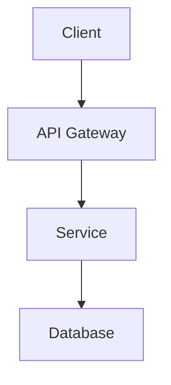
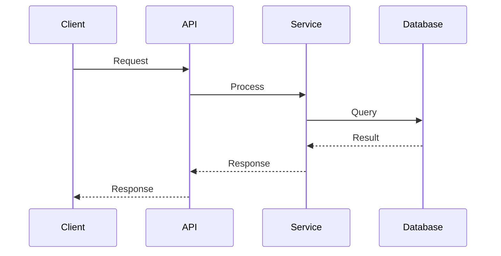
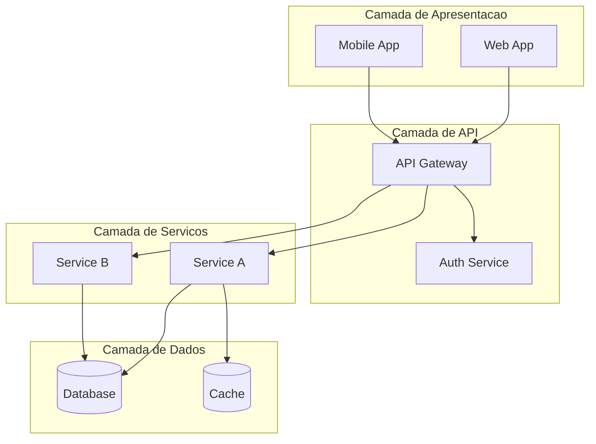

# Documentation Blueprint Skill

## Proposito

Esta skill gera documentacao tecnica automaticamente a partir do codigo e artefatos.

## Comandos

### /doc-readme

Gera README.md baseado na analise do codigo:

```bash
/doc-readme
```

Analisa:
- Estrutura do projeto
- Arquivos de configuracao (package.json, *.csproj, etc.)
- Codigo fonte
- Dependencias

### /doc-api

Gera documentacao de API:

```bash
/doc-api
```

Extrai:
- Endpoints (controllers, routes)
- Request/Response schemas
- Codigos de erro
- Exemplos de uso

### /doc-arch

Gera documentacao de arquitetura:

```bash
/doc-arch
```

Inclui:
- Visao geral do sistema
- Diagrama de componentes (Mermaid)
- Fluxos de dados
- ADRs relacionados

### /doc-onboarding

Gera guia de onboarding para desenvolvedores:

```bash
/doc-onboarding
```

Contem:
- Setup do ambiente
- Estrutura do projeto
- Fluxo de desenvolvimento
- Convencoes de codigo

### /doc-runbook

Gera runbook operacional:

```bash
/doc-runbook
```

Inclui:
- Procedimentos de deploy
- Troubleshooting comum
- Metricas a monitorar
- Contatos de escalacao

## Templates

### README Template

```markdown
# {Project Name}

{Brief description - 2-3 sentences}

## Status

[](link)
[](link)
[](link)

## Overview

{What the project does, key features}

## Architecture

{High-level architecture diagram}



## Getting Started

### Prerequisites

- {requirement 1}
- {requirement 2}

### Installation

```bash
# Clone
git clone {repo-url}
cd {project}

# Install dependencies
{install-command}

# Configure
cp .env.example .env
# Edit .env with your settings

# Run
{run-command}
```

### Configuration

| Variable | Description | Default |
|----------|-------------|---------|
| `VAR_1` | Description | `default` |

## Usage

```bash
# Example usage
{example-command}
```

## API Reference

See [API Documentation](docs/api.md)

## Development

### Running Tests

```bash
{test-command}
```

### Code Style

{code-style-info}

### Contributing

See [CONTRIBUTING.md](CONTRIBUTING.md)

## License

{license-info}
```

### API Documentation Template

```markdown
# API Reference

## Base URL

`https://api.example.com/v1`

## Authentication

{auth-info}

## Endpoints

### {Resource Name}

#### GET /{resource}

List all {resources}.

**Request**

```http
GET /api/v1/{resource}
Authorization: Bearer {token}
```

**Response**

```json
{
  "data": [...],
  "pagination": {
    "page": 1,
    "per_page": 20,
    "total": 100
  }
}
```

**Errors**

| Code | Description |
|------|-------------|
| 401 | Unauthorized |
| 500 | Internal Server Error |
```

### Architecture Document Template

```markdown
# Architecture Overview

## System Context

{High-level description}

## Components

### Component 1

- **Responsibility**: {description}
- **Technology**: {tech stack}
- **Interfaces**: {APIs, events}

### Component 2

...

## Data Flow



## Architecture Decision Records

- [ADR-001](decisions/adr-001.yml): {title}
- [ADR-002](decisions/adr-002.yml): {title}

## Security

{security-considerations}

## Scalability

{scalability-approach}
```

## Output

Documentos sao salvos em:
`.agentic_sdlc/projects/{project-id}/docs/`

Estrutura gerada:
```
docs/
├── README.md           # Gerado por /doc-readme
├── API.md              # Gerado por /doc-api
├── ARCHITECTURE.md     # Gerado por /doc-arch
├── ONBOARDING.md       # Gerado por /doc-onboarding
├── RUNBOOK.md          # Gerado por /doc-runbook
└── diagrams/           # Diagramas gerados
    ├── architecture.mmd
    └── sequence.mmd
```

## Integracao com SDLC

| Fase | Documentacao Gerada |
|------|---------------------|
| Fase 2 | User Stories, Requisitos |
| Fase 3 | Architecture Overview, ADRs |
| Fase 5 | API Docs, Code Comments |
| Fase 7 | Release Notes, Changelog |
| Fase 8 | Runbooks, Playbooks |

## Geracao de Diagramas

Diagramas sao gerados em formato Mermaid:



## Customizacao

Para customizar templates, edite:
`.agentic_sdlc/templates/doc-*.md`

## Pontos de Pesquisa

Para melhores praticas:
- "readme best practices"
- "api documentation standards"
- "architecture documentation template"
