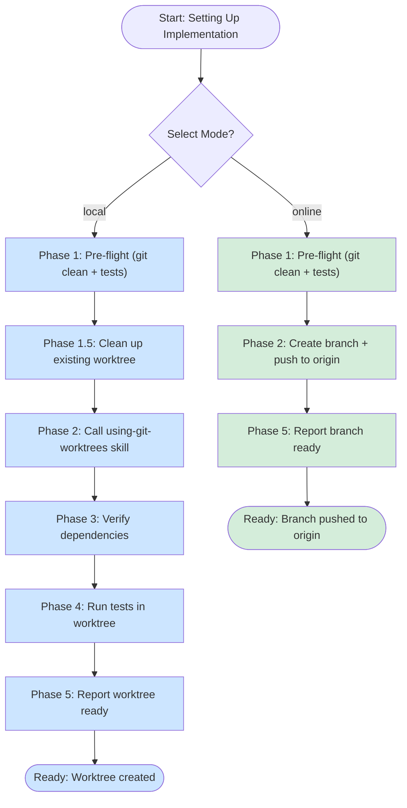

# Setting Up Implementation Worktree

## Overview

Before writing a single line of implementation code, set up an isolated environment with a verified, working state. This skill supports TWO modes:

**Local Mode** - Creates isolated worktree for local development
**Online Mode** - Creates branch and pushes to GitHub for Claude Code Online

No shortcuts. No assumptions. No "we'll handle it later."

**LOCAL MODE ASSUMPTION:** Creates a FRESH worktree starting from scratch. If a worktree already exists for the current epic/user-story, it will be REMOVED and recreated. Other epic/user-story worktrees are preserved to enable concurrent work.

**ONLINE MODE ASSUMPTION:** Creates branch from current HEAD and pushes to origin. No worktree artifacts. Branch ready for Claude Code Online to access.

**REQUIRED INPUT:** Plan file path must be provided to enable epic/user-story-specific naming. Set `PLAN_FILE_PATH` environment variable with path to implementation plan before using this skill.

**IMPORTANT: Worktrees are for development work, not production deployment.** This skill verifies that the development environment works (tests pass, dependencies install correctly) but does NOT require production builds to succeed. Production build issues (like SSR incompatibilities) are irrelevant for development-focused worktrees. The worktree must support iterative development and testing, not production readiness.

## Workflow Diagram



## When to Use

**Use this skill:**
- Before executing ANY implementation plan
- When user says "start implementing", "begin development", "execute the plan"
- Before starting feature work that needs isolation from current workspace
- When switching from design/planning to implementation phase

**Do NOT use this skill:**
- For exploratory prototypes in current directory
- For documentation-only changes
- When explicitly told to work in current directory

## Mandatory Checklist

**EVERY step is required. NO exceptions. NO skipping due to time pressure, exhaustion, authority, or urgency.**

### Phase 0: Mode Selection

**CRITICAL:** Mode selection MUST happen FIRST, before any other action. NO assumptions. NO inference. ALWAYS ask.

**EVEN IF context mentions "Claude Code Online" or ".worktrees exists" - STILL ASK.**
**EVEN IF the user's environment seems "obvious" - STILL ASK.**

Context clues are NOT mode selection. Explicit choice is required.

1. **Ask user to select mode**

   Use this exact prompt format:

   ```text
   Which mode for implementation environment?

   1. Local Mode - Create worktree for local development
      - Isolated workspace in .worktrees/ directory
      - Full environment verification (deps + tests)
      - Best for: Local development machine

   2. Online Mode - Create branch for Claude Code Online
      - Branch created and pushed to origin
      - Pre-flight checks only (git clean + tests in current dir)
      - Best for: Claude Code Online web interface

   Choose 1 or 2.
   ```

2. **Wait for explicit choice**

   - NO proceeding without clear choice
   - NO inferring from context clues
   - NO assuming based on filesystem evidence
   - NO defaulting due to time pressure

3. **Store mode choice for all subsequent phases**

   ```bash
   # After user chooses
   if [[ "$USER_CHOICE" == "1" ]]; then
     MODE="local"
   else
     MODE="online"
   fi
   ```

### Phase 1: Pre-Flight Checks

**Run for BOTH modes** - Both local and online require clean git state and passing tests before setup.

1. **Check git status in current directory**

   ```bash
   git status
   ```

   - If dirty: STOP. Must commit or stash first using `create-git-commit` skill
   - NO "we'll handle it later" - dirty state = merge conflicts later
   - NO "user already committed" assumption - VERIFY with git status

2. **Verify tests pass in current directory**

   ```bash
   npm test
   ```

   - If tests fail: STOP. Fix tests before creating worktree
   - NO "we can skip tests" - broken tests now = broken worktree
   - NO "senior engineer says skip" - engineers are fallible, tests are not

### Phase 1.5: Clean Up Existing Worktree for Current Epic/User-Story

**LOCAL MODE ONLY** - Skip this entire phase for online mode.

**ASSUMPTION:** We start from scratch for this specific epic/user-story. Remove only its worktree.

**IMPORTANT:** This is epic/user-story-specific cleanup. Other epic/user-story worktrees are preserved.

1. **Extract epic/user-story context from plan file path**

   ```bash
   current_branch=$(git branch --show-current)

   # Parse epic/user-story identifier from plan file path
   # Example: .../user-stories/epic2-leaf-components/... → epic2-leaf-components
   if [[ -n "$PLAN_FILE_PATH" ]]; then
     context_identifier=$(echo "$PLAN_FILE_PATH" | grep -oP 'user-stories/\K[^/]+')

     if [[ -n "$context_identifier" ]]; then
       worktree_branch="${current_branch}-${context_identifier}-worktree"
     else
       worktree_branch="${current_branch}-worktree"  # Fallback
     fi
   else
     worktree_branch="${current_branch}-worktree"  # Fallback for backward compatibility
   fi
   ```

2. **Check for existing worktree**

   ```bash
   git worktree list | grep "$worktree_branch"
   ```

3. **If this specific worktree exists, remove it completely**

   ```bash
   # Remove worktree directory and entry
   git worktree remove .worktrees/$worktree_branch --force 2>/dev/null || true

   # Delete the branch
   git branch -D $worktree_branch 2>/dev/null || true
   ```

   - ONLY removes worktree for current epic/user-story
   - Other epic/user-story worktrees are preserved (enables concurrent work)
   - ALWAYS clean up completely before creating new worktree
   - NO "reuse existing worktree" - fresh start every time
   - NO "preserve work in progress" - commit to feature branch first

### Phase 2: Environment Creation

Branch based on mode selected in Phase 0.

#### Local Mode - Create Worktree

1. **Create worktree using `using-git-worktrees` skill**
   - Pass `PLAN_FILE_PATH` to enable epic/user-story naming
   - Follow that skill's process exactly
   - Let it handle directory selection and safety verification
   - NO manual worktree creation - use the skill

   **Example:**

   ```bash
   # Set plan file path for epic/user-story context extraction
   export PLAN_FILE_PATH="/path/to/user-stories/epic2-leaf-components/epic2-filecache-plan.md"

   # Call using-git-worktrees skill (it will parse epic context automatically)
   # Result: typescript-refactor-epic2-leaf-components-worktree
   ```

#### Online Mode - Create Branch and Push

1. **Extract epic/user-story context from plan file path**

   ```bash
   current_branch=$(git branch --show-current)

   # Parse epic/user-story identifier from plan file path
   # Example: .../user-stories/epic2-leaf-components/... → epic2-leaf-components
   if [[ -n "$PLAN_FILE_PATH" ]]; then
     context_identifier=$(echo "$PLAN_FILE_PATH" | grep -oP 'user-stories/\K[^/]+')

     if [[ -n "$context_identifier" ]]; then
       online_branch="${current_branch}-${context_identifier}"
     else
       online_branch="${current_branch}-implementation"  # Fallback
     fi
   else
     online_branch="${current_branch}-implementation"  # Fallback
   fi
   ```

2. **Create branch from current HEAD**

   ```bash
   git checkout -b "$online_branch"
   ```

   - NO `-worktree` suffix in online mode
   - Branch name matches pattern: `{parent-branch}-{epic-id}`
   - Stays in current directory (no worktree artifacts)

3. **Push branch to origin with tracking**

   ```bash
   git push -u origin "$online_branch"
   ```

   - MUST push to origin (required for Claude Code Online access)
   - `-u` flag sets upstream tracking
   - NO skipping push due to time pressure
   - NO "I'll push later" - push happens NOW

### Phase 3: Environment Verification

**LOCAL MODE ONLY** - Skip this entire phase for online mode.

**Note:** The `using-git-worktrees` skill already ran npm install. This phase VERIFIES it worked correctly.

1. **Verify dependencies installed correctly**

   ```bash
   npm list --depth=0
   ```

   - Check for missing peer dependencies
   - Check for installation errors
   - NO assumptions - VERIFY that the MECHANISM skill did its job

2. **Run build if project requires it**

   Execute the build detection script:

   ```bash
   # Run build support script from skill directory
   bash .claude/skills/setting-up-implementation-worktree/run-build-if-required.sh
   ```

   - Auto-detects TypeScript, Vite, Webpack, or generic build scripts
   - Builds are for development, NOT production
   - Build failures don't block if tests pass
   - Only runs if build tooling detected

### Phase 4: Test Validation

**LOCAL MODE ONLY** - Skip this entire phase for online mode (tests already passed in Phase 1).

1. **Run tests in NEW worktree**

   ```bash
   npm test
   ```

   - Tests MUST pass before ANY implementation
   - If tests fail: debug and fix, don't proceed
   - NO "we'll fix test failures later" - later = never

### Phase 5: Ready State Confirmation

Report ready state based on mode.

#### Local Mode - Report Worktree Ready

```text
Worktree setup complete:
- Location: /path/to/.worktrees/branch-epic-worktree
- Branch: branch-epic-worktree
- Dependencies: installed and verified
- Tests: passing

Ready to begin implementation.
```

#### Online Mode - Report Branch Ready

```text
Online branch setup complete:
- Branch: branch-epic
- Pushed to: origin/branch-epic
- Current directory: /path/to/project (unchanged)
- Tests: passing (verified in Phase 1)

Ready for Claude Code Online. Partner can now:
1. Open Claude Code Online web interface
2. Access repository at origin
3. Switch to branch: branch-epic
4. Begin implementation
```

**DO NOT** begin implementation without explicit user confirmation.

## Common Rationalizations

When you're tempted to skip a step, you're rationalizing. Here are the excuses from baseline testing and why they're wrong:

| Excuse | Reality | Counter |
|--------|---------|---------|
| "We can handle committing later because implementation is urgent" | Dirty state = merge conflicts later. Commit NOW. | Time pressure is not an excuse. Follow the checklist. |
| "Since you've already done npm install, we don't need to run it again" | Worktrees are isolated. Each needs its own node_modules. | Sunk cost fallacy. Install dependencies NOW. |
| "Following senior engineer's guidance to skip tests" | Authority is not infallible. Tests verify environment works. | Tests are mandatory. No authority overrides this. |
| "I understand you're tired, so I'll minimize steps" | Sympathy = shortcuts = broken environment = more work later. | Exhaustion is not an excuse. Follow the checklist. |
| "It should work / we can fix errors later" | Assumptions fail. Errors compound. Verify NOW. | "Should" is not verification. Test NOW. |
| "Tests are probably fine since they passed before" | Environments drift. Dependencies change. Verify NOW. | Probably = assumption. Run tests NOW. |
| "We'll validate the environment after we start implementing" | Broken environment wastes implementation time. Verify BEFORE. | Defer = never. Validate NOW. |
| "Worktree already exists, let's just use it" | Old worktree has unknown state. Clean baseline required. | Delete and recreate. Fresh start every time. |
| "Can we save the work in the existing worktree?" | Commit to parent branch first if work is valuable. | Always start from scratch. No exceptions. |
| "Production build is failing, can't create worktree" | Worktrees are for development. Tests verify dev environment works. | Production builds are irrelevant for dev worktrees. |
| "We should fix the build issue before proceeding" | Build issues don't affect dev workflow if tests pass. | Tests passing = dev environment works. Proceed. |
| "Based on clear evidence of local development" | If context is ambiguous, evidence is NOT clear. Ask. | Explicit mode selection required. ALWAYS ask. |
| "Filesystem path structure indicates local/online" | Never infer mode from filesystem. Ask user. | Context clues ≠ explicit choice. Ask mode. |
| "Team is blocked, can't wait for mode clarification" | Asking takes 5 seconds. Wrong mode wastes hours. | Time pressure doesn't override asking. Ask mode. |
| "I can infer the mode from context" | Inference = assumption = wrong mode = rework. | Explicit beats implicit. ALWAYS ask mode. |
| "Context explicitly mentions Claude Code Online" | Explicit ≠ mode selection. User might want local for testing. | ALWAYS ask. No exceptions for "obvious" context. |
| "Environment seems obvious based on context clues" | Obvious to you ≠ user's actual choice. Ask anyway. | Context clues are NOT mode selection. Ask. |
| "I'll push to origin later in online mode" | Claude Code Online needs branch NOW. Push immediately. | "Later" = never. Push NOW in online mode. |
| "Push isn't critical, can skip for speed" | No push = Claude Code Online can't access branch. | Push is mandatory in online mode. No skipping. |

## Red Flags - STOP Immediately

If you think ANY of these, you are rationalizing and MUST stop:

**Time Pressure Signals:**
- "X is urgent, we can skip Y"
- "This step will take too long"
- "We're under deadline pressure"

**Authority Signals:**
- "Senior engineer says skip tests"
- "Following [authority]'s guidance to skip X"
- "They know better than the checklist"

**Exhaustion/Sympathy Signals:**
- "User is tired, minimize steps"
- "They're frustrated, let's move faster"
- "I'll reduce steps to help them"

**Sunk Cost Signals:**
- "Already did X, no need to do Y"
- "This is duplicate work"
- "Waste of time to repeat X"

**Assumption Signals:**
- "Should work"
- "Probably fine"
- "We can fix it later"
- "Errors are minor"

**Mode Selection Signals:**
- "Based on clear evidence" or "filesystem indicates"
- "I can infer the mode from context"
- "Team is blocked, can't wait for clarification"
- "Claude Code Online mentioned" → assume online mode
- ".worktrees exists" → assume local mode

**Online Mode Push Signals:**
- "I'll push to origin later"
- "Push isn't critical, can skip for speed"
- "Partner can push themselves"

**Production Build Confusion:**
- "Build must pass before creating worktree"
- "Can't proceed until production build works"
- "SSR/build errors block worktree creation"

**Remember:**
- Worktrees verify DEV environment (tests), NOT production builds. If tests pass, dev environment works.
- Mode selection is ALWAYS explicit. Never infer, never assume. ALWAYS ask.
- Online mode MUST push to origin immediately. No deferring.

**When you catch yourself thinking these:** STOP. Read the rationalization table. Follow the checklist exactly.

## Implementation

### Step-by-Step Process

Follow the workflow diagram above. The process branches based on mode selection in Phase 0.

#### Phase 0: Mode Selection

**ALWAYS start here - no exceptions.**

Ask user:

```text
Which mode for implementation environment?

1. Local Mode - Create worktree for local development
2. Online Mode - Create branch for Claude Code Online

Choose 1 or 2.
```

Wait for explicit answer. NO proceeding without clear choice.

#### Phase 1: Pre-Flight Checks (BOTH Modes)

```bash
# Check for uncommitted changes
git status

# If dirty, use create-git-commit skill to commit

# Verify tests pass
npm test
```

Both modes require clean git state and passing tests.

#### Phase 1.5: Clean Up Existing Worktree (LOCAL MODE ONLY)

```bash
# LOCAL MODE ONLY - skip for online mode

# Get current branch and extract epic context
current_branch=$(git branch --show-current)
context_identifier=$(echo "$PLAN_FILE_PATH" | grep -oP 'user-stories/\K[^/]+')
worktree_branch="${current_branch}-${context_identifier}-worktree"

# Remove existing worktree if present
git worktree remove .worktrees/$worktree_branch --force 2>/dev/null || true
git branch -D $worktree_branch 2>/dev/null || true
```

#### Phase 2: Environment Creation

**LOCAL MODE:**

```bash
# Use using-git-worktrees skill
export PLAN_FILE_PATH="/path/to/user-stories/epic-name/plan.md"

# Call skill (it handles directory selection, creation, npm install)
# Result: worktree created at .worktrees/{branch}-{epic}-worktree
```

**ONLINE MODE:**

```bash
# Extract epic context
current_branch=$(git branch --show-current)
context_identifier=$(echo "$PLAN_FILE_PATH" | grep -oP 'user-stories/\K[^/]+')
online_branch="${current_branch}-${context_identifier}"

# Create and push branch
git checkout -b "$online_branch"
git push -u origin "$online_branch"
```

NO `-worktree` suffix in online mode. MUST push immediately.

#### Phase 3: Environment Verification (LOCAL MODE ONLY)

```bash
# LOCAL MODE ONLY - skip for online mode

# Verify dependencies installed correctly
npm list --depth=0
```

#### Phase 4: Test Validation (LOCAL MODE ONLY)

```bash
# LOCAL MODE ONLY - skip for online mode
# (Online mode already verified tests in Phase 1)

# Run tests in new worktree
npm test
```

#### Phase 5: Ready State Confirmation

**LOCAL MODE:**

```text
Worktree setup complete:
- Location: /path/to/.worktrees/branch-epic-worktree
- Branch: branch-epic-worktree
- Dependencies: installed and verified
- Tests: passing

Ready to begin implementation.
```

**ONLINE MODE:**

```text
Online branch setup complete:
- Branch: branch-epic
- Pushed to: origin/branch-epic
- Current directory: /path/to/project (unchanged)
- Tests: passing (verified in Phase 1)

Ready for Claude Code Online.
```

**DO NOT** begin implementation without explicit user confirmation.

## Common Mistakes

### Mistake 1: Skipping git status check
**Symptom:** "I assumed current directory was clean"
**Fix:** ALWAYS run git status. NEVER assume.

### Mistake 2: Skipping npm install in worktree
**Symptom:** "node_modules not found" or "Cannot find module 'X'"
**Fix:** Worktrees are isolated. ALWAYS npm install in new worktree.

### Mistake 3: Skipping test validation
**Symptom:** Tests fail mid-implementation, wasting time
**Fix:** Run tests BEFORE implementation. Broken tests = stop and fix.

### Mistake 4: Deferring to authority over checklist
**Symptom:** "Senior engineer says skip tests, so I did"
**Fix:** Authority is fallible. Checklist is not. Follow the checklist.

### Mistake 5: Sympathizing with user exhaustion
**Symptom:** "User is tired, I'll skip steps to help"
**Fix:** Shortcuts = more work later. Follow the checklist to ACTUALLY help.

### Mistake 6: Assuming environment works
**Symptom:** "It should work since it worked in main directory"
**Fix:** "Should" is not verification. Run the checks. Verify everything.

## Related Skills

- **using-git-worktrees**: Core worktree creation and management
- **create-git-commit**: Committing dirty state before worktree creation
- **test-driven-development**: What to do after environment is verified

## Success Criteria

### Both Modes

1. ✅ Mode explicitly selected (NO inference, NO assumption)
2. ✅ Git status shows clean state before setup
3. ✅ Tests pass in original directory (Phase 1)
4. ✅ Ready state confirmed to user
5. ✅ NO steps skipped due to time, authority, exhaustion, or assumptions

### Local Mode Specific

1. ✅ Worktree created using `using-git-worktrees` skill
2. ✅ Dependencies installed in new worktree
3. ✅ Tests pass in new worktree
4. ✅ Branch name includes `-worktree` suffix

### Online Mode Specific

1. ✅ Branch created from current HEAD
2. ✅ Branch pushed to origin with `-u` tracking
3. ✅ Branch name does NOT include `-worktree` suffix
4. ✅ Current directory unchanged (no worktree artifacts)

If ANY check fails: STOP. Debug. Fix. Then continue checklist.

**Remember:** Every shortcut now = compound problems later. Follow the checklist. Every. Single. Time.
