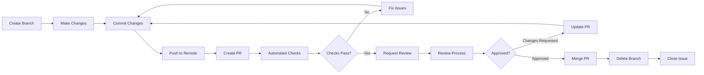
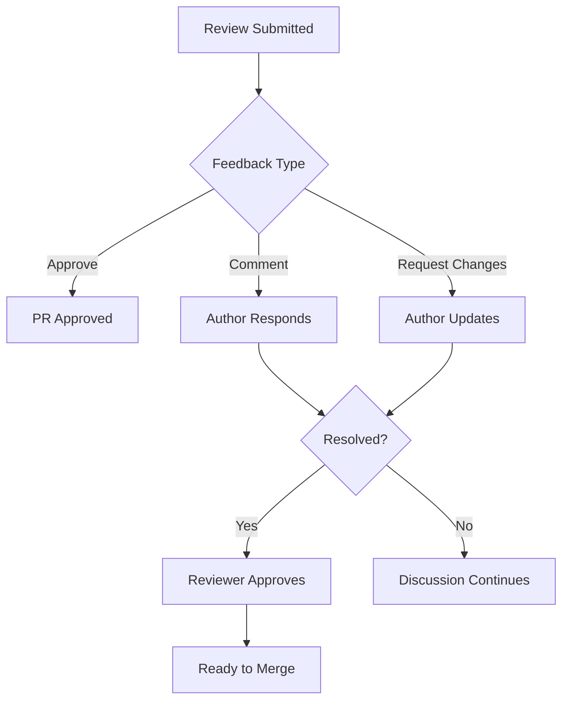

# GitHub Pull Request Lifecycle

## Overview

Pull request lifecycle management covers the complete workflow from branch creation through merge and post-merge activities. This skill covers PR workflows, review processes, automation, and best practices for managing pull requests efficiently using GitHub's features.

**When to use this skill:** When creating, reviewing, or managing pull requests in GitHub repositories.

## Table of Contents

1. [PR Lifecycle Stages](#pr-lifecycle-stages)
2. [PR Creation Workflow](#pr-creation-workflow)
3. [Review and Approval](#review-and-approval)
4. [Merge Strategies](#merge-strategies)
5. [Post-Merge Activities](#post-merge-activities)
6. [PR Lifecycle Checklist](#pr-lifecycle-checklist)
7. [Quick Reference](#quick-reference)

---

## PR Lifecycle Stages

### Complete Lifecycle Flow



### PR States

| State | Description | Next Action |
|-------|-------------|-------------|
| **Draft** | Work in progress, not ready for review | Mark as ready when complete |
| **Open** | Ready for review | Reviewers review changes |
| **Merged** | Changes merged into target branch | Delete feature branch |
| **Closed** | PR closed without merge | May need reopening |

---

## PR Creation Workflow

### Branch Naming Conventions

```bash
# Feature branches
feature/user-authentication
feature/add-payment-gateway

# Bugfix branches
bugfix/login-error
bugfix/memory-leak

# Hotfix branches
hotfix/security-patch
hotfix/critical-bug

# Release branches
release/v2.0.0
release/v2.1.0
```

### Creating a Pull Request

```bash
# Using GitHub CLI
gh pr create \
  --title "feat: Add user authentication" \
  --body "Implements #123" \
  --base main \
  --head feature/user-auth \
  --label enhancement \
  --reviewer @tech-lead \
  --assignee @me

# Using Git
git checkout -b feature/user-auth
git push origin feature/user-auth
# Then create PR via GitHub web UI
```

### PR Description Template

```markdown
## Description
Brief description of what this PR does.

## Type of Change
- [ ] Bug fix
- [ ] New feature
- [ ] Breaking change
- [ ] Documentation update
- [ ] Performance improvement
- [ ] Code refactoring

## Related Issue
Closes #123

## Changes Made
- Added user authentication flow
- Implemented JWT token validation
- Added login/logout endpoints
- Updated tests for auth module

## Testing
- [ ] Unit tests pass
- [ ] Integration tests pass
- [ ] Manual testing completed
- [ ] Added new tests

## Screenshots (if applicable)


## Checklist
- [ ] Code follows style guidelines
- [ ] Self-review performed
- [ ] Commented complex code
- [ ] Documentation updated
- [ ] No console.log statements
- [ ] No merge conflicts

## Breaking Changes
Describe any breaking changes and migration steps.

## Additional Notes
Any additional context for reviewers.
```

---

## Review and Approval

### Requesting Reviews

```bash
# Request specific reviewers
gh pr edit 123 --add-reviewer @username1,@username2

# Request team review
gh pr edit 123 --add-team-reviewer @backend-team

# Request code owner review
gh pr edit 123 --reviewer codeowners

# Request review from all team members
gh pr edit 123 --add-reviewer @team-name --reviewer-count 3
```

### Review Types

| Review Type | Description | When to Use |
|-------------|-------------|--------------|
| **Required Reviewer** | Must approve before merge | Critical code paths |
| **Optional Reviewer** | Nice to have feedback | General changes |
| **Team Review** | Any team member can approve | Team-managed code |
| **Code Owner Review** | Owners of changed files | Cross-team changes |

### Review Response Workflow



---

## Merge Strategies

### Merge Types

| Strategy | Description | When to Use |
|----------|-------------|--------------|
| **Merge Commit** | Creates merge commit | Preserve history |
| **Squash and Merge** | Combines all commits | Clean history |
| **Rebase and Merge** | Replays commits on target | Linear history |
| **Fast-forward** | Moves pointer forward | No merge commit |

### Merge Best Practices

```bash
# Squash merge for clean history
gh pr merge 123 --squash --delete-branch

# Rebase merge for linear history
gh pr merge 123 --rebase --delete-branch

# Create merge commit
gh pr merge 123 --merge --delete-branch

# Merge with custom commit message
gh pr merge 123 --squash \
  --subject "feat: Add user authentication" \
  --body "Implements #123. Adds JWT-based authentication."
```

### Branch Protection Rules

```yaml
# .github/branch-protection.yml (via GitHub UI)
# Main branch protection settings:
- Require pull request reviews before merging
- Require approval from CODEOWNERS
- Require status checks to pass before merging
- Require branches to be up to date before merging
- Restrict who can push to matching branches
- Allow force pushes
- Include administrators
```

---

## Post-Merge Activities

### Branch Cleanup

```bash
# Delete local branch
git branch -d feature/user-auth

# Delete remote branch
git push origin --delete feature/user-auth

# Or use GitHub CLI
gh repo sync --delete-source-branches
```

### Issue Management

```bash
# Close related issue when PR merges
gh issue close 123 --comment "Fixed by #456"

# Add comment to issue
gh issue comment 123 --body "Merged in #456. Will be available in next release."

# Link PR to issue (in PR description)
Closes #123
Fixes #123
Resolves #123
```

### Release Notes

```markdown
## Version 2.0.0

### Features
- Add user authentication (#456)
- Add payment gateway (#457)
- Improve dashboard performance (#458)

### Bug Fixes
- Fix login error (#459)
- Fix memory leak (#460)

### Breaking Changes
- API endpoint renamed from `/users` to `/accounts`
```

---

## PR Lifecycle Checklist

### Before Creating PR

```markdown
## Pre-PR Checklist

- [ ] Branch created from main/master
- [ ] Branch name follows convention
- [ ] Commits are atomic and focused
- [ ] Commit messages are clear
- [ ] Code is tested locally
- [ ] All tests pass
- [ ] No debug code left
- [ ] Self-review completed
- [ ] Documentation updated
- [ ] Related issue referenced
```

### During Review

```markdown
## Review Checklist

- [ ] Automated checks pass
- [ ] Code reviewers assigned
- [ ] Reviewers notified
- [ ] PR description is complete
- [ ] Screenshots included (if UI changes)
- [ ] Breaking changes documented
- [ ] Migration guide provided (if needed)
- [ ] Performance impact considered
- [ ] Security implications reviewed
```

### Before Merging

```markdown
## Merge Checklist

- [ ] All reviewers approved
- [ ] All automated checks pass
- [ ] All review comments addressed
- [ ] No merge conflicts
- [ ] Branch is up to date with main
- [ ] Related issue linked
- [ ] Release notes updated
- [ ] Documentation reviewed
- [ ] Ready for deployment
```

### After Merge

```markdown
## Post-Merge Checklist

- [ ] Feature branch deleted
- [ ] Related issue closed
- [ ] Release notes updated
- [ ] Team notified
- [ ] Deployment scheduled
- [ ] Monitoring configured
- [ ] Follow-up issues created (if needed)
```

---

## Quick Reference

### GitHub CLI Commands

```bash
# Create PR
gh pr create --title "feat: Add feature" --body "Description"

# View PR status
gh pr view 123

# List open PRs
gh pr list --state open

# Add reviewer
gh pr edit 123 --add-reviewer @username

# Approve PR
gh pr review 123 --approve

# Request changes
gh pr review 123 --request-changes

# Comment on PR
gh pr comment 123 --body "Looks good!"

# Merge PR
gh pr merge 123 --squash --delete-branch

# Reopen PR
gh pr reopen 123

# Close PR
gh pr close 123 --comment "No longer needed"

# Checkout PR locally
gh pr checkout 123
```

### PR Labels

| Label | Usage |
|-------|--------|
| `ready for review` | PR is ready for review |
| `needs work` | PR needs changes before merge |
| `wip` | Work in progress |
| `do not merge` | Do not merge yet |
| `breaking change` | Contains breaking changes |
| `documentation` | Documentation changes only |
| `dependencies` | Dependency updates |
| `bug` | Bug fix |
| `enhancement` | New feature |
| `refactor` | Code refactoring |
| `tests` | Test updates |

### PR Status Checks

| Check | Description |
|-------|-------------|
| **CI/CD** | Continuous integration pipeline |
| **Tests** | Unit and integration tests |
| **Lint** | Code quality checks |
| **Security** | Security vulnerability scan |
| **Build** | Build verification |
| **Coverage** | Code coverage threshold |

### Lifecycle Metrics

| Metric | Target | How to Track |
|--------|--------|----------------|
| **PR size** | < 400 lines | Lines changed per PR |
| **Review time** | < 24 hours | Time to first review |
| **Merge time** | < 48 hours | Time to merge |
| **Approval rate** | > 90% | PRs approved on first pass |
| **Reopen rate** | < 5% | PRs reopened after merge |

---

## Common Pitfalls

1. **Large PRs** - Keep PRs small and focused for easier review
2. **Poor descriptions** - Always provide clear context and testing notes
3. **Not self-reviewing** - Review your own code before requesting others
4. **Ignoring conflicts** - Resolve merge conflicts promptly
5. **Forcing merges** - Wait for all approvals and checks
6. **Not cleaning branches** - Delete merged branches to keep repo clean
7. **Missing context** - Link related issues and provide background
8. **Breaking changes without notice** - Always document breaking changes

## Additional Resources

- [GitHub Pull Requests Documentation](https://docs.github.com/en/pull-requests/collaborating-with-pull-requests/proposing-changes-to-your-work-with-pull-requests)
- [Branch Protection Rules](https://docs.github.com/en/repositories/configuring-branches-and-merges-in-your-repository/defining-the-mergeability-of-pull-requests/about-protected-branches)
- [GitHub CLI PR Commands](https://cli.github.com/manual/gh_pr)
