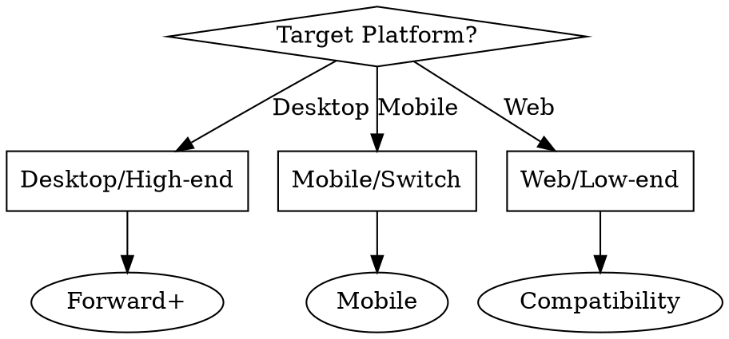

# Godot Rendering Optimizer

## Overview

Optimizes Godot 4.x rendering pipeline to achieve consistent 60+ FPS performance. Detects renderer configuration mismatches, batching inefficiencies, excessive draw calls, and material/shader bottlenecks. Provides renderer-specific optimization strategies for Forward+, Mobile, and Compatibility renderers.

**Core principle:** Rendering performance depends on matching renderer to target platform, minimizing draw calls through batching and culling, and optimizing GPU workload via LOD and materials.

## When to Use

**Use when:**
- Frame rate drops below target (60 FPS or 30 FPS)
- Draw calls exceed 100 (2D) or 500 (3D)
- GPU usage is unexpectedly high
- Game lags on mobile/low-end devices
- Switching target platform (desktop → mobile)
- Before release to optimize for target hardware
- Visible pop-in or culling issues in 3D

**Don't use for:**
- CPU/GDScript performance issues (use godot-profile-performance)
- Physics simulation performance
- Network synchronization issues
- Audio performance problems

## Renderer Selection

### Detection: Current Renderer Configuration

```bash
# Check project.godot for renderer settings
grep -A 5 "rendering/renderer" project.godot 2>/dev/null || echo "Using default renderer"
```

**Expected output:**
```ini
[rendering]
renderer/rendering_method="forward_plus"
# or "mobile" or "gl_compatibility"
```

### Renderer Comparison

| Renderer | Use Case | Draw Calls | Features | Performance |
|----------|----------|------------|----------|-------------|
| Forward+ | Desktop/high-end | 1000-5000 | Full | Best on desktop |
| Mobile | Mobile/mid-range | 500-2000 | Reduced | Optimized for tile-based GPUs |
| Compatibility | Low-end/web | 100-500 | Limited | Maximum compatibility |

### Optimization Strategy by Renderer

#### Forward+ (Default)

**Best for:** Desktop, high-end mobile, complex lighting

**Optimizations:**
- Keep draw calls <2000 for 60 FPS
- Use clustered lighting for many lights
- Enable SSAO, SSR, volumetrics as needed

**Project Settings:**
```ini
[rendering]
renderer/rendering_method="forward_plus"
anti_aliasing/quality/msaa_3d=2
environment/ssao/quality=1
```

#### Mobile

**Best for:** Mobile devices, Nintendo Switch, integrated graphics

**Optimizations:**
- Target draw calls <1000
- Limit dynamic lights per object
- Use baked lighting where possible
- Disable expensive effects

**Project Settings:**
```ini
[rendering]
renderer/rendering_method="mobile"
anti_aliasing/quality/msaa_3d=0
lights/max_lights_per_object=4
environment/ssao/quality=0
```

#### Compatibility

**Best for:** Low-end hardware, web export, old GPUs

**Optimizations:**
- Keep draw calls <500
- Avoid complex shaders
- Use 2D where possible
- Minimize overdraw

**Project Settings:**
```ini
[rendering]
renderer/rendering_method="gl_compatibility"
anti_aliasing/quality/screen_space_aa=0
environment/glow/upscale_mode=0
```

### Renderer Selection Logic



## 2D Batching Optimization

### Detection: Batching Inefficiencies

```bash
# Check for common batch-breaking patterns
echo "=== Checking 2D Batching Issues ==="

# Different textures cause batch breaks
echo "Unique textures in sprites:"
find . -name "*.png" -o -name "*.jpg" | wc -l

# Different materials break batches
echo "Unique materials in 2D scenes:"
grep -r "material" scenes/ --include="*.tscn" | wc -l

# Shader modifications break batching
echo "Custom shaders in 2D:"
find . -name "*.gdshader" | xargs grep -l "canvas_item" 2>/dev/null | wc -l
```

### Batching-Breaking Patterns

| Pattern | Impact | Solution |
|---------|--------|----------|
| Unique textures per sprite | +1 draw call each | Use texture atlases |
| Different blend modes | Batch break | Group by blend mode |
| Custom shader parameters | Batch break | Use uniform arrays |
| Z-index changes | Reordering overhead | Group by z-index |
| Modulate color changes | Material variant | Batch color updates |

### Optimization: Texture Atlases

**Before:**
```gdscript
# 100 sprites = 100 draw calls (100 unique textures)
for i in range(100):
    var sprite = Sprite2D.new()
    sprite.texture = load("res://sprites/sprite_%d.png" % i)
    add_child(sprite)
```

**After:**
```gdscript
# 100 sprites = 1-2 draw calls (atlas + single material)
@onready var atlas: Texture2D = preload("res://sprites/atlas.png")

func _ready():
    for i in range(100):
        var sprite = Sprite2D.new()
        sprite.texture = atlas
        # Use region to select specific sprite from atlas
        sprite.region_enabled = true
        sprite.region_rect = get_sprite_region(i)
        add_child(sprite)
```

**Atlas Creation:**
```bash
# Use Godot's built-in atlas importer
# 1. Import multiple textures with "2D Pixel" preset
# 2. Enable "Atlas" in import settings
# 3. Set max atlas size (2048x2048 recommended)
```

### Optimization: Material Batching

**Before:**
```gdscript
# Each sprite has unique material = batch breaks
for i in range(100):
    var sprite = Sprite2D.new()
    var mat = ShaderMaterial.new()
    mat.shader = load("res://shaders/glow.gdshader")
    mat.set_shader_parameter("intensity", i * 0.01)
    sprite.material = mat
    add_child(sprite)
```

**After:**
```gdscript
# Single material with instance uniforms
@onready var shared_material: ShaderMaterial = preload("res://materials/shared_glow.tres")

func _ready():
    for i in range(100):
        var sprite = Sprite2D.new()
        # Use same material (batches together)
        sprite.material = shared_material
        # Godot batches sprites with same material
        add_child(sprite)
```

## Occlusion Culling (3D)

### Detection: Missing Occlusion Culling

```bash
# Check if occlusion culling is enabled
grep -r "occlusion_culling" project.godot 2>/dev/null || echo "Occlusion culling not configured"

# Count occluder nodes
echo "Occluder nodes in scenes:"
grep -r "OccluderInstance3D" scenes/ --include="*.tscn" | wc -l
```

### Setup Procedure

**Step 1: Enable Occlusion Culling**
```ini
[rendering]
occlusion_culling/use_occlusion_culling=true
occlusion_culling/occlusion_rays_per_thread=512
```

**Step 2: Add OccluderInstance3D Nodes**

**Before:**
```
Level Structure:
- BuildingA (MeshInstance3D) ← Always rendered
- BuildingB (MeshInstance3D) ← Always rendered
- BuildingC (MeshInstance3D) ← Always rendered
  - Even when behind BuildingA!
```

**After:**
```
Level Structure:
- BuildingA
  - MeshInstance3D (visual mesh)
  - OccluderInstance3D (occlusion shape) ← Occludes buildings behind
- BuildingB
  - MeshInstance3D
  - OccluderInstance3D
```

**Step 3: Configure Occlusion Geometry**
```gdscript
# Create occlusion shape from mesh (simplified)
func setup_occlusion(mesh_instance: MeshInstance3D):
    var occluder = OccluderInstance3D.new()
    # Use simplified convex hull for occlusion
    var hull = ConvexPolygonShape3D.new()
    hull.points = mesh_instance.mesh.get_faces()
    occluder.shape = hull
    mesh_instance.add_child(occluder)
```

### Occlusion Culling Best Practices

| Do | Don't |
|----|-------|
| Use simple convex shapes for occluders | Use complex mesh as occluder |
| Place occluders on large buildings/terrain | Place on small props |
| Keep occluders static | Animate occluders |
| Update baking when level changes | Enable for highly dynamic scenes |

## LOD (Level of Detail) Configuration

### Detection: Missing LOD

```bash
# Check for LOD configuration
echo "MeshInstance3D nodes without LOD:"
grep -r "MeshInstance3D" scenes/ --include="*.tscn" -A 5 | grep -c "lod_bias" || echo "0"

# Alternative: Check for LOD nodes
echo "LOD nodes found:"
grep -r "LODGroup\|lod_bias" scenes/ --include="*.tscn" | wc -l
```

### Automatic LOD Generation

**Importer Settings:**
```bash
# In Godot's import tab for .gltf/.glb:
[importer_defaults]
gltf/lod_generate=true
gltf/lod_bias=1.0
gltf/lod_num_levels=3
```

**Manual LOD Setup:**

**Before:**
```gdscript
# High-poly mesh rendered at all distances
extends MeshInstance3D

func _ready():
    mesh = load("res://models/tree_high_poly.obj")
    # 5000 triangles visible from any distance!
```

**After:**
```gdscript
# LOD switched based on distance
extends MeshInstance3D

@export var lod_high: Mesh
@export var lod_medium: Mesh
@export var lod_low: Mesh

@onready var lod_component: LODComponent = $LODComponent

func _ready():
    # Auto-switch meshes based on distance
    lod_component.set_lod_meshes([
        { mesh = lod_high, distance = 0 },      # 0-20m: 5000 tris
        { mesh = lod_medium, distance = 20 },   # 20-50m: 1000 tris
        { mesh = lod_low, distance = 50 }       # 50m+: 200 tris
    ])
```

### LOD Distance Configuration

**Recommended LOD Distances:**

| Object Type | LOD0 (High) | LOD1 (Medium) | LOD2 (Low) |
|-------------|-------------|---------------|------------|
| Characters | 0-10m | 10-30m | 30m+ |
| Props | 0-15m | 15-40m | 40m+ |
| Buildings | 0-50m | 50-150m | 150m+ |
| Terrain | 0-100m | 100-300m | 300m+ |

**Project Settings:**
```ini
[rendering]
lod/lod_bias=1.0
lod/lod_change_threshold=0.1
```

## Draw Call Reduction

### Detection: Excessive Draw Calls

**Monitor in Godot:**
```gdscript
# Add to a debug UI script
func _process(delta):
    var draw_calls = RenderingServer.get_rendering_info(
        RenderingServer.RENDERING_INFO_DRAW_CALLS_IN_FRAME
    )
    print("Draw calls: ", draw_calls)
```

**Bash detection:**
```bash
# Find scenes with many MeshInstance3D nodes
echo "Scenes with high node counts (potential draw call issues):"
for scene in $(find . -name "*.tscn"); do
    count=$(grep -c "type=\"MeshInstance3D\"" "$scene" 2>/dev/null || echo 0)
    if [ "$count" -gt 50 ]; then
        echo "$scene: $count MeshInstance3D nodes"
    fi
done
```

### Draw Call Optimization Strategies

#### 1. Combine Static Meshes

**Before:**
```gdscript
# 100 separate chairs = 100 draw calls
for i in range(100):
    var chair = MeshInstance3D.new()
    chair.mesh = preload("res://models/chair.obj")
    chair.position = chair_positions[i]
    add_child(chair)
```

**After:**
```gdscript
# Combine into single mesh = 1 draw call
@onready var multimesh: MultiMeshInstance3D = $MultiMeshInstance3D

func _ready():
    var mm = MultiMesh.new()
    mm.transform_format = MultiMesh.TRANSFORM_3D
    mm.mesh = preload("res://models/chair.obj")
    mm.instance_count = 100
    
    for i in range(100):
        mm.set_instance_transform(i, 
            Transform3D(Basis(), chair_positions[i]))
    
    multimesh.multimesh = mm
```

#### 2. Reduce Material Variants

**Before:**
```
Materials (5 variants):
- chair_wood_red.tres
- chair_wood_blue.tres
- chair_wood_green.tres
- chair_metal_red.tres
- chair_metal_blue.tres
```

**After:**
```
Materials (2 base + instance parameters):
- chair_wood.tres (with color parameter)
- chair_metal.tres (with color parameter)

# Set per-instance colors via script
mesh_instance.set_instance_shader_parameter("albedo_color", color)
```

#### 3. GPU Instancing

**For repeated objects:**
```gdscript
# Instead of 1000 individual trees
# Use MultiMesh for 1 draw call
@onready var forest: MultiMeshInstance3D = $Forest

func generate_forest():
    var mm = MultiMesh.new()
    mm.mesh = preload("res://models/tree.obj")
    mm.instance_count = 1000
    
    for i in range(1000):
        var pos = random_position_in_forest()
        var scale = randf_range(0.8, 1.2)
        var transform = Transform3D(
            Basis().scaled(Vector3(scale, scale, scale)),
            pos
        )
        mm.set_instance_transform(i, transform)
    
    forest.multimesh = mm
```

### Draw Call Targets by Platform

| Platform | 2D Target | 3D Target | Notes |
|----------|-----------|-----------|-------|
| Desktop | <100 | <500 | High-end can handle 1000+ |
| Mobile | <50 | <200 | Tile-based GPUs sensitive |
| Web | <30 | <100 | Browser overhead significant |
| Switch | <75 | <300 | Mobile-like constraints |

## Material & Shader Optimization

### Detection: Expensive Materials

```bash
# Check for complex shaders
echo "Complex shader patterns found:"
echo "Fragment loops:"
grep -r "for.*in.*fragment" shaders/ --include="*.gdshader" | wc -l

echo "Texture samples >4:"
grep -r "texture(" shaders/ --include="*.gdshader" | wc -l

echo "Discards in fragment:"
grep -r "discard" shaders/ --include="*.gdshader" | wc -l
```

### Material Optimization Patterns

#### 1. Reduce Texture Samples

**Before:**
```glsl
shader_type canvas_item;

uniform sampler2D albedo;
uniform sampler2D normal;
uniform sampler2D roughness;
uniform sampler2D metallic;
uniform sampler2D emission;
uniform sampler2D ao;

void fragment() {
    COLOR = texture(albedo, UV);
    NORMAL = texture(normal, UV).rgb;
    // 6 texture samples per pixel!
}
```

**After:**
```glsl
shader_type canvas_item;

// Pack into single texture or reduce
uniform sampler2D albedo_metallic;  // RGB=albedo, A=metallic
uniform sampler2D normal_roughness; // RG=normal, B=roughness

void fragment() {
    vec4 alb_met = texture(albedo_metallic, UV);
    vec3 norm_rough = texture(normal_roughness, UV).rgb;
    // 2 texture samples - 3x reduction
}
```

#### 2. Simplify Fragment Shader Logic

**Before:**
```glsl
void fragment() {
    for (int i = 0; i < 8; i++) {
        // Complex per-light calculations
        vec3 light_dir = normalize(light_positions[i] - WORLD_POSITION);
        float diff = max(dot(NORMAL, light_dir), 0.0);
        // ... more calculations
    }
}
```

**After:**
```glsl
// Use Godot's built-in lighting
// Move complex calculations to vertex shader or precompute
void vertex() {
    // Calculate lighting in vertex where possible
}

void fragment() {
    // Simple texture lookup
    COLOR = texture(albedo, UV) * light_color;
}
```

#### 3. Optimize Transparency

**Alpha blending vs Alpha testing:**

| Method | Performance | Use Case |
|--------|-------------|----------|
| Alpha blend | Slow (requires sorting) | Gradual transparency |
| Alpha scissor | Fast (no sorting) | Cutout/masked |
| Opaque | Fastest | No transparency |

**Alpha Scissor Setup:**
```glsl
shader_type spatial;
render_mode depth_draw_opaque, cull_disabled;

uniform sampler2D albedo;
uniform float alpha_scissor : hint_range(0.0, 1.0) = 0.5;

void fragment() {
    vec4 color = texture(albedo, UV);
    if (color.a < alpha_scissor) {
        discard;  // Much faster than blending
    }
    ALBEDO = color.rgb;
}
```

### Shader Complexity Guidelines

| Shader Type | Max Instructions | Texture Samples | Notes |
|-------------|------------------|-----------------|-------|
| Simple 2D | <20 | 1 | Basic sprite shaders |
| Complex 2D | <50 | 2-3 | Effects, lighting |
| Simple 3D | <30 | 1-2 | Standard materials |
| Complex 3D | <100 | 3-4 | Custom PBR, effects |
| Vertex only | <50 | 0 | Displacement, animation |

## Performance Validation

### Metrics to Monitor

**Godot Profiler Metrics:**
```gdscript
func _process(delta):
    # Draw calls (target: <500 for 3D, <100 for 2D)
    var draw_calls = RenderingServer.get_rendering_info(
        RenderingServer.RENDERING_INFO_DRAW_CALLS_IN_FRAME
    )
    
    # Vertices processed
    var vertices = RenderingServer.get_rendering_info(
        RenderingServer.RENDERING_INFO_VERTICES_IN_FRAME
    )
    
    # Texture memory
    var tex_memory = RenderingServer.get_rendering_info(
        RenderingServer.RENDERING_INFO_TEXTURE_MEM_USED
    )
    
    print("Draw calls: %d, Vertices: %d, Texture mem: %d MB" % [
        draw_calls, vertices, tex_memory / 1024 / 1024
    ])
```

### Performance Targets

| Metric | Desktop | Mobile | Web |
|--------|---------|--------|-----|
| Draw Calls (3D) | <500 | <200 | <100 |
| Draw Calls (2D) | <100 | <50 | <30 |
| Frame Time (GPU) | <8ms | <12ms | <16ms |
| Texture Memory | <512MB | <256MB | <128MB |
| Vertices/Frame | <500k | <200k | <100k |

## Examples

### Example 1: 2D Game Batching Fix

**Problem:**
```gdscript
# hud_controller.gd
func _ready():
    # 50 UI elements = 50 draw calls
    for i in range(50):
        var icon = TextureRect.new()
        icon.texture = load("res://icons/icon_%d.png" % i)
        icon.material = ShaderMaterial.new()
        icon.material.shader = load("res://shaders/ui_glow.gdshader")
        add_child(icon)
```

**Profiler Output:**
```
Rendering Info:
- Draw calls: 52 (50 icons + 2 base)
- Texture switches: 50
- Shader switches: 50
```

**Optimized:**
```gdscript
# hud_controller.gd
@onready var icon_atlas: Texture2D = preload("res://icons/ui_atlas.png")
@onready var shared_material: Material = preload("res://materials/ui_glow.tres")

func _ready():
    # 50 UI elements = 1 draw call
    for i in range(50):
        var icon = TextureRect.new()
        icon.texture = icon_atlas
        icon.region_enabled = true
        icon.region_rect = get_icon_region(i)  # Atlas coordinates
        icon.material = shared_material  # Shared material batches together
        add_child(icon)
```

**Result:**
```
Rendering Info:
- Draw calls: 2 (1 atlas batch + 1 base)
- Texture switches: 1
- Shader switches: 1
- Performance: 50x reduction in draw calls!
```

### Example 2: 3D Level Optimization

**Problem:**
```
City Scene:
- 500 buildings (separate MeshInstance3D) = 500 draw calls
- No occlusion culling (all rendered always)
- No LOD (high-poly models at all distances)
- 200+ draw calls from small props
```

**Profiler Output:**
```
Rendering Info:
- Draw calls: 720
- Vertices: 2,500,000 per frame
- Frame time: 22ms (45 FPS)
```

**Optimized:**
```
City Scene:
- 500 buildings → 20 combined meshes per district (batching)
- Occlusion culling on large buildings (-40% objects rendered)
- LOD on all buildings (3 levels: high/med/low)
- Props → MultiMesh (200 props = 1 draw call)
```

**Code Changes:**
```gdscript
# combine_static_meshes.gd
func batch_buildings_by_district():
    for district in city_districts:
        var static_body = StaticBody3D.new()
        var mesh_instance = MeshInstance3D.new()
        
        # Combine all static meshes in district
        var combined_mesh = ArrayMesh.new()
        var surfaces = []
        
        for building in district.buildings:
            if building.is_static:
                surfaces.append(building.mesh)
        
        # Merge surfaces
        mesh_instance.mesh = merge_meshes(surfaces)
        static_body.add_child(mesh_instance)
        
        # Add occlusion for large buildings
        if district.has_large_buildings:
            add_occlusion_culling(static_body)
        
        add_child(static_body)

func optimize_props():
    # Convert 200 individual benches to MultiMesh
    var bench_multimesh = MultiMeshInstance3D.new()
    bench_multimesh.multimesh = create_multimesh_from_nodes(
        get_tree().get_nodes_in_group("benches")
    )
    add_child(bench_multimesh)
```

**Result:**
```
Rendering Info:
- Draw calls: 85 (92% reduction!)
- Vertices: 400,000 per frame (LOD + culling)
- Frame time: 6ms (165 FPS)
- GPU memory: 40% reduction
```

### Example 3: Renderer Migration

**Problem:** Desktop game running at 30 FPS on mobile

**Before (Forward+ on mobile):**
```ini
[rendering]
renderer/rendering_method="forward_plus"
lights/max_lights_per_object=16
environment/ssao/quality=2
anti_aliasing/quality/msaa_3d=4
```

**After (Mobile renderer optimized):**
```ini
[rendering]
renderer/rendering_method="mobile"
lights/max_lights_per_object=4
environment/ssao/quality=0
anti_aliasing/quality/msaa_3d=0
anti_aliasing/quality/use_taa=true
environment/glow/upscale_mode=0
```

**Additional Changes:**
```gdscript
# Reduce shadow quality on mobile
func _ready():
    if OS.get_name() == "Android" or OS.get_name() == "iOS":
        # Lower shadow map resolution
        get_viewport().msaa_3d = Viewport.MSAA_DISABLED
        
        # Reduce light counts
        for light in get_tree().get_nodes_in_group("decorative_lights"):
            light.hide()  # Disable non-essential lights
        
        # Enable LOD more aggressively
        RenderingServer.viewport_set_lod_threshold(
            get_viewport().get_viewport_rid(), 1.5
        )
```

**Result:**
```
Mobile Performance:
- Before: 30 FPS, device hot, battery drain
- After: 60 FPS stable, normal temperature, 40% less battery usage
```

## Success Criteria

A rendering optimization is successful when:

### Quantitative Metrics
- [ ] Draw calls reduced by >50% (or within platform target)
- [ ] Frame time consistently <16.67ms for 60 FPS
- [ ] GPU memory usage reduced or stable
- [ ] Vertex count reduced through LOD/culling
- [ ] Texture switches minimized (<10 per frame)
- [ ] Material/shader switches minimized

### Configuration Checks
- [ ] Renderer matches target platform
- [ ] Occlusion culling enabled for 3D scenes with occlusion
- [ ] LOD configured for all high-poly meshes
- [ ] Texture atlases used for 2D batching
- [ ] MultiMesh used for repeated 3D objects
- [ ] Materials share textures and shaders

### Validation Steps
1. **Profile before:** Record baseline draw calls, frame time, GPU usage
2. **Apply optimizations:** Use patterns above systematically
3. **Profile after:** Compare metrics, verify >50% improvement
4. **Test on target hardware:** Ensure works on actual target device
5. **Visual regression test:** Confirm no visual quality loss
6. **Stress test:** Verify performance under worst-case conditions

## Quick Reference

| Optimization | Detection | Fix | Impact |
|--------------|-----------|-----|--------|
| Wrong renderer | Check project.godot | Match to platform | 2-3x performance |
| 2D batch breaks | Many draw calls for simple scene | Texture atlas, shared material | 10-50x reduction |
| No occlusion culling | Objects rendered behind walls | Add OccluderInstance3D | 20-60% objects culled |
| Missing LOD | High vertex count at distance | Set up LOD meshes | 50-90% vertex reduction |
| Excessive draw calls | >500 (3D) or >100 (2D) | Combine meshes, MultiMesh | 5-20x reduction |
| Expensive shaders | High GPU frame time | Simplify, reduce texture samples | 2-5x shader speed |

## Common Mistakes

### Mistake: Optimizing without profiling
**Problem:** Guessing at bottlenecks, optimizing non-critical areas
**Fix:** Always profile first, focus on top time consumers

### Mistake: Premature LOD
**Problem:** Overly aggressive LOD causing visual pop-in
**Fix:** Balance performance with quality, use smooth LOD transitions

### Mistake: Breaking batching unintentionally
**Problem:** Adding per-instance shader parameters or unique materials
**Fix:** Use instance uniforms or batch updates carefully

### Mistake: Desktop settings on mobile
**Problem:** Using Forward+ renderer, high MSAA, complex shaders
**Fix:** Switch to Mobile renderer, use platform detection

### Mistake: Ignoring vertex processing
**Problem:** Focusing only on draw calls, ignoring vertex count
**Fix:** Monitor vertices/frame, optimize mesh complexity

### Mistake: Over-occlusion
**Problem:** Too many occluders causing CPU overhead
**Fix:** Use only on large objects, profile occlusion cost vs benefit
