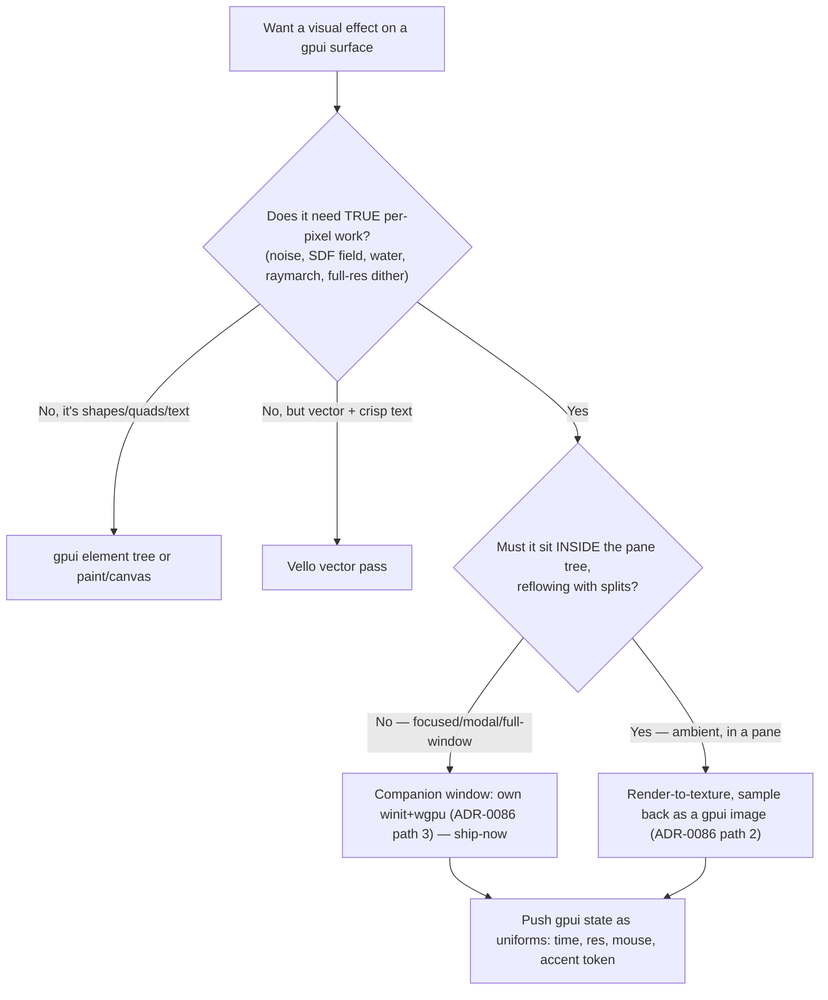

# gpui Shaders

**Activation boundary:** own WGSL code, GPU budget, and texture/window integration only when a pixel shader is required. Route ordinary GPUI `div`/`canvas` composition to `gpui-rust-console` and `with_animation` state transitions to `rust-gpui-motion`. The effect list below is illustrative, not an automatic reason to allocate a GPU pass.

Run your own WGSL fragment shaders on Metal (via wgpu) and get their pixels onto a native gpui window — for the per-pixel effects the element tree can't do (water, noise fields, dither, glints). The aesthetic house style is **pixelated + dithered retro-futurism** on the maritime palette; the engineering rule is **earn the GPU pass** — most "shader" ideas are better done with a gpui primitive or a Vello vector pass.

## When to Use

- A surface needs genuine per-pixel work: ocean/water, noise/fbm fields, raymarching, full-res dither, glints, a living-harbor backdrop.
- You want a shader-toy effect (SDF shapes, palettes, domain-warped noise) inside or behind a gpui pane.
- Building the "living harbor" viz, dithered chrome borders, a sonar/radar sweep, signal-flag shimmer, or a CRT/scanline post pass.

## NOT for

- Web shaders (GLSL/three.js/WebGL/`<canvas>`) — different runtime entirely.
- Non-shader motion/transitions in gpui — use `rust-gpui-motion`.
- Plain vector/2D drawing that Vello or gpui `paint`/`canvas` already does — don't reach for a raw fragment pass.
- General layout, color systems, typography — `beautiful-gui-design`. CLI/TUI — `beautiful-cli-design`.

## Decision Points

Route: **gpui primitive → Vello vector → wgpu fragment pass**, in that order of preference. A raw WGSL pass is justified only by real per-pixel cost. Companion-window is the ship-now path (it's the timeline-proto skeleton); in-window embed (render-to-texture) is the target for ambient surfaces — budget the round-trip honestly.

## Core Rules

- **Earn the GPU pass.** Don't shader a button. Per-pixel work or nothing.
- **Sample theme tokens.** Color comes from `u.accent` (the gpui theme token pushed as a uniform) + a cosine `palette()` — never hardcode brand hex in WGSL, so light/dark + brand flow through.
- **`time` is the only animation input** — so reduced-motion = freeze `time` to a static, still-beautiful frame (never a blank).
- **Pause offscreen/unfocused.** A shader pane that isn't visible must stop rendering; an ambient shader must cap its frame rate.
- **Dither + pixelate are the style, applied throughout** (Bayer threshold on luminance/palette-t, snap-to-grid UV) — not a post-filter bolted on.
- **Pixelate first for budget.** Fewer effective fragments; cap fbm octaves; render ambient surfaces at reduced res and upscale (the dither hides it).
- **Keep wgpu out of the Linux CI workspace** (companion crate, like `pd-timeline-proto`) so the rust-console gate never compiles it.

## Failure Modes

### Anti-Pattern: "Shadering a widget"
**Symptom**: a fragment pass drawing a rectangle, a border, or text that the element tree draws for free.
**Detection**: the shader has no `noise`/`sdf`/loop — it's just a fill or gradient.
**Fix**: use a gpui `div`/`paint_quad`/Vello. Reserve WGSL for true per-pixel work.

### Anti-Pattern: "The ambient shader that never sleeps"
**Symptom**: CPU/GPU pegged while the shader pane is offscreen, backgrounded, or the window's unfocused.
**Detection**: frame counter keeps climbing with the window hidden; fans spin on an idle app.
**Fix**: gate rendering on visibility/focus; cap ambient shaders to 30fps; stop the loop when occluded.

### Anti-Pattern: "Hardcoded accent hex in WGSL"
**Symptom**: the shader looks right in dark mode, wrong (or off-brand) in light; theme changes don't reach it.
**Detection**: literal colors in the `.wgsl`; no `accent` uniform.
**Fix**: push the theme token as `u.accent`; derive everything via `palette()`/`mix` from it.

### Anti-Pattern: "fbm to the moon"
**Symptom**: gorgeous in isolation, drops frames at full window size or on an iGPU.
**Detection**: profiler shows the fragment stage dominating; octave count ≥ 6 at full res.
**Fix**: pixelate first, cap octaves (4–5), reduce render resolution + upscale, precompute constants.

### Anti-Pattern: "Per-RGB dither rainbow"
**Symptom**: dithering produces colored speckle instead of a clean two-tone dissolve.
**Detection**: Bayer threshold applied to r,g,b independently.
**Fix**: dither luminance or the palette parameter `t`, then map through the palette.

## Worked Example: a living-harbor water shader behind the Quay

Goal: a calm, dithered, pixelated ocean drifting behind the agent dock — ambient, on-brand, reduced-motion-safe, cheap.

1. **Earn it**: water = domain-warped fbm + a sun glint = true per-pixel work → a fragment pass is justified (not a Vello vector).
2. **Path**: it lives *in* the pane behind the Quay → render-to-texture, sample back as a gpui image (ADR-0086 path 2). Ambient → cap at 30fps, pause when the window's unfocused.
3. **Shader** (from `03-the-stockpile.md` + `02`): aspect-correct `p`; `warped = fbm(p + 4*q)` for swells; horizon gradient via `palette(uv.y, …, u.accent)`; **pixelate** UV to fat pixels; **Bayer-dither** the luminance to ~4 levels for the retro water; a soft `sd_circle` sun with additive glint.
4. **Theme**: `u.accent` = the mustard token → warm sun on navy water in dark, muted in light.
5. **Reduced-motion**: if the OS prefers reduced motion, freeze `u.time` at a hand-picked still — the water becomes a static dithered seascape, never blank.
6. **Compose**: `rust-gpui-motion` fades the shader pane in (opacity, 200ms); `beautiful-gui-design` keeps the Quay text contrast ≥4.5:1 over the busiest water region (test it).

## Quality Gates

- [ ] The effect genuinely needs per-pixel work (else use a primitive/Vello).
- [ ] Companion-vs-embed chosen deliberately; wgpu kept out of the Linux CI workspace.
- [ ] Color derives from the `accent` theme uniform + `palette()`; no hardcoded brand hex.
- [ ] Reduced-motion freezes `time` to a still, non-blank frame.
- [ ] Shader pauses/caps when offscreen, occluded, or unfocused.
- [ ] AA uses `fwidth`; dither targets luminance/palette-t; pixelation applied before heavy noise.
- [ ] fbm octaves tuned to the frame budget; ambient surfaces render at reduced res if needed.
- [ ] Text/controls over the shader stay ≥4.5:1 contrast on the busiest region.

## Fork Guidance

Fork by lane: **integration** (`01` — surfaces, companion vs embed, uniform plumbing) · **technique** (`02` — SDF/noise/dither WGSL) · **content** (`03` — the stockpile of finished effects) · **shipping** (`04` — performance, reduced-motion, packaging). Keep the "earn the pass" decision in the parent.

## Reference Map

- `references/01-shader-surfaces-in-gpui.md` — getting a custom fragment pass onto a gpui window: companion window vs render-to-texture embed (ADR-0086), wgpu setup, uniform plumbing from gpui state.
- `references/02-wgsl-fundamentals-for-ui.md` — the per-pixel toolkit: UV spaces, SDFs + `fwidth` AA, hash/value-noise/fbm, domain warping, cosine palettes, Bayer dithering + pixelation, cost.
- `references/03-the-stockpile.md` — copy-pasteable WGSL examples: pixelated ocean waves, boats, the living harbor, signal-flag shimmer, aurora/starfield, CRT post, dithered chrome border, sonar sweep.
- `references/04-integration-performance-a11y.md` — when a shader earns its place, frame budget, pausing offscreen, reduced-motion, theme-token sampling, packaging/hot-reload.
- `scripts/shader_budget_audit.mjs` — deterministic auditor: run a `shader-effect-plan.json` (see `schemas/shader-plan.schema.json`, `examples/sample-input.json`) through this skill's Quality Gates and anti-patterns to catch "shadering a widget," an ambient shader that never sleeps, hardcoded brand hex, unfrozen reduced-motion, per-RGB dither, and fbm-to-the-moon before code is written.

**Sibling skills:** see `metadata.pairs-with` in the frontmatter — `rust-gpui-motion` (animate/fade shader surfaces), `vello-parley-rendering` + `metal-text-pipeline` (the vector + bare-metal neighbors), and `build-coop-ide-gpui` (the host these surfaces embed into). For contrast/hierarchy over shaders, see `beautiful-gui-design`.

<!-- BEGIN BUNDLE INDEX (auto: index_references.py) -->

## Skill Bundle Index

*Every file in this skill, and when to open it. Auto-generated; run `scripts/index_references.py --fix`.*

**root**
- [`CHANGELOG.md`](CHANGELOG.md) — UgpuiUshaders — Changelog — - Brought to the agentic-family standard: added `io-contract`/`provenance`/`pairs-with` frontmatter - Added a deterministic audit helper (ma

**`examples/`**
- [`examples/sample-input.json`](examples/sample-input.json) — sample input (data/schema)

**`references/`**
- [`references/01-shader-surfaces-in-gpui.md`](references/01-shader-surfaces-in-gpui.md) — Shader Surfaces in gpui — Getting a Custom GPU Fragment-Shader Pass Into a Native Rust Window — > **Scope.** The sibling doc `05-bespoke-graphics-vello-wgpu.md` maps the three tiers of bespoke drawing (T1 element tree → T2 gpui `paint`/
- [`references/02-wgsl-fundamentals-for-ui.md`](references/02-wgsl-fundamentals-for-ui.md) — WGSL Shader Fundamentals for UI Surfaces — > The Shadertoy mental model, ported to a **WGSL fragment shader feeding a gpui pane** (Metal via wgpu).
- [`references/03-the-stockpile.md`](references/03-the-stockpile.md) — The Stockpile — Copy-Pasteable WGSL Shader-Toy Examples for the Harbor Console — > **Scope.** This is the showpiece.
- [`references/04-integration-performance-a11y.md`](references/04-integration-performance-a11y.md) — Integration, Performance & Accessibility — Earning a Shader in a gpui App — > **Scope.** A shader is the most expensive pixel in your app.

**`schemas/`**
- [`schemas/shader-plan.schema.json`](schemas/shader-plan.schema.json) — shader plan.schema (data/schema)

**`scripts/`**
- [`scripts/shader_budget_audit.mjs`](scripts/shader_budget_audit.mjs)

<!-- END BUNDLE INDEX -->
