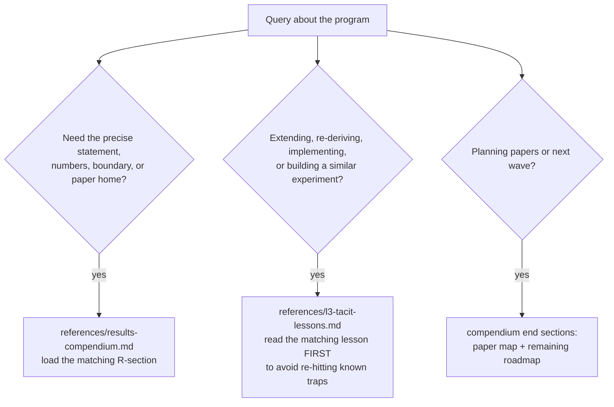

# Harbor Results: The Executed Corpus (R1–R17)

## Research work authority

Read [the Omni ledger](../../docs/harbor-research/OMNI-LEDGER.md) for results,
current work, acceptance conditions and source provenance. Its canonical data is
`docs/harbor-research/omni-ledger.json`; the Markdown and website program are
projections. Consolidated supporting documents are source records in that ledger,
with exact original bytes in `docs/harbor-research/omni-sources.zip`. Use
`scripts/harbor-research/omni_ledger.py` document APIs in checks rather than recreating
retired paths. Paper manuscripts, publication PDFs and executable evidence remain live.
An imported status is a source assertion; it does not certify a current proof or run.

Seventeen inherited result records, each with a one-breath statement here and full depth in the references. The original scripts use program seed 20260816 where stated. This repair independently checks only the bounded CR-4 fixtures; it preserves the other result records and their original evidence labels without recertifying them.

## Evidence status for this repair

CR-4’s general optimality and reconcile-round claims are refuted by the documented finite counterexamples. CR-1/2/3, the R6 harness, CR-5, and R1–R17 otherwise retain their own source-local `[verified]` or `[internal]` labels in the compendium; they are **unreviewed in this CR-4 repair**, rather than newly certified by it. Read the named method and boundary before relying on any result.

## When to Use
✅ Use for: citing or restating any R1–R17 result precisely; choosing which result underwrites a product claim; extending a result or checking whether a "new" idea is already covered or already refuted; packaging results into papers; onboarding a collaborator to the program.
❌ NOT for: general information theory / game theory / security reference unrelated to these seventeen; Port Daddy engineering outside the results (kernel schemas, CLI); exposition mechanics (harbor-exposition); running the validation discipline itself (falsification-first).

## The Seventeen, in one breath each
- **R1 — Information floor.** No digest below log₂C(N,k) − log₂C(m,k) bits can guarantee catching all k critical items among N while opening m; survived falsification (0/16 violations).
- **R2 — Split-digest.** A strict preference crossing prevents one scalar ranking from serving both readers at every prefix budget; separate decision heads can share one representation or store. Under a shared m-open union budget, disjoint critical sets have a super-additive zero-miss floor (≈2.13×, not 2×).
- **R3 — Derived regret head.** stakes × irreversibility × anomaly is expected loss of passing when anomaly is a calibrated posterior; inspect iff C_miss·a≥c_att+C_fa(1−a), equivalently a≥(c_att+C_fa)/(C_miss+C_fa) when the denominator is positive. With item-dependent costs, rank inspection by net benefit; reputation enters through the posterior.
- **R4 — Digest-zoom frontier.** Two-constraint rate-distortion R(δ,f) with the old floor as its zero-miss corner (R(0)=H(p), e.g. 0.286 bits at p=0.05); adaptive zoom needs ≈k·log₂(F/k) opens vs F flat — only in the sparse-flagged regime.
- **R5 — Hypervisor = supervisory control.** A policy is preventable (regimentable) iff controllable w.r.t. the uncontrollable event set (Ramadge–Wonham K̄Σᵤ∩L̄⊆K̄); "no egress after reading a secret" IS regimentable — gate the channel, never the token.
- **R6 — Edge-residual observability.** A one-edge perturbation leaves a residual exactly when its edge lies on a visible coordinate cycle. General one-sender split views obey the projected sender-map criterion; a cycle through the sender alone is insufficient. With authenticated relayed endpoint claims, direct sender-claim comparison subsumes residual detection.
- **R7 — Inspection tower.** ρ* = G/(dB); sealed sampling from C cliques makes bribery uneconomical (profitable iff G_k > C·B), corruption decays (1−ρd)^k; reputation is amortized verification (Θ(log T) or O(1) audit spend).
- **R8 — Work-unit machine.** Six safety invariants hold in all 536 reachable states; all five guards proven critical by mutation (shortest crimes: 4, 2, 4, 1, 7 steps).
- **R9 — Sealed-room noninterference.** Erin's view identical across equal-parity secrets under every interleaving to depth 7; schedule secret-independence checked separately; leaky-gate and bypass mutations caught with witnesses.
- **R10 — ε-ledger conservation.** The release ledger's atomic append+add conserves σ = Σ_Λ εᵢ ≤ εmax under every concurrent interleaving (single-writer serialization); sequential/advanced DP composition gives the sum its meaning; recorded spend only — mediation is R5's job.
- **R11 — Canary power + SPRT.** k smuggled canaries are caught w.p. 1−β^k; uniform planting gives the hypergeometric operating curve Pr(detect)=f(leak size); Wald's SPRT turns leak intensity into expected time-to-detection with errors at or below target.
- **R12 — No-mint inheritance.** Fork priors conserve iff split = transfer (the source is debited): total live creditable reputation never exceeds total witnessed; copy-full inheritance mints 8.2× from one episode — the quorum attack the invariant blocks.
- **R13 — Engine substitution.** Unattested, swapping a cheap engine behind a good record pays Δc at every price (Akerlof unraveling inside one identity, threshold μ*); engine attestation flips the incentive to Δc−Δθ — the planner's rule at zero audit stake; resurrection across providers is sanction-sound iff all three migration clauses hold, with a shortest attack per dropped clause.
- **R14 — Escalation tuning band.** Continuous strictly increasing benefit and continuous nondecreasing validation give a unique interior escalation threshold u*(δ) only when endpoint payoffs straddle zero (Spence-style separating equilibrium; u* = δw/(1+δw) uniform-linear); the feasible debit set between alarm fatigue and distress silencing is an interval that can be EMPTY — then the fix is capacity or evidence quality, not tuning.
- **R15 — Specialization boundary.** A sole specialist beats the pool iff μs/μg ≥ g(ρ,c) = cρ + c(1−ρ)/(c(1−ρ)+C(c,ρ)) — the whitepaper's proposed threshold falsified in both directions; with mortality ξ and succession rate η, pooling dominates at EVERY skill premium once ξ/η > D* — the price of the succession rule.
- **R16 — Context paging.** Exact Landlord imports k/(k−h+1) competitiveness for online capacity k against offline comparator capacity h. A repair-on-touch pin-oracle additive C·c_refetch term is a finite-test hypothesis, not a theorem; one blind-trusted corruption caused Θ(N) stale serves in a fixture. φN is expected C under a random corruption model.
- **R17 — Deontic conflict fragment.** Inside Horn + ground intervals + difference constraints, commitment-conflict detection is polynomial with a witness per conflict; one expressive step out (disjunctive obligations) is NP-complete — the fragment boundary is the exact price of proposal-time checking.
- **R6 theorem (CR).** The completion residual r is the exact minimum unrestricted visible edge-data correction, and a lower bound on a sender-constrained correction. One-edge sensitivity is |s|√(1−R_eff(e)); the coordinate solve count is the size of the visible coordinate union. For sender q and coordinate c, the invisible split-view dimension is the number of touched components of K_c−q minus one. With complete projected error balls of radius ε, a specified one-edge fault is distinguishable exactly when its projected magnitude exceeds 2ε. All split views of sender magnitude at least τ are distinguishable exactly when the blind-spot dimension is zero and τ times the smallest projected sender singular value exceeds 2ε. General sender offsets and coalitions can cancel to r = 0.
- **R6 active receipt result.** For a new independent edge-only receipt joining endpoints already connected in the visible coordinate graph, squared residual rises by squared least-squares innovation divided by 1 + effective resistance; joining distinct components has zero immediate gain. This is a rank-one least-squares identity, not a truth score or an ex ante promise without predicted receipt signatures.
- **R6 extension (CR-4 & CR-5).** CR-4 is a finite-input energy/cost *selection heuristic*: its single-cycle sever fixture completes, while a five-edge counterexample costs 6 against an exact cost 5 and reconcile-mode zeroing takes 3 rounds with beta_1=1. A lower residual means only that the selected numerical intervention changed the modeled observations. CR-5 retains the constructed 2-complex Hodge decomposition and Legibility Ratio fixture; neither fixture classifies field incidents.

## Routing

## CR-4 intervention boundary

Use the repair helper only after declaring the intervention semantics. `sever` removes an observation row from the residual calculation; it records a fenced or unavailable constraint, not a repaired observation. `reconcile` writes a selected observed coordinate to zero; it is a synthetic edit until a replacement observation, endpoint protocol, authority, and effect receipt are supplied. Both modes return `completed`, `already-consistent`, `early-stop-zero-score`, or `round-limit` with the remaining residual. None of those statuses proves the intervention was cheapest, authorized, or truthful.

Read [the CR-4 counterexample and scope reference](references/cr4-repair-counterexamples-and-scope.md) before extending the helper. The first diagram separates residual telemetry from intervention authority; the second shows the sever and zeroing branches.

- [Evidence and authority boundary](diagrams/01-evidence-scope.md)
- [Intervention decision trace](diagrams/02-intervention-boundary.md)

## Anti-Patterns

### The Unpriced Side Channel
**Novice**: "My simulation's oracle knows the answer; I only charge bits for output resolution."
**Expert**: Information bounds constrain what a channel *carries*; charge bits for *identification*, not tie-breaking. A sim that smuggles identity past the meter will appear to beat the floor (R1's 8/14 spurious violations before the fix).
**Detection**: Any experiment "beating" an information-theoretic bound.

### Cohomology of the Sheaf, Not the Data
**Novice**: "dim H¹ of the sheaf detects the inconsistency."
**Expert**: dim H¹ of the abstract sheaf is a property of restriction maps, data-independent. Equivocation is an obstruction of the *observed assignment* (is the disagreement cochain a coboundary?). And the value-add exists only where the missing edge lies on a cycle.
**Timeline**: Both wrong turns hit and documented 2026-08; they *located* the boundary.
**Detection**: Computing H¹ without the observed data anywhere in the computation; testing on a bridge/tree topology.

### Zoom Everywhere
**Novice**: "Group testing always beats flat inspection."
**Expert**: It pays ≈F/(k·log₂(F/k)) only when positives are sparse in the flagged set; dense flags make splitting overhead dominate. Zoom is for the miss-averse over-flagging regime — exactly where a safe digest operates.
**Detection**: Claiming zoom savings without stating flagged-set density.

## References
- `references/results-compendium.md` — Load when citing, restating, packaging, or checking scope of any R1–R17: boxed statements, [verified] vs [internal] numbers, applications, boundaries, paper map, reproducibility pointers, and the treatise-corrections consensus.
- `references/l3-tacit-lessons.md` — Load BEFORE extending or re-implementing anything here, or designing a related experiment: the hard-won lessons (bugs hit, boundaries found, conventions that change answers) with transferable rules.
- `references/cr4-repair-counterexamples-and-scope.md` — CR-4’s exact five-edge and triangle counterexamples, the conditional sever-only lemma, and the distinction between modeled consistency and an authorized external repair.
- `references/source-access.md` — Source identities, access scopes, and the boundary between imported linear-algebra behavior, constructed fixtures, and local engineering policy.

## Scripts (regenerate every [internal] number)

For registered categorical facts, use `scripts/claim_audit.py` and the contract
in [Omni source SRC-135](../../docs/harbor-research/OMNI-LEDGER.md#source-src-135). Its exact checker uses
zero-edge equality components and endpoint value pins; it can detect a
categorical contradiction on a tree even when the real-valued residual is zero.
Missing reciprocal reports must be excluded separately for each fact and
snapshot. A zero difference is an observed equality, never a missingness marker.
Raw sender comparison uses richer evidence and is reported separately.
`scripts/test_claim_audit.py` checks against exhaustive categorical assignments;
`scripts/costed_claim_certificates.py` computes the minimum retained evidence
certificate, and
`scripts/test_costed_claim_certificates.py` checks the exact minimum retained
certificate cost against all subsets. The costed routine assumes answers are
already observed; it is not an active-query oracle. `scripts/research_envelopes.py`
checks the bounded future-activation and release-policy examples discussed in
[Omni source SRC-142](../../docs/harbor-research/OMNI-LEDGER.md#source-src-142);
`scripts/test_research_envelopes.py` checks those finite models. These are new finite
checks, not inherited-suite coverage or empirical agent performance.

When adding a checker, register it in `whitepaper/corpus.json` and wire its execution into `.github/workflows/proofs.yml`; validate with `node scripts/check-whitepaper-corpus.mjs` from the repository root. A library-index entry alone does not satisfy the proof-estate gate.

For bounded follow-on research, run `scripts/continuation_observation_model.py` for the one-operation, two-epoch recovery model and its unsafe-policy witnesses, or `scripts/receipt_bundle_design.py` for exhaustive small receipt-acquisition instances. Their contracts and limits are in `continuation-observation-model.md` and `receipt-bundle-design.md` under the repository directory `docs/harbor-research/research/`. These checks do not certify a deployed adapter or a field diagnostic advantage. Before scheduling reviewer experiments, use `scripts/harbor-research/check_reviewer_protocol.py` from the repository root: planning validation is separate from admission to run an adjudicated benchmark.

`b4_deontic_fragment.py` is also importable: imports define the pure checker
without running experiments; direct execution or `run_experiments()` runs the
original seeded sweep. The reference interval loop enumerates all active pairs,
including non-clashing pairs, and is worst-case quadratic. Do not describe the
theoretical optimized detector bound as this script's measured scaling. Bound
inputs and audit complexity before using it on larger product corpora.

Self-contained; deps: numpy, scipy, matplotlib, networkx, pinned in `scripts/requirements.txt` (the same pins the proofs workflow installs: `pip install -r scripts/requirements.txt`); seed 20260816 fixed inside each. Run from the skill root when re-verifying a number before citing it, or after modifying any claim these underwrite.
- `python3 scripts/a7_experiment.py` — R1 floor falsification: expect "0/16 violations", split-floor numbers (5.98 / 12.77 bits); writes a7_figure.png.
- `python3 scripts/b1_frontier.py` — R4: analytic R(δ,f) table (0.286 corner) + zoom-advantage table (15.3× at F=2500,k=10) with the dense-regime boundary.
- `python3 scripts/b2_tower.py` — R7: stage-game indifference to machine precision, tower decay per C, amortization spends + pointwise IC check; writes b2_figure.png.
- `python3 scripts/b3_controllability.py` — R5: regimentability table + the compound channel-not-token proof.
- `python3 scripts/c0_workunit.py` — R8: 536-state invariant check + 5-mutation suite printing shortest crime traces.
- `python3 scripts/c1_noninterference.py` — R9: exhaustive depth-7 NI check, schedule-independence check, 2 mutation witnesses.
- `python3 scripts/sheaf_mechanism_proof.py` — R6: cycle-vs-cut minimal proof (signal 1.225 vs 0.000).
- `python3 scripts/a3_epsilon_ledger.py` — R10: exhaustive interleaving check (15 states, 0 violations), 2 atomicity mutations with shortest crimes (1 and 3 steps), DP composition crossover table.
- `python3 scripts/a4_canary_sprt.py` — R11: operating-curve table (0.554 at m=100), Wald-vs-sim SPRT latencies (297 vs 359), correlated-stripping boundary demo.
- `python3 scripts/a6_no_mint.py` — R12: closure-sum counterexample (2.44>1), 4000-DAG sweep (0 violations), copy-full mint caught (8.2×).
- `python3 scripts/b6_probation.py` — B6: front-loaded probation dominance — 0 dominating schedules in 4,000 random instances (76,000 schedules tested), matching the closed-form exchange argument; exit nonzero on violation.
- `python3 scripts/test_legibility_corrections.py` — nine exact boundary checks for decision costs, calibration direction, counting-bound achievability, tied orders, zoom equality, split floors, escalation assumptions and corruption counts. Counterexamples delimit the claims; finite sweeps do not prove universal bounds.
- `python3 scripts/zoom_bound_check.py` — Paper 1's zoom theorem verified: Q <= 2k*ceil(log2(F/k)) + 4k on every tested instance (random + adversarial placements), exact tightness at F=4096,k=32 (511), bound dominates the measured ~163 opens at the b1 point; exit nonzero on violation.
- `python3 scripts/b7_escalation_band.py` — R14: costly-escalation threshold equilibrium (single crossing, closed forms u*=δw/(1+δw) and Lambert-W) + the two-sided debit tuning band tied to R3's constants; empty-band regime exhibited; zero-debit and excessive-debit mutants caught; exit nonzero on violation.
- `python3 scripts/b4_deontic_fragment.py` — R17: polynomial witness-producing conflict checker for the Horn+interval+difference deontic fragment (3000-instance oracle sweep, 0 disagreements) + the 3-SAT NP-completeness reduction one expressive step outside it, verified both directions on 16/16 instances; Horn-propagation mutant misses 100/885 conflicts; exit nonzero on violation.
- `python3 scripts/sheaf_harness_v2.py` — R6 visibility and information-boundary harness: the one-edge cycle residual behaves as predicted, but an equal-information sender-claim checker finds every residual alarm and 209 additional cases across 1,800 synthetic trials. It constructs the bounded-error midpoint ambiguity, checks the sender margin on a six-cycle and path, and checks the marginal receipt identity against independent least-squares solves. The checked-edge-only comparison cannot support a unique detection claim.
- `python3 scripts/paper7_failure_cases.py` — 14 synthetic witnesses for finite-signature identifiability: hidden sender splits, cancelling offsets, ambiguous fault locations, information lost by taking a scalar norm, error-ball overlap, feature collision, and complementary query bundles. Two individually uninformative queries can jointly expose a cycle inconsistency; squared marginal gain is not generally submodular. This is a bounded observation-model check, not a deployed failure classifier.
- `python3 scripts/b5_engine_substitution.py` — R13: Akerlof unraveling inside one identity (swap gain price-independent, μ* threshold, death spirals), the IC flip under engine attestation (swap gain Δc−Δθ, audit stake → 0), and resurrection soundness (747-state migration machine, 0 Def-III.6.1 violations intact; 4 mutants caught with shortest crimes 1,2,2,2); exit nonzero on violation.
- `python3 scripts/sheaf_consistency_radius.py` — R6 synthetic checks: r is the exact minimum unrestricted edge-data change, not the minimum for a fixed sender. The one-edge formula is r = |s| sqrt(1 - R_eff) on the visible coordinate graph. General sender offsets can cancel, and the number of coordinate solves is bounded by the union of visible coordinate sets. Treat localization and timing figures as fixture results, not deployed guarantees.
- `python3 scripts/sheaf_repair_and_2complex.py --cr4-fixtures` — bounded CR-4 fixture suite: input validation, a positive single-cycle sever fixture, and two counterexamples. The helper is import-safe and returns an explicit mode, action list, residual trajectory, completion status, and remaining residual. `eligibleEdges` and `retainedEdges` are distinct in reconcile mode; `modeledObservations` records retained-row values. `python3 scripts/test_cr4_contract.py` runs portable contract regressions. Running without the flag preserves the broader local fixture suite; it is not a production or field validation.
- `python3 scripts/b9_context_paging.py` — R16: Landlord k/(k−h+1) import verified vs exact OPT (122 pairs, cycles at equality) + finite tests of an additive C·c_refetch corruption candidate (0 violations incl. greedy adaptive fixtures; slope 1.9% of ceiling, R²=0.994), without a general credit-coupling proof; blind pin-trust mutant catastrophic (Θ(N) staleness from one corruption); exit nonzero on violation.
- `python3 scripts/b8_specialization.py` — R15: exact Erlang-C specialization boundary g(ρ,c) (falsifies the proposed 1+(c−1)ρ/(1−ρ) threshold in both directions, crossing at ρ=(3−√5)/2) + succession-price theorem W_bd closed form, D* = ηK/(1−ηK); DES/matrix-geometric/CTMC cross-checks, 60-instance sweep, breakdown-blind mutant caught; exit nonzero on violation.
