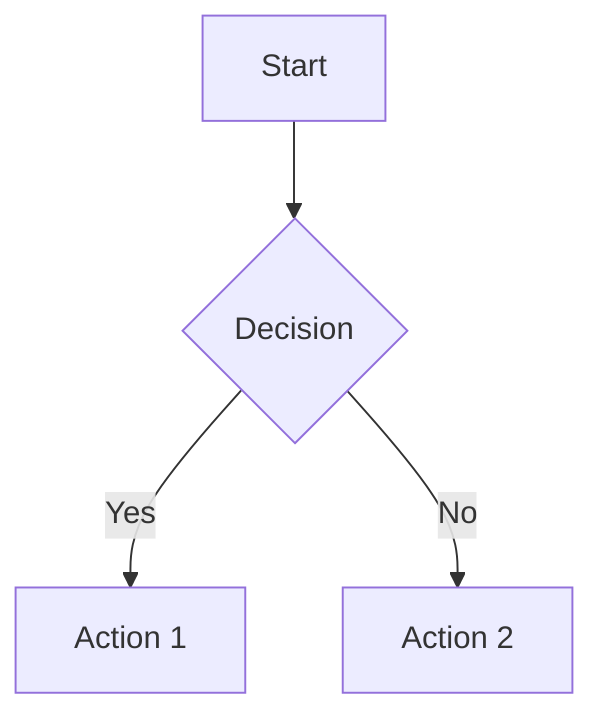

# Human Documentation Generator

## Purpose

This skill transforms detailed AI documentation stored in `ai/` folder into human-friendly documentation in `docs/` folder. It creates summaries, quick starts, and visual diagrams that enable humans to quickly understand and operate complex systems.

**Key principle:** `ai/` folder remains the source of truth (detailed, comprehensive, for AI context). `docs/` folder contains human-optimized extracts (summaries, diagrams, quick references).

## When to Use This Skill

Use this skill when:
- User needs human-readable documentation from AI context docs
- AI documentation is too detailed for quick human consumption
- System complexity requires visual diagrams for understanding
- Need quick start guides or executive summaries
- User specifically mentions difficulty following AI documentation
- Creating onboarding materials for new team members
- Extracting crucial information for operational quick reference

**Trigger phrases:**
- "Create human docs for..."
- "I can't follow the AI documentation"
- "Make this easier to understand"
- "Create a quick start guide"
- "Add diagrams to explain..."
- "Summarize the AI docs"

## Core Principles

### 1. Parallel Structure Maintained

```
ai/                          docs/
├── architect/               ├── architect/
│   ├── app/                │   ├── app/
│   │   └── 01_DOC.md       │   │   └── 01_DOC_SUMMARY.md
│   └── src/                │   └── src/
│       └── 01_DOC.md       │       └── 01_DOC_QUICKSTART.md
├── backend/                ├── backend/
├── frontend/               ├── frontend/
└── testing/                └── testing/
```

**Key rule:** `docs/` mirrors `ai/` structure but contains human-optimized versions

### 2. Three Human-Friendly Formats

**For each AI doc, create ONE or MORE of:**

1. **SUMMARY** (`*_SUMMARY.md`)
   - Executive summary (1-2 paragraphs)
   - Key points (bullet list)
   - Quick decision aids
   - 20% of original length

2. **QUICKSTART** (`*_QUICKSTART.md`)
   - Step-by-step getting started
   - 5-minute read maximum
   - Code examples
   - Common pitfalls
   - Success criteria

3. **DIAGRAMS** (`*_DIAGRAMS.md`)
   - Visual representation with Mermaid.js
   - Architecture diagrams
   - Flow charts
   - Sequence diagrams
   - Entity relationships

### 3. Mermaid Diagram Guidelines

**Always use Mermaid.js** for diagrams (renders in GitHub, VS Code, most markdown viewers):



**Diagram types to use:**
- `graph TD` - Top-down flowcharts
- `sequenceDiagram` - API/interaction flows
- `erDiagram` - Database schemas
- `journey` - User journeys
- `stateDiagram-v2` - State machines
- `gantt` - Timelines/roadmaps

See [references/mermaid_examples.md](references/mermaid_examples.md) for templates

## Workflows

### Workflow 1: Create Summary from AI Doc

**Input:** Path to AI documentation file (e.g., `ai/architect/app/02_BACKEND_REQUIREMENTS.md`)

**Process:**
1. Read AI documentation thoroughly
2. Identify the 20% most crucial information
3. Create executive summary (2-3 paragraphs)
4. Extract key points (5-10 bullets)
5. Add quick reference table
6. Save to parallel location in `docs/` with `_SUMMARY.md` suffix

**Output:** `docs/architect/app/02_BACKEND_REQUIREMENTS_SUMMARY.md`

**Template:** [assets/templates/summary_template.md](assets/templates/summary_template.md)

### Workflow 2: Create Quick Start Guide

**Input:** Path to AI documentation file

**Process:**
1. Read AI documentation
2. Identify "getting started" path
3. Create step-by-step instructions (numbered)
4. Add code snippets/commands
5. Include success criteria
6. Add "Next steps" section
7. Save to parallel location with `_QUICKSTART.md` suffix

**Output:** `docs/architect/app/02_BACKEND_REQUIREMENTS_QUICKSTART.md`

**Template:** [assets/templates/quickstart_template.md](assets/templates/quickstart_template.md)

### Workflow 3: Create Visual Diagrams

**Input:** Path to AI documentation file OR topic description

**Process:**
1. Read AI documentation
2. Identify visualizable concepts:
   - System architecture
   - Data flow
   - User journeys
   - Database schemas
   - Decision trees
3. Create Mermaid diagrams (2-5 diagrams)
4. Add explanatory text for each diagram
5. Save to parallel location with `_DIAGRAMS.md` suffix

**Output:** `docs/architect/app/02_BACKEND_REQUIREMENTS_DIAGRAMS.md`

**Template:** [assets/templates/diagrams_template.md](assets/templates/diagrams_template.md)

### Workflow 4: Batch Process Entire Folder

**Input:** Path to AI documentation folder (e.g., `ai/architect/app/`)

**Process:**
1. List all markdown files in folder
2. For each file, determine best format(s):
   - Architecture docs → SUMMARY + DIAGRAMS
   - Implementation guides → QUICKSTART
   - Specifications → SUMMARY + DIAGRAMS
3. Create human docs in parallel structure
4. Generate index README for `docs/` folder
5. Report completion summary

**Output:** Complete `docs/` folder structure

### Workflow 5: Update Existing Human Docs

**Input:** Path to updated AI documentation

**Process:**
1. Check if human doc already exists in `docs/`
2. If exists, compare modification dates
3. If AI doc is newer, regenerate human doc
4. Preserve any manual additions (check for "Manual:" markers)
5. Save updated human doc

**Output:** Updated human documentation

## Document Format Standards

### SUMMARY Format

```markdown
# [Original Title] - Summary

**Source:** Link to AI doc
**Last Updated:** Date
**Read Time:** X minutes

## Executive Summary

[2-3 paragraphs capturing essence]

## Key Points

- Point 1
- Point 2
- Point 3

## Quick Reference

| Aspect | Detail |
|--------|--------|
| Key 1  | Value  |

## When to Read Full Doc

- Scenario 1
- Scenario 2

[Link to full documentation]
```

### QUICKSTART Format

```markdown
# [Topic] Quick Start

**Time to complete:** X minutes
**Prerequisites:** List

## Step 1: [Action]

[Instructions + code/commands]

## Step 2: [Action]

[Instructions + code/commands]

## Success Criteria

✅ Checklist item
✅ Checklist item

## Next Steps

- Link to detailed docs
- Related quick starts

## Troubleshooting

**Issue:** Description
**Fix:** Solution
```

### DIAGRAMS Format

```markdown
# [Topic] Visual Guide

**Source:** Link to AI doc

## Overview Diagram

```mermaid
[diagram code]
```

**Explanation:** What this diagram shows

## [Specific Aspect] Diagram

```mermaid
[diagram code]
```

**Explanation:** What this diagram shows

## Legend

- Symbol → Meaning
```

## Integration with Other Skills

**Use with architect skill:**
- Architect creates detailed specs in `ai/architect/`
- Human-docs creates summaries in `docs/architect/`

**Use with business skill:**
- Business creates use cases in `ai/business/`
- Human-docs creates executive summaries

**Use with executive skill:**
- Executive defines strategy
- Human-docs creates visual roadmaps

**Use with cleanup skill:**
- Cleanup organizes `ai/` folder
- Human-docs regenerates `docs/` structure

## Quality Standards

**Every human doc must have:**
✅ **Clarity** - Understandable without reading AI doc
✅ **Conciseness** - 20% or less of original length (summaries)
✅ **Actionable** - Clear next steps
✅ **Visual** - At least 1 diagram for complex topics
✅ **Navigable** - Links to source and related docs
✅ **Dated** - Last updated timestamp

**Minimum quality threshold: 8/10**

## File Naming Conventions

```
AI doc:     ai/folder/FILE.md
Summary:    docs/folder/FILE_SUMMARY.md
Quickstart: docs/folder/FILE_QUICKSTART.md
Diagrams:   docs/folder/FILE_DIAGRAMS.md
```

**Never:**
- Create files in `ai/` (only read from there)
- Replace AI documentation
- Duplicate information across formats

## Maintenance

**When AI docs are updated:**
1. Check `docs/` for corresponding human docs
2. Regenerate if AI doc is newer
3. Update "Last Updated" timestamp
4. Keep change history minimal (humans don't need full changelog)

**Index README regeneration:**
- Create `docs/README.md` with navigation to all human docs
- Group by folder structure
- Add "Quick Links" section

## Common Use Cases

### Use Case 1: New Team Member Onboarding

**Scenario:** New developer needs to understand GabeDA architecture

**Action:**
1. Generate SUMMARY for all `ai/architect/app/` docs
2. Generate DIAGRAMS for key architecture concepts
3. Create `docs/ONBOARDING.md` with curated path
4. Include quick starts for common tasks

### Use Case 2: Executive Review

**Scenario:** Executive needs high-level understanding

**Action:**
1. Generate executive SUMMARY from technical specs
2. Create visual DIAGRAMS of system architecture
3. 1-page maximum with Mermaid diagrams
4. No technical jargon

### Use Case 3: Quick Reference for Developers

**Scenario:** Developer forgets API endpoint structure

**Action:**
1. Create QUICKSTART from API documentation
2. Include code examples
3. Add common patterns
4. Link to full spec

## Examples

**Example 1: Architecture Summary**

Input: `ai/architect/app/02_BACKEND_REQUIREMENTS.md` (14,000 words)
Output: `docs/architect/app/02_BACKEND_REQUIREMENTS_SUMMARY.md` (2,000 words)

**Example 2: Quick Start**

Input: `ai/architect/app/05_CSV_UPLOAD_SPECIFICATION.md`
Output: `docs/architect/app/05_CSV_UPLOAD_QUICKSTART.md`
- 5 steps to implement CSV upload
- Code snippets
- 10-minute read

**Example 3: Visual Guide**

Input: `ai/architect/app/07_WORKFLOWS_AND_DATA_FLOW.md`
Output: `docs/architect/app/07_WORKFLOWS_DIAGRAMS.md`
- Already has diagrams, extract and simplify
- Add annotations
- Create simplified version

## Version History

**v1.0.0** (2025-11-01)
- Initial skill creation
- Support for SUMMARY, QUICKSTART, DIAGRAMS formats
- Mermaid diagram integration
- Parallel folder structure

---

**Last Updated:** 2025-11-01
**Skill Type:** Documentation transformation and visualization