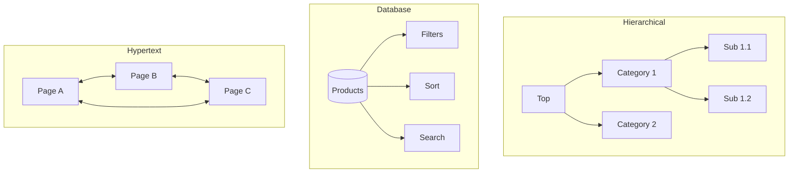

# Information Architecture

Design and validate information structures that help users find and understand content.

## When to Use This Skill

Use this skill when:

- **Information Architecture tasks** - Working on design information architecture - site structure, navigation, card sorting, tree testing, taxonomy, labeling systems, and findability
- **Planning or design** - Need guidance on Information Architecture approaches
- **Best practices** - Want to follow established patterns and standards

## MANDATORY: Skill Loading First

Before answering ANY information architecture question:

2. Use established IA methodology (Rosenfeld & Morville, Abby Covert)
3. Base all guidance on validated IA practices

## IA Foundations

### The Four Systems of IA

| System | Question Answered | Components |
|--------|-------------------|------------|
| **Organization** | How is content grouped? | Schemes, structures, taxonomies |
| **Labeling** | What do we call things? | Labels, terminology, naming |
| **Navigation** | How do users move around? | Menus, links, breadcrumbs |
| **Search** | How do users find specific items? | Search UI, indexing, results |

### IA Deliverables

| Deliverable | Purpose | When |
|-------------|---------|------|
| **Content Inventory** | Audit existing content | Discovery |
| **Site Map** | Hierarchical structure | Design |
| **Taxonomy** | Classification scheme | Design |
| **Navigation Model** | Menu and wayfinding | Design |
| **Wireframes** | Page-level IA | Design |
| **Card Sort Results** | User mental models | Validation |
| **Tree Test Results** | Findability validation | Validation |

## Organization Systems

### Organization Schemes

| Scheme | Description | Example |
|--------|-------------|---------|
| **Exact** | Objectively defined | Alphabetical, chronological, geographical |
| **Ambiguous** | Subjectively defined | By topic, audience, task, metaphor |
| **Hybrid** | Combination | Primary navigation + search + filters |

### Organization Structures



### Hierarchy Depth Guidelines

| Depth | Use Case | Considerations |
|-------|----------|----------------|
| **Flat (2-3)** | Simple sites, mobile | Easy to scan, limited content |
| **Medium (4-5)** | Most websites | Balance breadth/depth |
| **Deep (6+)** | Large catalogs, documentation | Risk of getting lost |

**Rule of thumb:** Prefer broader over deeper. Users can scan 5-7 items quickly.

## Card Sorting

### Card Sort Types

| Type | Description | Best For |
|------|-------------|----------|
| **Open** | Users create their own categories | Discovery, understanding mental models |
| **Closed** | Users sort into predefined categories | Validating proposed structure |
| **Hybrid** | Predefined categories + can add new | Validating with flexibility |

### Running a Card Sort

#### Preparation

```csharp
// Card sort configuration
public class CardSortStudy
{
    public Guid Id { get; init; }
    public required string Name { get; init; }
    public required CardSortType Type { get; init; }
    public required List<Card> Cards { get; init; }
    public List<Category>? PredefinedCategories { get; init; } // For closed/hybrid
    public bool AllowNewCategories { get; init; } // For hybrid
    public int TargetParticipants { get; init; } = 30;
}

public record Card(int Id, string Label, string? Description = null);
public record Category(int Id, string Name, string? Description = null);

public class CardSortResult
{
    public required Guid ParticipantId { get; init; }
    public required List<CategoryAssignment> Assignments { get; init; }
    public required List<Category> CreatedCategories { get; init; } // Open/hybrid
    public TimeSpan Duration { get; init; }
    public string? Feedback { get; init; }
}

public record CategoryAssignment(int CardId, int CategoryId, int? SortOrder = null);
```

#### Card Selection Guidelines

- **15-40 cards** typical for open sort
- **30-60 cards** manageable for closed sort
- Use real content labels, not placeholders
- Include mix of "easy" and "difficult" items
- Avoid duplicate concepts

### Card Sort Analysis

#### Similarity Matrix

Shows how often cards were sorted together:

```text
         Card A  Card B  Card C  Card D
Card A     -      85%     12%     45%
Card B    85%      -      10%     50%
Card C    12%     10%      -      90%
Card D    45%     50%     90%      -
```

Cards frequently sorted together should likely be grouped.

#### Dendrogram (Hierarchical Clustering)

```text
              |
      ________|________
      |               |
   ___|___         ___|___
   |     |         |     |
Card A  Card B  Card C  Card D
```

Shows natural groupings and relationships.

#### Category Analysis

For open sorts, analyze:

- **Category names** - What labels do users create?
- **Category frequency** - How many users created similar categories?
- **Standardized categories** - Group similar labels together

```csharp
public class CardSortAnalysis
{
    public required int TotalParticipants { get; init; }
    public required Dictionary<(int CardA, int CardB), decimal> SimilarityMatrix { get; init; }
    public required List<DendrogramNode> Dendrogram { get; init; }
    public required List<CategoryPattern> DiscoveredPatterns { get; init; }
    public required List<ProblematicCard> DifficultCards { get; init; }
}

public record CategoryPattern(
    string StandardizedName,
    List<string> Variations,
    List<int> CardIds,
    int Frequency
);

public record ProblematicCard(
    int CardId,
    string Label,
    decimal Disagreement, // How often it was sorted inconsistently
    string Issue // "Ambiguous label", "Fits multiple categories", etc.
);
```

## Tree Testing

### What is Tree Testing?

Users navigate a text-only version of your hierarchy to find items. No visual design, just structure.

### Running a Tree Test

```csharp
public class TreeTestStudy
{
    public Guid Id { get; init; }
    public required string Name { get; init; }
    public required TreeNode Root { get; init; }
    public required List<TreeTestTask> Tasks { get; init; }
    public int TargetParticipants { get; init; } = 50;
}

public class TreeNode
{
    public int Id { get; init; }
    public required string Label { get; init; }
    public List<TreeNode> Children { get; init; } = [];
    public bool IsCorrectAnswer { get; set; } // For current task
}

public class TreeTestTask
{
    public required int Order { get; init; }
    public required string TaskDescription { get; init; }
    public required List<int> CorrectAnswerPaths { get; init; } // Multiple valid paths
}

public class TreeTestResult
{
    public required Guid ParticipantId { get; init; }
    public required int TaskId { get; init; }
    public required List<int> PathTaken { get; init; }
    public required int FinalSelection { get; init; }
    public required bool IsDirectSuccess { get; init; } // Found it first try
    public required bool IsIndirectSuccess { get; init; } // Found after backtracking
    public required TimeSpan Duration { get; init; }
}
```

### Tree Test Metrics

| Metric | Definition | Target |
|--------|------------|--------|
| **Success Rate** | Found correct answer | >80% |
| **Directness** | Found without backtracking | >60% |
| **Time** | Seconds to complete | Task-dependent |
| **First Click** | Correct first navigation | >60% |

### Pietree Analysis

Visualize where users went for each task:

```text
Task: "Find return policy"

Customer Service [45%] ✓ Correct path
├── Returns [40%] ✓
├── FAQ [3%]
└── Contact [2%]

Help [30%]
├── FAQ [20%]
└── Contact [10%]

Account [15%] ✗ Wrong tree
└── Order History [15%]

About [10%] ✗ Wrong tree
└── Policies [10%]
```

### Identifying Problems

| Pattern | Indication | Solution |
|---------|------------|----------|
| Low success, low directness | Wrong location in hierarchy | Restructure |
| Low success, high first-click | Right area, wrong label | Rename |
| High success, low directness | Findable but confusing path | Simplify |
| Split decisions | Ambiguous placement | Cross-reference or restructure |

## Navigation Design

### Navigation Types

| Type | Purpose | Example |
|------|---------|---------|
| **Global** | Site-wide access | Header menu |
| **Local** | Section-specific | Sidebar in current area |
| **Contextual** | Content-related | "Related items" links |
| **Utility** | Tools/account | Login, cart, help |
| **Footer** | Secondary access | Policies, contact |
| **Breadcrumbs** | Location awareness | Home > Products > Shoes |

### Navigation Patterns

```csharp
// Navigation model
public class NavigationStructure
{
    public required List<NavItem> GlobalNav { get; init; }
    public required List<NavItem> UtilityNav { get; init; }
    public required List<NavItem> FooterNav { get; init; }
    public Dictionary<string, List<NavItem>> LocalNav { get; init; } = [];
}

public class NavItem
{
    public required string Label { get; init; }
    public required string Url { get; init; }
    public List<NavItem>? Children { get; init; }
    public bool IsCurrentSection { get; set; }
    public string? Icon { get; init; }
    public NavItemType Type { get; init; } = NavItemType.Link;
}

public enum NavItemType
{
    Link,
    Dropdown,
    Megamenu,
    Flyout,
    Button // For CTAs like "Sign Up"
}
```

### Mega Menu Structure

For sites with many categories:

```text
┌─────────────────────────────────────────────────────┐
│ PRODUCTS ▼                                          │
├─────────────────────────────────────────────────────┤
│ ┌──────────────┐ ┌──────────────┐ ┌──────────────┐  │
│ │ Category A   │ │ Category B   │ │ Category C   │  │
│ │ - Sub A1     │ │ - Sub B1     │ │ - Sub C1     │  │
│ │ - Sub A2     │ │ - Sub B2     │ │ - Sub C2     │  │
│ │ - Sub A3     │ │ - Sub B3     │ │ - Sub C3     │  │
│ │ > View All   │ │ > View All   │ │ > View All   │  │
│ └──────────────┘ └──────────────┘ └──────────────┘  │
│                                                      │
│ [Featured: Spring Collection]  [Featured: New]      │
└─────────────────────────────────────────────────────┘
```

### Mobile Navigation Considerations

| Pattern | When to Use |
|---------|-------------|
| **Hamburger** | Complex nav, frequent users |
| **Tab Bar** | 3-5 primary destinations |
| **Bottom Sheet** | Secondary actions |
| **Progressive Disclosure** | Deep hierarchies |

## Labeling Systems

### Label Evaluation Criteria

| Criterion | Question | Test |
|-----------|----------|------|
| **Clarity** | Is meaning obvious? | 5-second test |
| **Consistency** | Same concept = same label? | Content audit |
| **Completeness** | All content labeled? | Gap analysis |
| **Audience-fit** | Uses user language? | Card sort, interviews |

### Label Testing Methods

1. **Highlight Test** - Can users identify what label refers to?
2. **Cloze Test** - Fill in the blank with expected label
3. **Card Sort** - What do users call these groups?
4. **First-Click Test** - Do users click correct label for task?

### Common Labeling Problems

| Problem | Example | Solution |
|---------|---------|----------|
| **Jargon** | "SKU Manager" | Use user language: "Product Catalog" |
| **Ambiguity** | "Resources" | Be specific: "Documentation", "Downloads" |
| **Overlap** | "Support" vs "Help" | Consolidate or differentiate |
| **Inconsistency** | "Docs" / "Documentation" / "Help Files" | Standardize |

## Taxonomy Design

### Taxonomy Structure

```csharp
public class Taxonomy
{
    public Guid Id { get; init; }
    public required string Name { get; init; }
    public required TaxonomyType Type { get; init; }
    public required List<TaxonomyTerm> Terms { get; init; }

    public TaxonomyTerm? FindTerm(string label) =>
        Terms.SelectMany(Flatten).FirstOrDefault(t => t.Label == label);

    private IEnumerable<TaxonomyTerm> Flatten(TaxonomyTerm term) =>
        new[] { term }.Concat(term.Children.SelectMany(Flatten));
}

public enum TaxonomyType
{
    Hierarchical,   // Tree structure
    Faceted,        // Multiple dimensions
    Network,        // Many-to-many relationships
    Flat            // No hierarchy
}

public class TaxonomyTerm
{
    public int Id { get; init; }
    public required string Label { get; init; }
    public string? Definition { get; init; }
    public List<string> Synonyms { get; init; } = [];
    public List<TaxonomyTerm> Children { get; init; } = [];
    public int? ParentId { get; init; }
    public List<int> RelatedTermIds { get; init; } = [];
}
```

### Faceted Classification

Multiple ways to categorize the same content:

```text
Product: "Blue Running Shoes"

Facets:
├── Category: Footwear > Athletic > Running
├── Color: Blue
├── Brand: Nike
├── Price: $100-150
├── Size: 10
├── Gender: Men's
└── Activity: Running, Walking
```

## Site Map Documentation

### Visual Site Map

```text
Home
├── Products
│   ├── Category A
│   │   ├── Subcategory A1
│   │   └── Subcategory A2
│   └── Category B
├── About
│   ├── Company
│   ├── Team
│   └── Careers
├── Blog
│   └── [Dynamic: Post pages]
└── Contact

Utility:
├── Search
├── Account
│   ├── Profile
│   ├── Orders
│   └── Settings
└── Cart
```

### Site Map Spreadsheet

| ID | Page Name | Parent | Level | URL Pattern | Template | Notes |
|----|-----------|--------|-------|-------------|----------|-------|
| 1 | Home | - | 0 | / | Homepage | |
| 2 | Products | 1 | 1 | /products | Category Listing | |
| 3 | Category A | 2 | 2 | /products/{slug} | Category | Dynamic |
| 4 | Product Detail | 3 | 3 | /products/{cat}/{slug} | PDP | Dynamic |

## IA Auditing

### Content Inventory Template

```markdown
| URL | Title | Type | Category | Last Updated | Owner | Notes |
|-----|-------|------|----------|--------------|-------|-------|
| /about | About Us | Page | Company | 2024-01-15 | Marketing | Needs update |
| /blog/post-1 | Post Title | Blog | News | 2024-02-01 | Editor | Current |
```

### IA Evaluation Checklist

- [ ] **Organization**: Is grouping logical and consistent?
- [ ] **Labeling**: Are labels clear and user-centered?
- [ ] **Navigation**: Can users orient themselves?
- [ ] **Search**: Does search return relevant results?
- [ ] **Findability**: Can users complete key tasks?
- [ ] **Scalability**: Will structure handle growth?

## .NET IA Tools

```csharp
// Generate sitemap from content model
public class SitemapGenerator
{
    public XDocument GenerateXmlSitemap(IEnumerable<ContentItem> content)
    {
        var urlset = new XElement(
            XName.Get("urlset", "http://www.sitemaps.org/schemas/sitemap/0.9"),
            content.Select(item => new XElement("url",
                new XElement("loc", item.CanonicalUrl),
                new XElement("lastmod", item.ModifiedDate.ToString("yyyy-MM-dd")),
                new XElement("changefreq", GetChangeFrequency(item.Type)),
                new XElement("priority", GetPriority(item.Depth))
            ))
        );

        return new XDocument(
            new XDeclaration("1.0", "UTF-8", null),
            urlset
        );
    }

    private static string GetChangeFrequency(ContentType type) => type switch
    {
        ContentType.Homepage => "daily",
        ContentType.Blog => "weekly",
        ContentType.Product => "weekly",
        _ => "monthly"
    };

    private static decimal GetPriority(int depth) => depth switch
    {
        0 => 1.0m,
        1 => 0.8m,
        2 => 0.6m,
        _ => 0.4m
    };
}
```

## Related Skills

- `user-research-planning` - Card sort and tree test planning
- `usability-testing` - Testing navigation
- `accessibility-planning` - Accessible navigation patterns
- `service-blueprinting` - Service touchpoint structure
