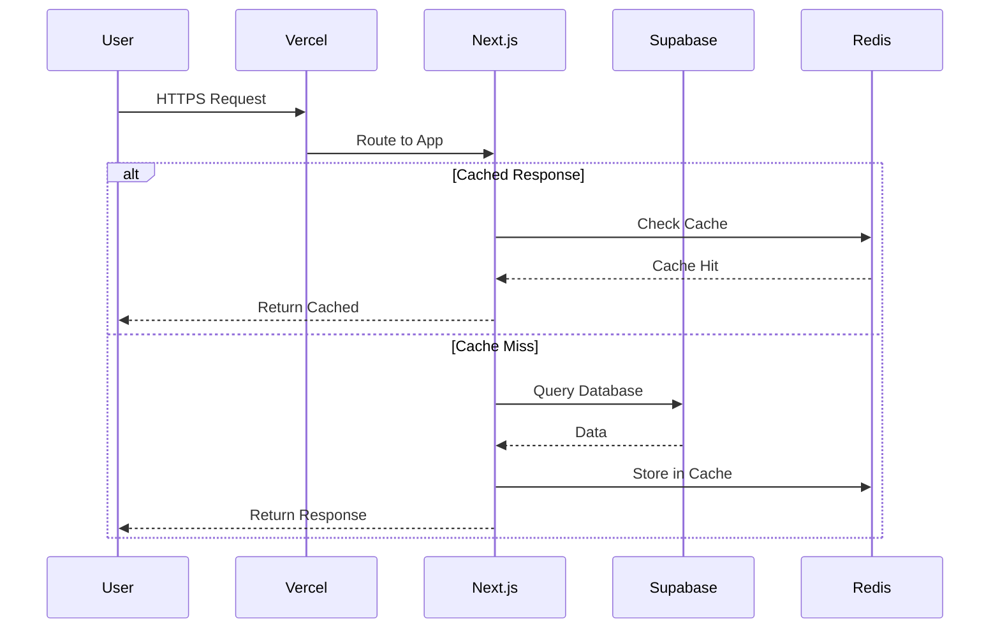
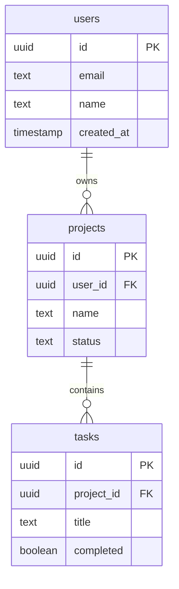

# Infrastructure Documenter Skill

## Overview

This skill helps you create clear, maintainable infrastructure documentation. Covers architecture diagrams, runbooks, system documentation, operational procedures, and documentation-as-code practices.

## Documentation Philosophy

### Principles
1. **Living documentation**: Keep it in sync with reality
2. **Audience-aware**: Different docs for different readers
3. **Actionable**: Every doc should help someone do something
4. **Version-controlled**: Documentation changes tracked with code

### Document Types

| Type | Audience | Purpose |
|------|----------|---------|
| Architecture | Engineers | Understand system design |
| Runbooks | Ops/SRE | Handle incidents |
| API Docs | Developers | Integrate with system |
| Onboarding | New hires | Get up to speed |
| Decision Records | Future you | Understand why |

## Architecture Documentation

### System Architecture Overview

```markdown
# System Architecture

## Overview

[Project Name] is a [type] application that [purpose].

## High-Level Architecture

```
┌─────────────────────────────────────────────────────────────┐
│                        Users                                 │
└─────────────────────────────────────────────────────────────┘
                              │
                              ▼
┌─────────────────────────────────────────────────────────────┐
│                      Vercel Edge                             │
│  ┌─────────────────┐  ┌─────────────────┐                   │
│  │   Next.js App   │  │  Edge Functions │                   │
│  └─────────────────┘  └─────────────────┘                   │
└─────────────────────────────────────────────────────────────┘
                              │
              ┌───────────────┼───────────────┐
              ▼               ▼               ▼
┌─────────────────┐ ┌─────────────────┐ ┌─────────────────┐
│    Supabase     │ │      Redis      │ │    Stripe       │
│  - PostgreSQL   │ │  - Session      │ │  - Payments     │
│  - Auth         │ │  - Cache        │ │  - Webhooks     │
│  - Realtime     │ │                 │ │                 │
│  - Storage      │ │                 │ │                 │
└─────────────────┘ └─────────────────┘ └─────────────────┘
```

## Components

### Frontend (Next.js App)
- **Location**: Vercel Edge Network
- **Framework**: Next.js 14 (App Router)
- **Styling**: Tailwind CSS + shadcn/ui
- **State**: Zustand + React Query

### Backend Services
| Service | Provider | Purpose |
|---------|----------|---------|
| Database | Supabase | PostgreSQL with RLS |
| Auth | Supabase Auth | User authentication |
| Storage | Supabase Storage | File uploads |
| Cache | Upstash Redis | Session & API cache |
| Payments | Stripe | Subscriptions |
| Email | Resend | Transactional emails |

### Data Flow

1. User request → Vercel Edge
2. SSR/API Route processes request
3. Database queries via Supabase client
4. Response cached at edge (when applicable)
5. Response returned to user

## Security

### Authentication Flow
1. User signs in via Supabase Auth
2. JWT token issued and stored in cookie
3. Server validates token on each request
4. RLS policies enforce data access

### Data Protection
- All data encrypted at rest (AES-256)
- TLS 1.3 for data in transit
- Secrets stored in Vercel environment
- PII fields encrypted in database
```

### Mermaid Diagrams

```markdown
## Request Flow



## Database Schema


```

## Runbooks

### Runbook Template

```markdown
# Runbook: [Service Name] - [Issue Type]

## Overview
Brief description of the issue and when this runbook applies.

## Severity
- **P1 (Critical)**: Complete outage
- **P2 (High)**: Degraded service
- **P3 (Medium)**: Minor impact
- **P4 (Low)**: No user impact

## Detection
How this issue is typically detected:
- [ ] Alert from [monitoring system]
- [ ] User report
- [ ] Automated check failure

## Impact Assessment
- **Users affected**: All / Segment / None
- **Data at risk**: Yes / No
- **Revenue impact**: High / Medium / Low / None

## Prerequisites
- [ ] Access to [system/dashboard]
- [ ] Credentials for [service]
- [ ] Contact info for [team/person]

## Resolution Steps

### Step 1: Verify the Issue
```bash
# Check service status
curl -I https://api.example.com/health

# Check logs
vercel logs --follow
```

### Step 2: Identify Root Cause
Common causes:
- [ ] Database connection pool exhausted
- [ ] Memory limit reached
- [ ] External service down
- [ ] Bad deployment

### Step 3: Apply Fix

#### If Database Issue:
```bash
# Check connection count
SELECT count(*) FROM pg_stat_activity;

# Kill idle connections
SELECT pg_terminate_backend(pid)
FROM pg_stat_activity
WHERE state = 'idle' AND query_start < now() - interval '1 hour';
```

#### If Bad Deployment:
```bash
# Rollback to previous deployment
vercel rollback
```

### Step 4: Verify Fix
```bash
# Check service health
curl https://api.example.com/health

# Monitor error rates for 15 minutes
```

## Escalation
If unable to resolve within 30 minutes:
1. Page on-call engineer: [contact]
2. Notify stakeholders in #incidents
3. Update status page

## Post-Incident
- [ ] Create incident report
- [ ] Schedule post-mortem (P1/P2 only)
- [ ] Update this runbook if needed

## Related Links
- [Dashboard](https://dashboard.example.com)
- [Logs](https://logs.example.com)
- [Metrics](https://metrics.example.com)
```

### Database Runbooks

```markdown
# Runbook: Database Performance Issues

## Symptoms
- Slow API responses (>1s)
- Timeout errors in logs
- High database CPU in dashboard

## Quick Checks

### 1. Check Active Connections
```sql
SELECT
  state,
  count(*),
  max(now() - query_start) as max_duration
FROM pg_stat_activity
GROUP BY state;
```

### 2. Find Long-Running Queries
```sql
SELECT
  pid,
  now() - query_start AS duration,
  query
FROM pg_stat_activity
WHERE state = 'active'
  AND now() - query_start > interval '30 seconds'
ORDER BY duration DESC;
```

### 3. Check Table Sizes
```sql
SELECT
  schemaname,
  tablename,
  pg_size_pretty(pg_total_relation_size(schemaname || '.' || tablename)) as size
FROM pg_tables
WHERE schemaname = 'public'
ORDER BY pg_total_relation_size(schemaname || '.' || tablename) DESC
LIMIT 10;
```

### 4. Check Missing Indexes
```sql
SELECT
  relname,
  seq_scan,
  idx_scan,
  seq_scan - idx_scan AS difference
FROM pg_stat_user_tables
WHERE seq_scan > idx_scan
ORDER BY difference DESC;
```

## Resolution

### Kill Problematic Queries
```sql
SELECT pg_terminate_backend(pid)
FROM pg_stat_activity
WHERE pid = [PID_FROM_ABOVE];
```

### Add Missing Index
```sql
CREATE INDEX CONCURRENTLY idx_table_column
ON table_name (column_name);
```
```

## Decision Records (ADRs)

### ADR Template

```markdown
# ADR-001: Choose Supabase for Database

## Status
Accepted

## Context
We need a database solution for [Project Name] that supports:
- PostgreSQL compatibility
- Real-time subscriptions
- Built-in authentication
- Easy local development
- Generous free tier

## Decision
We will use Supabase as our primary database and auth provider.

## Alternatives Considered

### PlanetScale
**Pros:**
- Excellent scaling
- Branching for schema changes
- MySQL compatible

**Cons:**
- No built-in auth
- No real-time subscriptions
- Additional services needed

### Firebase
**Pros:**
- Real-time built-in
- Mature platform
- Good mobile SDKs

**Cons:**
- NoSQL (not ideal for our use case)
- Vendor lock-in concerns
- Complex security rules

## Consequences

### Positive
- Single provider for DB + Auth + Storage
- Great developer experience
- Row Level Security for data protection
- Local development with supabase CLI

### Negative
- PostgreSQL-specific features tie us to provider
- Supabase still maturing (some rough edges)
- Limited to their managed offering

### Risks
- Supabase scaling limitations at high traffic
- Migration cost if we need to move

## References
- [Supabase Documentation](https://supabase.com/docs)
- [Comparison: Supabase vs Firebase](https://...)
```

## API Documentation

### Endpoint Documentation

```markdown
# API Reference

## Base URL
```
Production: https://api.example.com/v1
Staging: https://staging-api.example.com/v1
```

## Authentication

All API requests require authentication via Bearer token.

```bash
curl -H "Authorization: Bearer YOUR_TOKEN" \
  https://api.example.com/v1/users
```

## Endpoints

### Users

#### Get Current User
```
GET /users/me
```

**Response:**
```json
{
  "id": "usr_123",
  "email": "user@example.com",
  "name": "John Doe",
  "created_at": "2024-01-01T00:00:00Z"
}
```

#### Update User
```
PATCH /users/me
```

**Request Body:**
| Field | Type | Required | Description |
|-------|------|----------|-------------|
| name | string | No | Display name |
| avatar_url | string | No | Profile image URL |

**Example:**
```bash
curl -X PATCH \
  -H "Authorization: Bearer YOUR_TOKEN" \
  -H "Content-Type: application/json" \
  -d '{"name": "Jane Doe"}' \
  https://api.example.com/v1/users/me
```

### Error Responses

| Status | Code | Description |
|--------|------|-------------|
| 400 | BAD_REQUEST | Invalid request body |
| 401 | UNAUTHORIZED | Missing or invalid token |
| 403 | FORBIDDEN | Insufficient permissions |
| 404 | NOT_FOUND | Resource not found |
| 429 | RATE_LIMITED | Too many requests |
| 500 | INTERNAL_ERROR | Server error |

**Error Response Format:**
```json
{
  "error": {
    "code": "NOT_FOUND",
    "message": "User not found"
  }
}
```
```

## Environment Documentation

### Environment Matrix

```markdown
# Environments

## Overview

| Environment | URL | Purpose | Deploy |
|-------------|-----|---------|--------|
| Production | https://myapp.com | Live users | Manual (main) |
| Staging | https://staging.myapp.com | Pre-release testing | Auto (main) |
| Preview | https://pr-*.vercel.app | PR review | Auto (PR) |
| Development | http://localhost:3000 | Local dev | Manual |

## Configuration

### Production
```env
NODE_ENV=production
DATABASE_URL=[Supabase Production]
NEXT_PUBLIC_APP_URL=https://myapp.com
```

### Staging
```env
NODE_ENV=production
DATABASE_URL=[Supabase Staging Branch]
NEXT_PUBLIC_APP_URL=https://staging.myapp.com
```

### Development
```env
NODE_ENV=development
DATABASE_URL=[Local Supabase]
NEXT_PUBLIC_APP_URL=http://localhost:3000
```

## Access

### Production
- **Vercel**: Admin only
- **Database**: Read-only for devs, write for admin
- **Logs**: All engineers

### Staging
- **Vercel**: All engineers
- **Database**: All engineers
- **Logs**: All engineers

## Secrets Rotation

| Secret | Rotation | Last Rotated |
|--------|----------|--------------|
| Database password | 90 days | 2024-01-15 |
| API keys | 90 days | 2024-01-15 |
| JWT secret | Never | Initial setup |
```

## Documentation-as-Code

### Documentation Structure

```
docs/
├── README.md                 # Documentation index
├── architecture/
│   ├── overview.md           # System architecture
│   ├── data-flow.md          # Data flow diagrams
│   └── decisions/            # ADRs
│       ├── 001-database.md
│       └── 002-hosting.md
├── runbooks/
│   ├── README.md             # Runbook index
│   ├── database.md           # Database issues
│   ├── deployment.md         # Deployment issues
│   └── outage.md             # Service outage
├── api/
│   └── reference.md          # API documentation
└── onboarding/
    ├── setup.md              # Local setup
    └── contributing.md       # How to contribute
```

### Auto-Generated Documentation

```yaml
# .github/workflows/docs.yml
name: Generate Docs

on:
  push:
    branches: [main]
    paths:
      - 'src/**'
      - 'docs/**'

jobs:
  generate-docs:
    runs-on: ubuntu-latest
    steps:
      - uses: actions/checkout@v4

      - name: Generate API docs from OpenAPI
        run: |
          npx @redocly/cli build-docs openapi.yaml \
            --output docs/api/index.html

      - name: Generate TypeDoc
        run: npx typedoc --out docs/api/typescript

      - name: Deploy to GitHub Pages
        uses: peaceiris/actions-gh-pages@v3
        with:
          github_token: ${{ secrets.GITHUB_TOKEN }}
          publish_dir: ./docs
```

## Documentation Checklist

### Architecture Docs
- [ ] System overview diagram
- [ ] Component descriptions
- [ ] Data flow documentation
- [ ] Security architecture
- [ ] Technology decisions (ADRs)

### Operational Docs
- [ ] Runbooks for common issues
- [ ] Deployment procedures
- [ ] Monitoring and alerting
- [ ] Incident response plan
- [ ] On-call procedures

### Developer Docs
- [ ] Local setup guide
- [ ] API reference
- [ ] Contributing guidelines
- [ ] Code conventions
- [ ] Testing guide

### Maintenance
- [ ] Documentation review schedule
- [ ] Ownership assigned
- [ ] Change process defined
- [ ] Versioning strategy

## When to Use This Skill

Invoke this skill when:
- Creating architecture documentation
- Writing runbooks for operations
- Documenting decision rationale (ADRs)
- Setting up documentation structure
- Creating onboarding materials
- Building automated documentation
- Planning incident response procedures
