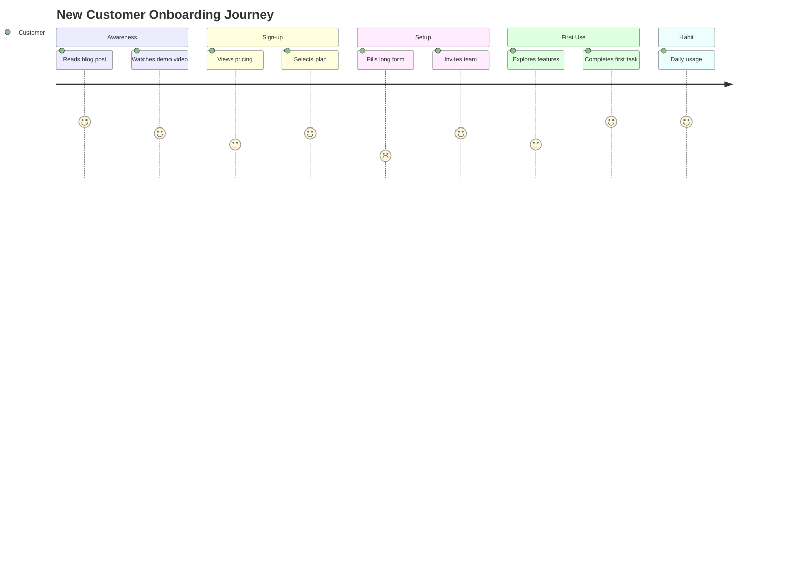
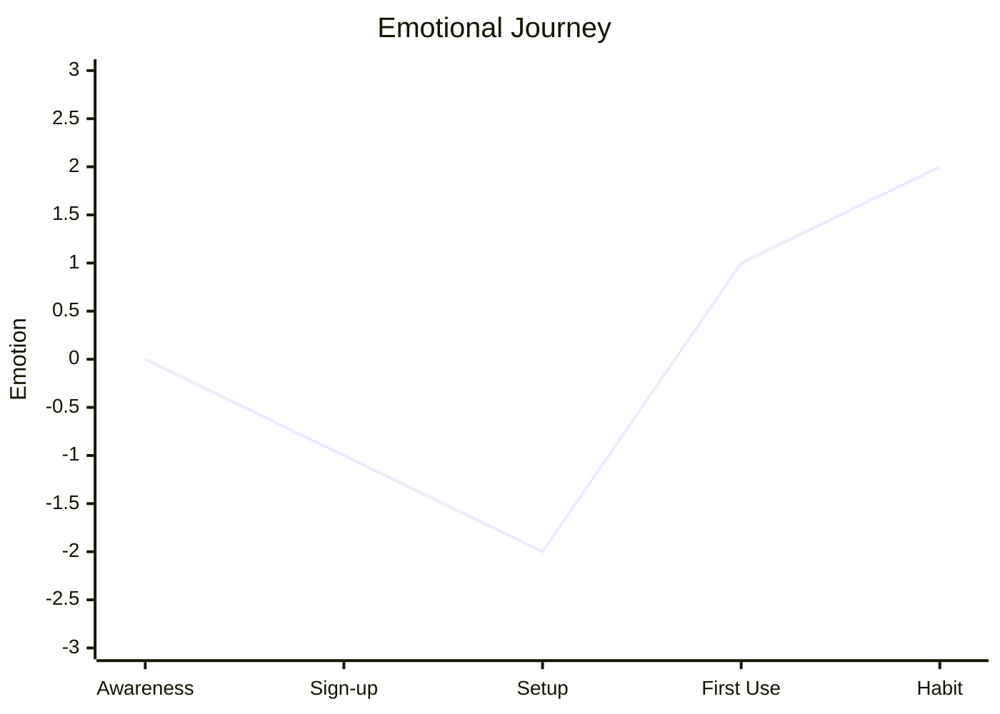

# Journey Mapping

Create user and customer journey maps to understand experiences, identify pain points, and discover improvement opportunities. A human-centered complement to process-focused value stream mapping.

## What is a Journey Map?

A **journey map** visualizes a user's experience over time as they accomplish a goal. Unlike process maps (which show what happens), journey maps show **how it feels** from the user's perspective.

| Element | Definition | Purpose |
|---------|------------|---------|
| **Persona** | Who is taking the journey | Focus on specific user type |
| **Phases** | Major stages of the journey | Organize the experience |
| **Touchpoints** | Interactions with your system | Identify contact points |
| **Actions** | What the user does | Understand behavior |
| **Thoughts** | What the user thinks | Understand mindset |
| **Emotions** | How the user feels | Identify emotional peaks/valleys |
| **Pain Points** | Friction and frustrations | Target improvements |
| **Opportunities** | Ways to improve | Prioritize enhancements |

## Journey Types

| Type | Scope | When to Use |
|------|-------|-------------|
| **Current State** | How things are today | Identify problems |
| **Future State** | Desired experience | Design solutions |
| **Day-in-the-Life** | Full day across contexts | Understand broader context |
| **Service Blueprint** | Journey + backstage operations | Design service delivery |

## Workflow

### Phase 1: Preparation

#### Step 1: Define the Journey Scope

```markdown
## Journey Definition

**Journey Name:** New Customer Onboarding
**Persona:** Sarah - First-time SaaS Buyer
**Goal:** Successfully adopt the product and get first value
**Trigger:** Signs up for trial
**End State:** Completes first project successfully
**Time Frame:** First 30 days
```

#### Step 2: Select or Create Persona

```markdown
## Persona: Sarah - First-time SaaS Buyer

**Demographics:**
- Age: 32
- Role: Marketing Manager
- Company: Mid-size B2B
- Tech Savviness: Moderate

**Goals:**
- Streamline team workflows
- Prove ROI to leadership
- Look good to her team

**Frustrations:**
- Limited time to learn new tools
- Past bad experiences with complex software
- Pressure to show quick results

**Quote:** "I need something that works out of the box."
```

### Phase 2: Map the Journey

#### Step 1: Identify Phases

Typical journey phases:

| Domain | Common Phases |
|--------|---------------|
| **Purchase** | Awareness → Consideration → Decision → Purchase |
| **Onboarding** | Sign-up → Setup → First Use → Habit Formation |
| **Support** | Issue → Search → Contact → Resolution → Follow-up |
| **Renewal** | Review → Evaluate → Negotiate → Renew/Churn |

#### Step 2: Map Touchpoints and Actions

For each phase:

```markdown
## Phase: Setup

### Touchpoints
- Welcome email
- Product UI (setup wizard)
- Help documentation
- Onboarding video

### Actions
1. Opens welcome email
2. Clicks "Get Started"
3. Enters company info
4. Invites team members
5. Configures first workspace
```

#### Step 3: Capture Thoughts and Emotions

```markdown
## Phase: Setup - Experience

| Step | Thought | Emotion | Intensity |
|------|---------|---------|-----------|
| Opens email | "Let's see if this is worth it" | Curious, skeptical | Neutral |
| Clicks Get Started | "Okay, here we go" | Hopeful | Slightly positive |
| Company info form | "Why so many fields?" | Frustrated | Negative |
| Invites team | "Easy enough" | Relieved | Positive |
| First workspace | "This is actually nice!" | Pleased | Very positive |
```

#### Step 4: Identify Pain Points

```markdown
## Pain Points - Setup Phase

| Pain Point | Severity | Evidence | Root Cause |
|------------|----------|----------|------------|
| Too many required fields | High | Drop-off data, complaints | Legacy form design |
| Unclear field labels | Medium | Support tickets | Jargon-heavy copy |
| No save-and-continue | High | Abandoned setups | Technical limitation |
| Team invite confusion | Medium | Support volume | Poor UX |
```

#### Step 5: Identify Opportunities

```markdown
## Opportunities - Setup Phase

| Opportunity | Impact | Effort | Priority |
|-------------|--------|--------|----------|
| Progressive disclosure (fewer upfront fields) | High | Low | 1 |
| Save progress functionality | High | Medium | 2 |
| Contextual help tooltips | Medium | Low | 3 |
| Interactive setup tutorial | Medium | High | 4 |
```

### Phase 3: Visualize the Journey

#### Standard Journey Map Format

```text
PHASE:      | Awareness    | Sign-up      | Setup        | First Use    | Habit
------------|--------------|--------------|--------------|--------------|--------
TOUCHPOINTS | Ads, blog    | Landing page | Email, UI    | Product      | Product
            |              | pricing page | docs         |              | email
------------|--------------|--------------|--------------|--------------|--------
ACTIONS     | Researches   | Compares     | Creates      | Explores     | Daily
            | solutions    | plans        | account      | features     | usage
------------|--------------|--------------|--------------|--------------|--------
THOUGHTS    | "Is there    | "Which plan  | "This is     | "How do I    | "This
            | a better     | is right?"   | taking       | do X?"       | saves
            | way?"        |              | too long"    |              | time"
------------|--------------|--------------|--------------|--------------|--------
EMOTIONS    |     😐       |      🤔      |      😣      |      😕      |     😊
            |  Neutral     |   Uncertain  |  Frustrated  |   Confused   |  Happy
------------|--------------|--------------|--------------|--------------|--------
PAIN POINTS | Too many     | Pricing      | Long form    | Feature      | None
            | options      | confusion    | No save      | discoverability
------------|--------------|--------------|--------------|--------------|--------
OPPORTUN-   | Clear        | Simpler      | Reduce       | Better       | Celebrate
ITIES       | comparisons  | pricing      | friction     | onboarding   | wins
```

### Phase 4: Emotion Curve

Visualize emotional highs and lows:

```text
EMOTION
  😊 +2  |                                              ___/
  😌 +1  |         ___/\                              /
  😐  0  |____/\__/      \            ___           /
  😕 -1  |                \          /   \__      _/
  😣 -2  |                 \________/          \_/

         |--Awareness--|--Sign-up--|--Setup--|--First Use--|--Habit--|
                                      ↑
                               Pain Point: Long form
```

### Phase 5: Identify Moments of Truth

**Moments of Truth** are critical interactions that disproportionately impact the overall experience:

| Moment Type | Definition | Example |
|-------------|------------|---------|
| **Zero Moment of Truth (ZMOT)** | Pre-purchase research | Reading reviews |
| **First Moment of Truth (FMOT)** | Initial encounter | Landing page |
| **Second Moment of Truth (SMOT)** | Using the product | First workflow |
| **Ultimate Moment of Truth (UMOT)** | Sharing experience | Referral/review |

```markdown
## Moments of Truth

| Moment | Phase | Current Experience | Desired Experience |
|--------|-------|-------------------|-------------------|
| FMOT | Landing | Overwhelming options | Clear value prop |
| SMOT | First Use | Confusion, need help | Guided success |
| UMOT | Habit | No celebration | Achievement sharing |
```

## Output Formats

### Narrative Summary

```markdown
## Journey Map Summary

**Journey:** [Name]
**Persona:** [Name]
**Date:** [ISO date]
**Analyst:** journey-facilitator

### Journey Overview
[2-3 sentence summary of the end-to-end experience]

### Emotional Journey
- **Highest Point:** [Phase] - [Why]
- **Lowest Point:** [Phase] - [Why]
- **Overall Arc:** [Description]

### Critical Pain Points
1. **[Pain Point]** (Phase: [X]) - [Impact and evidence]
2. **[Pain Point]** (Phase: [X]) - [Impact and evidence]

### Top Opportunities
1. **[Opportunity]** - Impact: High, Effort: Low
2. **[Opportunity]** - Impact: High, Effort: Medium

### Moments of Truth
- **Make or Break Moment:** [Description]
- **Current State:** [Assessment]
- **Recommendation:** [Action]
```

### Structured Data (YAML)

```yaml
journey_map:
  name: "New Customer Onboarding"
  version: "1.0"
  date: "{ISO-8601-date}"
  analyst: "journey-facilitator"
  type: current_state

  persona:
    name: "Sarah"
    archetype: "First-time SaaS Buyer"
    goals:
      - "Get value quickly"
      - "Look good to leadership"
    frustrations:
      - "Limited time"
      - "Complex tools"

  journey:
    goal: "Successfully adopt and get first value"
    trigger: "Signs up for trial"
    end_state: "Completes first project"
    time_frame: "30 days"

  phases:
    - name: "Awareness"
      order: 1
      touchpoints:
        - channel: "Web"
          type: "Blog post"
        - channel: "Email"
          type: "Marketing email"
      actions:
        - "Researches solutions"
        - "Reads comparison articles"
      thoughts:
        - "Is there a better way?"
      emotions:
        overall: neutral
        intensity: 0
      pain_points: []
      opportunities:
        - name: "Clear comparison content"
          impact: medium
          effort: low

    - name: "Setup"
      order: 3
      touchpoints:
        - channel: "Email"
          type: "Welcome email"
        - channel: "Product"
          type: "Setup wizard"
      actions:
        - "Opens welcome email"
        - "Starts setup wizard"
        - "Enters company info"
      thoughts:
        - "This is taking too long"
        - "Why so many fields?"
      emotions:
        overall: frustrated
        intensity: -2
      pain_points:
        - description: "Long form with many required fields"
          severity: high
          evidence: "40% drop-off rate"
        - description: "No save-and-continue"
          severity: high
          evidence: "Support tickets"
      opportunities:
        - name: "Progressive disclosure"
          impact: high
          effort: low
        - name: "Save progress"
          impact: high
          effort: medium

  moments_of_truth:
    - type: "First Moment (FMOT)"
      phase: "Sign-up"
      current_state: "Overwhelming options"
      desired_state: "Clear value proposition"
      priority: high

    - type: "Second Moment (SMOT)"
      phase: "First Use"
      current_state: "Confusion, needs help"
      desired_state: "Guided success path"
      priority: high

  summary:
    emotion_arc: "Curious → Frustrated → Confused → Satisfied"
    highest_point:
      phase: "Habit"
      reason: "Realizes time savings"
    lowest_point:
      phase: "Setup"
      reason: "Long form, no progress saving"
    top_recommendation: "Reduce setup friction through progressive disclosure"
```

### Mermaid Diagrams

**Journey Flow:**



**Emotion Curve (Mermaid XYChart):**



## Multi-Persona Workshop

For comprehensive journey analysis, run parallel persona agents:

| Persona Agent | Perspective | Focus |
|---------------|-------------|-------|
| `first-time-user-persona` | New to product | Onboarding friction |
| `power-user-persona` | Experienced | Advanced needs |
| `admin-persona` | Management | Configuration, oversight |
| `support-seeker-persona` | Needs help | Support experience |

## When to Use

| Scenario | Use Journey Mapping? |
|----------|---------------------|
| UX redesign | Yes - understand current experience |
| Service design | Yes - design end-to-end experience |
| Customer complaints | Yes - find pain points |
| Onboarding optimization | Yes - improve adoption |
| Process improvement | Partial - combine with VSM |
| Technical architecture | No - wrong level of abstraction |

## Integration

### Upstream

- **stakeholder-analysis** - Understand user stakeholders
- **process-modeling** - Process context
- **Persona research** - User research inputs

### Downstream

- **Requirements** - Experience requirements
- **UX design** - Design improvements
- **value-stream-mapping** - Operational improvements

## Related Skills

- `value-stream-mapping` - Process efficiency perspective
- `stakeholder-analysis` - Stakeholder needs
- `capability-mapping` - Capability touchpoints
- `root-cause-analysis` - Investigate pain point causes
- `prioritization` - Prioritize opportunities
- `decision-analysis` - Evaluate improvement options

## Version History

- **v1.0.0** (2025-12-26): Initial release
