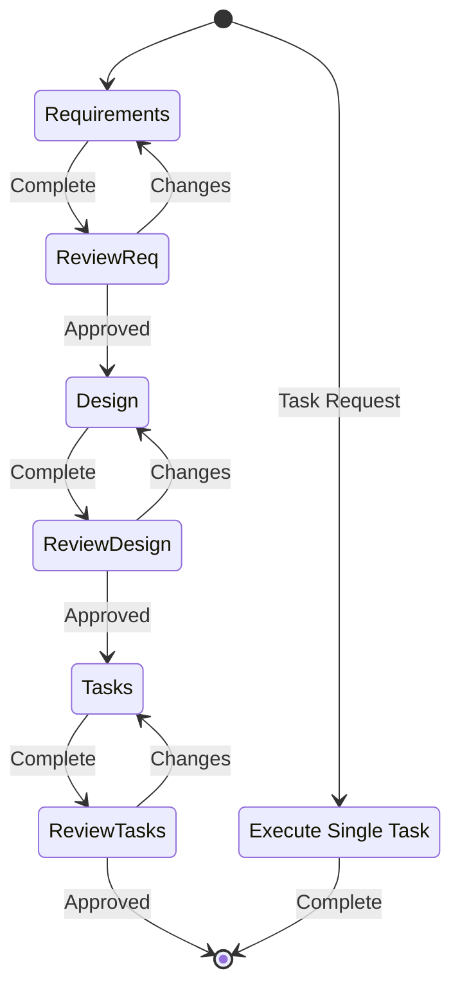

# Kiro: Spec-Driven Development Workflow

Transform ideas into comprehensive specifications, design documents, and actionable implementation plans.

## Workflow

1. **Requirements** → Define what to build (EARS format) → [Details](references/phase-1-requirements.md)
2. **Design** → How to build it (architecture + correctness properties) → [Details](references/phase-2-design.md)
3. **Tasks** → Actionable implementation steps → [Details](references/phase-3-tasks.md)
4. **Execute** → Implement one task at a time → [Details](references/phase-4-execute.md)

**Storage**: `.kiro/specs/{feature-name}/` (kebab-case)

---

## Core Rules

- **Sequential phases** — Never skip phases
- **Explicit approval** — Get user approval after each document
- **One task at a time** — During execution, focus on single task
- **Correctness mandatory** — Every design MUST include properties from EARS

## Quick Reference

### EARS Acceptance Criteria Format

```
WHEN [event] THEN THE [system] SHALL [response]
IF [condition] THEN THE [system] SHALL [response]
WHILE [state] THE [system] SHALL [response]
```

### Correctness Property Format

```markdown
### Property N: [Name]

_For any_ [inputs], [precondition], [system] SHALL [behavior].

**Validates: Requirement X.Y**
```

### Phase Outputs

| Phase | Output File | Key Content |
|-------|-------------|-------------|
| Requirements | `requirements.md` | User stories + EARS ACs |
| Design | `design.md` | Architecture + Interfaces + Properties |
| Tasks | `tasks.md` | Checkbox task list |

## Workflow Diagram



## Detection Logic

Determine current state by checking:

```bash
# Check for .kiro directory
if [ -d ".kiro/specs" ]; then
  # List features
  ls .kiro/specs/

  # For specific feature, check phase
  FEATURE="$1"
  if [ -f ".kiro/specs/$FEATURE/requirements.md" ]; then
    echo "Requirements exists"
  fi
  if [ -f ".kiro/specs/$FEATURE/design.md" ]; then
    echo "Design exists"
  fi
  if [ -f ".kiro/specs/$FEATURE/tasks.md" ]; then
    echo "Tasks exists - ready for execution"
  fi
fi
```

## Summary

Kiro provides a structured, iterative approach to feature development:
- Start with **requirements** (what to build)
- Progress to **design** (how to build it)
- Create **tasks** (implementation steps)
- **Execute** tasks one at a time

Each phase requires explicit user approval before proceeding, ensuring alignment and quality throughout the development process.

## Supporting Files

- [Kiro Identity](references/kiro-identity.md) — Response style
- [Workflow Diagrams](references/workflow-diagrams.md) — Visual references
