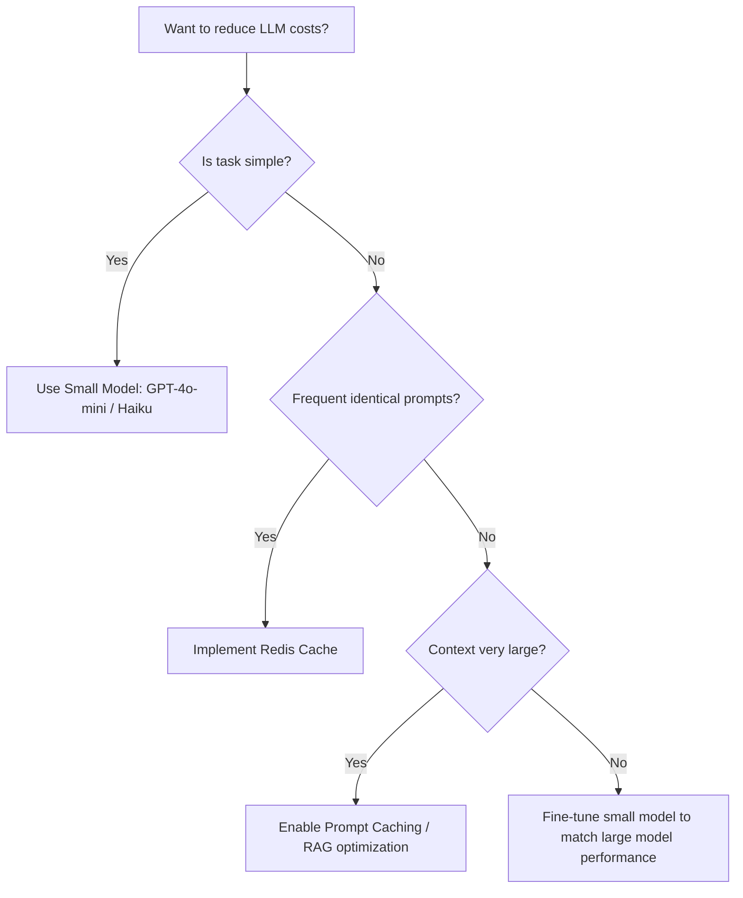

# LLM and AI Cost Optimization

## Overview

Artificial Intelligence, specifically Large Language Models (LLMs), introduces a new variable cost component to software engineering: **Inference tokens**. Unlike traditional API costs which are often fixed or volume-tiered, LLM costs scale linearly with usage, context length, and model complexity.

**Core Principle**: "Spend on intelligence where it matters, optimize where it doesn't."

---

## 1. LLM Pricing Models (2024 Context)

Pricing is typically structured around **Tokens** (units of text, roughly 4 characters or 0.75 words).

| Provider | Model | Input Price (per 1M) | Output Price (per 1M) | Unit |
| :--- | :--- | :--- | :--- | :--- |
| **OpenAI** | GPT-4o | $5.00 | $15.00 | Tokens |
| **OpenAI** | GPT-4o-mini | $0.15 | $0.60 | Tokens |
| **Anthropic**| Claude 3.5 Sonnet | $3.00 | $15.00 | Tokens |
| **Anthropic**| Claude 3 Haiku | $0.25 | $1.25 | Tokens |
| **Google** | Gemini 1.5 Pro | $3.50* | $10.50* | Characters/Tokens |
| **Cohere** | Command R+ | $3.00 | $15.00 | Tokens |

*\*Google often prices differently based on prompt size (e.g., higher for > 128k context).*

### The Cost Disparity
Note that **GPT-4o-mini** is ~33x cheaper than **GPT-4o**. Choosing the right model tier is the single most effective cost optimization strategy.

---

## 2. Token Economics

### Input vs. Output
Output tokens are significantly more expensive (2x - 4x) because the model must generate them autoregressively one by one, consuming more compute resources per unit.

### Context Window Usage
As context grows (e.g., long RAG retrieves), the **Input** cost increases.
*   **Prompt Caching**: Some providers (like Anthropic and OpenAI) now offer discounted rates for "cached" input tokens that have been sent recently, reducing costs for multi-turn conversations or massive system prompts.

---

## 3. Cost Optimization Strategies

### A. Model Routing (The Tiered Approach)
Don't use GPT-4 for everything. Use a "Router" to send simple tasks to cheap models.

```typescript
async function intelligentRouter(userInput: string) {
  // 1. Classification (Very Cheap)
  const taskType = await gpt4oMini.classify(userInput); 
  
  // 2. Routing logic
  if (taskType === 'SIMPLE_Q_AND_A') {
    return await haiku.generate(userInput); // $
  } else if (taskType === 'CODE_REFACTORING') {
    return await claudeSonnet.generate(userInput); // $$$
  }
}
```

### B. Prompt Engineering for Brevity
*   **System Prompt**: Keep it concise. Every token in the system prompt is charged for every turn of the conversation.
*   **Output Control**: "Answer in 50 words or less" directly reduces output token costs.

### C. Caching Frequent Prompts
If users ask the same questions, cache the *responses* in Redis.
```typescript
const cacheKey = hash(systemPrompt + userPrompt);
const cachedResponse = await redis.get(cacheKey);
if (cachedResponse) return cachedResponse; // $0 cost
```

### D. Semantic Caching (Advanced)
Use embeddings to find "similar" questions that were already answered.
*   Tool: **GPTCache**.

---

## 4. Embedding and Vector Database Costs

RAG (Retrieval-Augmented Generation) systems involve three cost layers:

### Layer 1: Embedding Generation
*   **OpenAI `text-embedding-3-small`**: $0.02 per 1M tokens.
*   **Strategy**: Use local embeddings (e.g., `BGE-small` via Transformers.js) for $0 if running on your existing infra.

### Layer 2: Vector Storage
*   **Pinecone**: Serverless (pay per read/write) vs. Pod-based (fixed monthly per pod).
*   **Chroma/Qdrant**: Self-hosted on EC2/GCE. Cost = VM Instance cost.

### Layer 3: The Retrieval Factor
Scaling `top_k`: Retrieving 10 chunks instead of 5 doubles the **Input Token** cost for the LLM step.

---

## 5. RAG System Cost Breakdown (Example)

**Task**: Analyze a 50-page PDF (25,000 tokens).

| Step | Operation | Cost (GPT-4o) | Cost (GPT-4o-mini) |
| :--- | :--- | :--- | :--- |
| **Ingestion** | Embed 25k tokens | $0.0005 | $0.0005 |
| **Retrieval** | 5 chunks (2k tokens) | $0.01 | $0.0003 |
| **Generation**| 500 output tokens | $0.0075 | $0.0003 |
| **Total** | | **$0.018** | **$0.0011** |

---

## 6. Cost Monitoring and Attribution

### Per-User Tracking (Multi-tenancy)
```bash
# Example Header for attribution (supported by some proxies)
X-User-ID: customer_9921
X-Feature: doc_analysis
```

### Key Metrics
1.  **Cost per Request**: Total spend / Request count.
2.  **Input/Output Ratio**: High output ratio suggests conversational usage; high input suggests RAG/Large data processing.
3.  **Token Efficiency**: Average tokens per successful user outcome.

---

## 7. Budget Controls

### Rate Limiting and Quotas
*   **Tier 1 (Free Users)**: 1000 tokens/day.
*   **Tier 2 (Pro Users)**: 1M tokens/month.

### Circuit Breakers
If an LLM starts "hallucinating" or enters an infinite loop of function calls, a circuit breaker must kill the process.

```typescript
let callCount = 0;
while (status === 'requires_action') {
  callCount++;
  if (callCount > 5) throw new Error("Agent runaway detected!"); 
  // ... process function call
}
```

---

## 8. Open-Source Model Hosting (Self-Hosting)

When does self-hosting (Llama 3, Mistral) become cheaper than API?

*   **Fixed Infra**: You pay for the GPU (A100/H100) 24/7 regardless of usage.
*   **Break-even Point**: If you process > 1B tokens per month, self-hosting is usually significantly cheaper.
*   **Optimizations**: Use **vLLM** or **TensorRT-LLM** to increase throughput (requests per second per GPU).

### GPU Pricing (Hourly)
- **AWS g5.xlarge (A10G)**: ~$1.00/hr.
- **RunPod/Lambda Labs**: ~$0.40 - $0.80/hr.

---

## 9. Tools for AI FinOps

1.  **Helicone**: Open-source observability proxy. Tracks costs, latency, and prompts.
2.  **LangSmith**: Deep tracing of LLM chains with cost analysis.
3.  **LiteLLM**: A proxy that maps multiple LLM providers to a single OpenAI-compatible format with cost tracking.
4.  **Promptfoo**: Compare model outputs vs. costs during development.

---

## 10. Optimization Decision Tree



## 11. Real-World Case Study: Code Analysis Tool
*   **Problem**: Analyzing enterprise GitHub repos was costing $1.50 per scan using GPT-4.
*   **Solution**: 
    1.  Used **Tree-sitter** (local) to identify only *relevant* code blocks (reduced input tokens by 80%).
    2.  Implemented LLM **Summarization** of files first using 4o-mini.
    3.  Only used GPT-4 for the final vulnerability assessment.
*   **Outcome**: Cost dropped from $1.50 to $0.08 per scan (94% reduction) with no loss in accuracy.

---

## Related Skills
- `42-cost-engineering/cloud-cost-models`
- `44-ai-governance/ai-cost-management`
- `43-data-reliability/vector-db-performance`
