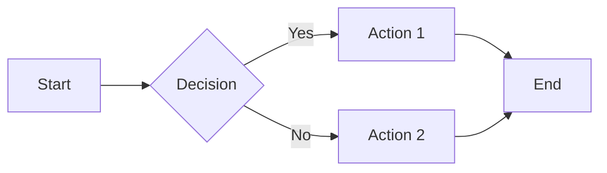

# Markdown Documentation

Best practices for writing effective technical documentation in markdown.

## README Structure

### Minimal README

```markdown
# Project Name

Brief description of what this project does.

## Installation

Instructions to install.

## Usage

Basic usage example.

## License

MIT
```

### Comprehensive README

```markdown
# Project Name


One-paragraph description of the project.

## Features

- Feature one
- Feature two
- Feature three

## Installation

### Prerequisites

- Requirement 1
- Requirement 2

### Steps

Instructions...

## Usage

### Basic Example

Code example...

### Advanced Usage

More examples...

## Configuration

Configuration options...

## API Reference

API documentation...

## Contributing

See [CONTRIBUTING.md](CONTRIBUTING.md)

## License

MIT License - see [LICENSE](LICENSE)
```

## Document Organization

### File Naming

```
docs/
├── README.md           # Entry point
├── CONTRIBUTING.md     # Contribution guidelines
├── CHANGELOG.md        # Version history
├── CODE_OF_CONDUCT.md  # Community guidelines
├── getting-started.md  # Onboarding guide
├── api/
│   ├── README.md       # API overview
│   └── endpoints.md    # Endpoint reference
└── guides/
    ├── installation.md
    └── configuration.md
```

### Linking Between Documents

```markdown
See the [installation guide](./guides/installation.md) for details.

For API reference, check [endpoints](./api/endpoints.md#authentication).
```

## Writing Style

### Be Concise

```markdown
<!-- Bad -->
In order to install the application, you will need to run the following command.

<!-- Good -->
Install the application:
```

### Use Active Voice

```markdown
<!-- Bad -->
The configuration file should be created in the home directory.

<!-- Good -->
Create the configuration file in your home directory.
```

### Address the Reader

```markdown
<!-- Bad -->
Users can configure the timeout setting.

<!-- Good -->
You can configure the timeout setting.
```

## Code Documentation

### Inline Code vs Code Blocks

```markdown
Use `npm install` to install dependencies.

For multiple commands, use a code block:

```bash
npm install
npm run build
npm start
```

```

### Command Examples

Show both command and output:

```bash
$ npm --version
10.2.0
```

### Configuration Examples

Always show complete, valid examples:

Create `config.json`:

```json
{
  "port": 3000,
  "debug": true,
  "database": {
    "host": "localhost",
    "name": "myapp"
  }
}
```

## Admonitions and Callouts

### GitHub-Style Alerts

```markdown
> [!NOTE]
> Useful information that users should know.

> [!TIP]
> Helpful advice for doing things better.

> [!IMPORTANT]
> Key information users need to know.

> [!WARNING]
> Urgent info that needs immediate attention.

> [!CAUTION]
> Advises about risks or negative outcomes.
```

### Custom Callouts (Emoji-Based)

```markdown
⚠️ **Warning**: This action cannot be undone.

💡 **Tip**: Use environment variables for sensitive data.

📝 **Note**: This feature requires version 2.0+.
```

## API Documentation

### Endpoint Documentation

#### Create User

Creates a new user account.

**Request:** `POST /api/users`

**Headers:**

| Header | Value | Required |
|--------|-------|:--------:|
| Content-Type | application/json | ✅ |
| Authorization | Bearer {token} | ✅ |

**Body:**

```json
{
  "name": "John Doe",
  "email": "john@example.com"
}
```

**Response (201):**

```json
{
  "id": "abc123",
  "name": "John Doe",
  "email": "john@example.com"
}
```

**Error (400):**

```json
{
  "error": "Invalid email format"
}
```

### Function Documentation

#### `parseConfig(path, options?)`

Parses a configuration file.

**Parameters:**

| Name | Type | Default | Description |
|------|------|---------|-------------|
| path | string | — | Path to config file |
| options.strict | boolean | false | Throw on unknown keys |
| options.env | boolean | true | Expand environment variables |

**Returns:** `Config` - Parsed configuration object

**Throws:**

- `FileNotFoundError` - Config file doesn't exist
- `ParseError` - Invalid JSON/YAML syntax

**Example:**

```javascript
const config = parseConfig('./config.json', { strict: true });
```

## Changelogs

### Keep a Changelog Format

```markdown
# Changelog

All notable changes to this project will be documented in this file.

## [Unreleased]

### Added
- New feature X

### Changed
- Updated dependency Y

## [1.2.0] - 2024-01-15

### Added
- Feature A
- Feature B

### Fixed
- Bug in feature C

### Deprecated
- Old API endpoint

## [1.1.0] - 2024-01-01

### Added
- Initial release
```

## Diagrams

### Mermaid (GitHub Supported)

````markdown

````

### ASCII Diagrams

````markdown
```
┌─────────┐     ┌─────────┐     ┌─────────┐
│ Client  │────▶│ Server  │────▶│Database │
└─────────┘     └─────────┘     └─────────┘
```
````

## Best Practices

1. **Start with why**: Explain what the project does and why it exists
2. **Show, don't tell**: Provide working code examples
3. **Keep it current**: Update docs when code changes
4. **Test examples**: Ensure code samples actually work
5. **Use consistent terminology**: Define terms and use them consistently
6. **Provide context**: Link to prerequisites and related docs
7. **Consider your audience**: Write for your users' skill level
8. **Include troubleshooting**: Document common errors and solutions

## Common Documentation Files

| File | Purpose |
|------|---------|
| README.md | Project overview and quick start |
| CONTRIBUTING.md | How to contribute |
| CHANGELOG.md | Version history |
| LICENSE | Legal terms |
| CODE_OF_CONDUCT.md | Community guidelines |
| SECURITY.md | Security policy |
| SUPPORT.md | How to get help |
