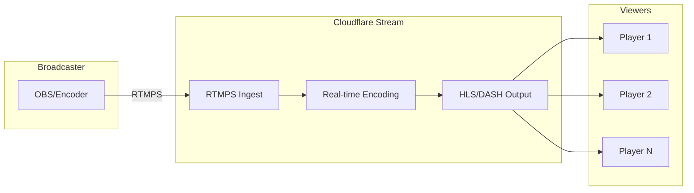

# Cloudflare Media & Streaming Skill

Build media-rich applications using Cloudflare Stream for video and Images for image transformations. Includes patterns for signed URLs, adaptive bitrate streaming, and responsive images.

## Service Overview

### Cloudflare Stream

| Feature | Description | Pricing (2026) |
|---------|-------------|----------------|
| Storage | $5/1,000 min stored | Per minute |
| Encoding | Included | Free |
| Delivery | $1/1,000 min viewed | Per minute watched |
| Live | $1/1,000 min live | Per minute streamed |
| Signed URLs | Included | Free |

### Cloudflare Images

| Feature | Description | Pricing (2026) |
|---------|-------------|----------------|
| Storage | $5/100K images | Per image stored |
| Transformations | $0.50/1,000 unique | Per unique transform |
| Delivery | $1/100K images | Per image served |
| Variants | 100 named variants | Included |

## Cloudflare Stream Patterns

### Pattern 1: Video Upload with Signed URL

```typescript
// api/videos/upload.ts - Generate upload URL
interface UploadRequest {
  userId: string;
  maxDurationSeconds?: number;
  meta?: Record<string, string>;
}

export async function createUploadUrl(
  env: Env,
  request: UploadRequest
): Promise<{ uploadUrl: string; videoId: string }> {
  const response = await fetch(
    `https://api.cloudflare.com/client/v4/accounts/${env.CF_ACCOUNT_ID}/stream/direct_upload`,
    {
      method: 'POST',
      headers: {
        'Authorization': `Bearer ${env.CF_API_TOKEN}`,
        'Content-Type': 'application/json',
      },
      body: JSON.stringify({
        maxDurationSeconds: request.maxDurationSeconds || 3600,  // 1 hour default
        expiry: new Date(Date.now() + 30 * 60 * 1000).toISOString(),  // 30 min
        requireSignedURLs: true,
        allowedOrigins: ['https://your-app.com'],
        meta: {
          userId: request.userId,
          ...request.meta,
        },
        thumbnailTimestampPct: 0.5,
      }),
    }
  );

  const result = await response.json();

  if (!result.success) {
    throw new Error(result.errors[0]?.message || 'Upload creation failed');
  }

  return {
    uploadUrl: result.result.uploadURL,
    videoId: result.result.uid,
  };
}
```

### Pattern 2: Signed Video Playback URL

```typescript
// api/videos/playback.ts - Generate signed playback URL
import { base64url } from 'rfc4648';

interface SignedUrlOptions {
  videoId: string;
  expiresIn?: number;  // seconds
  accessRules?: AccessRule[];
}

interface AccessRule {
  type: 'ip.src' | 'ip.geoip.country' | 'any';
  action: 'allow' | 'block';
  value?: string[];
  country?: string[];
}

export async function createSignedPlaybackUrl(
  env: Env,
  options: SignedUrlOptions
): Promise<string> {
  const { videoId, expiresIn = 3600, accessRules } = options;

  // Token creation using Stream's signing key
  const expiry = Math.floor(Date.now() / 1000) + expiresIn;

  // Build token payload
  const tokenPayload = {
    sub: videoId,
    kid: env.STREAM_SIGNING_KEY_ID,
    exp: expiry,
    accessRules: accessRules || [{ type: 'any', action: 'allow' }],
  };

  // Sign with RSA-256 or use Cloudflare's token endpoint
  const signedToken = await signStreamToken(env, tokenPayload);

  // Return signed URL
  return `https://customer-${env.CF_CUSTOMER_SUBDOMAIN}.cloudflarestream.com/${videoId}/manifest/video.m3u8?token=${signedToken}`;
}

// Alternative: Use Cloudflare API to generate token
async function signStreamToken(env: Env, payload: any): Promise<string> {
  const response = await fetch(
    `https://api.cloudflare.com/client/v4/accounts/${env.CF_ACCOUNT_ID}/stream/${payload.sub}/token`,
    {
      method: 'POST',
      headers: {
        'Authorization': `Bearer ${env.CF_API_TOKEN}`,
        'Content-Type': 'application/json',
      },
      body: JSON.stringify({
        id: payload.kid,
        exp: payload.exp,
        accessRules: payload.accessRules,
      }),
    }
  );

  const result = await response.json();
  return result.result.token;
}
```

### Pattern 3: HLS.js Player Integration

```html
<!-- Video player with Stream -->
<video id="player" controls></video>

<script src="https://cdn.jsdelivr.net/npm/hls.js@latest"></script>
<script>
async function loadVideo(videoId) {
  // Get signed URL from your API
  const response = await fetch(`/api/videos/${videoId}/playback`);
  const { playbackUrl } = await response.json();

  const video = document.getElementById('player');

  if (Hls.isSupported()) {
    const hls = new Hls();
    hls.loadSource(playbackUrl);
    hls.attachMedia(video);
    hls.on(Hls.Events.MANIFEST_PARSED, () => video.play());
  } else if (video.canPlayType('application/vnd.apple.mpegurl')) {
    // Safari native HLS
    video.src = playbackUrl;
    video.addEventListener('loadedmetadata', () => video.play());
  }
}
</script>
```

### Pattern 4: Stream Webhook Handler

```typescript
// api/webhooks/stream.ts - Handle video processing events
export async function handleStreamWebhook(
  request: Request,
  env: Env
): Promise<Response> {
  // Verify webhook signature
  const signature = request.headers.get('Webhook-Signature');
  const body = await request.text();

  if (!verifySignature(body, signature, env.STREAM_WEBHOOK_SECRET)) {
    return new Response('Invalid signature', { status: 401 });
  }

  const event = JSON.parse(body);

  switch (event.type) {
    case 'ready':
      // Video is ready for playback
      await handleVideoReady(env, event.payload);
      break;

    case 'error':
      // Video processing failed
      await handleVideoError(env, event.payload);
      break;

    case 'live_input.connected':
      // Live stream started
      await handleLiveStart(env, event.payload);
      break;

    case 'live_input.disconnected':
      // Live stream ended
      await handleLiveEnd(env, event.payload);
      break;
  }

  return new Response('OK');
}

async function handleVideoReady(env: Env, payload: any) {
  const { uid, duration, meta, thumbnail } = payload;

  await env.DB.prepare(
    `UPDATE videos SET status = 'ready', duration = ?, thumbnail_url = ?
     WHERE stream_id = ?`
  ).bind(duration, thumbnail, uid).run();

  // Notify user
  if (meta?.userId) {
    await sendNotification(env, meta.userId, 'Your video is ready!');
  }
}
```

## Cloudflare Images Patterns

### Pattern 1: Image Upload API

```typescript
// api/images/upload.ts
export async function uploadImage(
  env: Env,
  file: File,
  metadata: Record<string, string>
): Promise<{ imageId: string; url: string }> {
  const formData = new FormData();
  formData.append('file', file);
  formData.append('metadata', JSON.stringify(metadata));
  formData.append('requireSignedURLs', 'false');

  const response = await fetch(
    `https://api.cloudflare.com/client/v4/accounts/${env.CF_ACCOUNT_ID}/images/v1`,
    {
      method: 'POST',
      headers: {
        'Authorization': `Bearer ${env.CF_API_TOKEN}`,
      },
      body: formData,
    }
  );

  const result = await response.json();

  if (!result.success) {
    throw new Error(result.errors[0]?.message || 'Upload failed');
  }

  return {
    imageId: result.result.id,
    url: result.result.variants[0],
  };
}
```

### Pattern 2: Image URL Transformations

```typescript
// utils/images.ts - Build transformation URLs

type ImageFit = 'scale-down' | 'contain' | 'cover' | 'crop' | 'pad';
type ImageFormat = 'webp' | 'avif' | 'jpeg' | 'png' | 'gif';
type ImageGravity = 'auto' | 'face' | 'top' | 'bottom' | 'left' | 'right' | 'center';

interface ImageTransformOptions {
  width?: number;
  height?: number;
  fit?: ImageFit;
  format?: ImageFormat;
  quality?: number;
  gravity?: ImageGravity;
  blur?: number;  // 1-250
  sharpen?: number;  // 0-10
  brightness?: number;  // -1 to 1
  contrast?: number;  // -1 to 1
  dpr?: number;  // Device pixel ratio
  background?: string;  // For 'pad' fit
}

export function buildImageUrl(
  accountHash: string,
  imageId: string,
  options: ImageTransformOptions
): string {
  const transforms: string[] = [];

  if (options.width) transforms.push(`w=${options.width}`);
  if (options.height) transforms.push(`h=${options.height}`);
  if (options.fit) transforms.push(`fit=${options.fit}`);
  if (options.format) transforms.push(`f=${options.format}`);
  if (options.quality) transforms.push(`q=${options.quality}`);
  if (options.gravity) transforms.push(`g=${options.gravity}`);
  if (options.blur) transforms.push(`blur=${options.blur}`);
  if (options.sharpen) transforms.push(`sharpen=${options.sharpen}`);
  if (options.brightness) transforms.push(`brightness=${options.brightness}`);
  if (options.contrast) transforms.push(`contrast=${options.contrast}`);
  if (options.dpr) transforms.push(`dpr=${options.dpr}`);
  if (options.background) transforms.push(`background=${options.background}`);

  const transformString = transforms.join(',');

  return `https://imagedelivery.net/${accountHash}/${imageId}/${transformString || 'public'}`;
}

// Usage examples
const thumbnailUrl = buildImageUrl(ACCOUNT_HASH, imageId, {
  width: 300,
  height: 200,
  fit: 'cover',
  format: 'webp',
  quality: 80,
});

const avatarUrl = buildImageUrl(ACCOUNT_HASH, imageId, {
  width: 128,
  height: 128,
  fit: 'cover',
  gravity: 'face',
  format: 'webp',
});
```

### Pattern 3: Named Variants

Define reusable transformation presets via Cloudflare Dashboard or API:

```typescript
// Create named variants via API
const variants = [
  { id: 'thumbnail', fit: 'cover', width: 300, height: 200 },
  { id: 'avatar', fit: 'cover', width: 128, height: 128 },
  { id: 'hero', fit: 'cover', width: 1920, height: 1080 },
  { id: 'og', fit: 'cover', width: 1200, height: 630 },  // Open Graph
];

// Usage with named variant
const url = `https://imagedelivery.net/${ACCOUNT_HASH}/${imageId}/thumbnail`;
```

### Pattern 4: Responsive Images with srcset

```typescript
// components/ResponsiveImage.tsx
interface ResponsiveImageProps {
  imageId: string;
  alt: string;
  sizes: string;
  className?: string;
}

export function ResponsiveImage({ imageId, alt, sizes, className }: ResponsiveImageProps) {
  const accountHash = process.env.CF_IMAGES_HASH;

  const srcset = [320, 640, 960, 1280, 1920]
    .map(w => `https://imagedelivery.net/${accountHash}/${imageId}/w=${w},f=auto ${w}w`)
    .join(', ');

  return (
    
  );
}

// Usage
<ResponsiveImage
  imageId="abc123"
  alt="Product image"
  sizes="(max-width: 768px) 100vw, 50vw"
/>
```

### Pattern 5: Image Transform via Worker

Use R2 + Image Resizing for on-the-fly transforms:

```typescript
// workers/image-transform.ts
export default {
  async fetch(request: Request, env: Env): Promise<Response> {
    const url = new URL(request.url);
    const path = url.pathname;

    // Parse transform options from URL
    // Format: /transform/w=300,h=200,fit=cover/{imagePath}
    const match = path.match(/^\/transform\/([^/]+)\/(.+)$/);
    if (!match) {
      return new Response('Not found', { status: 404 });
    }

    const [, optionsStr, imagePath] = match;
    const options = parseTransformOptions(optionsStr);

    // Fetch original from R2
    const object = await env.R2_IMAGES.get(imagePath);
    if (!object) {
      return new Response('Image not found', { status: 404 });
    }

    // Apply transformations via cf.image
    return fetch(request.url, {
      cf: {
        image: {
          width: options.width,
          height: options.height,
          fit: options.fit || 'cover',
          format: 'auto',  // Auto-detect WebP/AVIF support
          quality: options.quality || 85,
        },
      },
    });
  },
};

function parseTransformOptions(str: string): Record<string, any> {
  const options: Record<string, any> = {};
  str.split(',').forEach(part => {
    const [key, value] = part.split('=');
    options[key] = isNaN(Number(value)) ? value : Number(value);
  });
  return options;
}
```

## Live Streaming Architecture



### Live Input Configuration

```typescript
// Create live input
async function createLiveInput(env: Env, name: string): Promise<LiveInput> {
  const response = await fetch(
    `https://api.cloudflare.com/client/v4/accounts/${env.CF_ACCOUNT_ID}/stream/live_inputs`,
    {
      method: 'POST',
      headers: {
        'Authorization': `Bearer ${env.CF_API_TOKEN}`,
        'Content-Type': 'application/json',
      },
      body: JSON.stringify({
        meta: { name },
        recording: {
          mode: 'automatic',  // or 'off'
          timeoutSeconds: 0,  // No timeout
          requireSignedURLs: true,
        },
      }),
    }
  );

  const result = await response.json();

  return {
    uid: result.result.uid,
    rtmps: result.result.rtmps,
    srt: result.result.srt,
    webRTC: result.result.webRTC,
  };
}

// RTMPS URL format:
// rtmps://live.cloudflare.com:443/live/{streamKey}
```

## Security Best Practices

### Signed URL Requirements

| Use Case | Signed URL | Expiration | Notes |
|----------|------------|------------|-------|
| Paid content | Required | 1-4 hours | Short expiry for VOD |
| User uploads | Required | 30 minutes | For upload URL only |
| Live streams | Recommended | Per-session | Regenerate on refresh |
| Public content | Optional | N/A | For analytics tracking |

### Access Control Rules

```typescript
const accessRules = [
  // Allow from specific countries
  {
    type: 'ip.geoip.country',
    action: 'allow',
    country: ['US', 'CA', 'GB'],
  },
  // Block specific IPs (abuse prevention)
  {
    type: 'ip.src',
    action: 'block',
    value: ['192.168.1.1'],
  },
  // Require referrer (hotlink protection)
  {
    type: 'any',
    action: 'allow',
    // Combined with allowedOrigins in upload config
  },
];
```

## Wrangler Configuration

```jsonc
{
  "name": "media-platform",
  "main": "src/index.ts",
  "compatibility_date": "2025-01-01",

  "d1_databases": [
    { "binding": "DB", "database_name": "media-db", "database_id": "..." }
  ],

  "r2_buckets": [
    { "binding": "R2_IMAGES", "bucket_name": "images" },
    { "binding": "R2_VIDEOS", "bucket_name": "videos-raw" }
  ],

  "vars": {
    "CF_ACCOUNT_ID": "your-account-id",
    "CF_IMAGES_HASH": "your-images-hash",
    "STREAM_SIGNING_KEY_ID": "key-id"
  }
}
```

## Cost Optimization

### Stream

- **Encode once, deliver many**: Re-encode only when quality issues
- **Set max duration**: Prevent infinite uploads
- **Use signed URLs**: Prevent bandwidth abuse
- **Monitor viewer minutes**: Primary cost driver

### Images

- **Use format=auto**: Let Cloudflare choose optimal format
- **Cache transforms**: Same transform = 1 unique transform charge
- **Batch uploads**: Reduce API calls
- **Clean up unused**: Delete orphaned images monthly

## Output Format

```markdown
# Media Delivery Report

## Stream Statistics

| Metric | Value | Cost Estimate |
|--------|-------|---------------|
| Videos stored | 1,500 min | $7.50/month |
| Minutes viewed (30d) | 50,000 min | $50/month |
| Unique videos | 45 | - |

## Images Statistics

| Metric | Value | Cost Estimate |
|--------|-------|---------------|
| Images stored | 25,000 | $1.25/month |
| Unique transforms | 75,000 | $37.50/month |
| Images delivered | 2M | $20/month |

## Optimization Opportunities

| Issue | Current | Optimized | Savings |
|-------|---------|-----------|---------|
| Unused transforms | 500 variants | 50 variants | ~$22/mo |
| Oversized images | avg 2000px | max 1920px | ~$5/mo |
```

## Tips

- **Auto-detect format**: Always use `format=auto` for best compression
- **Lazy loading**: Add `loading="lazy"` to images below fold
- **Preload critical**: Use `<link rel="preload">` for hero images
- **Stream analytics**: Use webhooks to track engagement
- **Thumbnail timing**: Set `thumbnailTimestampPct` for better previews
- **Regional delivery**: Stream uses Cloudflare's global network automatically
