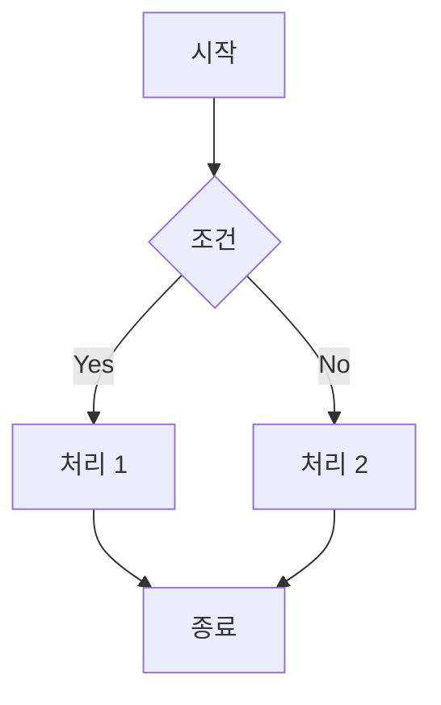
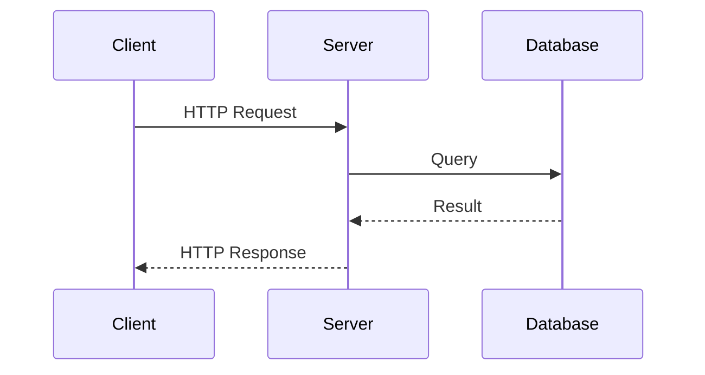
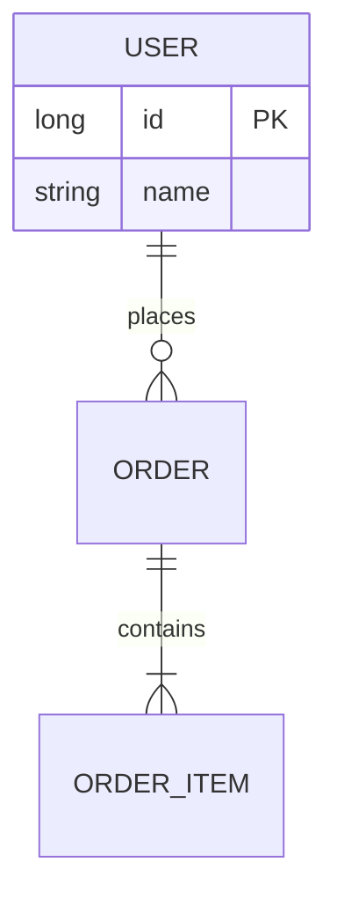

# Mermaid 다이어그램 스킬

> Mermaid 문법을 사용하여 다이어그램을 생성합니다.
> 포트폴리오의 **프로세스 흐름, 시퀀스 다이어그램** 작성에 적합합니다.

---

## 언제 이 방식을 사용하는가?

| 상황 | Mermaid 적합 |
|------|-------------|
| **플로우차트** | 비즈니스 로직, 의사결정 트리, 프로세스 흐름 |
| **시퀀스 다이어그램** | API 호출 흐름, 시스템 간 통신 (포트폴리오 핵심) |
| **ER 다이어그램** | 데이터베이스 스키마, 엔티티 관계 |
| **상태 다이어그램** | 상태 머신, 주문 라이프사이클 |
| **C4 다이어그램** | 시스템 컨텍스트, 컨테이너 구조 |

## 장점

- 텍스트 기반 문법으로 빠른 작성
- 자동 레이아웃 (노드 배치 자동화)
- 복잡한 분기/조건 표현 용이
- Git 버전 관리 용이
- 20개 이상의 다이어그램 유형 지원

## 단점

- 세밀한 레이아웃 조정 어려움 → `/svg-diagram` 사용
- 커스텀 스타일 제한적
- Mermaid CLI 설치 필요 (SVG 파일 생성 시)

---

## 지원 다이어그램

### 기본 (자주 사용)

| 유형 | 키워드 | 용도 |
|------|--------|------|
| **Flowchart** | `flowchart` | 흐름도, 프로세스, 의사결정 |
| **Sequence Diagram** | `sequenceDiagram` | API 흐름, 시스템 간 통신 |
| **Class Diagram** | `classDiagram` | 클래스 관계, UML |
| **State Diagram** | `stateDiagram-v2` | 상태 머신, 라이프사이클 |
| **ER Diagram** | `erDiagram` | DB 스키마, 테이블 관계 |

### 고급

| 유형 | 키워드 | 용도 |
|------|--------|------|
| **Gantt Chart** | `gantt` | 프로젝트 일정 |
| **GitGraph** | `gitGraph` | Git 브랜치 시각화 |
| **C4 Diagram** | `C4Context` | 시스템 아키텍처 |
| **Mindmap** | `mindmap` | 개념 정리 |
| **Quadrant Chart** | `quadrantChart` | 기술 평가 매트릭스 |
| **XY Chart** | `xychart-beta` | 수치 데이터, 트래픽 |

> **전체 문법**: `references/syntax.md` 참조

---

## 용도별 다이어그램 선택

| 용도 | 추천 다이어그램 |
|------|----------------|
| **로직/흐름 설명** | Flowchart |
| **API/통신 흐름** | Sequence |
| **시스템 구조** | Architecture / C4 / Block |
| **클래스 관계** | Class Diagram |
| **상태 변화** | State Diagram |
| **DB 스키마** | ER Diagram |
| **일정/타임라인** | Gantt / Timeline |
| **Git 브랜치** | GitGraph |
| **기술 평가** | Quadrant Chart |

---

## 빠른 시작 예시

### Flowchart



### Sequence Diagram



### ER Diagram



---

## 파일 구조

```
docs/career/portfolio/
├── portfolio.md
└── images/
    ├── api-sequence.mmd        # Mermaid 소스 (선택)
    ├── api-sequence.svg        # 생성된 SVG
    └── order-flow.svg
```

### 파일명 규칙

| 유형 | 파일명 예시 |
|------|------------|
| 시퀀스 다이어그램 | `{feature}-sequence.svg` |
| 플로우차트 | `{process}-flow.svg` |
| ER 다이어그램 | `{domain}-er.svg` |

---

## 작성 절차

1. **Mermaid 코드 작성**: `.mmd` 파일 또는 마크다운 코드 블록
2. **SVG 변환**: `mmdc -i diagram.mmd -o diagram.svg`
3. **파일 저장**: `docs/career/portfolio/images/`
4. **마크다운에서 참조**: ``
5. **git add 실행**

---

## 주의사항

1. **파일명**: kebab-case 사용 (예: `api-sequence.svg`)
2. **위치**: `docs/career/portfolio/images/` 폴더에 저장
3. **한글**: 일부 폰트에서 깨질 수 있음 - 테스트 필요
4. **복잡한 레이아웃**: 자동 배치가 마음에 안 들면 `/svg-diagram` 사용

---

## 체크리스트

- [ ] 다이어그램 유형이 목적에 적합한가?
- [ ] 파일명이 kebab-case인가?
- [ ] SVG 파일이 `images/` 폴더에 있는가?
- [ ] 마크다운에서 올바르게 참조했는가?
- [ ] git add 실행했는가?

---

## 참조 문서

| 문서 | 내용 |
|------|------|
| `references/syntax.md` | 모든 다이어그램 문법 상세 |
| `references/cli-styling.md` | CLI 사용법, 테마, 스타일링 |

## 외부 자료

- [Mermaid 공식 문서](https://mermaid.js.org/)
- [Mermaid Live Editor](https://mermaid.live/)

---

## 관련 스킬

- `/write-portfolio`: 포트폴리오 작성 (다이어그램 포함)
- `/svg-diagram`: SVG 직접 생성 (정교한 레이아웃)
- `/export`: PDF 내보내기
