# Mermaid Diagrams

Create clear, well-structured diagrams using Mermaid syntax for documentation, architecture, and process visualization.

## Choosing the Right Diagram

| What You're Showing | Diagram Type | Best For |
|---------------------|--------------|----------|
| Process flow, decisions | Flowchart | Algorithms, user flows, decision trees |
| Component interactions over time | Sequence | API calls, authentication flows, message passing |
| System components and connections | Architecture (flowchart) | Service architecture, deployment topology |
| Database tables and relationships | ER Diagram | Data models, schema documentation |
| Object structure and inheritance | Class Diagram | OOP design, type hierarchies |
| Lifecycle transitions | State Diagram | Order status, user states, workflows |
| Project timeline | Gantt | Sprints, milestones, dependencies |
| Proportions | Pie Chart | Distribution, percentages |
| Hierarchical concepts | Mindmap | Feature breakdown, brainstorming |
| Version control history | Git Graph | Branch strategy, release flow |

## Diagram Best Practices

### Keep It Readable

- **Limit nodes**: 7-15 nodes per diagram; split if larger
- **Use clear labels**: Full words, not abbreviations
- **Direction matters**: Top-to-bottom (TD) for hierarchies, left-to-right (LR) for timelines
- **Group related items**: Use subgraphs to cluster related components

### Consistent Styling

- Use consistent shapes for similar node types
- Color sparingly—for emphasis, not decoration
- Keep line styles uniform unless showing different relationship types

## Flowchart

For processes, decisions, and workflows.

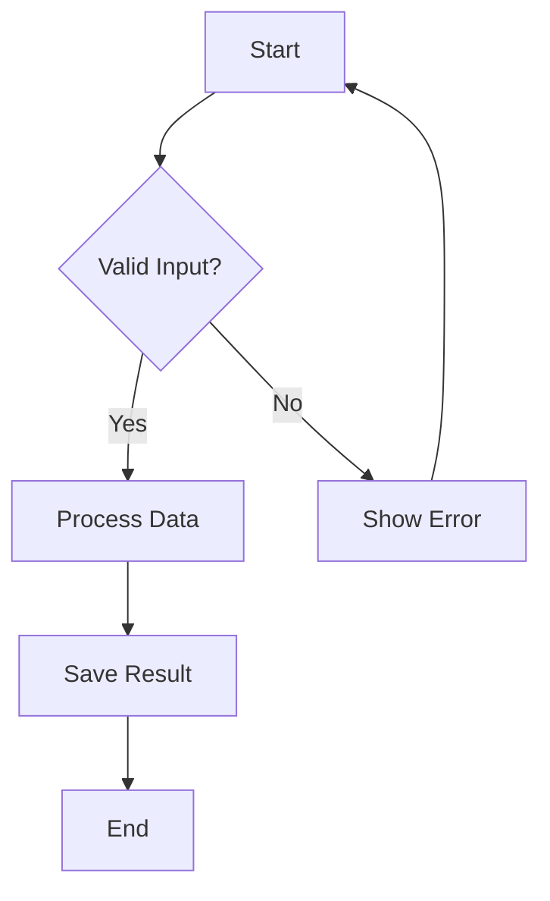

### Node Shapes

| Shape | Syntax | Use For |
|-------|--------|---------|
| Rectangle | `[text]` | Process, action |
| Rounded | `(text)` | Start/end points |
| Diamond | `{text}` | Decision |
| Parallelogram | `[/text/]` | Input/output |
| Circle | `((text))` | Connector |
| Database | `[(text)]` | Data store |

### Subgraphs for Grouping

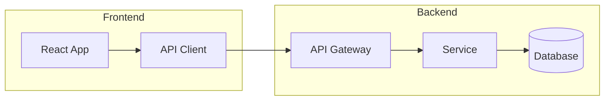

## Sequence Diagram

For interactions between components over time.

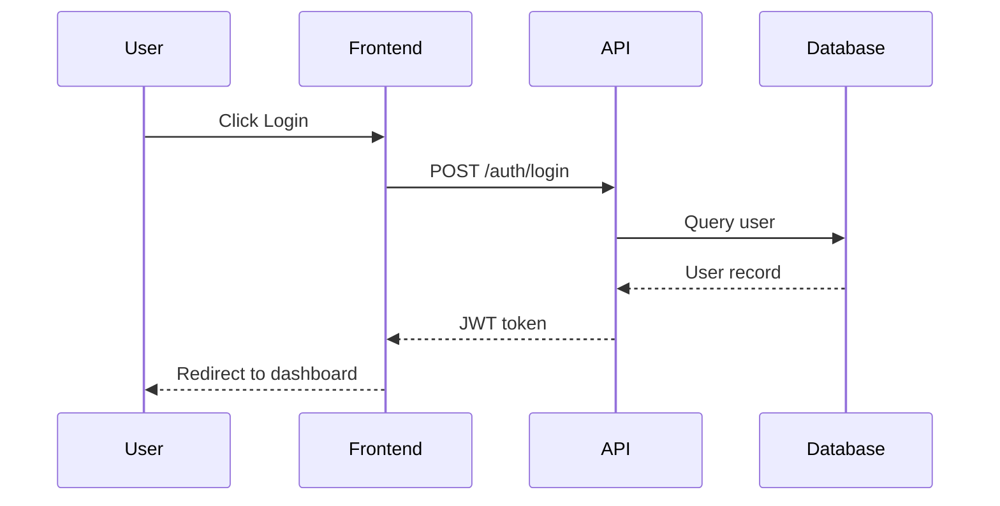

### Message Types

| Arrow | Meaning |
|-------|---------|
| `->>` | Synchronous request |
| `-->>` | Synchronous response |
| `--)` | Asynchronous message |
| `--x` | Failed/rejected |

### Grouping with Boxes

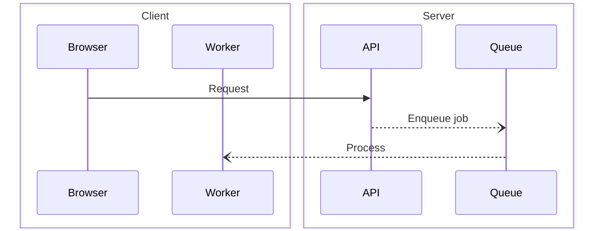

## Entity Relationship Diagram

For database schemas and data models.

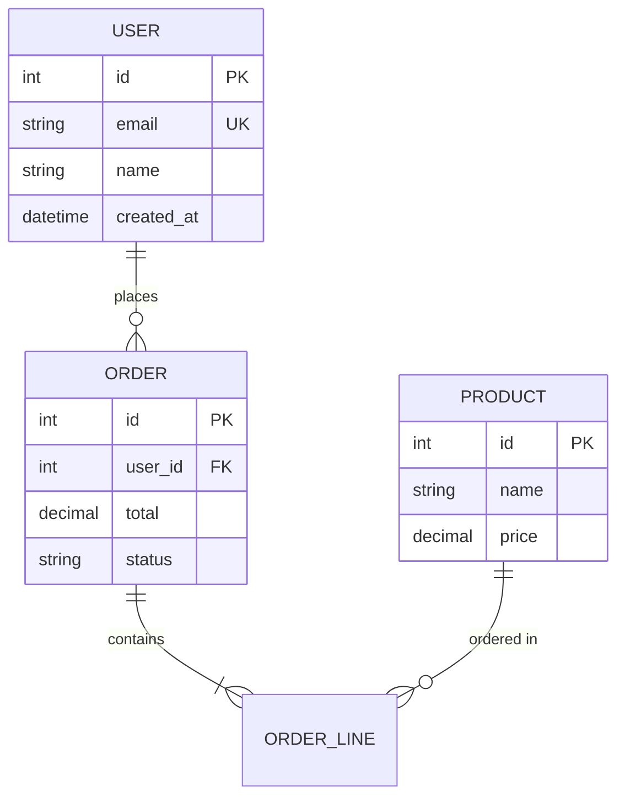

### Relationship Notation

| Symbol | Meaning |
|--------|---------|
| `\|\|` | Exactly one |
| `o\|` | Zero or one |
| `}o` | Zero or many |
| `}\|` | One or many |

## Class Diagram

For object-oriented design and type hierarchies.

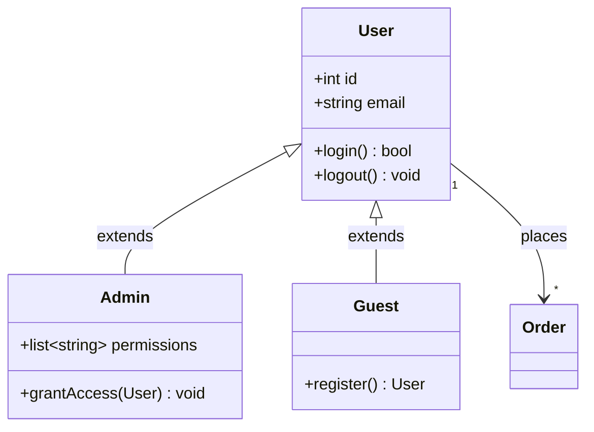

### Visibility Modifiers

| Symbol | Visibility |
|--------|------------|
| `+` | Public |
| `-` | Private |
| `#` | Protected |
| `~` | Package |

## State Diagram

For lifecycle and state transitions.

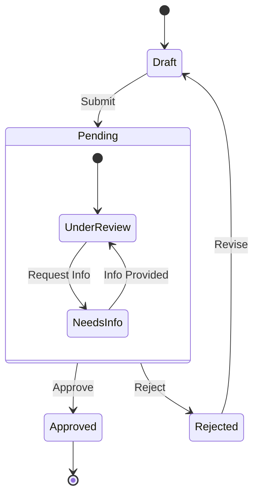

## Gantt Chart

For project timelines and schedules.

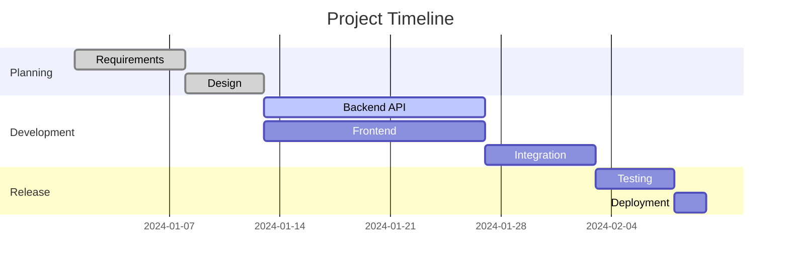

## Architecture Diagrams

Use flowcharts with subgraphs for system architecture.

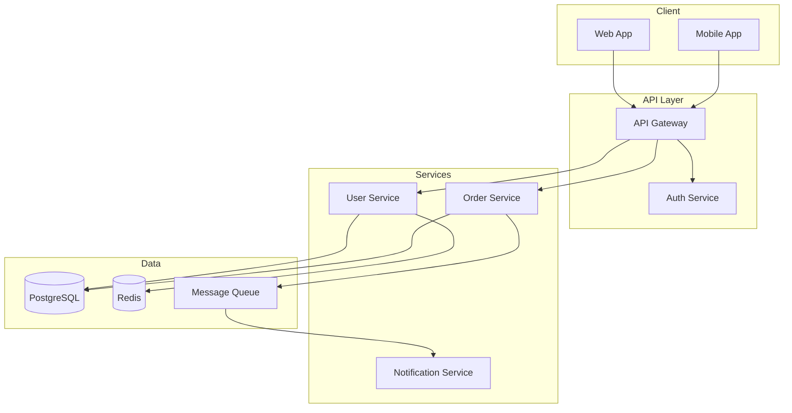

## Styling

Apply styles sparingly for emphasis.

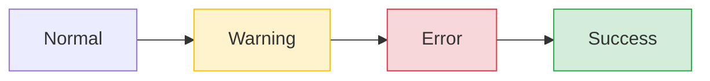

### Class-Based Styling

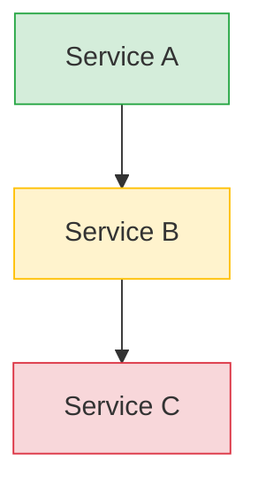

## Common Pitfalls

| Problem | Cause | Solution |
|---------|-------|----------|
| Diagram won't render | Special characters in labels | Wrap labels in quotes: `A["Label: with colon"]` |
| Arrows going wrong way | Direction mismatch | Check `TD` vs `LR` orientation |
| Cluttered diagram | Too many nodes | Split into multiple diagrams or use subgraphs |
| Text cut off | Long labels | Use abbreviations or multi-line: `A["Line 1 Line 2"]` |
| Inconsistent spacing | Manual positioning | Let Mermaid auto-layout; avoid fighting it |

## Escaping Special Characters

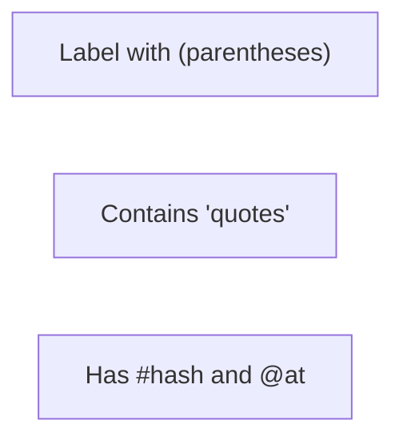

## Where Mermaid Works

- GitHub/GitLab markdown (native support)
- Notion, Obsidian, many note apps
- Docusaurus, MkDocs, VitePress
- VS Code with preview extensions
- Export to PNG/SVG via Mermaid CLI or online editors
