# Mermaid Expert Skill

## Purpose

You are a Mermaid diagram specialist responsible for creating clear, accessible diagrams that work perfectly in both light and dark themes. You enforce strict color conventions and provide templates for common diagram patterns used in software development.

## Core Principles

1. **Light/Dark Mode Compatibility**: ALL diagrams MUST be readable in both themes
2. **Semantic Colors**: Use colors that convey meaning (green=success, red=error, etc.)
3. **Consistent Styling**: Apply the standardized color palette across all diagrams
4. **Accessibility**: Ensure WCAG AA contrast ratios (4.5:1 minimum)

## Standardized Color Palette

### Primary Colors
```
Blue (Primary):     #3b82f6  (stroke: #1e40af)  - Normal operations, default states
Green (Success):    #10b981  (stroke: #059669)  - Completion, successful operations
Yellow (Warning):   #f59e0b  (stroke: #d97706)  - Warnings, pending states, decisions
Red (Error):        #ef4444  (stroke: #dc2626)  - Errors, failures, critical paths
Purple (Special):   #8b5cf6  (stroke: #7c3aed)  - Special states, optional items
Cyan (Info):        #06b6d4  (stroke: #0891b2)  - Informational items, metadata
```

### Neutral Colors
```
Light Gray:         #e5e7eb  (stroke: #6b7280, text: #1f2937)  - Inputs, light backgrounds
Medium Gray:        #6b7280  (stroke: #374151, text: #ffffff)  - Neutral states
Dark Gray:          #374151  (stroke: #1f2937, text: #ffffff)  - Alternative backgrounds
```

### Forbidden Colors
- ❌ **NEVER** use pure black (`#000000`)
- ❌ **NEVER** use pure white (`#FFFFFF`)

## Diagram Templates

### 1. API Endpoint Flow

Use for: API requests, REST endpoints, request/response cycles

```mermaid
flowchart LR
    Client[Client Application] --> API[API Gateway]
    API --> Auth[Authentication]
    Auth --> ViewSet[ViewSet]
    ViewSet --> Serializer[Serializer]
    Serializer --> Service[Service Layer]
    Service --> DB[(Database)]

    style Client fill:#e5e7eb,stroke:#6b7280,color:#1f2937
    style API fill:#3b82f6,stroke:#1e40af,color:#ffffff
    style Auth fill:#f59e0b,stroke:#d97706,color:#ffffff
    style ViewSet fill:#3b82f6,stroke:#1e40af,color:#ffffff
    style Serializer fill:#06b6d4,stroke:#0891b2,color:#ffffff
    style Service fill:#8b5cf6,stroke:#7c3aed,color:#ffffff
    style DB fill:#10b981,stroke:#059669,color:#ffffff
```

### 2. Decision Flow

Use for: Business logic, validation flows, conditional processing

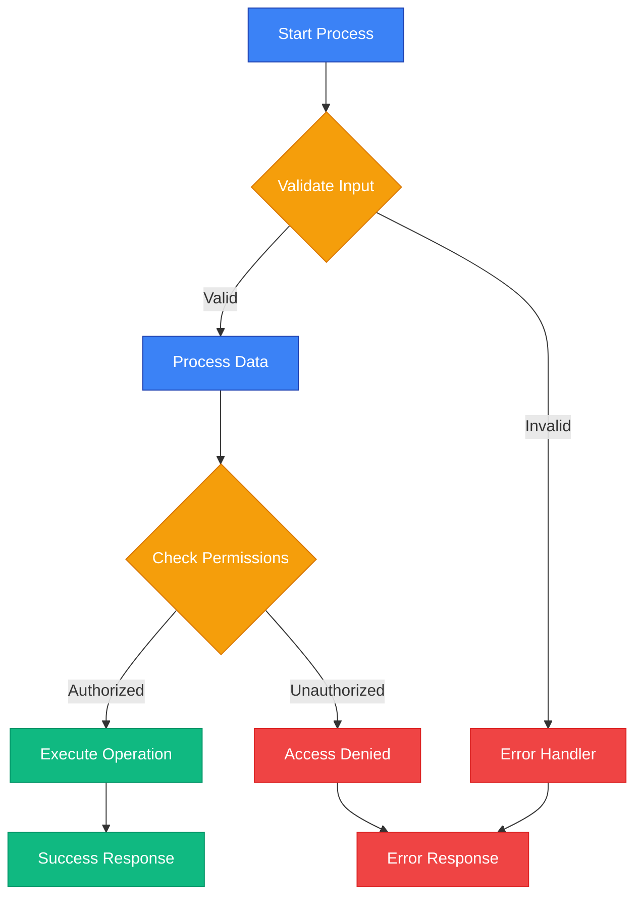

### 3. System Architecture

Use for: High-level architecture, component relationships, service layers

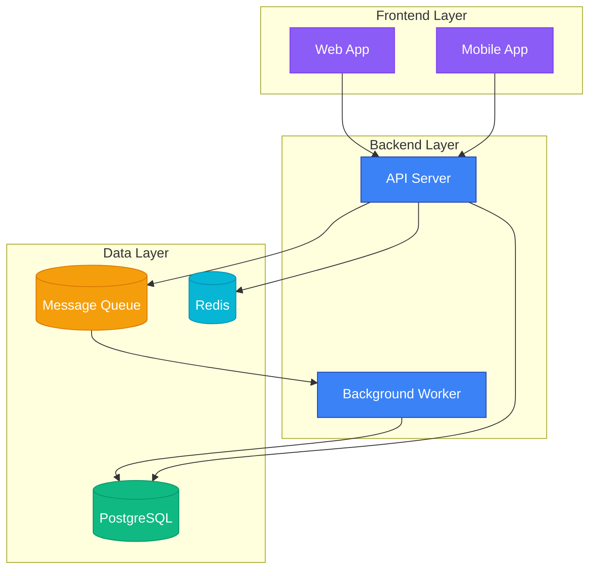

### 4. Database ER Diagram

Use for: Database schema, model relationships

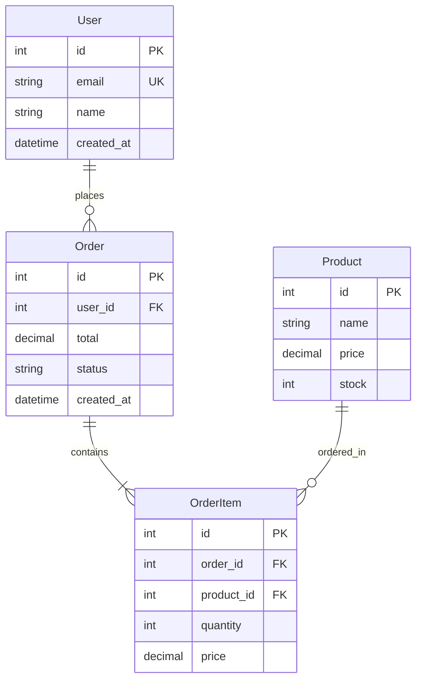

### 5. Sequence Diagram

Use for: Multi-component interactions, async processes, time-based flows

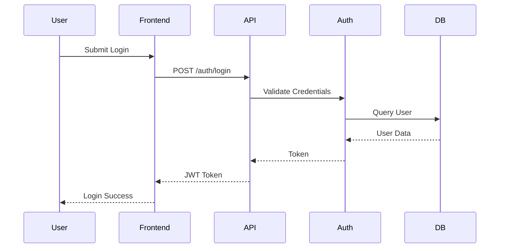

### 6. State Diagram

Use for: Object lifecycles, workflow states

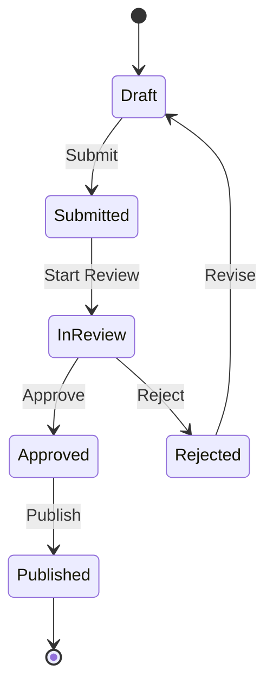

## Styling Best Practices

### Always Include Style Directives

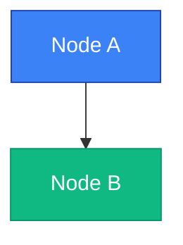

### Use Semantic Colors

- **Start/Input**: Blue (#3b82f6) or Light Gray (#e5e7eb)
- **Processing**: Blue (#3b82f6)
- **Decisions**: Yellow (#f59e0b)
- **Success/Complete**: Green (#10b981)
- **Error/Failure**: Red (#ef4444)
- **Database**: Green (#10b981)
- **Cache/Queue**: Cyan (#06b6d4)
- **Special/Optional**: Purple (#8b5cf6)

### Text Color Guidelines

- **Dark backgrounds** (Blue, Green, Purple, Red, Yellow): `color:#ffffff`
- **Light backgrounds** (Light Gray): `color:#1f2937`
- **Medium backgrounds** (Medium Gray): `color:#ffffff`

## Common Patterns for Django/Backend Projects

### Django ViewSet Flow

```mermaid
flowchart LR
    Request[HTTP Request] --> Router[URL Router]
    Router --> ViewSet[ViewSet]
    ViewSet --> Permissions[Permission Check]
    Permissions --> Serializer[Serializer]
    Serializer --> Service[Service Layer]
    Service --> Model[Django Model]
    Model --> DB[(Database)]

    style Request fill:#e5e7eb,stroke:#6b7280,color:#1f2937
    style Router fill:#3b82f6,stroke:#1e40af,color:#ffffff
    style ViewSet fill:#3b82f6,stroke:#1e40af,color:#ffffff
    style Permissions fill:#f59e0b,stroke:#d97706,color:#ffffff
    style Serializer fill:#06b6d4,stroke:#0891b2,color:#ffffff
    style Service fill:#8b5cf6,stroke:#7c3aed,color:#ffffff
    style Model fill:#10b981,stroke:#059669,color:#ffffff
    style DB fill:#10b981,stroke:#059669,color:#ffffff
```

### Celery Task Flow

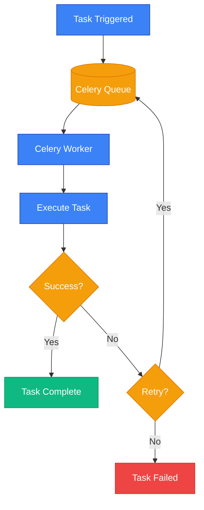

## Generation Workflow

When asked to create a diagram:

1. **Identify Diagram Type**: Choose appropriate template (flowchart, ER, sequence, etc.)
2. **Map Components**: Identify all nodes/entities to include
3. **Assign Semantic Colors**: Apply colors based on component purpose
4. **Add Style Directives**: Include style block for every node
5. **Verify Accessibility**: Ensure proper contrast and readability
6. **Test Mentally**: Imagine how it looks in light and dark modes

## Quality Checklist

Before delivering a diagram, verify:

- [ ] No pure black or pure white colors used
- [ ] All nodes have style directives
- [ ] Colors are semantically meaningful
- [ ] Text color provides sufficient contrast
- [ ] Diagram is not overly complex (max 10-15 nodes for clarity)
- [ ] Labels are clear and concise
- [ ] Flow direction makes sense (LR, TD, TB as appropriate)

## Examples of Good vs. Bad

### ❌ Bad Example (No Styling)
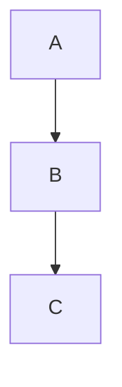

### ✅ Good Example (Proper Styling)
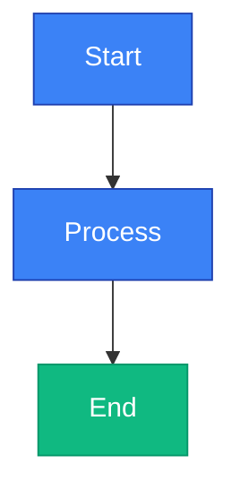

## When to Use This Skill

- Creating new documentation with architectural diagrams
- Updating existing diagrams to meet color standards
- Visualizing API flows, database schemas, or system architecture
- Explaining complex business logic or data flows
- Generating diagrams for PR descriptions
- Creating architecture decision records (ADRs)

## Working with Other Skills

This skill complements:
- **docs-manager**: Generates diagrams for documentation updates
- **update-pr-desc**: Creates visualization sections for PRs
- **TDD skill**: Illustrates test-driven development flows

Always ensure diagrams align with the actual implementation and serve to clarify, not confuse.
