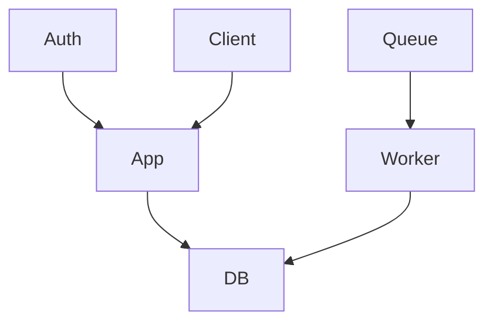
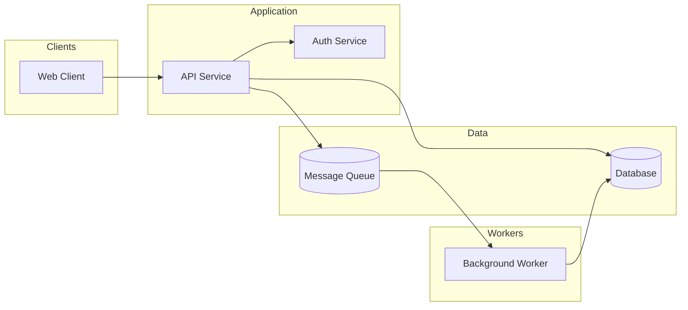

# Mermaid Diagram Optimizer

Optimize Mermaid diagrams for improved readability, consistency, and completeness.

## Quick Start

1. Read the target file(s) containing Mermaid diagrams
2. For each diagram, apply optimization rules:
   - Simplify layouts and reduce edge crossings
   - Use consistent directional flow (LR or TD)
   - Group related components with subgraphs
   - Add missing components (databases, queues, auth services, etc.)
   - Standardize naming conventions and styles
3. Replace optimized diagrams in source file(s)

## Optimization Goals

### 1. Visual Clarity
- Simplify layouts to reduce complexity
- Minimize edge crossings
- Use consistent directional flow (prefer LR or TD)
- Break large diagrams into logical sections

### 2. Layout and Grouping
- Group related components using `subgraph` with clear labels
- Keep similar component types aligned
- Avoid overcrowding nodes

### 3. Add Missing Components
Identify implied but missing components:
- Databases
- Queues / message brokers
- Auth / identity services
- External clients or APIs
- Monitoring / logging components

Add only when logically required by existing connections or labels.

### 4. Style Standardization
- Use consistent diagram types (`graph`, `sequenceDiagram`, `stateDiagram`)
- Use semantic node IDs with readable labels:
  ```mermaid
  graph LR
    api[API Service]
    db[(Database)]
  ```
- Standardize capitalization and spacing
- Use consistent arrow styles and directions

### 5. Mermaid Best Practices
- Always use explicit direction: `graph LR`, `graph TD`
- Avoid overly long node labels
- Keep one responsibility per node
- Use widely supported Mermaid syntax only

## Constraints

- Preserve the original meaning and architecture
- Do not remove existing components unless they are redundant duplicates
- Do not change non-Mermaid content
- Output valid Mermaid syntax only

## Example Before/After

**Before:**


**After:**


## Notes

- This skill focuses on optimization and improvement, not syntax fixing
- For parsing errors and syntax issues, use the `/mermaid-fix` skill instead
- Always validate diagrams after optimization using `mmdc`
