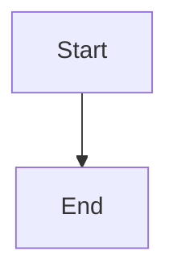
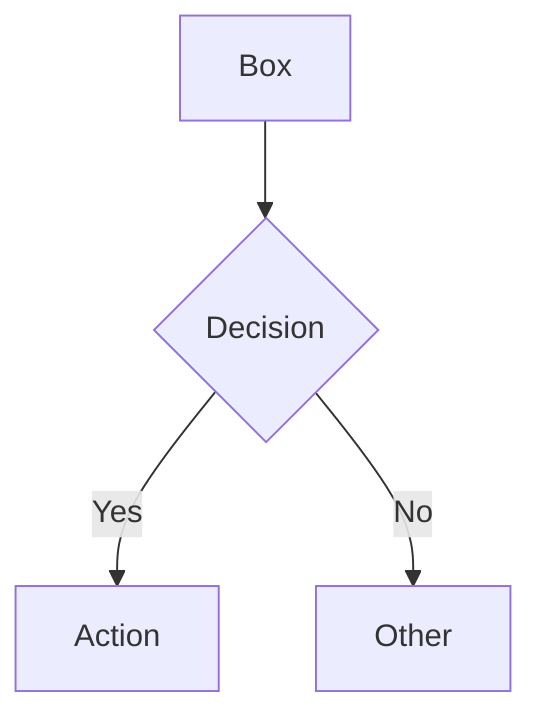
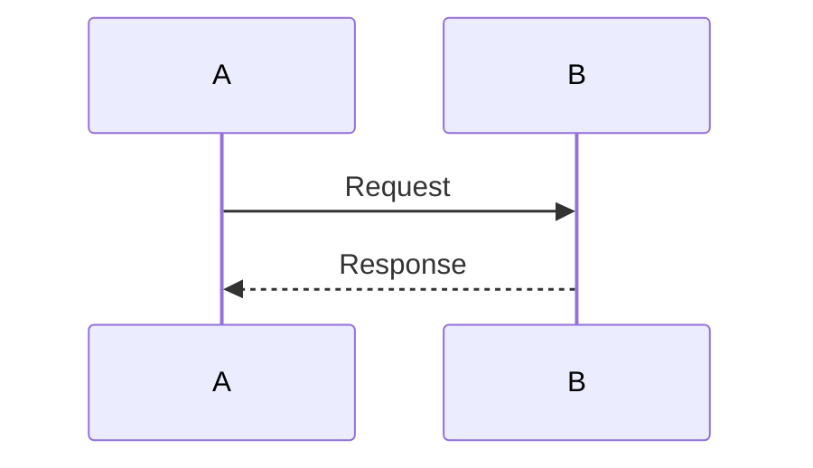
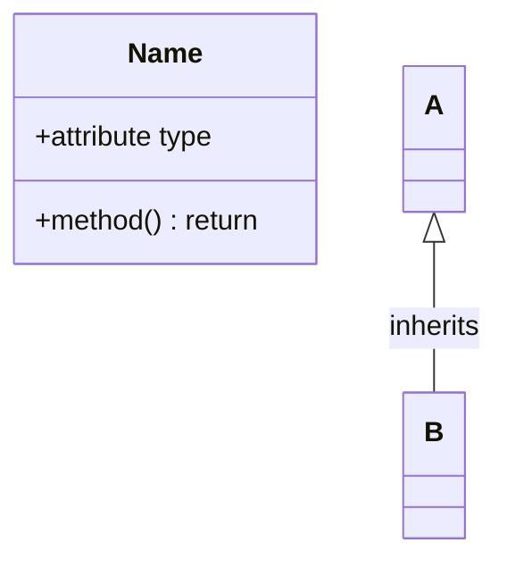
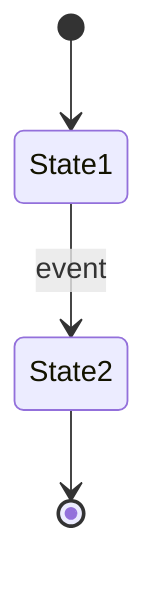
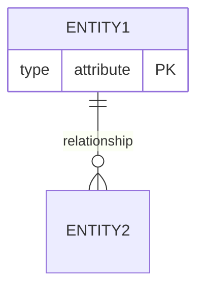

# Mermaid Syntax Reference

## Overview

Mermaid is a JavaScript-based diagramming tool that renders diagrams from Markdown-inspired text definitions. Diagrams render as SVG directly in browsers and are natively supported by GitHub, GitLab, Azure DevOps, Obsidian, and Notion.

**Key advantages:**

- Zero setup (browser-based rendering)
- Native Markdown integration (diagrams auto-sync with definitions)
- Simpler syntax than PlantUML
- No external dependencies

**Limitations:**

- Less customization than PlantUML
- C4 support is experimental
- No MindMap or JSON visualization

---

## Diagram Types Quick Reference

| Type | Keyword | Best For |
| --- | --- | --- |
| Flowchart | `flowchart` or `graph` | Process flows, decision trees, workflows |
| Sequence | `sequenceDiagram` | API calls, request/response flows |
| Class | `classDiagram` | OOP structures, inheritance, relationships |
| State | `stateDiagram-v2` | State machines, lifecycle states |
| ER | `erDiagram` | Database schemas, entity relationships |
| Gantt | `gantt` | Project timelines, schedules |
| Pie | `pie` | Distribution, proportions |
| Git Graph | `gitGraph` | Branching strategies, commit history |
| C4 Context | `C4Context` | System architecture (experimental) |
| Timeline | `timeline` | Chronological events |

---

## Markdown Integration

Mermaid diagrams are embedded in Markdown using fenced code blocks:

````markdown

````

**Platform support:**

- GitHub: Native rendering in README, issues, PRs, wikis
- GitLab: Native rendering in Markdown files
- Azure DevOps: Native rendering in wikis and repos
- Obsidian: Native with core plugin
- VS Code: With Markdown Preview Mermaid Support extension

---

## Quick Reference Card

### Flowchart



### Sequence



### Class



### State



### ER



---

## References

For detailed syntax and complete examples, see:

| Reference | Content | When to Load |
| --- | --- | --- |
| [flowchart.md](references/flowchart.md) | Node shapes, edge types, subgraphs | Creating flowcharts |
| [sequence.md](references/sequence.md) | Participants, arrows, activation, alt/loop | Creating sequence diagrams |
| [class.md](references/class.md) | Classes, visibility, relationships, cardinality | Creating class diagrams |
| [state-er.md](references/state-er.md) | State machines, ER diagrams, relationships | Creating state/ER diagrams |
| [special-diagrams.md](references/special-diagrams.md) | Gantt, Git Graph, C4, styling, gotchas | Creating special diagrams |

---

## Test Scenarios

### Scenario 1: Creating a flowchart

**Query:** "Create a Mermaid flowchart for user registration process"

**Expected:** Skill activates, provides flowchart syntax with decision nodes and subgraphs

### Scenario 2: Creating a sequence diagram

**Query:** "Generate a Mermaid sequence diagram for API authentication"

**Expected:** Skill activates, provides sequence syntax with participants and alt/loop blocks

### Scenario 3: Creating an ER diagram

**Query:** "Create a Mermaid ER diagram for a blog database"

**Expected:** Skill activates, directs to state-er.md reference for entity attributes and relationships

---

**Last Updated:** 2025-12-28
**Mermaid Version:** 10.x / 11.x

## Version History

- **v1.1.0** (2025-12-28): Refactored to progressive disclosure - extracted content to references/
- **v1.0.0** (2025-12-26): Initial release
