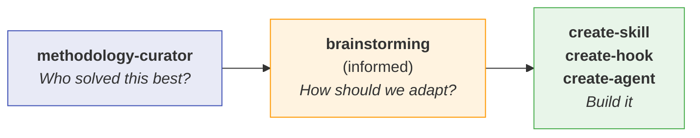
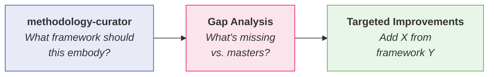

# Methodology Curator

## Overview

Surface proven frameworks from domain masters before creating OR evaluating skills, hooks, agents, or commands. This prevents reinventing wheels and identifies methodology gaps in existing work.

**Core principle**: The hardest part isn't scaffolding—it's knowing the *best way* to approach the domain you're teaching.

## Quick Start

### 1. Identify Your Domain

What domain does your skill/hook/agent address?

| If Creating... | Consider Domain... |
|---------------|-------------------|
| Teaching a technique | Instruction Design |
| Review workflow | Code Review |
| Troubleshooting skill | Debugging |
| Test-related skill | Testing & TDD |
| Knowledge/memory system | Knowledge Management |
| Decision framework | Decision Making |

### 2. Surface Relevant Masters

Read the domain module to discover experts and their frameworks:

```
See modules/<domain>.md for masters and methodologies
```

**Available domains:**
- `modules/instruction-design.md` - Teaching techniques, behavioral objectives
- `modules/code-review.md` - Review methodologies, feedback patterns
- `modules/debugging.md` - Systematic troubleshooting frameworks
- `modules/testing.md` - TDD masters, test design patterns
- `modules/knowledge-management.md` - Note-taking, knowledge systems
- `modules/decision-making.md` - Mental models, decision frameworks

### 3. Select & Blend

For each master/methodology presented:
1. **Assess fit**: Does this match your context?
2. **Extract principles**: What core ideas apply?
3. **Identify conflicts**: Do methodologies contradict?
4. **Blend consciously**: Combine compatible elements

### 4. Create Methodology Brief

Before proceeding to skill creation, document your choices:

```markdown
## Methodology Brief: [Skill Name]

### Domain(s): [e.g., Instruction Design + Testing]

### Selected Frameworks:
1. [Framework]: [Why selected]
2. [Framework]: [Why selected]

### Key Principles to Encode:
- [Principle 1]
- [Principle 2]

### Explicitly Rejected:
- [Framework]: [Why not suitable]

### Handoff to: /create-skill or /create-hook
```

## Workflow Integration

### For New Work (Creation)



### For Existing Work (Evaluation)



**This skill runs BEFORE brainstorming or evaluation**, as a brief initial check.

## Evaluating Existing Work

Quick methodology audit for existing skills/hooks/agents/commands:

### 1. Identify What It Teaches

Read the existing work and determine its domain:
- What behavior is it trying to change?
- What technique/pattern/process does it encode?

### 2. Surface Relevant Masters

Check the domain module for established frameworks:
- What do recognized experts say about this domain?
- What principles are well-established?

### 3. Gap Analysis

Compare existing work against master frameworks:

```markdown
## Methodology Audit: [Existing Skill Name]

### Domain: [Identified domain]

### Relevant Frameworks:
| Framework | Key Principle | Present in Skill? | Gap? |
|-----------|--------------|-------------------|------|
| [Master A] | [Principle] | Yes/No/Partial | [What's missing] |
| [Master B] | [Principle] | Yes/No/Partial | [What's missing] |

### Optimization Opportunities:
1. [Gap]: Could add [principle] from [framework]
2. [Gap]: [Framework] suggests [approach] instead

### Verdict:
- [ ] Well-grounded - matches established methodology
- [ ] Partial - missing key principles from [framework]
- [ ] Ad-hoc - not grounded in recognized methodology
```

### 4. Targeted Improvements

Don't rewrite—surgically add missing methodology:
- Add specific principles that are missing
- Align terminology with established frameworks
- Reference masters to add authority

## When to Skip

### Skip for Creation when:
- You're implementing a well-defined spec
- The domain is highly specific to your codebase
- You've already researched methodologies externally
- Creating a simple utility with no pedagogical component

### Skip for Evaluation when:
- Fixing syntax/structural issues (use `/validate-plugin` instead)
- The work is purely mechanical (no methodology to ground)
- Already performed a recent methodology audit
- Quick bug fixes that don't change the approach

## Domain Modules

Each module contains:
- **Masters**: Recognized experts in the domain
- **Key Works**: Essential books/papers/talks
- **Frameworks**: Actionable methodologies
- **Selection Guide**: When to use each approach
- **Anti-patterns**: What to avoid

### Adding New Domains

To expand the masters database, create a new module following this template:

```markdown
# [Domain Name] Masters

## Masters Overview
| Expert | Key Contribution | Best For |
|--------|-----------------|----------|
| Name   | Framework/Book  | Context  |

## Detailed Frameworks

### [Framework 1]
**Source**: [Expert] - [Work]
**Core Idea**: [One sentence]
**Key Principles**:
- Principle 1
- Principle 2
**Use When**: [Context]
**Avoid When**: [Anti-context]

## Selection Matrix
[Decision guide for choosing between frameworks]
```

## Integration with Skill Authoring

After curating methodologies, the skill authoring workflow benefits from:

1. **Grounded TDD scenarios**: Test against the methodology's expected behaviors
2. **Principled anti-rationalization**: Counter excuses using the methodology's logic
3. **Authoritative references**: Cite masters in skill documentation
4. **Consistent terminology**: Use the methodology's vocabulary

## Related

### For Creation
- `/create-skill` - Skill creation workflow (use after this)
- `/create-hook` - Hook creation workflow
- `superpowers:brainstorming` - Refine approach after methodology selection
- `skill-authoring` - Detailed skill writing guidance

### For Evaluation
- `/skills-eval` - Evaluate skill quality (complements methodology audit)
- `/analyze-skill` - Analyze skill complexity
- `/bulletproof-skill` - Harden against rationalization
- `pensive:code-reviewer` - Code review (uses code-review domain)
