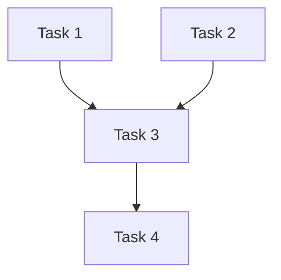
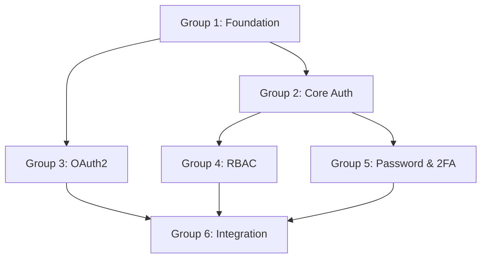

# Multi-Agent Planner Skill

## Description
Automated generation of MULTI_AGENT_PLAN.md files with comprehensive task decomposition, dependency analysis, agent role assignment, timeline estimation, and parallel execution grouping. This skill transforms high-level feature requirements into structured multi-agent orchestration plans with clear responsibilities, dependencies, and coordination protocols.

## When to Use This Skill
- "Create a multi-agent plan for implementing user authentication with email verification and OAuth2 integration"
- "Break down this feature into parallel tasks for multiple agents to work on simultaneously"
- "Generate an orchestration plan for refactoring the payment processing module with minimal downtime"
- "I need agents to work on building a data pipeline with ingestion, transformation, and storage components"
- "Coordinate development of a microservices migration from monolith including API gateway and service mesh"

## When NOT to Use This Skill
- Single-file modifications or trivial changes → Use direct implementation instead
- Exploratory research tasks without concrete implementation → Use researcher agent directly
- Emergency hotfixes requiring immediate action → Use systematic-debugging skill instead

## Prerequisites
- Clear feature requirements or project specification
- Understanding of codebase architecture and structure
- Access to repository file structure and existing documentation
- Knowledge of available agent roles and their capabilities
- Understanding of project dependencies and constraints

## Workflow

### Phase 1: Requirements Analysis and Context Gathering
**Purpose**: Understand the scope, constraints, and objectives to create accurate task decomposition

#### Step 1.1: Extract Requirements
Parse and analyze the feature request to identify:
- Core functionality requirements
- Technical constraints (performance, security, compatibility)
- Integration points with existing systems
- Success criteria and acceptance tests
- Timeline constraints and milestones

**Expected Output**: Structured requirements document with categorized functional and non-functional requirements

#### Step 1.2: Analyze Codebase Context
Search codebase to understand:
- Existing architecture patterns
- Related modules and dependencies
- Configuration files and environment setup
- Testing infrastructure
- Documentation structure

```bash
# Example context gathering
grep -r "authentication" src/ --include="*.ts"
find . -name "*config*" -type f
ls -la tests/
```

**Expected Output**: Context map showing relevant files, dependencies, and architectural patterns

#### Step 1.3: Identify Technical Dependencies
Map out dependencies between components:
- Database schema changes before API implementation
- Authentication before authorization
- Migration scripts before feature deployment
- API contracts before client implementation

**Decision Point**:
- IF dependencies are cyclical → Flag for architecture review and resolution
- ELSE IF dependencies are complex (>3 levels) → Consider phased approach
- ELSE → Proceed with dependency graph creation

**Expected Output**: Directed acyclic graph (DAG) of technical dependencies

### Phase 2: Task Decomposition and Agent Assignment
**Purpose**: Break down requirements into atomic, parallelizable tasks with clear ownership

#### Step 2.1: Decompose into Work Packages
Create hierarchical task breakdown:

**Level 1 - Epic**: High-level feature (e.g., "User Authentication System")
**Level 2 - Story**: Major component (e.g., "Email Verification Flow")
**Level 3 - Task**: Atomic implementation unit (e.g., "Create EmailVerificationToken model")

Task granularity rules:
- Each task should be completable in 2-4 hours
- Task should have clear input/output contracts
- Task should be independently testable
- Task should modify <5 files when possible

**Expected Output**: Hierarchical task list with estimated complexity (S/M/L)

#### Step 2.2: Assign Agent Roles
Match tasks to agent roles based on specialization:

**Agent Role Matching Logic**:
- **Architect**: System design, API contracts, database schemas, architecture decisions
- **Builder**: Feature implementation, component creation, integration code
- **Validator**: Test creation, quality assurance, security audits, performance testing
- **Scribe**: Documentation, API docs, user guides, migration guides
- **DevOps**: CI/CD pipelines, deployment scripts, infrastructure configuration
- **Researcher**: Technology evaluation, pattern research, spike solutions

**Expected Output**: Task-to-agent mapping with rationale for each assignment

#### Step 2.3: Identify Parallel Groups
Analyze dependency graph to find tasks that can execute concurrently:

```
Parallel Group 1 (no dependencies):
- Task A: Create User model
- Task B: Set up email service configuration
- Task C: Design authentication UI components

Parallel Group 2 (depends on Group 1):
- Task D: Implement login endpoint (depends on A)
- Task E: Build email verification handler (depends on A, B)
- Task F: Create login form (depends on C)
```

**Validation**:
- [ ] No circular dependencies within parallel groups
- [ ] All dependencies resolved before task execution
- [ ] Resource conflicts identified (e.g., same file modifications)

**Expected Output**: Parallel execution groups with dependency markers

### Phase 3: Timeline and Milestone Creation
**Purpose**: Establish realistic timelines with checkpoints and review gates

#### Step 3.1: Estimate Task Duration
Calculate time estimates using complexity and dependencies:

**Estimation Formula**:
- Small task: 2-3 hours
- Medium task: 4-6 hours
- Large task: 8-12 hours
- Add 25% buffer for integration and coordination overhead
- Add 50% buffer for tasks with external dependencies

**Expected Output**: Timeline with task durations and cumulative time

#### Step 3.2: Define Milestones and Review Gates
Create checkpoints for validation and course correction:

**Milestone Types**:
- **Technical Milestone**: Core functionality complete (e.g., "Authentication API functional")
- **Integration Milestone**: Components working together (e.g., "Frontend-backend auth flow working")
- **Quality Milestone**: Tests passing, documentation complete (e.g., "All auth tests green")
- **Deployment Milestone**: Feature deployed to environment (e.g., "Auth in staging")

**Review Gate Criteria**:
- All tests in milestone scope passing
- Code review completed and approved
- Documentation updated
- Integration tests successful
- Performance benchmarks met

**Expected Output**: Milestone timeline with review gate criteria

### Phase 4: Communication Protocol Definition
**Purpose**: Establish how agents coordinate, share context, and handle handoffs

#### Step 4.1: Define Handoff Points
Identify where work transitions between agents:

**Handoff Template**:
```markdown
## Handoff: [From Agent] → [To Agent]
**Trigger**: [Completion condition]
**Artifacts**: [Files, docs, data to transfer]
**Context Required**: [Background info needed]
**Acceptance Criteria**: [How to verify ready for handoff]
```

**Expected Output**: Documented handoff protocols for each agent transition

#### Step 4.2: Establish Shared Context
Define what information must be accessible to all agents:

- **Project Context**: README, architecture docs, coding standards
- **Work State**: Current status, completed tasks, blockers
- **Decisions Log**: Architecture decisions, technical choices, rationale
- **Integration Contracts**: API schemas, interfaces, data models

**Expected Output**: Shared context document structure and update protocol

#### Step 4.3: Create Communication Events
Define events that trigger agent notifications:

**Event Types**:
- `TaskCompleted`: Agent finished assigned task
- `BlockerEncountered`: Agent cannot proceed without input
- `ReviewRequired`: Work ready for validation
- `DependencyReady`: Blocking dependency now available
- `MilestoneReached`: Checkpoint achieved

**Expected Output**: Event schema and subscription model

### Phase 5: Plan Document Generation
**Purpose**: Produce final MULTI_AGENT_PLAN.md with all orchestration details

#### Step 5.1: Render Plan Document
Generate structured markdown file:

```markdown
# Multi-Agent Development Plan: [Feature Name]

## Overview
- **Feature**: [Description]
- **Timeline**: [Estimated duration]
- **Agents Involved**: [List with roles]
- **Milestones**: [Count and summary]

## Agent Roles and Responsibilities
[Detailed role assignments]

## Task Breakdown
### Parallel Group 1: [Name]
**Duration**: [Estimate]
**Dependencies**: None

- [ ] Task 1.1: [Description] (Agent: [Name], Est: [Time])
- [ ] Task 1.2: [Description] (Agent: [Name], Est: [Time])

### Parallel Group 2: [Name]
**Duration**: [Estimate]
**Dependencies**: Group 1 complete

[...]

## Dependency Graph


## Milestones
### Milestone 1: [Name]
**Target**: [Date/Time]
**Criteria**: [Acceptance criteria]
**Review Gate**: [Validation steps]

## Communication Protocol
[Event definitions and handoff procedures]

## Risk Assessment
[Identified risks and mitigation strategies]
```

**Validation**:
- [ ] All tasks accounted for in parallel groups
- [ ] Dependencies correctly represented
- [ ] Timeline realistic and achievable
- [ ] Agent assignments balanced
- [ ] Success criteria measurable

**Expected Output**: Complete MULTI_AGENT_PLAN.md ready for execution

#### Step 5.2: Generate Supporting Artifacts
Create additional coordination files:

- `AGENT_CONTEXT.md`: Shared knowledge base for all agents
- `DECISIONS.md`: Architecture and technical decisions log
- `HANDOFF_LOG.md`: Template for documenting agent transitions
- `.claude/agents/[role].md`: Agent-specific configuration files

**Expected Output**: Complete orchestration document set

## Examples

### Example 1: REST API with Authentication Feature
**Context**: Building a new REST API with JWT authentication, role-based access control, and rate limiting for an e-commerce platform

**Input:**
```markdown
## Feature Request
Implement user authentication and authorization system:
- JWT-based authentication with refresh tokens
- Email/password and OAuth2 (Google, GitHub) providers
- Role-based access control (Admin, Merchant, Customer)
- Rate limiting per user tier
- Audit logging for security events
- Password reset via email
- 2FA support (TOTP)
```

**Execution Flow:**
1. Phase 1 output: Requirements parsed into 23 functional requirements, 8 non-functional requirements, identified 12 integration points
2. Phase 2 output: 45 atomic tasks organized into 6 parallel groups
3. Phase 3 output: 4 milestones over 3-week timeline
4. Phase 4 output: 18 handoff points, 5 shared context documents
5. Final output: Complete MULTI_AGENT_PLAN.md with dependency graph

**Expected Output:**
```markdown
# Multi-Agent Development Plan: JWT Authentication System

## Overview
- **Feature**: JWT Authentication with OAuth2 and RBAC
- **Timeline**: 15 working days (3 weeks)
- **Agents Involved**: 2 Architects, 3 Builders, 2 Validators, 1 Scribe, 1 DevOps
- **Milestones**: 4 major checkpoints

## Agent Roles and Responsibilities

### Architect-1: Authentication Architecture
- Design JWT token structure and refresh flow
- Define OAuth2 integration contracts
- Create database schema for users, roles, sessions
- Establish security policies and audit logging

### Architect-2: Authorization & Rate Limiting
- Design RBAC permission model
- Create rate limiting strategy per tier
- Define audit event schema
- Establish 2FA integration approach

### Builder-1: Core Auth Implementation
- Implement JWT service (sign, verify, refresh)
- Build email/password authentication
- Create session management
- Implement password hashing (bcrypt)

### Builder-2: OAuth2 & External Integrations
- Integrate Google OAuth2 provider
- Integrate GitHub OAuth2 provider
- Build email service for verification
- Implement TOTP 2FA service

### Builder-3: Authorization & Middleware
- Implement RBAC middleware
- Create rate limiting middleware
- Build audit logging interceptor
- Develop permission checking service

### Validator-1: Security & Integration Testing
- Write authentication flow tests
- Create OAuth2 integration tests
- Test rate limiting behavior
- Security audit and penetration testing

### Validator-2: Unit & Performance Testing
- Unit tests for all auth services
- Performance benchmarks (login, verify)
- Load testing for rate limiter
- Test 2FA flows

### Scribe-1: Documentation
- API documentation (Swagger/OpenAPI)
- Authentication flow diagrams
- Integration guide for OAuth2
- Security best practices doc

### DevOps-1: Infrastructure & Deployment
- Set up Redis for session storage
- Configure OAuth2 app credentials
- Create CI/CD pipeline for auth service
- Set up monitoring and alerting

## Task Breakdown

### Parallel Group 1: Foundation (Days 1-2)
**Duration**: 2 days
**Dependencies**: None

- [ ] 1.1: Design JWT token structure (Architect-1, 3h)
- [ ] 1.2: Create User/Role database schema (Architect-1, 4h)
- [ ] 1.3: Design RBAC permission model (Architect-2, 4h)
- [ ] 1.4: Set up project structure and dependencies (Builder-1, 2h)
- [ ] 1.5: Configure TypeScript and Jest (Builder-1, 2h)
- [ ] 1.6: Set up Redis for sessions (DevOps-1, 3h)
- [ ] 1.7: Create API documentation structure (Scribe-1, 2h)

### Parallel Group 2: Core Auth (Days 3-5)
**Duration**: 3 days
**Dependencies**: Group 1 complete

- [ ] 2.1: Implement JWT service (Builder-1, 6h)
- [ ] 2.2: Create User model and repository (Builder-1, 4h)
- [ ] 2.3: Build registration endpoint (Builder-1, 5h)
- [ ] 2.4: Build login endpoint (Builder-1, 5h)
- [ ] 2.5: Implement refresh token flow (Builder-1, 4h)
- [ ] 2.6: Create session management service (Builder-3, 4h)
- [ ] 2.7: Write unit tests for JWT service (Validator-2, 4h)
- [ ] 2.8: Write auth flow integration tests (Validator-1, 6h)

### Parallel Group 3: OAuth2 Integration (Days 4-6)
**Duration**: 3 days
**Dependencies**: Group 1 complete, can overlap with Group 2

- [ ] 3.1: Integrate Google OAuth2 (Builder-2, 6h)
- [ ] 3.2: Integrate GitHub OAuth2 (Builder-2, 6h)
- [ ] 3.3: Create OAuth2 callback handlers (Builder-2, 4h)
- [ ] 3.4: Build account linking logic (Builder-2, 5h)
- [ ] 3.5: Configure OAuth2 apps in providers (DevOps-1, 2h)
- [ ] 3.6: Test OAuth2 flows (Validator-1, 6h)
- [ ] 3.7: Document OAuth2 setup (Scribe-1, 3h)

### Parallel Group 4: Authorization & Rate Limiting (Days 6-8)
**Duration**: 3 days
**Dependencies**: Group 2 complete (needs auth foundation)

- [ ] 4.1: Implement RBAC middleware (Builder-3, 6h)
- [ ] 4.2: Create permission checking service (Builder-3, 5h)
- [ ] 4.3: Build rate limiting middleware (Builder-3, 6h)
- [ ] 4.4: Implement audit logging (Builder-3, 4h)
- [ ] 4.5: Create Role model and assignment (Builder-1, 4h)
- [ ] 4.6: Test RBAC scenarios (Validator-2, 5h)
- [ ] 4.7: Test rate limiting (Validator-2, 4h)
- [ ] 4.8: Document permission model (Scribe-1, 3h)

### Parallel Group 5: Password Reset & 2FA (Days 8-10)
**Duration**: 3 days
**Dependencies**: Group 2 complete

- [ ] 5.1: Build email verification service (Builder-2, 5h)
- [ ] 5.2: Implement password reset flow (Builder-1, 6h)
- [ ] 5.3: Create TOTP 2FA service (Builder-2, 6h)
- [ ] 5.4: Build 2FA enrollment endpoints (Builder-2, 4h)
- [ ] 5.5: Build 2FA verification endpoints (Builder-2, 4h)
- [ ] 5.6: Configure email service (SendGrid) (DevOps-1, 3h)
- [ ] 5.7: Test password reset flow (Validator-1, 4h)
- [ ] 5.8: Test 2FA flows (Validator-1, 5h)
- [ ] 5.9: Document 2FA setup (Scribe-1, 3h)

### Parallel Group 6: Integration & Polish (Days 11-15)
**Duration**: 5 days
**Dependencies**: All previous groups complete

- [ ] 6.1: End-to-end integration testing (Validator-1, 8h)
- [ ] 6.2: Security audit and pen testing (Validator-1, 12h)
- [ ] 6.3: Performance benchmarking (Validator-2, 6h)
- [ ] 6.4: Load testing (Validator-2, 6h)
- [ ] 6.5: Complete API documentation (Scribe-1, 8h)
- [ ] 6.6: Create integration guide (Scribe-1, 6h)
- [ ] 6.7: Set up monitoring (DevOps-1, 6h)
- [ ] 6.8: Configure CI/CD pipeline (DevOps-1, 8h)
- [ ] 6.9: Deployment to staging (DevOps-1, 4h)
- [ ] 6.10: Final review and approval (All, 4h)

## Dependency Graph


## Milestones

### Milestone 1: Foundation Complete
**Target**: End of Day 2
**Criteria**:
- [ ] Database schema created and migrations run
- [ ] Project structure established
- [ ] Redis configured and accessible
- [ ] All dependencies installed

**Review Gate**:
- Run migrations successfully
- Verify Redis connection
- Build project without errors
- Review architecture designs

### Milestone 2: Core Authentication Functional
**Target**: End of Day 5
**Criteria**:
- [ ] Users can register with email/password
- [ ] Users can login and receive JWT
- [ ] Token refresh works
- [ ] Session management active
- [ ] Unit tests passing (>80% coverage)

**Review Gate**:
- Manual testing of registration flow
- Manual testing of login flow
- Test token expiration and refresh
- Review test coverage report
- Code review of core auth components

### Milestone 3: Full Feature Set Complete
**Target**: End of Day 10
**Criteria**:
- [ ] OAuth2 providers working
- [ ] RBAC enforced on protected routes
- [ ] Rate limiting active
- [ ] Password reset functional
- [ ] 2FA enrollment and verification working
- [ ] All unit and integration tests passing

**Review Gate**:
- Test all OAuth2 flows
- Verify RBAC permissions
- Test rate limiting under load
- Test password reset end-to-end
- Test 2FA enrollment and login
- Review security audit findings

### Milestone 4: Production Ready
**Target**: End of Day 15
**Criteria**:
- [ ] All tests passing (>90% coverage)
- [ ] Security audit complete with no critical issues
- [ ] Performance benchmarks met
- [ ] Documentation complete
- [ ] Monitoring configured
- [ ] Deployed to staging successfully

**Review Gate**:
- Run full test suite
- Review security audit report
- Review performance benchmarks
- Review documentation completeness
- Verify monitoring dashboards
- Staging smoke tests passing

## Communication Protocol

### Event: TaskCompleted
**Payload**: `{taskId, agentId, artifacts, testResults}`
**Subscribers**: Orchestrator, dependent task agents
**Action**: Check if dependent tasks can now start

### Event: BlockerEncountered
**Payload**: `{taskId, agentId, blockerType, description}`
**Subscribers**: Orchestrator, relevant architects
**Action**: Escalate for resolution, update timeline

### Event: ReviewRequired
**Payload**: `{taskId, agentId, reviewType, artifacts}`
**Subscribers**: Validator agents, orchestrator
**Action**: Queue for review, assign reviewer

### Event: MilestoneReached
**Payload**: `{milestoneId, completedTasks, metrics}`
**Subscribers**: All agents, orchestrator
**Action**: Run review gate, update project status

## Handoff Protocols

### Handoff: Architect-1 → Builder-1
**Trigger**: Database schema design approved
**Artifacts**:
- `schema.sql` migration files
- `models/` TypeScript interfaces
- Architecture decision record

**Context Required**:
- Rationale for schema choices
- Index strategy
- Migration rollback plan

**Acceptance Criteria**:
- [ ] Schema reviewed by second architect
- [ ] Migrations tested on clean database
- [ ] Interfaces typed correctly

### Handoff: Builder-1 → Validator-2
**Trigger**: JWT service implementation complete
**Artifacts**:
- `services/jwt.service.ts`
- `services/jwt.service.spec.ts` (starter tests)
- Interface documentation

**Context Required**:
- Edge cases to test
- Security considerations
- Performance requirements

**Acceptance Criteria**:
- [ ] Code passes linting
- [ ] Basic functionality demonstrated
- [ ] Unit test scaffolding present

## Risk Assessment

### High Risk: OAuth2 Provider Changes
**Description**: External OAuth2 providers may change APIs
**Probability**: Medium
**Impact**: High
**Mitigation**:
- Use well-maintained OAuth2 libraries
- Implement adapter pattern for provider abstraction
- Monitor provider changelogs

### Medium Risk: Rate Limiting Performance
**Description**: Rate limiter may become bottleneck under high load
**Probability**: Medium
**Impact**: Medium
**Mitigation**:
- Use Redis for distributed rate limiting
- Implement circuit breaker pattern
- Benchmark early (Group 4)
- Consider multiple rate limiting strategies

### Medium Risk: 2FA Adoption Complexity
**Description**: Users may struggle with 2FA enrollment
**Probability**: High
**Impact**: Low
**Mitigation**:
- Create detailed user documentation
- Implement clear error messages
- Provide backup codes
- Support recovery flow

### Low Risk: Email Delivery Issues
**Description**: Email service (SendGrid) may have downtime
**Probability**: Low
**Impact**: Medium
**Mitigation**:
- Use reliable email provider (SendGrid)
- Implement retry logic
- Queue emails for delayed sending
- Monitor email delivery rates
```

**Rationale**: This example demonstrates complex multi-component feature planning with multiple parallel tracks, external dependencies (OAuth2, email), security considerations, and clear milestone progression.

### Example 2: Microservices Migration Plan
**Context**: Migrating monolithic e-commerce application to microservices architecture with API gateway, service mesh, and event-driven communication

**Input:**
```markdown
## Migration Scope
Extract 3 services from monolith:
- Product Catalog Service
- Order Management Service
- Inventory Service

Requirements:
- Zero downtime migration
- Maintain data consistency during transition
- Implement API gateway (Kong)
- Set up service mesh (Istio)
- Event-driven communication (Kafka)
- Monitoring and observability (Prometheus, Grafana, Jaeger)
```

**Expected Output:**
```markdown
# Multi-Agent Development Plan: Microservices Migration

## Overview
- **Feature**: Extract 3 services with supporting infrastructure
- **Timeline**: 40 working days (8 weeks)
- **Agents Involved**: 3 Architects, 5 Builders, 3 Validators, 2 Scribes, 2 DevOps
- **Milestones**: 6 major checkpoints

## Parallel Group Summary
- **Group 1**: Infrastructure setup (API Gateway, Service Mesh, Kafka)
- **Group 2**: Product Catalog extraction
- **Group 3**: Order Management extraction
- **Group 4**: Inventory extraction
- **Group 5**: Data migration and sync
- **Group 6**: Cutover and validation

## Critical Path
1. Infrastructure (Week 1-2)
2. Product Catalog (Week 2-4, depends on infra)
3. Inventory (Week 3-5, depends on infra, can overlap catalog)
4. Order Management (Week 4-6, depends on catalog + inventory)
5. Data sync layer (Week 5-7, depends on all services)
6. Cutover (Week 7-8, depends on everything)

[Detailed task breakdown follows same pattern as Example 1]
```

**Rationale**: Demonstrates phased migration planning with infrastructure dependencies, parallel service extraction, and critical path analysis.

### Example 3: Data Pipeline with Quality Gates
**Context**: Building end-to-end data pipeline with ingestion from multiple sources, transformation, quality validation, and storage in data warehouse

**Input:**
```markdown
## Pipeline Requirements
- Ingest from 5 sources (REST APIs, S3, databases)
- Transform and normalize data
- Data quality validation (completeness, accuracy, timeliness)
- Load to Snowflake data warehouse
- Orchestration with Airflow
- Monitoring and alerting
- Handle 10M+ records daily
```

**Expected Output:**
```markdown
# Multi-Agent Development Plan: Data Pipeline

## Agent Strategy
- **Architect-1**: Pipeline architecture and data flow design
- **Architect-2**: Data quality framework design
- **Builder-1**: Ingestion connectors
- **Builder-2**: Transformation logic
- **Builder-3**: Quality validation engine
- **DevOps-1**: Airflow orchestration
- **DevOps-2**: Infrastructure and monitoring
- **Validator-1**: Data quality testing
- **Validator-2**: Performance and scale testing

## Parallel Execution Groups
### Group 1: Foundation (Week 1)
- Design pipeline architecture
- Set up Airflow environment
- Configure Snowflake connection
- Create data quality framework

### Group 2: Ingestion (Week 2-3)
- Build REST API connectors (parallel)
- Build S3 connector
- Build database connectors (parallel)
- All can run concurrently

### Group 3: Transformation & Quality (Week 3-4)
- Implement transformation DAGs
- Build quality validation rules
- Can run in parallel

### Group 4: Integration & Testing (Week 5)
- End-to-end integration
- Scale testing
- Quality validation
- Must run sequentially

[Detailed orchestration continues...]
```

**Rationale**: Shows planning for data-intensive pipeline with quality gates, parallel ingestion development, and scale testing requirements.

## Quality Standards

### Output Requirements
- MULTI_AGENT_PLAN.md must contain all required sections (overview, agents, tasks, milestones, communication, risks)
- Every task must have assigned agent, time estimate, and dependencies clearly marked
- Dependency graph must be cycle-free and accurately represent task relationships
- Timeline estimates must include 25% coordination buffer minimum
- All handoff points must have documented acceptance criteria

### Performance Requirements
- Execution time: Complete plan generation in <5 minutes for features with <50 tasks
- Token usage: Optimize for <40K tokens for typical feature planning
- Success rate: 95%+ of generated plans should be executable without major revisions

### Integration Requirements
- Generated plans must integrate with `/start-session` command for initialization
- Plans should reference specific agent configuration files in `.claude/agents/`
- Plans must be compatible with parallel executor skill for automated execution
- Generated milestone checklists should integrate with TodoWrite tool

## Common Pitfalls

### Pitfall 1: Task Granularity Too Large
**Issue**: Tasks estimated at >12 hours create long feedback loops and high risk
**Why it happens**: Insufficient decomposition, treating stories as tasks
**Solution**:
- Enforce maximum task size of 12 hours
- Break large tasks into sub-tasks with intermediate checkpoints
- Create explicit integration tasks between large components

### Pitfall 2: Missing Hidden Dependencies
**Issue**: Tasks appear parallel but share file modifications or require sequential execution
**Why it happens**: Insufficient analysis of file-level conflicts, implicit ordering assumptions
**Solution**:
- Run file conflict analysis using grep/glob to identify shared files
- Make implicit dependencies explicit in dependency graph
- Add buffer tasks for integration points
- Use worktree skill to isolate parallel work

### Pitfall 3: Unrealistic Timeline Compression
**Issue**: Ignoring coordination overhead, context switching, and integration time
**Why it happens**: Optimistic estimation, pressure to deliver quickly
**Solution**:
- Always add 25% buffer for coordination
- Add 50% buffer for tasks with external dependencies
- Include explicit integration and testing time
- Account for code review and revision cycles

### Pitfall 4: Poor Agent Work Distribution
**Issue**: Some agents overloaded while others underutilized
**Why it happens**: Unbalanced task assignment, not considering agent capacity
**Solution**:
- Calculate total hours per agent and balance across timeline
- Identify sequential bottlenecks and parallelize where possible
- Cross-train agents on multiple roles for flexibility
- Use "floater" agents to absorb overflow work

### Pitfall 5: Vague Handoff Criteria
**Issue**: Agents unsure when work is ready to hand off, causing delays
**Why it happens**: Implicit assumptions about "done", missing acceptance criteria
**Solution**:
- Define explicit acceptance criteria for every handoff
- Include artifacts checklist (files, tests, docs)
- Specify validation steps required before handoff
- Create handoff checklist template

## Integration with Command & Control

### Related Agents
- **Orchestrator Agent**: Consumes MULTI_AGENT_PLAN.md to coordinate worker agents, monitors progress, handles exceptions
- **Architect Agents**: Provide input during planning phase for technical feasibility, review generated plans for architectural soundness
- **Builder/Validator/Scribe Agents**: Referenced in task assignments, execute plan tasks, report completion status

### Related Commands
- `/start-session`: Initializes session and can invoke multi-agent-planner skill to create plan before work begins
- `/plan`: May wrap multi-agent-planner skill for interactive plan creation with user input
- `/handoff`: Uses handoff protocols defined in generated plan
- `/close-session`: References plan for completion reporting and metrics

### Related Skills
- **parallel-executor-skill**: Consumes MULTI_AGENT_PLAN.md to execute parallel task groups
- **worktree-manager-skill**: Creates isolated environments for parallel agent work based on plan
- **agent-communication-skill**: Implements communication protocols defined in plan

### MCP Dependencies
- **Episodic Memory MCP**: Search past conversations for similar features to inform estimation and task breakdown
- **IDE MCP**: Analyze codebase structure and file dependencies for accurate task decomposition
- **Git MCP**: Analyze repository history for complexity estimation based on similar past work

### Orchestration Notes
- **Invoked by**: `/start-session`, `/plan` commands, orchestrator agent when new feature begins
- **Invokes**: `agent-communication-skill` for protocol setup, episodic memory search for historical context
- **Chained with**: `parallel-executor-skill` (plan → execute), `worktree-manager-skill` (plan → isolate work)

## Troubleshooting

### Issue: Generated Plan Has Circular Dependencies
**Symptoms**: Dependency graph contains cycles, tasks cannot determine start order
**Diagnosis**:
```bash
# Check for cycles in task dependencies
grep -A 5 "Dependencies:" MULTI_AGENT_PLAN.md
```
**Solution**:
1. Identify the cycle in dependency graph
2. Determine which dependency is actually optional or can be async
3. Break cycle by introducing intermediate task or interface contract
4. Regenerate dependency graph and validate it's a DAG

### Issue: Timeline Estimates Don't Match Project Deadline
**Symptoms**: Generated plan shows 6 weeks but deadline is 4 weeks
**Diagnosis**: Compare critical path duration vs available time
**Solution**:
1. Identify critical path tasks (longest dependent chain)
2. Look for opportunities to parallelize critical path
3. Consider reducing scope (remove low-priority tasks)
4. Add more agents to parallelizable tasks
5. Negotiate deadline extension if critical functionality cannot be cut

### Issue: Agent Role Assignments Don't Match Available Team
**Symptoms**: Plan assigns 3 builder agents but only 1 available
**Diagnosis**: Review agent capacity vs plan requirements
**Solution**:
1. Reorganize parallel groups to reduce concurrent agent needs
2. Serialize some parallel work to reuse agents across phases
3. Cross-train agents to cover multiple roles
4. Adjust timeline to reflect sequential execution
5. Consider hiring/allocating additional agents if critical

### Issue: Tasks Too Vague for Agents to Execute
**Symptoms**: Agents frequently ask for clarification, tasks have high failure rate
**Diagnosis**: Review task descriptions for specificity and actionability
**Solution**:
1. Enhance task descriptions with:
   - Specific files to modify
   - Expected input/output
   - Acceptance criteria
   - Examples of similar completed work
2. Add more context in handoff protocols
3. Include code snippets or pseudo-code for complex logic
4. Reference related documentation or past conversations

## Version History
- 1.0.0 (2025-11-29): Initial release
  - Automated MULTI_AGENT_PLAN.md generation
  - Task decomposition with dependency analysis
  - Agent role assignment logic
  - Timeline estimation with buffers
  - Parallel group identification
  - Communication protocol definition
  - Risk assessment framework
  - Integration with command and control ecosystem
