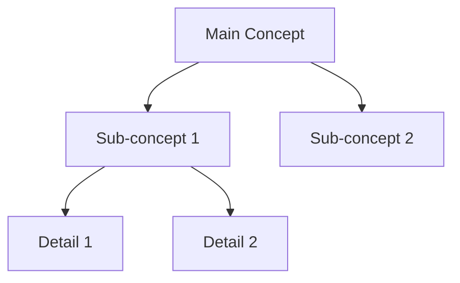
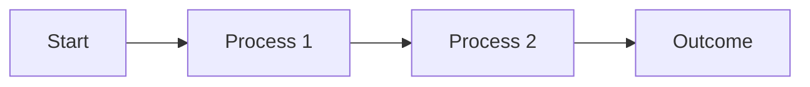
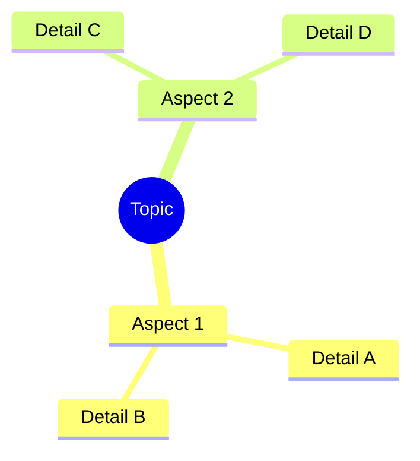

# Notes Generator (Bloom's Taxonomy)

## Purpose

This skill generates structured educational notes following Bloom's Taxonomy cognitive framework. It produces comprehensive learning materials adaptively selecting appropriate taxonomy levels based on topic complexity, incorporating summaries, practice questions, visual concept maps, and references.

## Bloom's Taxonomy Framework

The skill structures notes across relevant cognitive levels:

1. **Remember**: Recall facts, terms, basic concepts
2. **Understand**: Explain ideas, interpret information
3. **Apply**: Use knowledge in concrete situations
4. **Analyze**: Break down information, identify relationships
5. **Evaluate**: Make judgments, critique, assess value
6. **Create**: Synthesize information, produce original work

## Instructions

### Phase 1: Input Acquisition and Analysis

**Step 1.1: Determine Input Source**

If user provides a reference file:
1. Use Read tool to access the file
2. Extract topic, key concepts, and source material
3. Proceed to Phase 2 with extracted content

If user provides only a topic title:
1. Confirm topic scope with user if ambiguous
2. Use WebSearch to gather authoritative information:
   ```
   Query pattern: "[topic] tutorial", "[topic] fundamentals", "[topic] comprehensive guide"
   ```
3. Use WebFetch to retrieve 2-3 high-quality sources (educational sites, documentation, academic resources)
4. Synthesize gathered information
5. Proceed to Phase 2 with researched content

**Step 1.2: Topic Classification**

Analyze topic to determine appropriate Bloom levels:
- **Factual topics** (history, terminology): Emphasize Remember, Understand
- **Procedural topics** (programming, methods): Emphasize Understand, Apply, Analyze
- **Conceptual topics** (theories, frameworks): Emphasize Understand, Analyze, Evaluate
- **Creative topics** (design, composition): Include all levels, emphasize Create
- **Complex topics** (systems, architectures): Focus on Analyze, Evaluate, Create

Select 4-6 most relevant taxonomy levels for the specific topic.

### Phase 2: Content Structure Generation

**Step 2.1: Executive Summary Creation**

Generate concise overview (3-5 sentences):
- Topic definition and scope
- Primary learning objectives
- Key concepts covered
- Practical applications or relevance

**Step 2.2: Bloom's Taxonomy Level Development**

For each selected taxonomy level, generate 5-7 structured points:

**Remember Level** (if applicable):
- Key terminology with definitions
- Essential facts and figures
- Fundamental principles
- Memorization aids (mnemonics, acronyms)
- Core components or elements

**Understand Level**:
- Conceptual explanations in accessible language
- Comparisons and contrasts
- Cause-effect relationships
- Interpretations of key ideas
- Paraphrased core concepts
- Examples illustrating principles

**Apply Level**:
- Practical use cases
- Step-by-step procedures
- Implementation examples
- Real-world applications
- Scenario-based demonstrations
- Problem-solving approaches

**Analyze Level**:
- Component breakdown and decomposition
- Relationship mapping between elements
- Pattern identification
- Comparative analysis
- Structural examination
- Critical distinctions

**Evaluate Level**:
- Criteria for assessment
- Strengths and limitations
- Critical appraisal
- Comparative evaluation of approaches
- Quality metrics
- Evidence-based judgments

**Create Level**:
- Synthesis opportunities
- Original application ideas
- Design principles
- Innovation possibilities
- Integration with other concepts
- Generative thinking prompts

**Step 2.3: Visual Diagram Generation**

Create Mermaid diagram representing concept relationships:

For hierarchical topics:


For process-oriented topics:


For relational topics:


Select diagram type matching topic structure (hierarchy, process, relationship, classification).

**Step 2.4: Practice Questions Generation**

Create 5-8 questions aligned with Bloom levels:

- **Knowledge Check** (Remember): "Define...", "List...", "Identify..."
- **Comprehension** (Understand): "Explain...", "Summarize...", "Describe..."
- **Application** (Apply): "How would you use...", "Demonstrate...", "Apply X to..."
- **Analysis** (Analyze): "Compare...", "Analyze why...", "What is the relationship..."
- **Synthesis** (Evaluate): "Assess...", "Critique...", "Which approach is better..."
- **Evaluation** (Create): "Design...", "Propose...", "Create a solution for..."

Distribute questions across selected taxonomy levels.

**Step 2.5: References and Further Reading**

Include:
- Source citations (if using WebSearch results)
- Recommended readings (textbooks, articles, documentation)
- Online resources (courses, tutorials, interactive tools)
- Related topics for deeper exploration

### Phase 3: Note Compilation and Formatting

**Step 3.1: Assemble Complete Document**

Structure notes in markdown format following this template:

```markdown
# [Topic Title]

## Summary

[Executive summary paragraph]

**Learning Objectives:**
- [Objective 1]
- [Objective 2]
- [Objective 3]

---

## Notes by Bloom's Taxonomy

### 1. Remember: Foundational Knowledge

[5-7 structured points with definitions, facts, key terms]

### 2. Understand: Conceptual Comprehension

[5-7 structured points with explanations, examples, interpretations]

### 3. Apply: Practical Application

[5-7 structured points with use cases, procedures, implementations]

### 4. Analyze: Critical Examination

[5-7 structured points with breakdowns, relationships, patterns]

### 5. Evaluate: Assessment and Judgment

[5-7 structured points with criteria, critiques, evaluations]

### 6. Create: Synthesis and Innovation

[5-7 structured points with synthesis, design, generative ideas]

---

## Visual Concept Map

[Mermaid diagram]

---

## Practice Questions

### Knowledge & Comprehension
1. [Question]
2. [Question]

### Application & Analysis
3. [Question]
4. [Question]

### Evaluation & Creation
5. [Question]
6. [Question]

---

## References and Further Reading

### Primary Sources
- [Citation 1]
- [Citation 2]

### Recommended Resources
- [Resource 1 with URL if applicable]
- [Resource 2 with URL if applicable]

### Related Topics
- [Topic 1]
- [Topic 2]
```

**Step 3.2: Quality Validation**

Verify generated notes meet standards:
- [ ] Summary clearly defines topic and objectives
- [ ] 4-6 Bloom levels selected appropriately for topic
- [ ] Each level contains 5-7 substantive points
- [ ] Visual diagram accurately represents concept relationships
- [ ] 5-8 practice questions distributed across taxonomy levels
- [ ] References include sources and further reading
- [ ] Markdown formatting correct and consistent
- [ ] Content factually accurate and pedagogically sound

### Phase 4: Output Delivery

**Step 4.1: File Creation**

Use Write tool to create notes file:
- Default filename: `[topic-name]-notes.md` (kebab-case format)
- Location: Current working directory or user-specified path
- Encoding: UTF-8 with proper markdown formatting

**Step 4.2: Confirmation Report**

Provide user with completion summary:
```
Notes generated successfully: [filename]

**Topic**: [Topic name]
**Bloom Levels Included**: [List of levels used]
**Total Sections**: [Count]
**Practice Questions**: [Count]
**Word Count**: [Approximate count]

**File Location**: [Full path]

The notes are structured using Bloom's Taxonomy methodology and include:
✓ Executive summary with learning objectives
✓ [X] Bloom's Taxonomy levels with 5-7 points each
✓ Visual concept map (Mermaid diagram)
✓ [X] practice questions for self-assessment
✓ References and further reading recommendations
```

## Adaptive Behavior Patterns

### Topic-Specific Adaptations

**Scientific/Technical Topics**:
- Emphasize Apply and Analyze levels
- Include formulas, equations, technical diagrams
- Focus practice questions on problem-solving
- Reference primary literature and documentation

**Humanities/Social Sciences**:
- Emphasize Understand, Analyze, Evaluate
- Include theoretical frameworks and perspectives
- Focus on interpretive and critical thinking
- Reference seminal works and contemporary scholarship

**Practical Skills/Procedures**:
- Emphasize Apply level with detailed procedures
- Include step-by-step instructions
- Use flowchart diagrams
- Reference tutorials and hands-on resources

**Conceptual/Theoretical Topics**:
- Balance across all six levels
- Include multiple perspectives and interpretations
- Use mind-map or concept-map diagrams
- Reference foundational and contemporary sources

### Content Depth Adjustment

**Simple/Introductory Topics**:
- Focus on Remember, Understand, Apply
- 5 points per level (lower end of moderate range)
- Straightforward practice questions
- Beginner-friendly resources

**Complex/Advanced Topics**:
- Include all relevant levels
- 7 points per level (upper end of moderate range)
- Challenging, multi-step practice questions
- Advanced and specialized resources

## Error Handling and Edge Cases

### Insufficient Source Material

If reference file is too brief or web research yields limited information:
1. Inform user of content limitations
2. Generate notes based on available information
3. Mark sections requiring additional research: `[Additional research needed]`
4. Suggest specific areas for user to provide more information

### Ambiguous Topics

If topic title is ambiguous (e.g., "Java" could mean programming language or island):
1. Use AskUserQuestion tool to clarify:
   - "Which aspect of [topic] should the notes cover?"
   - Present 2-4 most likely interpretations
2. Await user clarification
3. Proceed with specified interpretation

### Highly Specialized Topics

If topic requires domain expertise beyond general knowledge:
1. Clearly label notes as "Introductory Overview"
2. Focus on foundational concepts
3. Emphasize References section with authoritative sources
4. Recommend consulting domain experts or specialized texts

### File Write Errors

If Write tool encounters errors (permissions, disk space):
1. Report specific error to user
2. Offer to display notes content directly in conversation
3. Suggest alternative file locations or names

## Examples

### Example 1: Topic Title Only

**User Request**: "Generate notes on neural networks"

**Skill Actions**:
1. Classify as scientific/technical topic
2. WebSearch: "neural networks tutorial", "neural networks fundamentals"
3. WebFetch: Retrieve content from educational sites
4. Select Bloom levels: Understand, Apply, Analyze, Evaluate
5. Generate moderate-depth notes (5-7 points per level)
6. Create flowchart diagram showing neural network architecture
7. Generate practice questions on architecture, training, applications
8. Include references to deep learning resources
9. Write to `neural-networks-notes.md`

### Example 2: Reference File Provided

**User Request**: "Create notes from this document" [provides research-paper.pdf]

**Skill Actions**:
1. Read provided file
2. Extract topic: "Transformer Architecture in NLP"
3. Classify as technical/conceptual topic
4. Select Bloom levels: Understand, Analyze, Evaluate, Create
5. Generate notes based on paper content
6. Create architecture diagram showing transformer components
7. Generate questions on attention mechanisms, applications
8. Include paper as primary reference, add related readings
9. Write to `transformer-architecture-notes.md`

### Example 3: Highly Specific Request

**User Request**: "Generate introductory notes on Bloom's Taxonomy itself, include all six levels"

**Skill Actions**:
1. Recognize meta-topic (educational framework)
2. WebSearch for authoritative educational psychology sources
3. Include all six Bloom levels (user-specified)
4. Create hierarchical diagram showing taxonomy pyramid
5. Generate questions demonstrating each cognitive level
6. Include references to original Bloom (1956) and revised Anderson & Krathwohl (2001)
7. Write to `blooms-taxonomy-notes.md`

## Quality Standards

All generated notes shall adhere to:

1. **Pedagogical Soundness**: Content structured for effective learning
2. **Factual Accuracy**: Information verified against authoritative sources
3. **Appropriate Depth**: Moderate detail (5-7 points) suitable for study notes
4. **Adaptive Structure**: Bloom levels selected match topic characteristics
5. **Visual Clarity**: Diagrams enhance understanding of relationships
6. **Assessment Alignment**: Practice questions target specified cognitive levels
7. **Resource Quality**: References direct to credible, relevant sources
8. **Markdown Compliance**: Proper formatting for readability and compatibility

## Advanced Usage

For specialized note generation patterns, see [reference.md](reference.md):
- Custom Bloom level selection
- Integration with spaced repetition systems
- Collaborative note merging
- Multi-source synthesis strategies
- Domain-specific templates

For comprehensive examples across disciplines, see [examples.md](examples.md).
