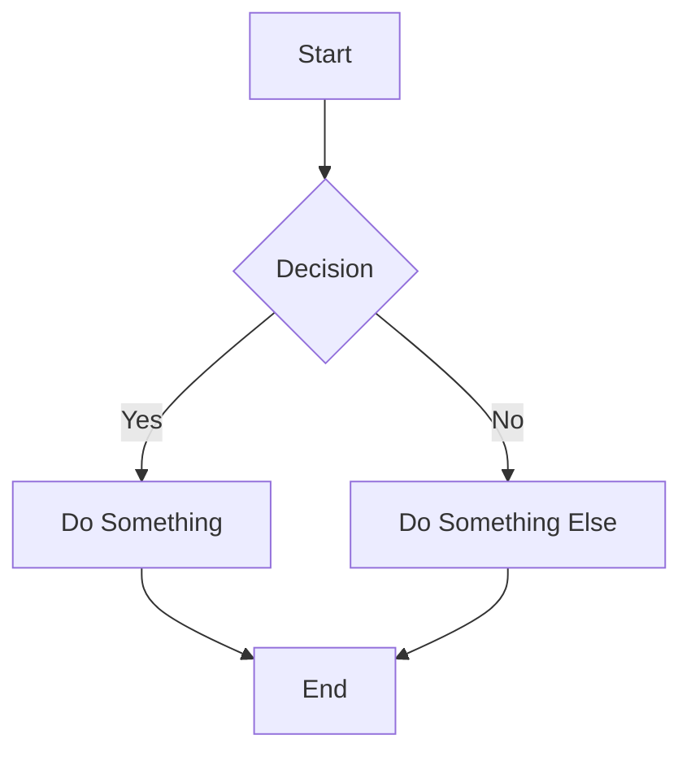
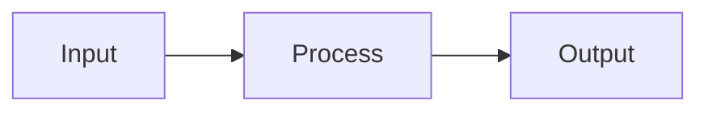

# Obsidian Flavored Markdown

This skill enables Claude Code to create and edit valid Obsidian Flavored Markdown including wikilinks, embeds, callouts, properties, and all related syntax.

## When to Use This Skill

- Working with .md files in an Obsidian vault
- Creating notes with wikilinks or internal links
- Adding embeds for notes, images, audio, or PDFs
- Using callouts (info boxes, warnings, tips, etc.)
- Managing frontmatter/properties in YAML format
- Working with tags and nested tags
- Creating block references and block IDs

## Basic Formatting

### Paragraphs and Line Breaks

Paragraphs are separated by blank lines. Single line breaks within a paragraph are ignored unless you use:
- Two spaces at the end of a line
- Or use `<br>` for explicit breaks

### Headings

```markdown
# Heading 1
## Heading 2
### Heading 3
#### Heading 4
##### Heading 5
###### Heading 6
```

### Text Styling

```markdown
**Bold text**
*Italic text*
***Bold and italic***
~~Strikethrough~~
==Highlighted text==
```

## Internal Links (Wikilinks)

### Basic Wikilinks

```markdown
[[Note Name]]
[[Note Name|Display Text]]
[[Folder/Note Name]]
```

### Heading Links

```markdown
[[Note Name#Heading]]
[[Note Name#Heading|Display Text]]
[[#Heading in Current Note]]
```

### Block References

```markdown
[[Note Name#^block-id]]
[[Note Name#^block-id|Display Text]]
[[#^block-id]]
```

### Creating Block IDs

Add a block ID at the end of any paragraph or list item:

```markdown
This is a paragraph you can reference. ^my-block-id

- List item with ID ^list-block
```

## Embeds

### Embedding Notes

```markdown
![[Note Name]]
![[Note Name#Heading]]
![[Note Name#^block-id]]
```

### Embedding Images

```markdown
![[image.png]]
![[image.png|400]]
![[image.png|400x300]]
```

### Embedding Audio

```markdown
![[audio.mp3]]
```

### Embedding PDFs

```markdown
![[document.pdf]]
![[document.pdf#page=5]]
![[document.pdf#height=400]]
```

### Embedding Videos

```markdown
![[video.mp4]]
```

## Callouts

### Basic Callout Syntax

```markdown
> [!note]
> This is a note callout.

> [!warning]
> This is a warning callout.

> [!tip] Custom Title
> This callout has a custom title.
```

### Callout Types

| Type | Aliases | Description |
|------|---------|-------------|
| `note` | | Default blue info box |
| `abstract` | `summary`, `tldr` | Abstract/summary |
| `info` | | Information |
| `todo` | | Task/todo item |
| `tip` | `hint`, `important` | Helpful tip |
| `success` | `check`, `done` | Success message |
| `question` | `help`, `faq` | Question/FAQ |
| `warning` | `caution`, `attention` | Warning message |
| `failure` | `fail`, `missing` | Failure message |
| `danger` | `error` | Error/danger |
| `bug` | | Bug report |
| `example` | | Example content |
| `quote` | `cite` | Quotation |

### Foldable Callouts

```markdown
> [!note]+ Expanded by default
> Content visible initially.

> [!note]- Collapsed by default
> Content hidden initially.
```

### Nested Callouts

```markdown
> [!question] Can callouts be nested?
> > [!answer] Yes!
> > Callouts can be nested inside each other.
```

## Lists

### Unordered Lists

```markdown
- Item 1
- Item 2
  - Nested item
  - Another nested item
- Item 3
```

### Ordered Lists

```markdown
1. First item
2. Second item
   1. Nested numbered item
3. Third item
```

### Task Lists

```markdown
- [ ] Uncompleted task
- [x] Completed task
- [ ] Another task
```

## Code Blocks

### Inline Code

```markdown
Use `inline code` for short snippets.
```

### Fenced Code Blocks

````markdown
```javascript
function hello() {
  console.log("Hello, world!");
}
```
````

### Supported Languages

Obsidian supports syntax highlighting for many languages including:
`javascript`, `typescript`, `python`, `rust`, `go`, `java`, `c`, `cpp`, `csharp`, `ruby`, `php`, `html`, `css`, `json`, `yaml`, `markdown`, `bash`, `sql`, and many more.

## Tables

```markdown
| Header 1 | Header 2 | Header 3 |
|----------|:--------:|---------:|
| Left     | Center   | Right    |
| aligned  | aligned  | aligned  |
```

## Math (LaTeX)

### Inline Math

```markdown
The equation $E = mc^2$ is famous.
```

### Block Math

```markdown
$$
\frac{-b \pm \sqrt{b^2 - 4ac}}{2a}
$$
```

## Diagrams (Mermaid)

````markdown

````

## Footnotes

```markdown
This is a sentence with a footnote.[^1]

[^1]: This is the footnote content.
```

## Comments

```markdown
%%
This is a comment that won't be rendered.
%%

Inline %%comment%% within text.
```

## Properties (Frontmatter)

### Basic Properties

```yaml
---
title: My Note Title
date: 2024-01-15
tags:
  - tag1
  - tag2
author: John Doe
---
```

### Property Types

| Type | Example |
|------|---------|
| Text | `title: My Title` |
| Number | `rating: 5` |
| Checkbox | `completed: true` |
| Date | `date: 2024-01-15` |
| Date & time | `created: 2024-01-15T10:30:00` |
| List | `tags: [a, b, c]` or multiline |
| Link | `related: "[[Other Note]]"` |

### Multi-value Properties

```yaml
---
tags:
  - project
  - work
  - important
aliases:
  - My Alias
  - Another Name
cssclasses:
  - wide-page
  - cards
---
```

## Tags

### Inline Tags

```markdown
This note is about #productivity and #tools.
```

### Nested Tags

```markdown
#project/work
#status/in-progress
#priority/high
```

### Tags in Frontmatter

```yaml
---
tags:
  - project
  - project/work
  - status/active
---
```

## HTML Support

Obsidian supports a subset of HTML:

```markdown
<div class="my-class">
  Custom HTML content
</div>

<details>
<summary>Click to expand</summary>
Hidden content here
</details>

<kbd>Ctrl</kbd> + <kbd>C</kbd>
```

## Complete Example

```markdown
---
title: Project Alpha Overview
date: 2024-01-15
tags:
  - project
  - documentation
status: active
---

# Project Alpha Overview

## Summary

This document outlines the key aspects of **Project Alpha**. For related materials, see [[Project Alpha/Resources]] and [[Team Members]].

> [!info] Quick Facts
> - Start Date: January 2024
> - Team Size: 5 members
> - Status: Active

## Key Features

1. [[Feature A]] - Core functionality
2. [[Feature B]] - User interface
3. [[Feature C]] - API integration

### Feature A Details

The main equation governing our approach is $f(x) = ax^2 + bx + c$.

![[feature-a-diagram.png|500]]

> [!tip] Implementation Note
> See [[Technical Specs#^impl-note]] for implementation details.

## Tasks

- [x] Initial planning ^planning-task
- [ ] Development phase
- [ ] Testing phase
- [ ] Deployment

## Code Example

```python
def process_data(input):
    return transform(input)
```

## Architecture



## Notes

This approach was inspired by ==recent research==[^1].

[^1]: Smith, J. (2024). Modern Approaches to Data Processing.

%%
TODO: Add more examples
Review with team next week
%%

#project/alpha #documentation
```

## References

- [Obsidian Formatting Syntax](https://help.obsidian.md/Editing+and+formatting/Basic+formatting+syntax)
- [Advanced Formatting](https://help.obsidian.md/Editing+and+formatting/Advanced+formatting+syntax)
- [Internal Links](https://help.obsidian.md/Linking+notes+and+files/Internal+links)
- [Embedding Files](https://help.obsidian.md/Linking+notes+and+files/Embed+files)
- [Callouts](https://help.obsidian.md/Editing+and+formatting/Callouts)
- [Properties](https://help.obsidian.md/Editing+and+formatting/Properties)
