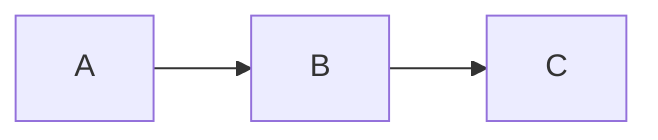

# Obsidian Spec Wiki

Create and manage behavior specification wikis as Obsidian-compatible markdown. Specs capture what the system does (not how to build it) so code can be rebuilt from specs alone.

## When to Use

- Creating new project specs or documentation
- Working with existing wikis using `%% [ ] %%` task format
- User mentions "wiki", "spec", "workstream", or "Obsidian"
- Need to document behavior for agent-driven code updates

## Wiki Discovery

Check for existing wiki in order:
1. `docs/` - Primary location
2. `docs/wiki/` - Nested variant
3. `wiki/` - Root alternative
4. `.plans/*/` - Legacy support

First match wins. **Always use `docs/` for new wikis.**

## Directory Structure

```
docs/
├── README.md              # Index with workstream table
├── CLAUDE.md              # Global agent rules
├── changelog.md           # Keep a Changelog format
├── workstreams/
│   └── NN-name/
│       ├── README.md      # Executive summary + spec table
│       ├── CLAUDE.md      # Optional: workstream-specific rules
│       └── N.N-spec.md    # Behavior specs
├── reference/             # Shared architecture docs
└── research/              # Oracle outputs (frozen)
```

**Key concepts:**
- **Workstreams** = logical functional areas (not temporal phases)
- **Specs** = behavior documents (what the system does)
- **Research** = Oracle/Delphi outputs (frozen snapshots)

## Core Principles

### 1. Progressive Disclosure

Load only what's needed:

```
User asks about auth → Read workstreams/01-auth/README.md
User asks about login → Read workstreams/01-auth/1.1-login.md
User asks for overview → Read README.md only
```

Never load the entire wiki into context at once.

### 2. Wiki Links Everywhere

All references use `[[wiki-links]]`. Broken links = sync signal.

```markdown
[[workstreams/01-auth/1.1-login|Login Flow]]
[[reference/architecture#auth-middleware|Auth Middleware]]
```

### 3. Task Tracking with Obsidian Comments

Track open questions using hidden comments:

```markdown
%% [ ] open question or task %%
%% [x] completed → see [[research/result]] %%
```

Find all open tasks:
```bash
grep -r '%% \[ \]' docs/
```

### 4. Changelog Protocol

Log every change in `changelog.md`:

```markdown
## YYYY-MM-DD

### Added
- [[path/to/file]] - Description

### Changed
- [[path/to/file]] - What changed and why
```

## Templates

### Spec File Template

```markdown
# N.N Spec Name

> **Workstream:** [[../README|NN-Workstream-Name]]

## Behavior

### Contract
- **Input:** description
- **Output:** description
- **Preconditions:** what must be true before
- **Postconditions:** what will be true after

### Scenarios
- When X happens → Y should occur
- When edge case → handle gracefully

## Decisions

### Assumptions
1. [Assumption] - [implication if wrong]
2. [Assumption] - [implication if wrong]

### Failure Modes
| Failure | Detection | Recovery |
|---------|-----------|----------|
| [scenario] | [how to detect] | [what to do] |

### ADR-1: Decision Title
- **Status:** Proposed | Accepted | Deprecated | Superseded
- **Context:** Why this decision was needed
- **Decision:** What we decided
- **Consequences:** What happens as a result
- **Alternatives:** What we considered and rejected

### Open Questions
%% [ ] Question needing resolution %%

## Integration

### Dependencies
- [[path/to/spec|Display Name]] - what we need from it

### Consumers
- [[path/to/spec|Display Name]] - what uses us

### Diagram

```

### Workstream README Template

```markdown
# NN Workstream Name

> Brief description of what this workstream covers.

## Goal
What this workstream achieves.

## Specs

| Spec | Description | Status |
|------|-------------|--------|
| [[N.1-spec-name]] | Brief description | Status |
| [[N.2-spec-name]] | Brief description | Status |

## Shared Decisions

ADRs that apply to all specs in this workstream:
- **Decision:** Brief summary

## Integration Points

This workstream connects to:
- [[../other-workstream/README|Other Workstream]] - how
```

### CLAUDE.md Template

The project CLAUDE.md should include wiki operations guidance:

```markdown
# Rules for Claude: [Project Name]

[Project-specific rules here...]

---

## Wiki Operations

This documentation lives in an Obsidian vault. Follow these patterns.

### Progressive Disclosure

**Don't load everything.** Navigate in layers:

1. **Start at workstream README** - `workstreams/##-name/README.md`
   - Understand scope and current status
   - See which specs exist

2. **Read specific specs as needed** - `workstreams/##-name/#.#-spec.md`
   - Load only the spec you're implementing
   - Check "Integration" section for related specs

3. **Dive into reference docs for deep context** - `reference/` or `workstreams/##-name/reference/`

4. **Check research for background** - `research/topic/`

### Updating Specs

**Before:** Read Assumptions and Failure Modes
**During:** Mark open questions resolved, note discoveries
**After:** Update Success Criteria checkboxes, update README status

### Link Format

| Target | Format |
|--------|--------|
| Same directory | `[text](filename.md)` |
| Parent | `[text](../README.md)` |
| Cross-workstream | `[text](../06-name/README.md)` |
```

### Root README Template

```markdown
# Project Wiki

> **For Claude:** Start here. Read workstream READMEs for context, then specific specs as needed.

## Workstreams

| # | Workstream | Description |
|---|------------|-------------|
| 01 | [[workstreams/01-name/README\|Name]] | Description |

## Quick Links

- [[CLAUDE]] - Rules for agents
- [[changelog]] - What changed and when
- [[reference/architecture]] - System overview

## Research

Oracle/Delphi outputs (frozen snapshots):
- [[research/topic]] - Description
```

## Workflow Patterns

### Creating a New Wiki

1. Create `docs/` directory structure
2. Write README.md with workstream table
3. Create CLAUDE.md with project-specific rules
4. Initialize changelog.md
5. Create workstream folders with README.md
6. Add specs as needed

### Adding a Spec

1. Create `N.N-spec-name.md` in workstream folder
2. Fill in Behavior (contract + scenarios)
3. Document Decisions (ADRs)
4. Map Integration (dependencies + consumers with wiki links)
5. Update workstream README table
6. Add to changelog

### Research Workflow

When a `%% [ ] %%` needs research:

**Simple question:** Launch oracle agent
**Complex/uncertain:** Use Delphi (3 parallel oracles + synthesis)

Store results in `research/`, link from spec:
```markdown
%% [x] question → see [[research/topic]] %%
```

### Pointing an Agent at a Spec

To update code based on a spec:
1. Agent reads the spec's Behavior section (contract + scenarios)
2. Agent reads the Integration section (what it touches)
3. Agent implements/updates code to match spec
4. Agent updates spec status if needed

### Updating Specs During Implementation

**Before starting:** Read the spec's Assumptions and Failure Modes.

**During implementation:**
- Add implementation notes to the spec
- Mark open questions as resolved: `%% [x] Decided → [outcome] %%`
- Note any discovered failure modes

**After completing:**
- Update Success Criteria checkboxes
- Add commit hash if significant
- Update workstream README status if needed

## Link Format

Use relative markdown links (Obsidian-compatible):

| Target | Link Format |
|--------|-------------|
| Same directory | `[text](filename.md)` |
| Parent directory | `[text](../README.md)` |
| Subdirectory | `[text](reference/file.md)` |
| Cross-workstream | `[text](../06-context-menu/README.md)` |
| Heading anchor | `[text](file.md#section-name)` |

## When to Create New Documentation

| Situation | Action |
|-----------|--------|
| New feature area | Create new workstream directory |
| New task within workstream | Create numbered spec file |
| Deep technical topic | Add to `reference/` subdirectory |
| Research question | Use Oracle, save to `research/` |
| Workstream-specific rules | Create `CLAUDE.md` in workstream |

## Best Practices

1. **Specs describe behavior, not implementation** - What it does, not how
2. **All references are wiki links** - Broken links signal sync issues
3. **Update changelog immediately** - Don't batch changes
4. **One spec per feature/component** - Keep focused
5. **Research before deciding** - Use oracles for uncertain questions
6. **Optional CLAUDE.md per workstream** - For scoped agent rules
