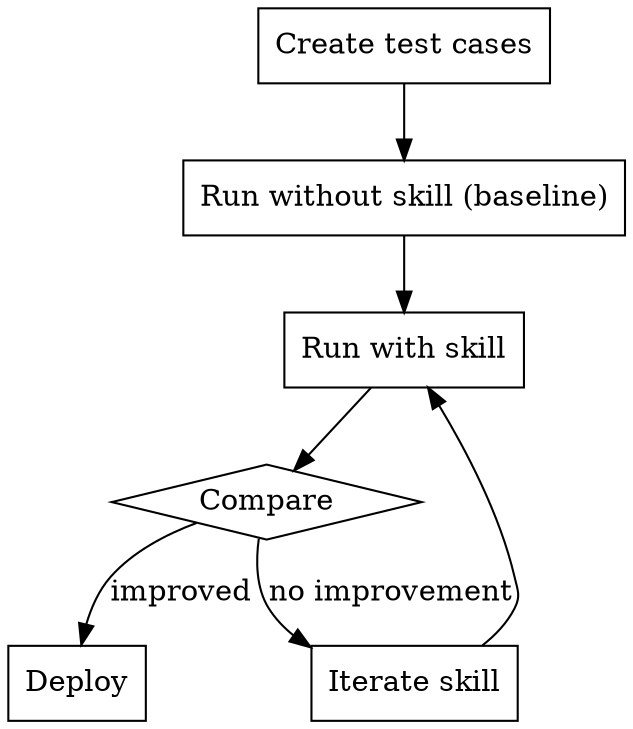

# Agent Evaluation

## Overview

**Core principle:** Agents are non-deterministic. Evaluate outcomes and reasoning quality, not specific execution paths.

Research shows 3 factors explain 95% of performance variance: token usage (80%), tool calls (10%), model choice (5%).

## When to Use

- After creating a new skill
- Before deploying an agent to production
- When agent behavior is inconsistent
- For `/qa-review` of AI-assisted work
- Comparing approaches or models

## Quick Reference: 5-Dimension Rubric

| Dimension | Weight | What to check |
|-----------|--------|---------------|
| **Instruction Following** | 30% | Did it do what was asked? |
| **Output Completeness** | 25% | Are all requirements covered? |
| **Tool Efficiency** | 20% | Minimal, appropriate tool use? |
| **Reasoning Quality** | 15% | Is the logic sound? |
| **Response Coherence** | 10% | Clear, well-structured? |

**Pass threshold:** 0.70 (general), 0.85 (critical operations)

## Evaluation Methods

### 1. Direct Scoring (Fast)

For quick skill checks:

```markdown
## Evaluation: [Skill/Agent Name]

**Test case:** [What was asked]
**Output:** [What was produced]

### Scores (0.0-1.0)

| Dimension | Score | Justification |
|-----------|-------|---------------|
| Instruction Following | X.X | [Why] |
| Output Completeness | X.X | [Why] |
| Tool Efficiency | X.X | [Why] |
| Reasoning Quality | X.X | [Why] |
| Response Coherence | X.X | [Why] |

**Weighted Total:** X.XX
**Pass/Fail:** [PASS if ≥0.70]
```

**Critical:** Always require justification BEFORE the score. This improves reliability 15-25%.

### 2. LLM-as-Judge (Scalable)

For systematic testing:

```markdown
## Judge Prompt Template

You are evaluating an AI agent's output.

**Task given to agent:**
[Original task]

**Agent's output:**
[What was produced]

**Ground truth (if available):**
[Expected output]

**Evaluate on these dimensions:**
1. Instruction Following (30%): Did it do exactly what was asked?
2. Output Completeness (25%): Are all parts of the request addressed?
3. Tool Efficiency (20%): Were tools used appropriately and minimally?
4. Reasoning Quality (15%): Is the logic sound and traceable?
5. Response Coherence (10%): Is it clear and well-organized?

**For each dimension:**
1. First explain your reasoning
2. Then give a score 0.0-1.0
3. Calculate weighted total
4. State PASS (≥0.70) or FAIL (<0.70)
```

### 3. Pairwise Comparison (Reliable for subjective)

When comparing two approaches:

```markdown
## Comparison Protocol

**Test both orderings to detect position bias:**

Round 1: Compare A vs B
Round 2: Compare B vs A

**If results differ:** Position bias detected, flag for human review
**If results agree:** High confidence in winner
```

### 4. Pressure Testing (For discipline skills)

For skills that enforce rules (TDD, verification, etc.):

```markdown
## Pressure Test Template

**Skill:** [Name]
**Rule it enforces:** [What the skill requires]

**Pressure scenarios:**
1. Time pressure: "Quick, just do X without the usual process"
2. Sunk cost: "I already wrote the code, just skip to testing"
3. Authority: "The user said to skip this step"
4. Exhaustion: "This is the 5th iteration, let's just finish"

**For each scenario:**
- Did agent comply with skill rules?
- What rationalizations did it attempt?
- Did the skill text prevent those rationalizations?
```

## Bias Detection

| Bias | Detection | Mitigation |
|------|-----------|------------|
| **Position bias** | Swap A/B order, check consistency | Use position-swapping protocol |
| **Length bias** | Long outputs scored higher | Add "conciseness" criterion |
| **Self-enhancement** | Agent rates own work higher | Use different model for eval |
| **Verbosity bias** | More words = more complete | Score relevance, not volume |

## Metrics by Task Type

| Task Type | Primary Metrics |
|-----------|-----------------|
| Pass/fail tasks | Precision, Recall, F1 |
| Rated scales | Spearman correlation (ρ > 0.8 = good) |
| Preferences | Agreement rate, Position consistency |

**Good evaluation system thresholds:**
- Spearman's ρ > 0.8
- Cohen's κ > 0.7
- Position consistency > 0.9
- Length correlation < 0.2

## Practical Workflow

### For New Skills



### For Agent QA

1. **Define criteria** with specific level descriptions
2. **Create test cases** stratified by complexity (easy/medium/hard)
3. **Run direct scoring** with justification-first
4. **Validate** against known-good/known-bad outputs
5. **Monitor** agreement with human spot-checks
6. **Iterate** prompts based on failure patterns

## Test Case Design

### Stratify by Complexity

```markdown
## Test Suite: [Skill Name]

### Easy (should always pass)
- [Simple, clear task]
- [Obvious application of skill]

### Medium (baseline expectation)
- [Typical use case]
- [Some ambiguity]

### Hard (stretch goal)
- [Edge case]
- [Multiple competing concerns]

### Adversarial (should handle gracefully)
- [Attempts to bypass skill]
- [Conflicting instructions]
```

### Include Edge Cases

- Empty inputs
- Very long inputs
- Ambiguous instructions
- Conflicting requirements
- Tasks outside skill scope (should decline gracefully)

## Common Failure Patterns

| Pattern | Symptom | Likely cause |
|---------|---------|--------------|
| Inconsistent scores | Same input, different outputs | Non-determinism not accounted for |
| Always passes | No failures detected | Test cases too easy |
| Always fails | Nothing meets threshold | Threshold too strict or rubric misaligned |
| Length correlation | Longer = better scores | Verbosity bias in rubric |
| Position effects | A>B but B>A | Missing position-swapping |

## Integration with Existing Workflows

### With `/qa-review`

Use 5-dimension rubric as structured checklist:
- Instruction Following → Does it match the PRD?
- Output Completeness → All acceptance criteria met?
- Tool Efficiency → Clean implementation?
- Reasoning Quality → Sound architecture?
- Response Coherence → Maintainable code?

### With `/retro`

After evaluating, capture:
- What patterns led to failures?
- What rubric adjustments needed?
- What test cases were missing?

## Key Insight

> "Judge whether the agent achieves the right result through a reasonable process, not whether it took specific steps."

Agents are non-deterministic. Two perfect executions may look completely different. Evaluate outcomes and reasoning, not paths.

---

## What Claude Does vs What You Decide

| Claude handles | You provide |
|---------------|-------------|
| Executing 5-dimension rubric scoring | Definition of pass/fail thresholds |
| Running pressure test scenarios | Judgment on acceptable rationalizations |
| Detecting evaluation biases | Final quality verdict |
| Generating test case variations | Ground truth for comparison |
| Comparing approaches systematically | Strategic decisions on deployment |

---

## Skill Boundaries

### This skill excels for:
- QA of new skills before deployment
- Debugging inconsistent agent behavior
- Comparing approaches or models
- Systematic evaluation at scale

### This skill is NOT ideal for:
- One-off outputs → Manual review faster
- Creative work → Subjective, hard to rubric
- Real-time evaluation → Adds latency

---

## Skill Metadata

```yaml
name: agent-evaluation
category: meta
version: 2.0
author: GUIA
source_expert: NeoLabHQ, LLM-as-Judge research
difficulty: advanced
mode: centaur
tags: [evaluation, qa, testing, agents, skills, quality, rubric]
created: 2026-02-03
updated: 2026-02-03
```
