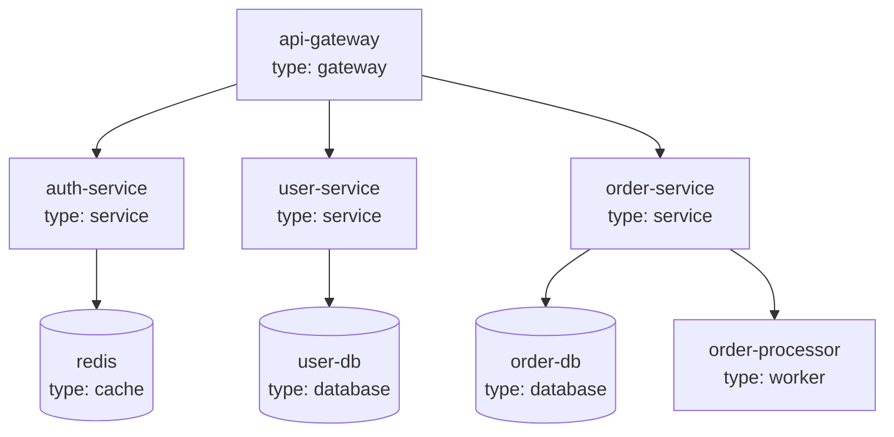
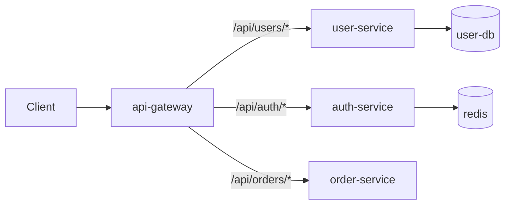
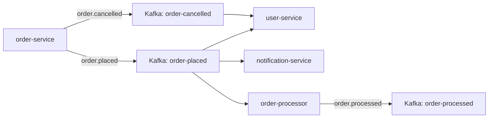

# Architecture View

Generate cross-repository architectural views by aggregating `catalog-info.yaml` metadata from all repositories using parallel subagents.

## Purpose

Create visual architectural representations (Mermaid diagrams, markdown tables) that show how services fit together, how requests flow through gateways, how events propagate, and how services group by domain/team.

## When to Use

Trigger this skill when:
- User asks to "show service dependency graph" or "map the architecture"
- User wants to understand "how services connect"
- User asks about "request flows" or "event topology"
- User wants to "group services by domain/team"
- User mentions "cross-repo architecture" or "system architecture"

## Workflow

### Phase 1: Discover Repositories

Find all repositories to analyze:

1. **Check `repos/` directory** - Local cloned repositories
2. **Optionally fetch from GitHub** - Use `gh repo list Astrabit-CPT` for full list
3. **Filter for active repos** - Skip archived or template repos

### Phase 2: Parallel Metadata Collection

Use subagents IN PARALLEL to read each repository's `catalog-info.yaml`:

```
For each repo:
  Launch subagent with: "Read catalog-info.yaml from [repo_path] and return the parsed content"
```

**Parallel processing strategy:**
- Launch 5-10 subagents simultaneously
- Collect all results
- Handle missing metadata gracefully (skip or note as missing)

### Phase 3: Aggregate and Build Model

Combine all metadata into a unified model:

```python
aggregated = {
    "components": {},  # name -> catalog info
    "dependencies": set(),  # (from, to) tuples
    "gateways": [],
    "services": [],
    "workers": [],
    "domains": {},  # domain -> [components]
    "events": {
        "producers": {},  # topic -> [producers]
        "consumers": {},  # topic -> [consumers]
    },
    "routes": [],  # gateway routes
}
```

### Phase 4: Generate Requested View

Based on user request, generate the appropriate view:

| View | Command/Trigger | Output |
|------|-----------------|--------|
| Service Dependency Graph | "dependency graph", "show dependencies" | Mermaid graph |
| Request Flow Maps | "request flows", "how requests flow" | Mermaid flowchart |
| Event Topology | "event topology", "event map" | Mermaid graph |
| Service Groupings | "group services", "services by domain" | Markdown tables |
| Full Architecture | "architecture view", "full architecture" | All views combined |

## View Templates

### Service Dependency Graph



**Generation logic:**
- Nodes: All components from `catalog-info.yaml`
- Edges: From `dependsOn` relationships
- Shape: Database nodes use `[(name)]`, others use `[name]`
- Labels: Include `name` and `type`

### Request Flow Map



**Generation logic:**
- Start from gateway components (type: gateway)
- Follow `routes` to find downstream services
- Include route paths as edge labels
- Follow service dependencies to databases

### Event Topology



**Generation logic:**
- Nodes: Services (from `eventProducers`) and Kafka topics (from `topic` field)
- Edges: Producer → Topic, Topic → Consumer
- Labels: Topic names on edges

### Service Groupings

**By Domain:**
| Domain | Services | Owner |
|--------|----------|-------|
| trading | order-service, trade-service, order-processor | trading-team |
| platform | api-gateway, user-service, auth-service | platform-team |
| shared | shared-utils, shared-types | platform-team |

**By Type:**
| Type | Services |
|------|----------|
| gateway | api-gateway |
| service | user-service, auth-service, order-service |
| worker | order-processor, notification-worker |
| library | shared-utils, shared-types |

**Generation logic:**
- Group by `spec.domain` field
- Show owner for each domain
- Count services per grouping

## Scripts

### aggregate-metadata.py

Collect all `catalog-info.yaml` files from repositories:

```bash
# Aggregate from repos directory
python skills/arch-view/scripts/aggregate-metadata.py repos/

# Output as JSON
python skills/arch-view/scripts/aggregate-metadata.py repos/ --format json

# Output as summary
python skills/arch-view/scripts/aggregate-metadata.py repos/ --summary
```

### generate-mermaid.py

Convert aggregated metadata to Mermaid diagrams:

```bash
# Generate all views
python skills/arch-view/scripts/generate-mermaid.py aggregated.json

# Generate specific view
python skills/arch-view/scripts/generate-mermaid.py aggregated.json --view dependency
python skills/arch-view/scripts/generate-mermaid.py aggregated.json --view request-flow
python skills/arch-view/scripts/generate-mermaid.py aggregated.json --view events
```

## Using Subagents

Launch subagents to read metadata in parallel:

```
For efficiency, launch multiple subagents simultaneously:

Subagent 1: "Read repos/api-gateway/catalog-info.yaml and return parsed YAML"
Subagent 2: "Read repos/user-service/catalog-info.yaml and return parsed YAML"
Subagent 3: "Read repos/order-service/catalog-info.yaml and return parsed YAML"
... (continue for all repos)

Collect results and aggregate.
```

**Tip:** Limit to 5-10 concurrent subagents to avoid overwhelming the system.

## Output Format

Present results as:

1. **Summary** - Quick overview of what was found
2. **Visual diagrams** - Mermaid graphs that render in supported viewers
3. **Tables** - Groupings and listings
4. **Missing metadata** - List of repos without catalog-info.yaml

### Example Output Structure

```markdown
# Architecture View

## Summary
- Total repositories: 15
- Components with metadata: 12
- Missing metadata: 3
- Gateways: 1
- Services: 8
- Workers: 2
- Libraries: 1

## Service Dependency Graph
[Mermaid diagram]

## Request Flow Map
[Mermaid diagram]

## Event Topology
[Mermaid diagram]

## Service Groupings
[Markdown tables]

## Missing Metadata
The following repositories lack catalog-info.yaml:
- repo-a
- repo-b
- repo-c
```

## Additional Resources

### Reference Files

- **`references/view-templates.md`** - Mermaid templates for each view type
- **`references/mermaid-guide.md`** - Mermaid syntax reference

### Scripts

- **`scripts/aggregate-metadata.py`** - Collect catalog-info.yaml from all repos
- **`scripts/generate-mermaid.py`** - Convert metadata to Mermaid diagrams
