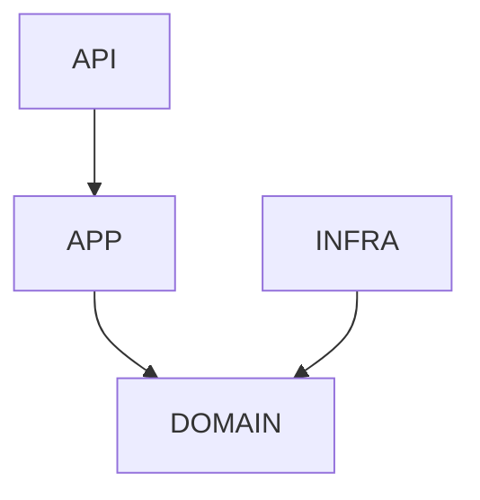
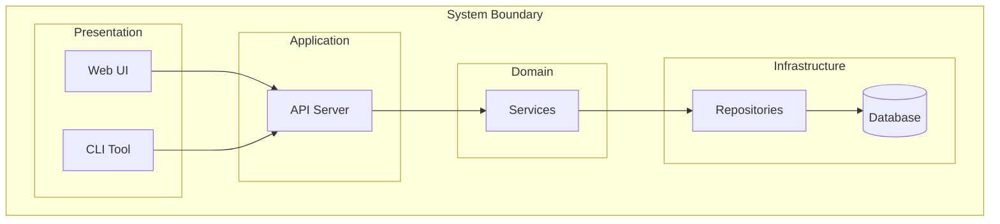
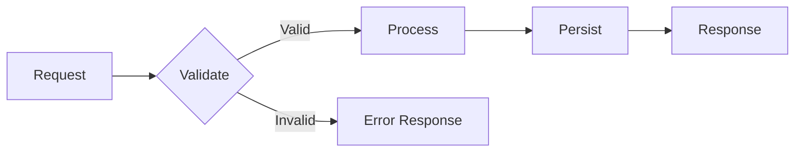
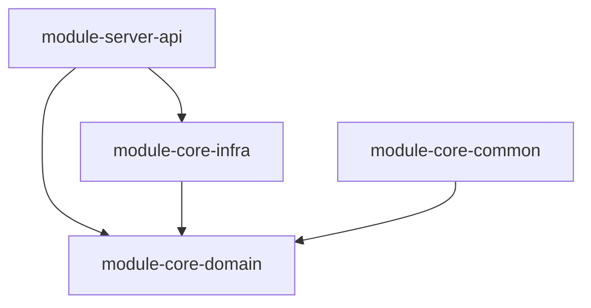

# Architecture

Architecture analysis with pattern validation and dependency checking.

## When to Use

- Architecture compliance verification
- Dependency graph analysis
- Pattern validation (Hexagonal, Clean, Layered)
- Circular dependency detection
- Module boundary evaluation
- Architecture documentation generation

## MCP Workflow

```
# 1. Project structure (high-level first)
serena.list_dir(relative_path=".", recursive=False)  # Top-level only
serena.list_dir(relative_path="src/", recursive=True, skip_ignored_files=True)

# 2. Module/layer overview (signatures only)
serena.get_symbols_overview(relative_path="src/domain/")
serena.get_symbols_overview(relative_path="src/application/")

# 3. Past architecture decisions
claude-mem.search(query="architecture decision", project="<project>")

# 4. Layer dependencies (TOKEN CRITICAL - Always limit!)
serena.search_for_pattern(
    substring_pattern="^import",
    relative_path="src/domain/",
    context_lines_after=0,
    max_answer_chars=3000
)

# 5. Framework patterns when needed
context7.get-library-docs("<framework>", topic="architecture")
```

## Efficiency Rules

**Do (Token-Efficient):**
- Start with `list_dir(recursive=False)` for top-level structure
- Use `get_symbols_overview` per layer, not entire project
- Search patterns with `relative_path` to limit scope
- Check memory before re-analyzing

**Avoid (Token-Wasteful):**
- Reading entire files to understand structure
- Recursive scans without limiting scope
- Re-analyzing architecture already documented

## Architecture Patterns

### Hexagonal (Ports & Adapters)
```
Primary Adapters   <- Controllers, CLI
        |
    Application    <- Use Cases
        |
      Domain       <- Entities, Ports
        ^
Secondary Adapters <- Repositories, APIs
```
**Rules:** Domain NEVER depends on adapters. Ports in domain, adapters implement.

### Layered
```
Presentation  -> Application -> Domain <- Infrastructure
```
**Rules:** Dependencies flow inward. Inner layers know nothing of outer.

## Layer Validation

```python
# Domain should NOT import Infrastructure (TOKEN CRITICAL - Always limit!)
serena.search_for_pattern(
    substring_pattern="import.*infra",
    relative_path="src/domain/",
    context_lines_after=0,
    max_answer_chars=3000
)

# Domain should NOT import Presentation
serena.search_for_pattern(
    substring_pattern="import.*controller",
    relative_path="src/domain/",
    context_lines_after=0,
    max_answer_chars=3000
)
```

## Output Format

```markdown
## Architecture: [Scope]

### Pattern: [Name]

| Layer | Status | Issues |
|-------|--------|--------|
| Domain | OK / VIOLATION | [details] |
| Application | OK / VIOLATION | [details] |
| Infrastructure | OK / VIOLATION | [details] |

### Violations
1. `file:line` - Domain imports Infrastructure
   - Impact: [description]
   - Fix: Create port interface

### Dependency Graph


### Recommendations
1. **[High]** Fix layer violation
2. **[Medium]** Improve cohesion
```

## Layer Rules

| Layer | Contains | Depends On |
|-------|----------|------------|
| Presentation | Controllers, Views | Application |
| Application | Use Cases | Domain |
| Domain | Entities, Ports | Nothing (pure) |
| Infrastructure | Repositories | Domain (implements ports) |

## Anti-Patterns to Detect

- **God class**: Class doing too much
- **Circular dependency**: A -> B -> A
- **Layer leaking**: Infrastructure in domain
- **Entity exposure**: Domain objects in API
- **Tight coupling**: No abstraction between components

## ADR Template

```markdown
# ADR-001: [Title]

## Status
Proposed / Accepted / Deprecated

## Context
What issue motivates this decision?

## Decision
What change are we making?

## Consequences
What becomes easier or harder?
```

## Architecture Diagram Templates

### Component Diagram (C4 Style)


### Data Flow Diagram


### Module Dependencies


## Documentation Workflow

When documenting architecture:
1. **Gather** - Use MCP workflow above
2. **Diagram** - Create Mermaid diagrams
3. **Describe** - Explain key decisions
4. **Validate** - Check against code
