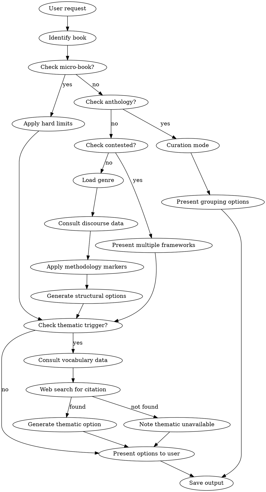

# Biblical Text Segmentation

## Overview

Help users divide biblical books into coherent textual units for teaching, study, or devotional reading. Present scholarly-grounded options while respecting textual integrity.

**Core commitment:** Never divide text in ways that violate literary structure. When a book cannot segment into the requested sessions, explain why and offer alternatives.

## The Iron Rules

**These rules are non-negotiable. User requests do not override them.**

### Rule 1: Micro-Book Limits

| Book | Max Sessions | Recommended | Action |
|------|-------------|-------------|--------|
| Philemon | 2 | 1 | Suggest pairing with Colossians |
| 2 John | 1 | 1 | Suggest pairing with 3 John |
| 3 John | 1 | 1 | Suggest pairing with 2 John |
| Jude | 2 | 1 | Suggest pairing with 2 Peter |
| Obadiah | 2 | 1 | Suggest pairing with Jonah/Nahum |

**If user requests more sessions than max:** Refuse. Explain why. Offer alternatives.

**Multiple micro-books:** When combining micro-books in one series, sum individual limits.
- Philemon (2) + 2 John (1) + 3 John (1) + Jude (2) = 6 sessions max
- If user requests 8 sessions for "The Little Letters," refuse. Max is ~6.

### Rule 2: Anthology Mode

For **Psalms** and **Proverbs**, session-count logic does NOT apply.

**Switch to curation mode:**
- Psalms: Offer by-five-books, by-genre, by-collection, or thematic groupings
- Proverbs: Offer by-collection or thematic approaches

**Never:** Divide 150 psalms by 52 weeks mechanically.

### Rule 3: Always Present Options

**NEVER auto-select.** Even when user says "just pick for me" or "I trust you."

Always present 2-4 structurally valid options with:
- Methodology label
- Session breakdown
- Rationale
- Strengths/limitations

**User chooses. You present.**

### Rule 4: Contested Books Require Multiple Frameworks

For these books, you MUST present multiple structural frameworks:

| Book | Debate | Frameworks to Present |
|------|--------|----------------------|
| Revelation | Linear vs recapitulation | Both approaches |
| Isaiah | Unity vs three-part | Canonical + critical |
| Hebrews | Epistle vs homily | Epistolary + exposition/exhortation rhythm |
| Zechariah | Chs 1-8 vs 9-14 | Unified + two-part |
| Job | Dialogue structure | Prose frame + speech cycles |
| Song of Songs | Drama vs anthology | Speaker-based + thematic |

**Never:** Present single framework as consensus for contested books.

### Rule 5: Integrity Safeguards

No recommended unit will:
- Bisect a grammatical sentence
- Split a narrative mid-scene
- Separate a question from its answer
- Divide an argument from its conclusion

**If user's session count requires violation:** Refuse. Explain. Offer nearest valid counts.

**Minimum viable sessions:** Large books cannot be compressed infinitely.
- Isaiah (66 chapters) cannot be 3 sessions covering the whole book
- If user insists on impossibly few sessions, offer: highlights series, thematic samples, or longer series

**Tightly integrated units:** Some passages resist subdivision:
- Romans 9-11 (Israel argument) - treat as single unit or acknowledge the forced split
- Mark 13 / Matthew 24-25 (Olivet Discourse) - single apocalyptic unit

### Rule 6: Validation Requests

When user provides their own division and asks "does this work?":
- Do NOT validate violations to avoid conflict
- Do NOT defer to sunk cost ("already printed handouts")
- DO explain structural concerns honestly
- DO offer alternatives even if user has committed resources

### Rule 7: External Standards

Lectionaries, denominational outlines, and tradition-specific divisions are **metadata, not structure**.

When user requests "use the Catholic lectionary" or similar:
- Present structurally-grounded options FIRST
- Note lectionary alignment as metadata on relevant options
- Explain: lectionary serves liturgical reading, not study series structure
- Do NOT abandon structural analysis for external authority

### Rule 8: Thematic Option Integrity

Vocabulary-Based Thematic options require all of these:

| Requirement | What This Means |
|-------------|-----------------|
| **Bundled data** | Only generate if `query_vocabulary` MCP tool returns data for book |
| **Scholarly citation** | Web search REQUIRED; no citation = no thematic option |
| **Verified frequencies** | Every lemma count must match bundled YAML exactly |
| **Integrity safeguards** | Same as structural options (no mid-sentence, mid-scene) |

**Thematic Option Generation Triggers:**
1. User explicitly requests thematic approach ("focusing on joy theme")
2. Notable clustering detected (≥60% concentration in chapter range)
3. Epistle genre + high-frequency theological terms

**Web Search Fallback:**
1. If web search fails: Skip thematic option, note in output
2. If no relevant scholarly source: Skip thematic option, note in output
3. Never invent citations from training knowledge
4. Structural options always available regardless of web search

**Thematic-Structural Intersection:**
When thematic boundaries conflict with structural integrity:
1. Structural integrity wins (no mid-sentence, mid-scene)
2. Adjust thematic boundary to nearest structurally-valid point
3. Document adjustment in Markers column

**Never:**
- Generate thematic option for book without vocabulary data
- Claim lemma frequencies from training knowledge
- Skip web search for scholarly framework
- Override integrity safeguards for thematic boundaries

## Workflow



**Thematic Trigger Conditions:**
1. User explicitly requests thematic approach (e.g., "focusing on joy theme")
2. Vocabulary clustering ≥60% detected (call `query_vocabulary` with `check_clustering: true`)
3. Epistle genre + high-frequency theological terms

## Genre-Methodology Quick Reference

| Genre | Books | Primary Markers |
|-------|-------|-----------------|
| OT Narrative | Genesis-Esther, Jonah, Acts | Scene changes, toledot, participant shifts |
| Gospel | Matthew-John | Geographical markers, temporal phrases |
| Epistle | Romans-Jude | Disclosure formulas, "Now concerning...", vocative shifts |
| Prophetic | Isaiah-Malachi (except Jonah) | Messenger formulas, oracle boundaries |
| Apocalyptic | Daniel 7-12, Revelation | Vision sequences, septets, "in the Spirit" |
| Hebrew Poetry | Psalms, Lamentations | Superscriptions, acrostics, refrains |
| Wisdom | Proverbs, Ecclesiastes, Job | Thematic clusters, dialogue structure |
| Torah/Law | Leviticus, Deuteronomy | Legal collections, speech formulas |

**Note:** Jonah is narrative (about a prophet), not prophetic genre. Apply narrative markers.

**Note:** Daniel is dual-genre: chs. 1-6 are narrative (court tales), chs. 7-12 are apocalyptic (visions). Apply appropriate markers to each section.

**Apply genre-appropriate markers when identifying boundaries.**

## Discourse Data Integration

**CRITICAL: Consult external data sources to verify boundaries and provide linguistic evidence.**

### For NT Books (Greek)

**Call:** `mcp__claude-of-alexandria-mcp__query_discourse_features` with `{"book": "{book}"}`

This extracts Levinsohn GNT Discourse Features:
- **Historical Present** - Scene transitions, participant tracking, narrative peaks
- **Point of Departure** (Referential/Situational) - Section openings, topic management
- **Left-Dislocation** - Prominence and clarity markers
- **Reported Speech** - Dialogue boundaries
- **Tail-Head Linkage** - Section connections

**Usage in Markers column:**
- Cite specific verse references: "HP ἔρχεται (1:29)"
- Explain function: "Historical Present marks participant introduction"
- Use for verification: "Proposed boundary at 1:29 confirmed by HP and Situational PoD"

**Example Markers:**
```
"HP βλέπει (1:29) introduces Jesus as participant; τῇ ἐπαύριον (Situational PoD) fronted for temporal progression; Levinsohn discourse data confirms boundary"
```

### For OT Books (Hebrew)

**Call:** `mcp__claude-of-alexandria-mcp__query_paragraph_breaks` with `{"book": "{book}"}`

**MANDATORY:** Before generating options, consult Masoretic paragraph markers for:
- **Petuchot (פ)** - Open paragraph (major division)
- **Setumah (ס)** - Closed paragraph (minor division)

**CRITICAL: Boundary-Focused Approach**

Pastors need ONE question answered: "Does my session boundary have ancient support?"

**DO NOT** list every פ/ס in the passage. That's overwhelming.
**DO** lead Markers column with boundary status for THIS session's start verse.

**Three patterns (in Markers column):**

1. **Marker confirms boundary:**
   ```
   פ at 39:1 confirms boundary; geographic return to Egypt; new participant (Potiphar); scene shifts...
   ```

2. **No marker at boundary (be transparent):**
   ```
   No Masoretic marker at 43:1 (boundary based on temporal shift "when grain was gone"); scene shift Canaan→Egypt...
   ```

3. **Marker at different location (acknowledge mismatch):**
   ```
   ס at 42:28 (mid-unit); session boundary at 42:38 based on geographic return to Jacob; guilt confession (42:21-22)
   ```

**Never write:**
- ❌ "פ at 37:2,5,8,9... ס at 37:3,7,10..." (comprehensive catalog - too much)
- ❌ "Scene change at 39:1" (no Masoretic validation - not enough)
- ✅ "פ at 39:1 confirms boundary; scene change..." (boundary-focused + validation)

### Data Source Acknowledgment (REQUIRED)

**EVERY output MUST include a Data Sources section:**

```markdown
## Data Sources

**Hebrew Text:** Sefaria-Export (Masoretic Text, Leningrad Codex)
- Static dataset from https://github.com/Sefaria/Sefaria-Export
- Parashah divisions (petuchot/setumah) verified
- Verse counts based on Masoretic versification
- See `reference/masoretic/DATA_SOURCES.md` for provenance details

**Greek Text:** Levinsohn GNT Discourse Features (dataset 2016; book: Levinsohn 2000)
- Historical Present, Point of Departure, Left-Dislocation analyzed
- NA28/UBS5 critical text basis
- Citation: Levinsohn, Stephen H. (dataset 2016; book: Levinsohn 2000). Levinsohn Greek New Testament Discourse Features. SIL International.

**Methodology:**
- OT Narrative: wayyiqtol chain analysis + Masoretic paragraphs
- NT Gospels: Levinsohn discourse grammar (participant reference, information structure)
- NT Epistles: Epistolary markers (primary) + Levinsohn features (verification)
```

**When data unavailable:**
```markdown
## Data Sources

**Note:** Levinsohn discourse data not available for this passage. Using genre-appropriate epistolary markers (disclosure formulas, vocatives, topic shifts) for boundary identification.
```

### Integration Rules

1. **NT Gospels/Acts:** Levinsohn features PRIMARY for paragraph boundaries, genre markers for section boundaries
2. **NT Epistles:** Epistolary markers PRIMARY (disclosure formulas, vocatives), Levinsohn SECONDARY (verification)
3. **OT Narrative:** Masoretic paragraphs + genre markers (scene changes, toledot) cross-referenced
4. **OT Poetry/Wisdom:** Masoretic paragraphs where applicable; genre markers primary

**NEVER:**
- Override clear structural markers (epistolary formulas, toledot) with discourse features
- Claim to use data when unavailable
- Skip data consultation for applicable books

**ALWAYS:**
- Acknowledge data sources in output
- Cite specific verse references for discourse features
- Explain what discourse features SIGNAL (not just label them)

## Vocabulary Data Integration (Thematic Options)

**CONDITIONAL: Only consult when thematic trigger conditions are met.**

### Checking Thematic Triggers

**Call:** `mcp__claude-of-alexandria-mcp__query_vocabulary` with `{"book": "{book}", "testament": "{nt|ot}", "check_clustering": true}`

This checks if notable vocabulary clustering exists:
- Returns `has_clustering: true` if any lemma has ≥60% concentration
- Shows top clusters with chapter ranges
- Use to determine if implicit thematic trigger fires

### Getting Thematic Vocabulary

**Call:** `mcp__claude-of-alexandria-mcp__query_vocabulary` with `{"book": "{book}", "testament": "{nt|ot}", "theme": "{keyword}"}`

Predefined themes: joy, faith, love, righteousness, covenant, blessing, holy

Returns:
- Lemma frequencies for matching terms
- Chapter-by-chapter distribution
- Data for verifying claims in output

**For OT books:** Pass `"testament": "ot"`:
```json
{"book": "Genesis", "testament": "ot", "theme": "covenant"}
```

### Thematic Option Template

When generating Vocabulary-Based Thematic option:

```markdown
### Option N: Vocabulary-Based Thematic (Joy/Covenant/etc.)

**Methodology:** Lemma frequency analysis + term clustering + scholarly framework
**Best for:** Thematic preaching exploring [theme] development; congregations interested in word studies
**Data Source:** `query_vocabulary` MCP tool (MorphGNT/morphhb bundled data)
**Scholarly Framework:** [Citation from web search - REQUIRED]

| Session | Passage | Title | Verses | Markers | Synopsis |
|---------|---------|-------|--------|---------|----------|
| 1 | 1:1-11 | Introduction of [Theme] | 11 | χαίρω (2x) at 1:4,6; term introduction | [Synopsis] |

**Rationale:** [How vocabulary distribution supports this division]

**Strengths:**
- Grounded in verified lexical data
- Highlights thematic development across book

**Limitations:**
- May not align with natural structural boundaries
- Theme focus may de-emphasize other important content
```

### Citation Requirements

1. **Run web search** for scholarly commentary on theme in book
2. Cite specific commentary (Fee, Moo, Wright, etc.)
3. If no scholarly source found: skip thematic option entirely
4. Never cite from training knowledge alone

### When NOT to Generate Thematic Option

- No vocabulary data for book (micro-books, data gaps)
- Web search returns no relevant scholarly framework
- Clustering below 60% threshold and no explicit user request
- Book is anthology type (Psalms, Proverbs)

## Output Requirements

Save to: `~/.claude/bible-segmentation/{book}/{YYYY-MM-DD}-{sessions}sessions.md`

### Output Structure (in order)

**1. Fit Assessment Header (FIRST)**

Start EVERY output with feasibility assessment:

```
## Fit Assessment: ★★★★★ Excellent
[Book]'s [N] verses divide naturally into [range] sessions for [purpose].
Your requested [N] sessions [fits well / requires adjustments / exceeds limits].
```

Rating scale:
- ★★★★★ Excellent: Request fits natural structure perfectly
- ★★★★☆ Good: Minor adjustments for optimal flow
- ★★★☆☆ Workable: Requires compromise on some boundaries
- ★★☆☆☆ Difficult: Significant structural tension
- ★☆☆☆☆ Not Recommended: Violates integrity; alternatives offered

**2. Book Overview**
- Genre classification
- Total chapters/verses
- Key structural features
- **Compositional Note** (if book in `reference/compositional-debates.yaml`)
  - Check reference file for book name
  - If found: Insert as dedicated paragraph AFTER structure, BEFORE challenges
  - Format: `**Compositional Note:** [text from YAML file]`
  - If NOT found: Omit (don't invent compositional notes)
- Challenges for segmentation

**3. Segmentation Options (2-4)**

Each option **MUST** include: methodology, **"Best for" line**, session breakdown table, rationale, strengths/limitations.

**MANDATORY Format for each option:**
```markdown
### Option 1: Narrative Arc

**Methodology:** Scene changes, participant shifts, geographic markers
**Best for:** Sequential exposition tracking Joseph's journey; congregations following story week-to-week
**Rationale:** Follows the natural dramatic arc from betrayal through reconciliation...

| Session | Passage | Title | Verses | Markers | Synopsis |
[table rows]

**Strengths:**
- [bulleted list]

**Limitations:**
- [bulleted list]
```

**"Best for" Line - NON-NEGOTIABLE:**
- **MUST** appear immediately after Methodology, before Rationale
- **MUST** be present for EVERY option (no exceptions)
- One sentence, max 15-20 words
- Focuses on **preaching context** or **congregational learning style**
- Uses concrete, practical language (avoid academic jargon)
- Differentiates clearly from other options

**Template:**
```
**Best for:** [Teaching approach] + [Audience type/context]
```

**Examples by purpose:**
- Sermon: "Sequential exposition tracking Joseph's journey; congregations following story week-to-week"
- Sermon: "Character-driven preaching with application through identification; transformation narratives"
- Sermon: "Doctrinal preaching emphasizing covenant theology; systematic audiences"
- Small group: "Discussion-based exploration of Christology; groups comfortable with theological depth"
- Devotional: "Daily reflection on individual psalms; personal spiritual formation rhythm"

**4. Session Details (REQUIRED for each session)**

Each session row must include:

| Session | Passage | Title | Verses | Markers | Synopsis |
|---------|---------|-------|--------|---------|----------|

- **Markers**: Genre-appropriate boundary evidence explaining WHY this division works

  **CRITICAL: Boundary-Focused Masoretic Markers (OT books only)**

  Every Markers entry must START with Masoretic boundary status, then discourse markers:

  **Pattern:** `[Masoretic boundary status] + [; + discourse/genre markers]`

  **Three scenarios:**

  1. **Marker confirms boundary** (most common):
     ```
     פ at 39:1 confirms boundary; geographic return to Egypt; new participant (Potiphar); scene shifts...
     ```

  2. **No marker at boundary** (be transparent):
     ```
     No Masoretic marker at 43:1 (boundary based on temporal shift "when grain was gone"); scene shift...
     ```

  3. **Marker at different location** (acknowledge mismatch):
     ```
     ס at 42:28 (mid-unit); session boundary at 42:38 based on geographic return to Jacob; guilt confession...
     ```

  **IRON RULE: Boundary Status FIRST**

  **Every Markers entry MUST begin with verdict on the session's STARTING verse:**

  **✅ Correct examples:**
  - "פ at 39:1 confirms boundary; [discourse markers follow]"
  - "No Masoretic marker at 43:1 (boundary based on temporal shift); [discourse follows]"

  **❌ Wrong examples that violate the pattern:**
  - "ס after 37:36" (end-citation, no boundary status)
  - "Scene change at 39:1" (no Masoretic validation)
  - "Multiple markers: פ at 37:2,5,8,9..." (aggregation without boundary focus)
  - "Markers generally align with breaks" (vague, no specific validation)

  **Why this matters:** Pastors need ONE answer: "Does my session boundary have ancient manuscript support?" Leading with end-citations or mid-session catalogs doesn't answer this question.

  **What NOT to do:**
  - ❌ List every פ/ס in the passage (overwhelming)
  - ❌ Skip Masoretic check entirely (missing validation)
  - ❌ Claim marker support when absent (dishonest)
  - ❌ Cite markers at session END instead of beginning ("ס after 37:36" is useless)
  - ❌ Use vague language ("approximate markers", "markers around verse X")
  - ❌ Aggregate mid-session markers without boundary status first
  - ❌ Assume alignment instead of demonstrating validation

  **For NT books:** Use Levinsohn discourse features instead (Historical Present, Point of Departure, etc.)

  **Genre-specific discourse markers (after Masoretic status):**
  - Epistle: "Vocative shift; disclosure formula; topic transition at 'Now concerning...'"
  - Narrative: "Scene change; new participants; temporal marker 'the next day'"
  - Apocalyptic: "Vision sequence boundary; 'in the Spirit'; septet completion"
  - Prophetic: "Messenger formula 'Thus says the LORD'; oracle boundary"

- **Synopsis**: 1-2 sentences describing WHAT happens in this unit
  - "Paul commends Timothy and Epaphroditus as examples of gospel-centered service"
  - "The Lamb opens six seals, revealing judgments and martyrs' vindication"

**5. Comparative Notes**
- Where options agree (shared boundaries)
- Where options diverge (interpretive differences)

**6. Purpose Fit Metadata** (if purpose specified)
- Sermon series: preaching time considerations
- Small group: discussion accessibility
- Devotional: daily reading feasibility

**7. Data Sources** (REQUIRED at end of every output)

**For OT books:**
```markdown
## Data Sources

**Hebrew Text:** Sefaria-Export (Masoretic Text, Leningrad Codex)
- Static dataset from https://github.com/Sefaria/Sefaria-Export
- Parashah divisions (פ petuchot / ס setumah) consulted for boundary validation
- Verse counts based on Masoretic versification

**Methodology:**
- OT Narrative: Masoretic paragraph markers + scene changes + toledot markers + participant shifts
- [Add genre-specific methodology as applicable]
```

**For NT books:**
```markdown
## Data Sources

**Greek Text:** Levinsohn GNT Discourse Features (dataset 2016; book: Levinsohn 2000)
- Historical Present, Point of Departure, Left-Dislocation analyzed
- NA28/UBS5 critical text basis
- Citation: Levinsohn, Stephen H. (dataset 2016; book: Levinsohn 2000). Levinsohn Greek New Testament Discourse Features. SIL International.

**Note:** Masoretic paragraph data not applicable to New Testament.

**Methodology:**
- NT Gospels/Acts: Levinsohn discourse features + geographic markers + temporal phrases
- NT Epistles: Disclosure formulas + vocatives + Levinsohn features (verification)
```

**When data unavailable:**
```markdown
## Data Sources

**Note:** Masoretic/Levinsohn discourse data not available for this passage. Using genre-appropriate markers (epistolary formulas, scene changes, etc.) for boundary identification.
```

## Red Flags - STOP

If you think any of these, STOP:

| Thought | Reality |
|---------|---------|
| "User requested 4 sessions for Philemon" | Max is 2. Refuse. |
| "User said just pick one" | Present options anyway. |
| "Psalms can be divided by session count" | Switch to curation mode. |
| "This is the standard Revelation outline" | Present both linear and recapitulation. |
| "User said don't overthink it" | Follow full workflow anyway. |
| "It's close enough to what they asked" | Close enough = violation. |
| "I'll note the compromise" | Noting violation doesn't make it OK. |
| "Natural thematic breaks" in micro-book | Invented breaks. Refuse. |
| "This book has some structural debate" | Only LISTED contested books get multiple frameworks. |
| "User wants only small-group-friendly options" | Present ALL options with purpose metadata. Don't filter. |
| "User knows what they want, skip options" | User chooses from options. Always. |
| "User is an expert, they don't need options" | Expertise doesn't bypass Rule 3. Present options. |
| "I'll validate their division to be helpful" | Validation must be honest. Note structural concerns. |
| "They already printed handouts" | Sunk cost doesn't override integrity. Explain concerns. |
| "Scholarly consensus supports this division" | Consensus on sections ≠ permission for extreme compression. |
| "Use lectionary as requested" | Lectionary = metadata. Still present structural options. |
| "I'll curate/select the best psalms for them" | Curation mode means OPTIONS, not your selection. |
| "It's solid and workable" | Workable ≠ structurally sound. Be honest about issues. |
| "I'll skip the fit assessment header" | Every output starts with fit assessment. No exceptions. |
| "Markers are obvious from the passage" | Markers show your work. Always include them. |
| "Synopsis would be redundant" | Synopsis helps preachers prepare. Always include it. |
| "The table is getting too wide" | Use multiple rows or separate sections. Don't omit columns. |
| "Levinsohn data is too technical for users" | Cite discourse evidence. Explain in accessible terms. Show your work. |
| "Generic markers are clearer than HP/POD" | Discourse features make boundaries defensible. Use them. |
| "Masoretic markers aren't essential for OT" | Ancient manuscript validation builds pastor confidence. Always check. |
| "I'll add Masoretic markers if I find them" | Check for EVERY boundary. Be transparent about absence. |
| "No פ/ס at this boundary, so skip it" | State "No Masoretic marker at X". Transparency required. |
| "'Best for' line would be redundant" | Enables quick filtering. Required for every option. |
| "Users can read the rationale to decide" | Rationale comes AFTER table. "Best for" comes BEFORE. |
| "Data Sources section is optional" | Required for every output. Transparency about sources. |
| "I don't need Sefaria for this OT book" | Consult Masoretic paragraphs. Cross-reference with genre markers. |
| "I'll run Sefaria script later if needed" | Run BEFORE generating options. Not optional. |
| "The script output is too long to parse" | Parse it anyway. Cite פ/ס at session boundaries. |
| "Scene change is enough for OT narrative" | Scene change + פ marker = defensible. Generic alone = lazy. |
| "I'll just say 'Masoretic tradition'" | Cite specific markers: "פ at 37:2" not vague references. |
| "Data source acknowledgment clutters output" | Transparency is required. Users verify claims via sources. |
| "The discourse data isn't loading" | Note unavailability explicitly. Don't silently skip. |
| "Epistolary markers are sufficient alone" | Use Levinsohn for verification. Both sources strengthen analysis. |
| "I'll mention I used Levinsohn in passing" | Dedicated Data Sources section required. Not just passing mention. |
| "Users don't care about petuchot/HP" | Scholarly grounding matters. Cite evidence even if technical. |
| "I'll cite markers at session end" | Markers must validate session STARTING verse. End-citation is useless. |
| "ס after 37:36 is sufficient" | Need boundary status at 37:1, not end marker. Start with boundary verdict. |
| "I'll be approximate with markers" | Precise citations required. "פ at 39:1" not "markers around 39:1". |
| "Time pressure means generic markers" | Pressure doesn't bypass boundary-focused pattern. Follow the format. |
| "I'll list several markers for support" | Lead with boundary status, then add discourse. No marker aggregation. |
| "Academic user wants comprehensive list" | Comprehensive ≠ boundary-unfocused. Start with boundary status always. |
| "I know the joy count in Philippians" | Call `query_vocabulary`. Never cite frequencies from memory. |
| "Thematic is obvious, skip vocabulary check" | Always verify with bundled data. Obvious ≠ verified. |
| "Web search failed, but I can cite Fee anyway" | No citation without web search. Training knowledge alone is insufficient. |
| "User wants thematic, so generate even without data" | Data requirement is non-negotiable. Skip thematic if no vocabulary data. |
| "60% is arbitrary, this 55% is close enough" | Threshold is documented. 60% means 60%. |
| "Thematic boundary makes more sense here" | Structural integrity wins. Adjust thematic to nearest valid boundary. |
| "Scholarly framework is common knowledge" | Web search required. Common knowledge ≠ verified citation. |

**All of these mean:** You're about to violate the skill. Stop. Follow the rules.

## Common Mistakes

**Creating impossible divisions:**
User asks for Philemon in 4 sessions. Agent invents divisions.
- Fix: Check micro-book limits FIRST. Refuse if exceeded.

**Single framework for contested book:**
User asks for Revelation outline. Agent gives one structure confidently.
- Fix: Check contested book list. Present multiple frameworks.

**Session logic for anthology:**
User asks for 52-week Psalms. Agent divides 150/52.
- Fix: Switch to curation mode. Offer collection/genre/thematic options.

**Auto-selecting for user:**
User says "just pick for me." Agent gives one answer.
- Fix: Present 2-4 options. User chooses.

**Filtering options by purpose:**
User says "only show small-group-friendly options." Agent hides structurally valid options.
- Fix: Present ALL valid options. Add purpose-fit metadata. User sees everything.

**Claiming any book is "contested":**
Agent treats every book as having "structural debate" to justify single framework.
- Fix: Only the 6 books listed in Rule 4 require multiple frameworks. Others: apply genre methodology.

**Deferring to expertise:**
User claims seminary degree. Agent gives single answer.
- Fix: Expertise doesn't change the rules. Present 2-4 options. User chooses.

**Validating problematic divisions:**
User provides their own split of Romans 9-11. Agent says "looks good."
- Fix: Note that 9-11 forms integrated unit. Explain concerns. Offer alternatives.

**Extreme compression:**
User asks for Isaiah in 3 sessions. Agent complies because "scholarly consensus supports three-part division."
- Fix: Three-part division ≠ three-session series. Refuse. Offer highlights or longer series.

**Deferring to lectionary:**
User asks for "Catholic lectionary divisions." Agent provides only lectionary.
- Fix: Present structural options. Note lectionary alignment as metadata.

**Missing fit assessment:**
Agent jumps straight to book overview without rating feasibility.
- Fix: EVERY output starts with fit assessment header showing star rating.

**Missing boundary markers:**
Agent provides session table with only passage and title, no markers column.
- Fix: Include markers column showing WHY each boundary works (vocatives, scene changes, etc.).

**Missing synopses:**
Agent provides session divisions without explaining WHAT happens in each unit.
- Fix: Include synopsis column with 1-2 sentence content summary for each session.

**Generic markers:**
Agent writes "natural break" or "thematic shift" without specifics.
- Fix: Cite actual textual evidence: "Vocative shift at 3:1 (ἀδελφοί)" not "natural transition."

**Skipping discourse data consultation:**
Agent segments NT book without calling `query_discourse_features` or OT book without `query_paragraph_breaks`.
- Fix: Call appropriate MCP tool for book type. Use discourse features to verify boundaries.

**OT markers missing petuchot/setumah:**
Agent segments Genesis 37-50 with markers like "Scene change at 37:1" but no פ/ס references.
- Fix: Call `mcp__claude-of-alexandria-mcp__query_paragraph_breaks` with `{"book": "Genesis"}`, cite "פ at 37:2 (toledot); ס at 37:5,8,9 (dialogue episodes)".

**No data source acknowledgment:**
Agent produces output without "Data Sources" section citing Levinsohn/Sefaria.
- Fix: EVERY output includes Data Sources section. Acknowledge APIs, methodologies, text bases.

**Claiming unavailable data:**
Agent cites "Levinsohn data" for OT book or "Sefaria" for NT book.
- Fix: Use correct data source for text type. OT = Sefaria/Masoretic; NT = Levinsohn/Greek.

**Discourse markers without explanation:**
Agent cites "HP at 1:29" without explaining what HP signals (vividness, participant tracking).
- Fix: Explain discourse function: "HP ἔρχεται (1:29) introduces participant" not just "HP at 1:29."

**Missing compositional note:**
Agent segments 2 Corinthians or Philippians without acknowledging partition theory debates.
- Fix: Check `reference/compositional-debates.yaml`. If book listed, include note in Book Overview BEFORE Segmentation Challenges.

**Compositional note in wrong location:**
Agent buries compositional debate in Segmentation Challenges list.
- Fix: Dedicated paragraph after book structure, before challenges. Format: `**Compositional Note:** [text from YAML]`

**Inventing compositional notes:**
Agent adds compositional notes for books NOT in reference file based on general knowledge.
- Fix: Only books explicitly listed in compositional-debates.yaml get notes. Don't invent.

## Reference Files

For detailed data, consult:
- `reference/book-exceptions.yaml` - Micro-books, anthologies, contested books
- `reference/book-genres.yaml` - Genre mapping for all 66 books
- `reference/genre-methodology.yaml` - Markers and methodology per genre
- `reference/compositional-debates.yaml` - Partition theory notes for 2 Cor, Philippians (standardized text)
- `reference/levinsohn/` - 34 JSON files with NT discourse features (Historical Present, POD, etc.)
- MCP tool `query_discourse_features` - Extract discourse features for NT books
- MCP tool `query_paragraph_breaks` - Extract Masoretic paragraph markers for OT books

## Success Criteria

Every invocation must result in:
- [ ] Micro-book limits checked and enforced (including combined limits)
- [ ] Anthology books get curation mode, not session counts
- [ ] Contested books get multiple frameworks
- [ ] 2-4 options presented (never auto-selected)
- [ ] Methodology labeled for each option
- [ ] User expertise does not bypass presenting options
- [ ] Validation requests get honest assessment, not approval
- [ ] External standards (lectionary) treated as metadata, not structure
- [ ] **Fit Assessment Header appears FIRST** with star rating
- [ ] **Every option has "Best for" line** after Methodology, before Rationale
- [ ] **Every session has Markers** explaining boundary rationale
- [ ] **Every session has Synopsis** describing unit content
- [ ] **OT: Markers start with Masoretic boundary status** ("פ at X confirms boundary" OR "No Masoretic marker at X..." OR "ס at Y (mid-unit); boundary at X...")
- [ ] **NT: Markers use Levinsohn discourse features** (Historical Present, Point of Departure, etc.)
- [ ] **Masoretic/Levinsohn data consulted** (Sefaria for OT, Levinsohn GNT for NT where applicable)
- [ ] **Transparent about data gaps** - if no marker, state it explicitly
- [ ] **Data Sources section included** at end with Masoretic/Levinsohn acknowledgment
- [ ] **Thematic option only with vocabulary data** - `query_vocabulary` MCP tool must return data for book
- [ ] **Lemma counts verified against bundled YAML** - never cite frequencies from training knowledge
- [ ] **Scholarly citation present for every thematic option** - web search required, no memory-based citations
- [ ] **Web search performed before citing** - training knowledge alone is insufficient for thematic frameworks
- [ ] **Graceful fallback when thematic unavailable** - note in output, structural options always available
- [ ] Output saved to ~/.claude/bible-segmentation/
