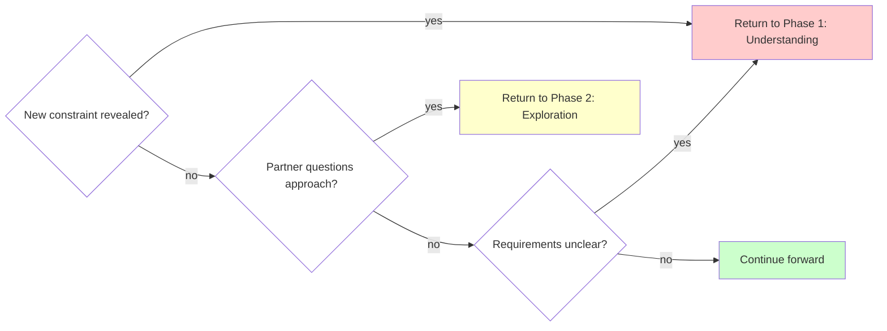

# Brainstorming Ideas Into Designs

## Inputs
<critical-instructions>
- Gather context on project file/folder conventions by using `citation-manager extract header` tool on `ARCHITECTURE.md` in root, header = "Code Organization and Structure"
- Gather link context on file by using `npm run citation:extract:content {{this-file-path}}`
</critical-instructions>

## Overview

Transform rough ideas into fully-formed designs through structured questioning and alternative exploration.

**Core principle:** Research first, ask targeted questions to fill gaps, explore alternatives, validate decisions in chat, write details to document.

**Audience assumption:** Solo founder CEO (non-technical). Chat window = decision validation only. Design document = complete technical details.

**Announce at start:** "I'm using the brainstorming skill to refine your idea into a design."

## Progressive Disclosure Protocol

### CRITICAL: Chat window vs Document separation

| Output Type | Purpose | Content | Token Budget |
|-------------|---------|---------|--------------|
| **Chat Window** | Decision validation | What CEO needs to validate. Options with 1-2 sentence trade-offs, your recommendation with brief rationale. | <150 words per phase |
| **Design Document** | Implementation guide | Complete technical details, architecture diagrams, code examples, validation procedures, step-by-step instructions. | Unlimited |

**Rules:**
1. If CEO doesn't need to validate it → Goes in document, NOT chat
2. Implementation details (bash commands, validation steps, config changes) → ALWAYS in document
3. Chat window output must be **scannable in 30 seconds** - CEO should grasp options and recommendation at a glance
4. If CEO says "idk, does it?" → Add 2-3 sentence "why" explanation, stay high-level
5. If CEO says "too much detail" → You violated protocol. Apologize and simplify immediately.
6. If CEO requests more detail → You can expand in chat, but default is scannable summary

<critical-instruction>
**BEFORE sending Phase 2 output:**
1. Count your bullet points per option - if >3 bullets, you're including implementation details
2. Check for config file names (tsconfig, package.json, vitest.config) - DELETE them
3. Check for validation procedures ("Run tests", "Verify imports") - DELETE them
4. Check total word count - if >150 words, CUT IN HALF
5. Read your output as if you have 30 seconds - is it scannable? If no, DELETE AND RESTART

**This is not optional. Check ALL 5 items before sending.**
</critical-instruction>

**Example - VIOLATION (466 words in chat):**

```text
Option 1: TypeScript with Dual Export Strategy

What it does:
- Convert normalizeAnchor.js → normalizeAnchor.ts with proper TypeScript types
- Use TypeScript compilation to emit both .js and .d.ts files
- JavaScript files import from the compiled .js output
- No changes needed to existing .js importers

Validation approach:
- Convert test file to normalize-anchor.test.ts
- Run existing Vitest suite to confirm tests pass
- Add import validation test in ContentExtractor.js

[continues with 300+ more words...]
```

**Example - CORRECT (<100 words in chat):**

```text
Two options for Epic 3 POC:

Option 1 (Recommended): Standard TypeScript compilation
- .js files import from compiled output (no changes needed)
- Validates no-touch migration pattern for Epic 4

Option 2: Direct .ts imports
- Faster but requires changing import paths in .js files
- Riskier for scaling to 58 files

Recommendation: Option 1 validates the critical requirement (incremental conversion without breaking existing code).

Your decision: Approve Option 1?
```

### Common Rationalizations (STOP These)

| Excuse | Reality |
|--------|---------|
| "CEO needs these details to decide" | CEO needs trade-offs to decide. Implementation details go in document. |
| "Options need complete descriptions" | Options need 1-2 sentence descriptions. Complete = document. |
| "This is 'core architecture' not 'details'" | tsconfig settings, validation checklists, build steps = details. Architecture = approach. |
| "'What we validate' helps understanding" | 5-item validation checklist = implementation details. 1 sentence validation goal = architecture. |
| "Current skill says 200-300 words Phase 3" | That's for Phase 3 design presentation, NOT Phase 2 exploration. Phase 2 = <150 words. |
| "I'm just being thorough" | Thorough = document. Chat = decision validation only. |

### Red Flags - You're About to Violate

**STOP immediately if you find yourself:**
- Writing "What we validate:" subsections with 3+ bullet points
- Mentioning specific config files (tsconfig.json, vitest.config.js)
- Including "What we skip" or "What we document" sections
- Writing 100+ words per option (3 options × 100 words = already over budget)
- Adding detailed pros/cons lists (4-5 items each)
- Using technical jargon (source maps, type inference, circular dependencies)
- Explaining validation procedures ("Run Vitest suite", "Add import test")

**If you hit ANY red flag:** Delete what you wrote. Restart with decision focus only.

## User Interface

<criticial-instruction>
- Use `AskUserQuestion` tool only when you need the human to make a decision among real alternatives.
</criticial-instruction>

## Quick Reference

| Phase                       | Key Activities                   | Tool Usage                               | Output                               |
| --------------------------- | -------------------------------- | ---------------------------------------- | ------------------------------------ |
| **Prep: Autonomous Recon** | Inspect repo/docs/commits, form initial model | Native tools (ls, cat, git log, etc.) | Draft understanding to confirm |
| **1. Understanding**        | Ask questions (one at a time)    | `AskUserQuestion` for choices            | Purpose, constraints, criteria       |
| **2. Exploration**          | Propose 2-3 approaches           | `AskUserQuestion` for approach selection | Architecture options with trade-offs |
| **3. Design Presentation**  | Present in 200-300 word sections | Open-ended questions                     | Complete design with validation      |
| **4. Design Documentation** | Write design document            | `writing-clearly-and-concisely` skill    | Design doc using project design document conventions            |

## The Process

Copy this checklist to track progress:

```markdown
Brainstorming Progress:
- [ ] Prep: Autonomous Recon (repo/docs/commits reviewed, initial model shared)
- [ ] Phase 1: Understanding (purpose, constraints, criteria gathered)
- [ ] Phase 2: Exploration (2-3 approaches proposed and evaluated)
- [ ] Phase 3: Design Presentation (design validated in sections)
- [ ] Phase 4: Design Documentation (design written to project design documen folder)
```

### Prep: Autonomous Recon
- Use existing tools (file browsing, docs, git history, tests) to understand current project state before asking anything.
- Form your draft model: what problem you're solving, what artifacts exist, and what questions remain.
- Start the conversation by sharing that model: "Based on exploring the project state, docs, working copy, and recent commits, here's how I think this should work…"
- Ask follow-up questions only for information you cannot infer from available materials.
  
### Phase 1: Understanding
- Share your synthesized understanding first, then invite corrections or additions.
- Ask one focused question at a time, only for gaps you cannot close yourself.
- **Use `AskUserQuestion` tool** only when you need the human to make a decision among real alternatives.
- Gather: Purpose, constraints, success criteria (confirmed or amended by your partner)

**Example summary + targeted question:**

```text
Based on the README and yesterday's commit, we're expanding localization to dashboard and billing emails; admin console is still untouched. Only gap I see is whether support responses need localization in this iteration. Did I miss anything important?
```

**Example using AskUserQuestion:**

```yaml
Question: "Where should the authentication data be stored?"
Options:
  - "Session storage" (clears on tab close, more secure)
  - "Local storage" (persists across sessions, more convenient)
  - "Cookies" (works with SSR, compatible with older approach)
```

### Phase 2: Exploration
- Propose 2-3 different approaches
- For each: Core architecture, trade-offs, complexity assessment

- **Use AskUserQuestion tool** to present approaches when you truly need a judgement call
- Lead with the option you prefer and explain why; invite disagreement if your partner sees it differently
- Own prioritization: if the repo makes priorities clear, state them and proceed rather than asking

**Example using AskUserQuestion:**

```yaml
Question: "Which architectural approach should we use?"
Options:
  - "Event-driven with message queue" (scalable, complex setup, eventual consistency)
  - "Direct API calls with retry logic" (simple, synchronous, easier to debug)
  - "Hybrid with background jobs" (balanced, moderate complexity, best of both)
```

### Phase 3: Design Presentation
- Present in coherent sections; use ~200-300 words when introducing new material, shorter summaries once alignment is obvious
- Cover: Architecture, components, data flow, error handling, testing
- Check in at natural breakpoints rather than after every paragraph: "Stop me if this diverges from what you expect."
- Use open-ended questions to allow freeform feedback
- Assume ownership and proceed unless your partner redirects you

### Phase 4: Design Documentation
After validating the design, write it to a permanent document:
- **File location:** `docs/plans/YYYY-MM-DD-<topic>-design.md` (use actual date and descriptive topic)
- **RECOMMENDED SUB-SKILL:** Use elements-of-style:writing-clearly-and-concisely (if available) for documentation quality
- **Content:** Capture the design as discussed and validated in Phase 3, organized into sections that emerged from the conversation
- Commit the design document to git before proceeding

## Question Patterns

### When to Use AskUserQuestion Tool

**Use AskUserQuestion when:**
- You need your partner to make a judgement call among real alternatives
- You have a recommendation and can explain why it’s your preference
- Prioritization is ambiguous and cannot be inferred from existing materials

**Best practices:**
- State your preferred option and rationale inside the question so your partner can agree or redirect
- If you know the answer from repo/docs, state it as fact and proceed—no question needed
- When priorities are spelled out, acknowledge them and proceed rather than delegating the choice back to your partner

### When to Use Open-Ended Questions

**Use open-ended questions for:**
- Phase 3: Design validation ("Does this look right so far?")
- When you need detailed feedback or explanation
- When partner should describe their own requirements
- When structured options would limit creative input

Frame them to confirm or expand your current understanding rather than reopening settled topics.

**Example decision flow:**
- "What authentication method?" → Use AskUserQuestion (2-4 options)
- "Does this design handle your use case?" → Open-ended (validation)

## When to Revisit Earlier Phases



**You can and should go backward when:**
- Partner reveals new constraint during Phase 2 or 3 → Return to Phase 1
- Validation shows fundamental gap in requirements → Return to Phase 1
- Partner questions approach during Phase 3 → Return to Phase 2
- Something doesn't make sense → Go back and clarify

**Don't force forward linearly** when going backward would give better results.

## Key Principles

| Principle | Application |
|-----------|-------------|
| **One question at a time** | Phase 1: Single targeted question only for gaps you can’t close yourself |
| **Structured choices** | Use AskUserQuestion tool for 2-4 options with trade-offs |
| **YAGNI ruthlessly** | Remove unnecessary features from all designs |
| **Explore alternatives** | Always propose 2-3 approaches before settling |
| **Incremental validation** | Present design in sections, validate each |
| **Flexible progression** | Go backward when needed - flexibility > rigidity |
| **Own the initiative** | Recommend priorities and next steps; ask if you should proceed only when requirements conflict |
| **Announce usage** | State skill usage at start of session |
