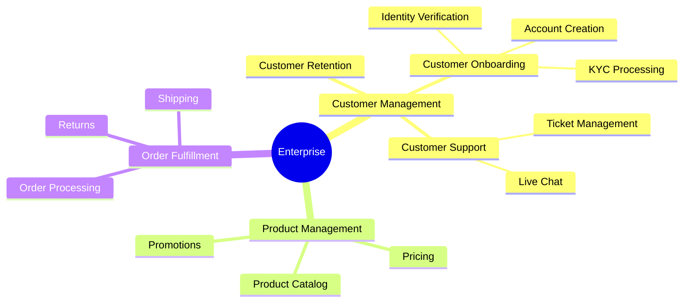

# Business Capability Mapping

Create hierarchical business capability models that bridge strategy and architecture. Based on BABOK v3 Business Capability Analysis (10.6).

## What is a Business Capability?

A **business capability** defines "what" a business does at its core, independent of:

- **How** it's done (processes)
- **Who** does it (organizational structure)
- **Where** it's done (locations)

Capabilities are stable over time, even as processes, technology, and org structure change.

## Capability Hierarchy

| Level | Scope | Example | Description |
|-------|-------|---------|-------------|
| **L1** | Domain | Customer Management | Strategic capability areas (typically 8-15) |
| **L2** | Sub-Domain | Customer Onboarding | Decomposition of L1 (3-7 per L1) |
| **L3** | Activity | Identity Verification | Detailed activities (3-10 per L2) |
| **L4+** | Optional | KYC Document Processing | Granular (map to SOA services) |

## Capability Types

| Type | Description | Investment Priority |
|------|-------------|---------------------|
| **Strategic** | Drive competitive advantage | High - differentiate |
| **Core** | Essential to value delivery | Medium - optimize |
| **Supporting** | Enable other capabilities | Low - commoditize/outsource |

## Workflow

### Phase 1: Discovery

Before creating a capability map, understand the business domain:

1. **Analyze existing documentation**
   - Review business processes, org charts, strategy docs
   - Identify actors, work objects, activities

2. **Conduct stakeholder interviews**
   - Invoke `stakeholder-analysis` skill to identify key stakeholders
   - Interview domain experts for capability insights

3. Use discovered patterns as L1 capability candidates

### Phase 2: Capability Identification

#### Step 1: Define L1 Capabilities

Start with industry frameworks, then customize:

```markdown
## L1 Capabilities (Example: Retail)

| # | Capability | Type | Description |
|---|------------|------|-------------|
| 1 | Product Management | Core | Manage product lifecycle |
| 2 | Customer Management | Core | Manage customer relationships |
| 3 | Order Fulfillment | Core | Process and deliver orders |
| 4 | Supply Chain | Core | Manage suppliers and inventory |
| 5 | Finance & Accounting | Supporting | Financial operations |
| 6 | Human Resources | Supporting | People management |
| 7 | IT Services | Supporting | Technology operations |
| 8 | Marketing | Strategic | Brand and customer acquisition |
```

#### Step 2: Decompose to L2

For each L1, identify sub-capabilities:

```markdown
## L2 Decomposition: Customer Management

| L2 Capability | Owner | Maturity | Systems |
|---------------|-------|----------|---------|
| Customer Onboarding | Customer Success | 3 | CRM, KYC |
| Customer Support | Support Team | 4 | Ticketing, Chat |
| Customer Retention | Marketing | 2 | CRM, Analytics |
| Customer Analytics | Data Team | 2 | BI Platform |
```

#### Step 3: Decompose to L3 (as needed)

Only decompose where detail is needed for planning:

```markdown
## L3 Decomposition: Customer Onboarding

| L3 Capability | Description | Status |
|---------------|-------------|--------|
| Identity Verification | Verify customer identity | Automated |
| Account Creation | Create customer account | Automated |
| KYC Processing | Know Your Customer compliance | Semi-manual |
| Welcome Communication | Onboarding emails/guides | Automated |
```

### Phase 3: Cross-Mapping

Map capabilities to other domains for strategic analysis:

| Cross-Map Domain | Purpose | Example Questions |
|------------------|---------|-------------------|
| **People** | Ownership | Who owns this capability? |
| **Process** | Execution | What processes implement this? |
| **Technology** | Enablement | What systems support this? |
| **Strategy** | Alignment | How does this support strategy? |
| **Investment** | Prioritization | Where should we invest? |
| **Risk** | Exposure | What are the risks? |

### Phase 4: Assessment

Score each capability on maturity and strategic importance:

**Maturity Scale (1-5):**

1. Initial - Ad hoc, reactive
2. Developing - Some structure
3. Defined - Standardized processes
4. Managed - Measured and controlled
5. Optimizing - Continuous improvement

**Heat Map Visualization:**

```markdown
## Capability Heat Map

| Capability | Maturity | Importance | Gap | Action |
|------------|----------|------------|-----|--------|
| Customer Onboarding | 3 | High | Low | Maintain |
| Customer Analytics | 2 | High | High | Invest |
| IT Services | 4 | Medium | Low | Maintain |
| HR Admin | 3 | Low | Low | Outsource? |
```

## Output Format

### Narrative Summary

Provide human-readable analysis:

```markdown
## Capability Map Summary

**Organization:** [Name]
**Scope:** [Enterprise / Business Unit / Domain]
**Date:** [ISO date]

### Key Findings

1. **Strategic Capabilities:** [List with assessment]
2. **Investment Priorities:** [Capabilities needing attention]
3. **Optimization Opportunities:** [Capabilities to streamline]

### Recommendations

1. [Specific, actionable recommendation]
2. [...]
```

### Structured Data (YAML)

```yaml
capability_model:
  version: "1.0"
  organization: "Acme Corp"
  scope: enterprise
  generated: "{ISO-8601-date}"
  generated_by: capability-analyst

  capabilities:
    - id: CAP-001
      name: "Customer Management"
      level: 1
      type: core
      description: "Manage customer lifecycle and relationships"
      owner: "Chief Customer Officer"
      children:
        - id: CAP-001-01
          name: "Customer Onboarding"
          level: 2
          owner: "Customer Success Director"
          maturity: 3
          importance: high
          systems:
            - CRM
            - KYC Platform
          processes:
            - "Customer Registration"
            - "Identity Verification"
          children:
            - id: CAP-001-01-01
              name: "Identity Verification"
              level: 3
              maturity: 4
              automation: high
```

### Mermaid Diagram



## Integration Points

### Upstream (Discovery)

- **stakeholder-analysis** - Identify capability owners and domain experts
- **process-modeling** - Understand AS-IS processes
- **value-stream-mapping** - Understand value flow

### Downstream (Consumers)

- **Requirements** - Capability → Requirements traceability
- **Systems design** - Capability → System mapping
- **Investment planning** - Capability → Budget allocation

## When to Use

| Scenario | Use Capability Mapping? |
|----------|------------------------|
| Strategic planning | Yes - align investments |
| M&A integration | Yes - identify overlaps |
| Digital transformation | Yes - prioritize initiatives |
| Application rationalization | Yes - map apps to capabilities |
| Process improvement | Partial - use with process modeling |
| Specific feature design | No - too high-level |

## References

- Load `references/capability-hierarchy.md` for detailed hierarchy guidance
- See BABOK v3 Section 10.6 for formal technique definition

## Related Skills

- `stakeholder-analysis` - Identify capability owners
- `value-stream-mapping` - Map value flow across capabilities
- `benchmarking` - Compare capability maturity against industry standards
- `prioritization` - Prioritize capability investments
- `swot-pestle-analysis` - Strategic context for capabilities
- `decision-analysis` - Evaluate capability investment options

## Version History

- **v1.0.0** (2025-12-26): Initial release
