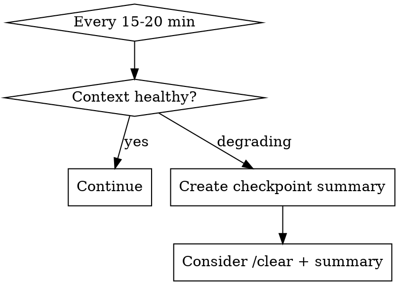

# Context Engineering

## Overview

**Core principle:** Context is a finite resource with diminishing returns. Find the smallest high-signal token set, not the largest.

200K tokens is shared space: system prompt + conversation history + your processing. As context grows, performance degrades predictably.

## When to Use

- Session > 30 minutes or 50k+ tokens
- Instructions being ignored or forgotten
- Repeated clarifications needed
- Planning multi-agent workflows
- Preparing handoffs between sessions

## Quick Reference

| Problem | Symptom | Fix |
|---------|---------|-----|
| **Lost-in-middle** | Mid-conversation instructions ignored | Move critical info to start/end |
| **Context poisoning** | Errors compounding, hallucinations referenced | Summarize and reset |
| **Context distraction** | Irrelevant info degrading performance | Prune aggressively |
| **Context confusion** | Conflicting guidance causing inconsistency | Consolidate instructions |

## Degradation Patterns

### 1. Lost-in-Middle Effect

Information in context middle gets **10-40% lower recall** than edges.

```
[START - High attention]
  ↓
[MIDDLE - Low attention zone]  ← Instructions here get ignored
  ↓
[END - High attention]
```

**Fix:** Strategic placement
- Critical instructions → START (system prompt, first user message)
- Recent decisions → END (last few messages)
- Reference material → MIDDLE (acceptable for lookup, not instructions)

### 2. Context Poisoning

Early hallucination gets referenced → compounds → becomes "fact".

**Symptoms:**
- Confident statements contradicting earlier facts
- "As we discussed..." referencing things never said
- Circular reasoning citing own previous errors

**Fix:** Checkpoint and summarize
```
Every 10-15 exchanges, create explicit checkpoint:

"Let me summarize what we've established:
1. [Verified fact]
2. [Verified fact]
3. [Decision made]

Continuing from here..."
```

### 3. Context Distraction

Irrelevant tokens compete for attention budget.

**Symptoms:**
- Responses reference unrelated earlier topics
- Focus drifts from current task
- Unnecessary caveats about old context

**Fix:** Aggressive pruning
- Use `/clear` + summary for fresh context
- In multi-agent: give subagents ONLY relevant context
- Remove resolved discussions from active consideration

### 4. Context Confusion

Multiple conflicting instructions create inconsistent behavior.

**Symptoms:**
- Alternating between approaches
- "On one hand... on the other hand..." hedging
- Ignoring some instructions to satisfy others

**Fix:** Consolidate
```
Before: "Use TypeScript" (message 3) + "Keep it simple" (message 12) + "Add types everywhere" (message 27)

After: "TypeScript with practical typing - types where they help, skip where obvious"
```

## Optimization Techniques

### Compaction

When approaching limits, summarize context sections:

```markdown
## Session Summary (compacted)

**Goal:** [One sentence]
**Decisions made:**
- [Decision 1]
- [Decision 2]
**Current state:** [What's done, what's next]
**Key constraints:** [Still-active requirements]

---
[Continue with fresh context]
```

### Observation Masking

Replace verbose tool outputs with compact references:

```
Before: [500 lines of file content in context]
After: "Read src/app/page.tsx - React component with Hero, About, FAQ sections"
```

### Context Partitioning (Multi-Agent)

Isolate subtasks in separate agents with clean contexts:

```
Main Agent (orchestrator):
  - High-level plan
  - Synthesis of results

Subagent 1 (search):        Subagent 2 (implement):
  - Only search context       - Only implementation context
  - Returns summary           - Returns code
```

**Rule:** Subagents get task + minimum required context, NOT full conversation history.

## Practical Workflow

### For Long Sessions (>1 hour)



**Health check questions:**
- Are recent instructions being followed?
- Is focus staying on current task?
- Are responses becoming vague or hedgy?

### For Handoffs (/save-session)

Capture for next session:
1. **Goal state** - What were we trying to achieve?
2. **Current state** - What's done, what's broken?
3. **Key decisions** - Why did we choose X over Y?
4. **Active constraints** - What rules still apply?
5. **Next steps** - Where to pick up?

### For Subagents

```markdown
## Subagent Prompt Template

**Task:** [Specific deliverable]
**Context:** [ONLY what's needed - 50-200 words max]
**Constraints:** [Hard requirements]
**Output format:** [What to return]

[Do NOT include: conversation history, resolved discussions, unrelated files]
```

## Anti-Patterns

| Anti-Pattern | Why it fails | Better approach |
|--------------|--------------|-----------------|
| "Include everything just in case" | Dilutes attention, causes distraction | Include only what's needed NOW |
| Repeating instructions every message | Wastes tokens, implies they weren't heard | Trust system prompt, reinforce only when ignored |
| Long file dumps without summary | Lost-in-middle effect | Read → summarize → reference summary |
| Keeping resolved threads active | Context confusion | Summarize resolution, move on |

## Token Budget Guidelines

| Context size | Expected quality | Action |
|--------------|------------------|--------|
| < 20k | Optimal | Continue normally |
| 20-50k | Good | Monitor for degradation |
| 50-100k | Degrading | Active management needed |
| 100-150k | Poor | Summarize and reset soon |
| > 150k | Critical | Reset with checkpoint |

## Key Insight

> "The goal isn't to use all 200K tokens. It's to use the fewest tokens that achieve your outcome."

Informativity over exhaustiveness. Include what matters for current decisions, exclude everything else, and design systems that access additional information on demand.

---

## What Claude Does vs What You Decide

| Claude handles | You provide |
|---------------|-------------|
| Monitoring context health | Decision to reset or continue |
| Creating checkpoint summaries | Validation that summary is accurate |
| Pruning irrelevant content | Judgment on what's still needed |
| Structuring subagent prompts | Strategic task decomposition |
| Detecting degradation patterns | Timing of interventions |

---

## Skill Boundaries

### This skill excels for:
- Long sessions (>30 min, >50k tokens)
- Multi-agent workflows with handoffs
- Complex projects spanning multiple sessions
- Debugging "forgotten instruction" issues

### This skill is NOT ideal for:
- Short, focused interactions → Not needed
- Single-turn queries → Overhead unnecessary
- Tasks with naturally bounded context → Already constrained

---

## Skill Metadata

```yaml
name: context-engineering
category: meta
version: 2.0
author: GUIA
source_expert: Anthropic research, NeoLabHQ context-engineering-kit
difficulty: advanced
mode: centaur
tags: [context, tokens, memory, multi-agent, handoff, optimization]
created: 2026-02-03
updated: 2026-02-03
```
