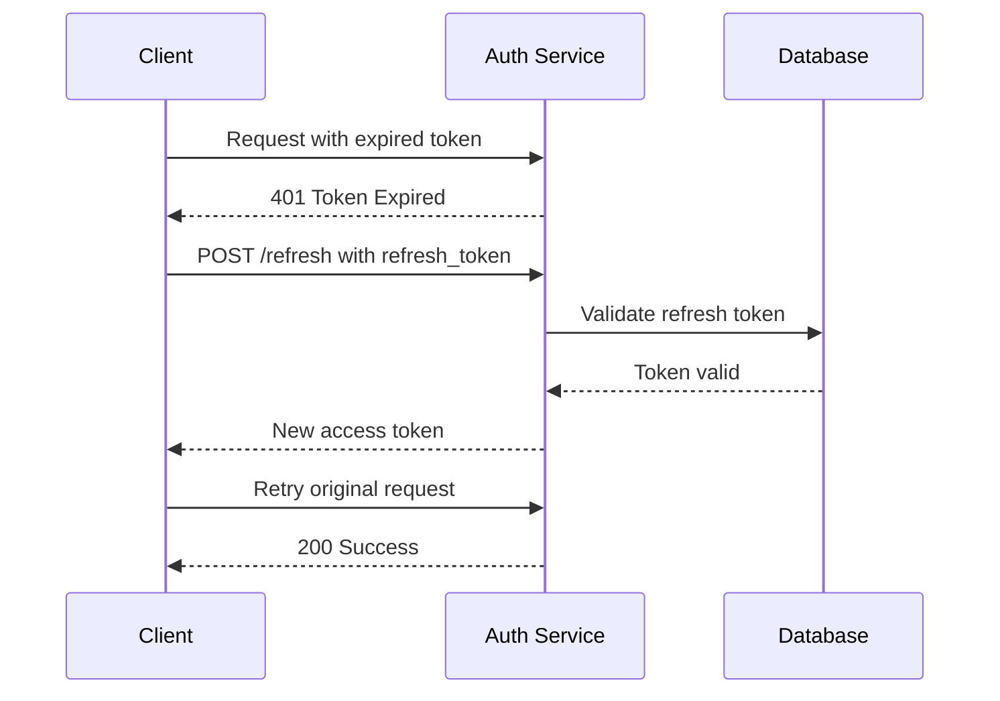

# Create a PR

## ⚠️ MANDATORY: Issue Linking

**Every PR MUST link to related issues and use closing keywords.**

- PRs without issue links are incomplete
- Use `Closes #X` or `Fixes #X` to auto-close issues on merge
- Reference ALL related issues, even if not closing them

## Instructions

### Step 1: Identify Related Issues

```bash
# Check current branch name for issue hints
git branch --show-current

# Search for related issues
gh issue list --search "relevant keywords"

# View specific issue
gh issue view <number>
```

**Find ALL issues this PR addresses:**
- Issues explicitly being fixed
- Issues partially addressed
- Related issues for context

### Step 2: Gather Context

```bash
# See what changed
git log main..HEAD --oneline
git diff main..HEAD --stat

# Get commit messages for context
git log main..HEAD --format="%s%n%b"
```

### Step 3: Create PR with Issue Links

Use the `writing-clearly-and-concisely` skill for clear writing, then follow [pr_guide](pr_guide.md).

```bash
gh pr create --title "[type]: [emoji] [description]" --body "$(cat <<'EOF'
[Two-sentence summary of what and why]

## Key Changes
- [Change 1]
- [Change 2]

## Related Issues

**Closes:**
- Closes #X - [brief description of what's fixed]
- Closes #Y - [brief description]

**Related (not closing):**
- Related to #Z - [why related]
- See also #W - [context]

## Testing
- [How it was tested]

## Files Changed
- [List key files]
EOF
)"
```

### Issue Linking Keywords

GitHub recognizes these keywords to auto-close issues on merge:

| Keyword | Example | Effect |
|---------|---------|--------|
| `Closes` | `Closes #123` | Closes issue when PR merges |
| `Fixes` | `Fixes #123` | Closes issue when PR merges |
| `Resolves` | `Resolves #123` | Closes issue when PR merges |

**Use format**: `Closes #X - brief description`

### Step 4: Verify Issue Links

After creating PR:

```bash
# Verify the PR shows linked issues
gh pr view <number> --json closingIssuesReferences

# Check the issue shows the PR link
gh issue view <number>
```

---

## PR Description Template

```markdown
[Two-sentence summary: what changed and why it was needed]

## Key Changes
- [Most important change]
- [Second important change]
- [Third important change]

## Related Issues

**Closes:**
- Closes #X - [what requirement this addresses]
- Fixes #Y - [what bug this fixes]

**Related:**
- Related to #Z - [provides context but doesn't close]

## Testing
- [Manual testing performed]
- [Automated tests added/passing]

## Architectural Impact
[If significant: explain system-wide effects]

## Files Changed
- `path/to/file1.ts` - [what changed]
- `path/to/file2.ts` - [what changed]
```

---

## Anti-Patterns

```
❌ WRONG:
gh pr create --title "Fix bug" --body "Fixed the thing"

❌ WRONG:
"Related: #123" (no closing keyword, issue won't close)

❌ WRONG:
No mention of any issues at all

✅ CORRECT:
gh pr create --title "fix: 🔧 Resolve auth token expiration" --body "
Fixes session timeout by implementing token refresh.

## Related Issues
- Closes #123 - Auth token expires incorrectly
- Closes #124 - Users logged out unexpectedly
- Related to #100 - Auth system overhaul (partial)
"
```

---

## Mermaid Diagrams in PRs

**Use Mermaid diagrams to visualize changes, flows, and architectural impacts.**

GitHub renders Mermaid natively. Include diagrams when:
- Showing before/after state changes
- Illustrating new data flows
- Explaining component interactions
- Depicting architectural changes

### When to Include Diagrams

| PR Type | Diagram Use |
|---------|-------------|
| Bug fix | Before/after flow showing fix |
| New feature | User journey or data flow |
| Refactor | Component dependency changes |
| API changes | Request/response sequence |

### Example: PR with Diagram

````markdown
## Key Changes

Added token refresh flow when session expires.

### New Authentication Flow



## Related Issues
- Closes #123 - Token expiration handling
````

### Diagram Types for PRs

```markdown
## Flow changes: flowchart
## API interactions: sequenceDiagram
## State machines: stateDiagram-v2
## Data models: erDiagram
```

**Tips:**
- Keep diagrams focused (5-10 nodes)
- Show the change, not entire system
- Before/after pairs are powerful
- Embed in PR body, not as links

---

## Quick Reference

1. **Find issues**: `gh issue list --search "keywords"`
2. **Create PR with closing keywords**: `Closes #X`, `Fixes #X`
3. **Always include**: Related Issues section in PR body
4. **Verify**: `gh pr view --json closingIssuesReferences`
5. **Add Mermaid diagrams** for complex changes
