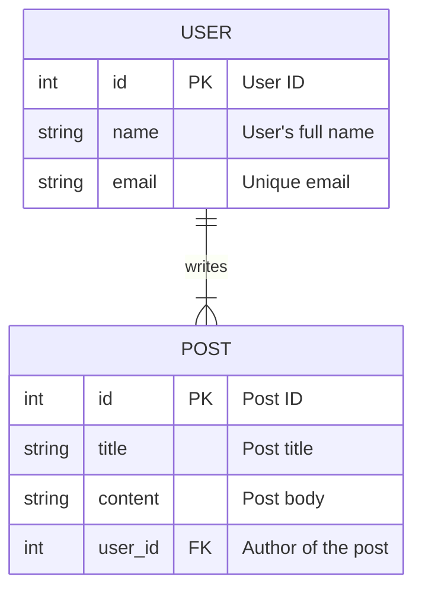

# Relational Database Schema Design

This skill provides a structured workflow for designing robust and scalable relational database schemas.

## Schema Design Workflow

Follow these steps to design a database schema. For detailed principles and best practices for each step, consult the [Design Principles Guide](references/design-principles.md).

1.  **Identify Entities & Attributes**: Analyze requirements to find the core nouns (entities) and their properties (attributes).
2.  **Determine Relationships**: Define how entities relate to each other (one-to-one, one-to-many, many-to-many).
3.  **Create an ERD with Mermaid**: Visualize the schema with an Entity-Relationship Diagram.
4.  **Define Constraints**: Specify rules to ensure data integrity (primary keys, foreign keys, unique, check).
5.  **Generate DDL Scripts**: Write the SQL code to create the schema.
6.  **Develop Indexing Strategy**: Plan indexes to optimize query performance.
7.  **Consider Denormalization**: Decide if and where to denormalize for performance reasons.
8.  **Plan for Schema Evolution**: Establish a strategy for managing future schema changes.

## ERD Creation Guide with Mermaid

Use Mermaid syntax to create an ERD. This provides a clear, version-controllable diagram of the schema.

**Example:** A simple blog schema.

**Cardinality Syntax:**

*   `|o--||` : One-to-one
*   `|o--|{` : One-to-many
*   `}o--|{` : Many-to-many

## Additional Resources

*   **[Core Design Principles](references/design-principles.md)**: Detailed guide on entities, relationships, attributes, constraints, and denormalization.
*   **[SQL DDL Templates](references/ddl-templates.md)**: Reusable SQL templates for creating tables, constraints, and other schema objects.
*   **[Indexing Checklist](references/indexing-checklist.md)**: A checklist to guide your indexing strategy for optimal performance.
*   **[Schema Evolution Strategy](references/schema-evolution.md)**: A document on how to manage changes to your database schema over time.
