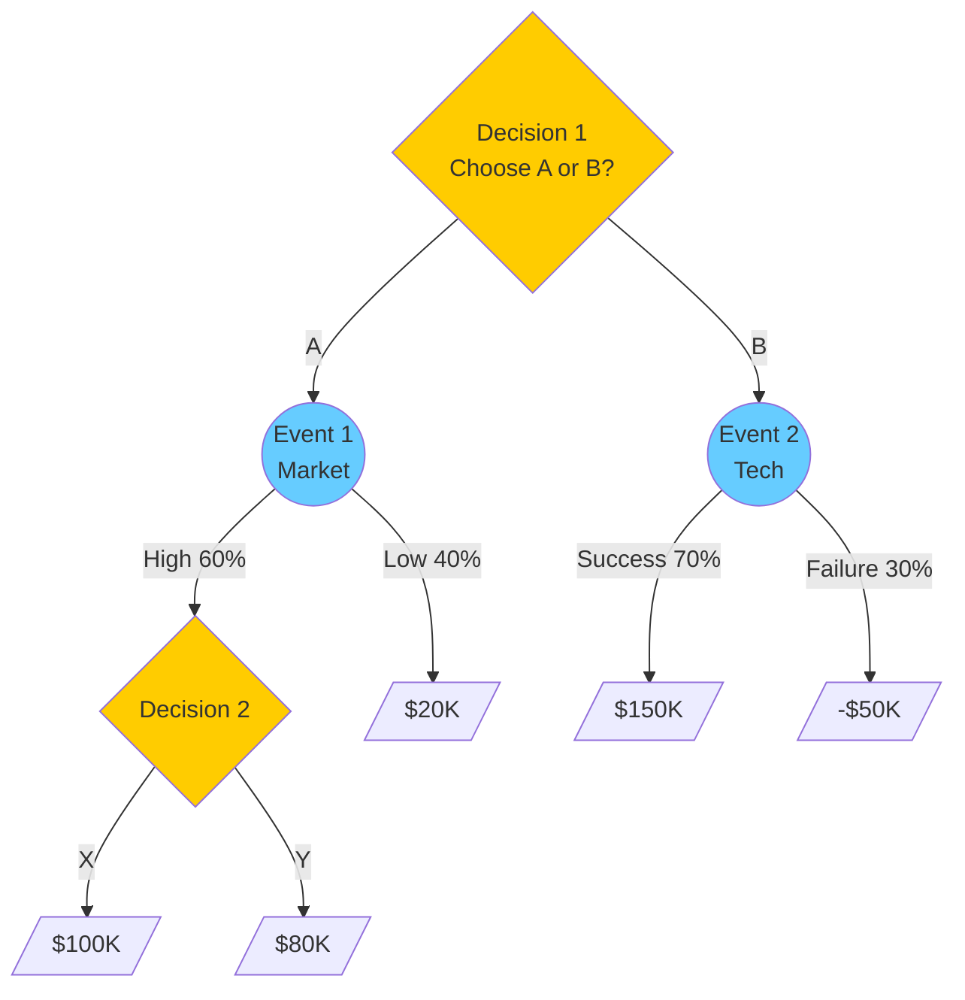
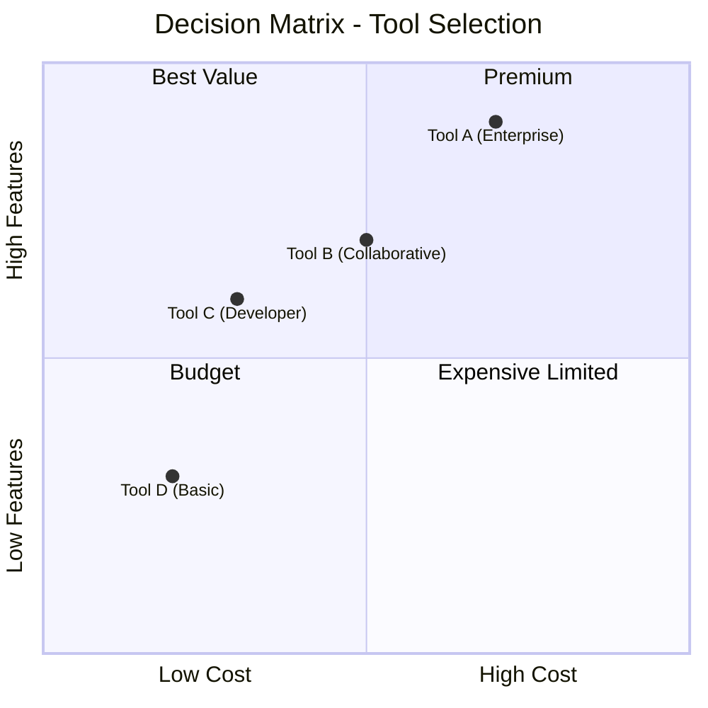

# Decision Analysis

Model and analyze complex decisions using structured techniques: decision tables, weighted scoring matrices, and decision trees. Creates clear, defensible decision frameworks with traceable rationale.

## What is Decision Analysis?

**Decision Analysis** is a systematic approach to evaluating complex choices by breaking them down into components: objectives, alternatives, criteria, and trade-offs. It transforms subjective judgment into structured, transparent reasoning.

| Technique | Best For | Output |
|-----------|----------|--------|
| **Decision Table** | Rule-based logic, many conditions | Action based on condition combinations |
| **Weighted Scoring Matrix** | Multi-criteria comparison | Ranked alternatives with scores |
| **Decision Tree** | Sequential decisions, uncertainty | Optimal path with probabilities |
| **Pugh Matrix** | Concept selection, design choices | Best concept vs baseline |

## Technique 1: Decision Tables

### What is a Decision Table?

A **decision table** captures complex conditional logic in a compact grid format. It lists all combinations of conditions and their corresponding actions.

| Component | Description | Example |
|-----------|-------------|---------|
| **Conditions** | Input variables/states | Customer type, Order value |
| **Actions** | Outcomes/responses | Apply discount, Require approval |
| **Rules** | Condition combinations | IF Premium AND >$1000 THEN 20% off |

### Decision Table Workflow

#### Step 1: Identify Conditions and Actions

```markdown
## Decision Context

**Decision:** [What are we deciding?]
**Trigger:** [When is this decision made?]

### Conditions (Inputs)
| # | Condition | Possible Values |
|---|-----------|-----------------|
| C1 | [Condition 1] | [Value A / Value B / ...] |
| C2 | [Condition 2] | [Yes / No] |
| C3 | [Condition 3] | [Low / Medium / High] |

### Actions (Outputs)
| # | Action | Description |
|---|--------|-------------|
| A1 | [Action 1] | [What happens] |
| A2 | [Action 2] | [What happens] |
```

#### Step 2: Build the Decision Table

```markdown
## Decision Table: [Name]

| Rule | C1 | C2 | C3 | A1 | A2 |
|------|----|----|----|----|----|
| R1 | Premium | Yes | High | X | - |
| R2 | Premium | Yes | Low | X | X |
| R3 | Standard | Yes | - | - | X |
| R4 | Standard | No | High | - | - |
| R5 | - | No | Low | - | X |

**Legend:** X = Execute action, - = Skip, [blank] = Any value
```

#### Step 3: Validate Completeness

| Check | Question | Pass? |
|-------|----------|-------|
| **Completeness** | All condition combinations covered? | ☐ |
| **Consistency** | No contradictory rules? | ☐ |
| **Uniqueness** | Each combination maps to one outcome? | ☐ |
| **Simplification** | Can rules be consolidated? | ☐ |

### Decision Table Template

```markdown
## Decision Table: [Decision Name]

**Context:** [Business context]
**Owner:** [Decision owner]
**Last Updated:** [ISO date]

### Conditions
| ID | Condition | Values |
|----|-----------|--------|
| C1 | | |
| C2 | | |

### Actions
| ID | Action | Description |
|----|--------|-------------|
| A1 | | |
| A2 | | |

### Rules
| Rule | C1 | C2 | → | A1 | A2 | Notes |
|------|----|----|---|----|----|-------|
| R1 | | | | | | |
| R2 | | | | | | |

### Validation
- [ ] All combinations covered
- [ ] No contradictions
- [ ] Rules simplified
```

## Technique 2: Weighted Scoring Matrix

### What is a Weighted Scoring Matrix?

A **weighted scoring matrix** (also called decision matrix or Pugh matrix) evaluates multiple alternatives against weighted criteria to produce a ranked list.

| Component | Description |
|-----------|-------------|
| **Alternatives** | Options being compared |
| **Criteria** | Factors for evaluation |
| **Weights** | Importance of each criterion (sum to 100%) |
| **Scores** | Rating of each alternative on each criterion |
| **Weighted Score** | Score × Weight, summed across criteria |

### Weighted Scoring Workflow

#### Step 1: Define the Decision

```markdown
## Decision Context

**Decision:** [What are we choosing?]
**Objective:** [What outcome do we want?]
**Constraints:** [Non-negotiable requirements]
**Timeline:** [When must we decide?]
```

#### Step 2: Identify Alternatives

```markdown
## Alternatives

| # | Alternative | Description | Source |
|---|-------------|-------------|--------|
| A | [Option A] | [Brief description] | [How identified] |
| B | [Option B] | [Brief description] | [How identified] |
| C | [Option C] | [Brief description] | [How identified] |
```

#### Step 3: Define and Weight Criteria

```markdown
## Criteria

| # | Criterion | Description | Weight | Rationale |
|---|-----------|-------------|--------|-----------|
| 1 | [Criterion 1] | [What it measures] | 30% | [Why this weight] |
| 2 | [Criterion 2] | [What it measures] | 25% | [Why this weight] |
| 3 | [Criterion 3] | [What it measures] | 25% | [Why this weight] |
| 4 | [Criterion 4] | [What it measures] | 20% | [Why this weight] |
|   | **Total** | | **100%** | |
```

**Weighting Methods:**

| Method | Description | When to Use |
|--------|-------------|-------------|
| **Direct Assignment** | Stakeholders assign weights directly | Clear priorities, experienced team |
| **Pairwise Comparison** | Compare criteria pairs (AHP) | Unclear priorities, need consensus |
| **Ranking** | Rank criteria, convert to weights | Quick, approximate |
| **Equal Weights** | All criteria weighted equally | No clear priority, initial analysis |

#### Step 4: Score Alternatives

```markdown
## Scoring Scale

| Score | Meaning |
|-------|---------|
| 5 | Excellent - Fully meets/exceeds criterion |
| 4 | Good - Mostly meets criterion |
| 3 | Adequate - Partially meets criterion |
| 2 | Poor - Minimally meets criterion |
| 1 | Unacceptable - Does not meet criterion |
```

#### Step 5: Calculate Weighted Scores

```markdown
## Decision Matrix

| Criterion | Weight | Alt A | Alt B | Alt C |
|-----------|--------|-------|-------|-------|
| Criterion 1 | 30% | 4 | 3 | 5 |
| Criterion 2 | 25% | 3 | 5 | 4 |
| Criterion 3 | 25% | 5 | 4 | 3 |
| Criterion 4 | 20% | 4 | 4 | 4 |
| **Weighted Score** | | **3.95** | **3.95** | **4.05** |
| **Rank** | | 2 | 3 | 1 |

**Calculation:** Weighted Score = Σ(Score × Weight)
```

#### Step 6: Sensitivity Analysis

Test how results change if weights shift:

```markdown
## Sensitivity Analysis

| Scenario | Weight Change | Winner | Confidence |
|----------|---------------|--------|------------|
| Baseline | As defined | Alt C | - |
| Cost +10% | C1: 40%, others adjusted | Alt A | Low |
| Quality +10% | C2: 35%, others adjusted | Alt C | High |

**Robustness:** [Is the winner stable across scenarios?]
```

### Pugh Matrix (Concept Selection)

A specialized scoring matrix comparing alternatives to a baseline:

```markdown
## Pugh Matrix: [Decision]

**Baseline:** [Reference option - usually current state or simplest option]

| Criterion | Weight | Alt A vs Baseline | Alt B vs Baseline | Alt C vs Baseline |
|-----------|--------|-------------------|-------------------|-------------------|
| Criterion 1 | 30% | + | S | ++ |
| Criterion 2 | 25% | - | + | S |
| Criterion 3 | 25% | S | + | - |
| Criterion 4 | 20% | + | S | + |
| **Σ Plus** | | 2 | 2 | 2 |
| **Σ Minus** | | 1 | 0 | 1 |
| **Σ Same** | | 1 | 2 | 1 |
| **Net Score** | | +1 | +2 | +1 |

**Legend:** ++ Much better, + Better, S Same, - Worse, -- Much worse
```

## Technique 3: Decision Trees

### What is a Decision Tree?

A **decision tree** maps sequential decisions and uncertain events to visualize possible paths and outcomes. It's ideal for decisions with multiple stages or probabilistic outcomes.

| Node Type | Symbol | Description |
|-----------|--------|-------------|
| **Decision Node** | □ | Choice point (you control) |
| **Chance Node** | ○ | Uncertain event (probabilities) |
| **End Node** | △ | Final outcome (value) |

### Decision Tree Workflow

#### Step 1: Frame the Decision

```markdown
## Decision Tree Context

**Decision:** [Primary decision]
**Objective:** [What we're optimizing - NPV, utility, etc.]
**Time Horizon:** [How far into future]
**Key Uncertainties:** [Major unknown factors]
```

#### Step 2: Identify Decision Points and Uncertainties

```markdown
## Structure

### Decision Points
| # | Decision | Options |
|---|----------|---------|
| D1 | [First decision] | Option A, Option B |
| D2 | [Subsequent decision] | Option X, Option Y |

### Chance Events
| # | Event | Outcomes | Probabilities |
|---|-------|----------|---------------|
| E1 | [Uncertainty 1] | High, Low | 60%, 40% |
| E2 | [Uncertainty 2] | Success, Failure | 70%, 30% |
```

#### Step 3: Assign Values and Probabilities

```markdown
## Outcomes

| Path | Sequence | Probability | Value | Expected Value |
|------|----------|-------------|-------|----------------|
| P1 | D1:A → E1:High → D2:X | 0.60 | $100K | $60K |
| P2 | D1:A → E1:High → D2:Y | 0.60 | $80K | $48K |
| P3 | D1:A → E1:Low | 0.40 | $20K | $8K |
| P4 | D1:B → E2:Success | 0.70 | $150K | $105K |
| P5 | D1:B → E2:Failure | 0.30 | -$50K | -$15K |
```

#### Step 4: Calculate Expected Values (Rollback)

Work backwards from end nodes:

```markdown
## Rollback Analysis

### Chance Node E1 (after D1:A)
EV = (0.60 × max($100K, $80K)) + (0.40 × $20K)
EV = (0.60 × $100K) + $8K = $68K

### Chance Node E2 (after D1:B)
EV = (0.70 × $150K) + (0.30 × -$50K)
EV = $105K - $15K = $90K

### Decision Node D1
Choose B: EV = $90K > $68K

**Recommendation:** Choose Option B
```

### Decision Tree Mermaid Diagram



## DMN-Lite: Decision Model Notation

For simple, repeatable decisions, use a lightweight DMN approach:

```markdown
## Decision: [Name]

**Decision ID:** DEC-001
**Business Context:** [When this decision is made]

### Input Data
| Input | Type | Source |
|-------|------|--------|
| Customer Segment | Text | CRM |
| Order Value | Currency | Order System |
| Credit Score | Number | Credit Bureau |

### Decision Logic

```text
IF Customer Segment = "Premium" AND Order Value > 1000
  THEN Discount = 20%
ELSE IF Customer Segment = "Premium"
  THEN Discount = 10%
ELSE IF Order Value > 5000
  THEN Discount = 15%
ELSE
  THEN Discount = 0%
```

### Output

| Output | Type | Range |
|--------|------|-------|
| Discount | Percentage | 0% - 20% |

## Output Formats

### Narrative Summary

```markdown
## Decision Analysis Summary

**Decision:** [What was decided]
**Date:** [ISO date]
**Analyst:** decision-analyst

### Context
[2-3 sentences on why this decision was needed]

### Approach
- **Technique Used:** [Decision Table / Weighted Matrix / Decision Tree]
- **Alternatives Considered:** [Count and brief list]
- **Criteria Applied:** [Count and key criteria]

### Recommendation
**Recommended Option:** [Name]
**Rationale:** [Key reasons - 2-3 points]
**Confidence:** High / Medium / Low

### Key Trade-offs
| Factor | Recommended Option | Runner-up |
|--------|-------------------|-----------|
| [Factor 1] | [Assessment] | [Assessment] |
| [Factor 2] | [Assessment] | [Assessment] |

### Risks and Mitigations
| Risk | Likelihood | Impact | Mitigation |
|------|------------|--------|------------|
| [Risk 1] | H/M/L | H/M/L | [Action] |

### Next Steps
1. [Immediate action]
2. [Follow-up action]
```

### Structured Data (YAML)

```yaml
decision_analysis:
  version: "1.0"
  date: "2025-01-15"
  analyst: "decision-analyst"

  context:
    decision: "Select project management tool"
    objective: "Maximize team productivity while minimizing cost"
    constraints:
      - "Budget under $500/month"
      - "Must integrate with team messaging platform"
    timeline: "Decision by end of Q1"

  technique: "weighted_scoring_matrix"

  alternatives:
    - id: A
      name: "Tool A (Enterprise)"
      description: "Enterprise-grade, feature-rich work item tracking"
    - id: B
      name: "Tool B (Collaborative)"
      description: "User-friendly, good collaboration features"
    - id: C
      name: "Tool C (Developer-Focused)"
      description: "Modern, developer-focused interface"

  criteria:
    - id: C1
      name: "Ease of Use"
      weight: 0.30
      rationale: "Team adoption is critical"
    - id: C2
      name: "Feature Set"
      weight: 0.25
      rationale: "Must handle complex workflows"
    - id: C3
      name: "Integration"
      weight: 0.25
      rationale: "Slack integration required"
    - id: C4
      name: "Cost"
      weight: 0.20
      rationale: "Within budget constraint"

  scores:
    - alternative: A
      scores: {C1: 3, C2: 5, C3: 4, C4: 3}
      weighted_total: 3.75
    - alternative: B
      scores: {C1: 5, C2: 4, C3: 5, C4: 4}
      weighted_total: 4.50
    - alternative: C
      scores: {C1: 4, C2: 4, C3: 3, C4: 5}
      weighted_total: 3.95

  ranking:
    - rank: 1
      alternative: B
      score: 4.50
    - rank: 2
      alternative: C
      score: 3.95
    - rank: 3
      alternative: A
      score: 3.75

  sensitivity:
    - scenario: "Cost weight +10%"
      winner: C
      stable: false
    - scenario: "Ease of Use weight +10%"
      winner: B
      stable: true

  recommendation:
    choice: B
    confidence: high
    rationale:
      - "Highest weighted score (4.50)"
      - "Stable across sensitivity scenarios"
      - "Best ease of use for team adoption"

  risks:
    - description: "Asana pricing may increase"
      likelihood: medium
      impact: low
      mitigation: "Negotiate annual contract"
```

### Mermaid Decision Matrix Visualization



## When to Use

| Scenario | Technique |
|----------|-----------|
| Rule-based logic with many conditions | Decision Table |
| Comparing multiple options on criteria | Weighted Scoring Matrix |
| Sequential decisions with uncertainty | Decision Tree |
| Concept selection vs baseline | Pugh Matrix |
| Simple repeatable business rules | DMN-Lite |
| Quick relative comparison | Pugh Matrix |
| Need stakeholder buy-in | Weighted Scoring (transparent) |

## Integration

### Upstream

- **stakeholder-analysis** - Identify decision makers and criteria sources
- **root-cause-analysis** - Understand problem before deciding solution
- **swot-pestle-analysis** - Strategic context for decisions

### Downstream

- **Requirements** - Decision drives requirement priorities
- **Risk registers** - Capture decision risks
- **Implementation plans** - Execute chosen alternative

## Related Skills

- `prioritization` - MoSCoW, Kano for feature prioritization
- `risk-analysis` - Risk assessment for decision alternatives
- `root-cause-analysis` - Problem analysis before solution selection
- `business-model-canvas` - Strategic business decisions
- `stakeholder-analysis` - Decision maker identification

## Version History

- **v1.0.0** (2025-12-26): Initial release
