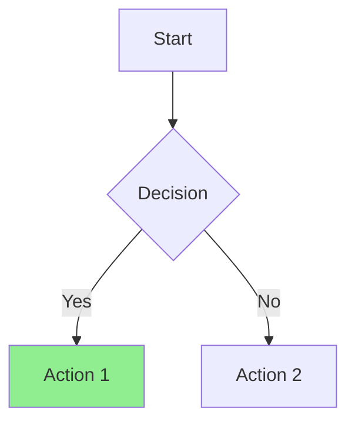

# Diagram Generator

Expert skill for creating clear, professional diagrams in Mermaid or ASCII format.

## Supported Formats

| Format | Best For | Trigger Keywords |
|--------|----------|------------------|
| **Mermaid** | Web docs, GitHub, rich rendering | "diagram", "mermaid", "visualize" |
| **ASCII** | Terminals, plain text, emails | "ASCII", "text diagram", "terminal" |

## Diagram Types

```
graph/flowchart     - Flowcharts and decision trees
sequenceDiagram     - API interactions and workflows
classDiagram        - Object-oriented structures
stateDiagram-v2     - State machines and transitions
erDiagram           - Database relationships
C4Context/C4Container/C4Component - Architecture views (C4 model)
mindmap             - Brainstorming and idea organization
block-beta          - System block diagrams
gantt               - Project timelines
pie                 - Data distributions
gitGraph            - Git branching strategies
journey             - User experience flows
quadrantChart       - Priority matrices
timeline            - Historical events
```

## Quick Start

1. **Determine format**: Mermaid (default) or ASCII (if user explicitly requests)
2. **Select diagram type** based on what's being visualized
3. **Choose layout**: TB/TD (top-down), LR (left-right) for Mermaid
4. **Keep readable**: Max 15-20 nodes per diagram
5. **Apply meaningful styling**: Colors/shapes with semantic meaning

## Output Format

### Mermaid (Default)

````markdown

````

### ASCII (When Explicitly Requested)

```
+-------+     +----------+
| Start | --> | Decision |
+-------+     +----+-----+
                   |
         +---------+---------+
         |                   |
         v                   v
    +----------+       +----------+
    | Action 1 |       | Action 2 |
    +----------+       +----------+
```

**ASCII Conventions:**
- `+---+` for boxes, `|` for vertical lines, `-->` or `---` for connections
- Use consistent spacing and alignment
- Label arrows with `[text]` above the line when needed

## Diagram Type Selection

| Use Case | Recommended Type |
|----------|------------------|
| Process/decision flow | `graph` (flowchart) |
| API/service interactions | `sequenceDiagram` |
| System architecture (high-level) | `C4Context` |
| System architecture (detailed) | `C4Container`, `block-beta` |
| Database schema | `erDiagram` |
| Brainstorming/ideas | `mindmap` |
| State transitions | `stateDiagram-v2` |
| Project timeline | `gantt` |
| Feature prioritization | `quadrantChart` |

## Resources

- [WORKFLOW.md](WORKFLOW.md) - Detailed creation methodology
- [EXAMPLES.md](EXAMPLES.md) - All diagram types with real-world examples
- [TROUBLESHOOTING.md](TROUBLESHOOTING.md) - Common errors and fixes

## Integration

- **Auto-invokes** on trigger keywords (diagram, mermaid, ASCII, visualize, etc.)
- **Manual**: Use `/diagram` command
- **With docs**: Works alongside `doc-coauthoring` skill for documentation diagrams
