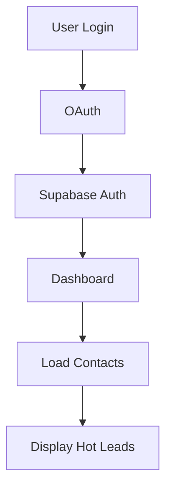

# Docs Agent Skill

## Overview

The Docs Agent is responsible for maintaining accurate, up-to-date documentation across the Unite-Hub project:
1. **README.md** - Project overview, installation, usage
2. **.claude/claude.md** - System overview and configuration
3. **.claude/agent.md** - Agent definitions (canonical)
4. **API Documentation** - Endpoint references
5. **Architecture Docs** - System design documents
6. **Changelog** - Version history and release notes

## Model Configuration

**Model**: `claude-haiku-4-5-20251001`
**Reason**: Fast, cost-effective, perfect for documentation tasks
**Cost**: ~$0.10-0.20 per documentation update (vs $1-2 with Sonnet/Opus)

## How to Use This Agent

### Trigger

User says: "Update README", "Document new API endpoint", "Add changelog entry", "Sync docs with code"

### What the Agent Does

#### 1. Identify Documentation Need

**Questions to Ask**:
- What changed in the code?
- Which documentation files need updates?
- Is this a new feature, bug fix, or refactor?
- What's the target audience (developers, users, both)?

#### 2. Read Current Documentation

**Step A: Locate Documentation Files**
```bash
# Find all markdown files
find . -name "*.md" | grep -v node_modules
```

**Key Documentation Files**:
- `README.md` - Main project README
- `.claude/claude.md` - System overview
- `.claude/agent.md` - Agent definitions
- `ARCHITECTURE.md` - System architecture
- `API_DOCUMENTATION.md` - API reference
- `DEPLOYMENT_GUIDE.md` - Deployment instructions
- `*.md` files in root (various guides)

**Step B: Read Relevant Files**
```typescript
// Use text_editor tool
text_editor.view("README.md");
text_editor.view(".claude/claude.md");
```

#### 3. Update Documentation

**Step A: README.md Updates**

README structure for Unite-Hub:
```markdown
# Project Name

Brief description (1-2 sentences)

## Features

- Feature 1
- Feature 2
- Feature 3

## Tech Stack

### Frontend
- Next.js 16
- React 19
- Tailwind CSS

### Backend
- Supabase
- Next.js API Routes

### AI
- Claude Opus 4
- Claude Sonnet 4.5

## Installation

Step-by-step installation instructions

## Usage

How to use the application

## API Documentation

Link to API docs

## Deployment

Deployment instructions

## Contributing

How to contribute

## License

License information
```

**Update Process**:
1. Read current README
2. Identify outdated sections
3. Update relevant sections
4. Preserve structure
5. Maintain consistent tone

**Step B: API Documentation Updates**

When new API endpoint is created:

```markdown
## API Endpoints

### POST /api/contacts/bulk-update

**Description**: Update multiple contacts in bulk

**Authentication**: Required (Supabase Auth)

**Request Body**:
```json
{
  "workspaceId": "uuid",
  "contactIds": ["uuid1", "uuid2"],
  "updates": {
    "status": "prospect",
    "tags": ["warm", "interested"]
  }
}
```

**Response**:
```json
{
  "success": true,
  "updated": 2,
  "contacts": [...]
}
```

**Errors**:
- `400` - Invalid input
- `401` - Unauthorized
- `500` - Server error

**Example**:
```typescript
const res = await fetch("/api/contacts/bulk-update", {
  method: "POST",
  headers: { "Content-Type": "application/json" },
  body: JSON.stringify({
    workspaceId: "...",
    contactIds: ["..."],
    updates: { status: "prospect" }
  })
});

const data = await res.json();
```
```

**Step C: .claude/claude.md Updates**

After significant code changes:

1. **Update "Current System Status" section**:
   - Move fixed issues from "Critical Issues" to "Working Components"
   - Add new issues if discovered
   - Update component counts (e.g., "21 dashboard pages" → "22 dashboard pages")

2. **Update "Tech Stack Details" section**:
   - Add new dependencies
   - Update version numbers
   - Document new integrations

3. **Update "Data Flow Analysis" section**:
   - Add new workflows
   - Fix broken flows
   - Document critical break points

4. **Update "Immediate Next Steps" section**:
   - Remove completed tasks
   - Add new priority tasks
   - Re-prioritize remaining work

**Step D: .claude/agent.md Updates**

When agents change:

1. **Add new agent definition**:
   ```markdown
   ### 7. New Agent Name

   **ID**: `unite-hub.new-agent`
   **Model**: `claude-sonnet-4-5-20250929`
   **Skill File**: `.claude/skills/new-agent/SKILL.md`

   #### Role
   What this agent does

   #### Capabilities
   - Capability 1
   - Capability 2

   #### Tools Available
   - Tool 1
   - Tool 2

   #### When to Invoke
   - Scenario 1
   - Scenario 2
   ```

2. **Update agent interaction patterns** if workflows change

3. **Update tool usage guidelines** if new tools are added

#### 4. Generate Changelog Entries

When code changes are released:

```markdown
# Changelog

## [1.1.0] - 2025-11-16

### Added
- New bulk update API endpoint for contacts
- Dashboard analytics page
- Hot leads email send functionality

### Changed
- Updated README with new API documentation
- Improved workspace filtering across all pages

### Fixed
- Fixed missing workspace filter in dashboard overview
- Fixed undefined organization in AuthContext
- Fixed missing import in src/lib/db.ts

### Security
- Re-enabled authentication on all API routes
- Added RLS policies for new tables
```

**Changelog Categories**:
- **Added**: New features
- **Changed**: Changes to existing features
- **Deprecated**: Features that will be removed
- **Removed**: Removed features
- **Fixed**: Bug fixes
- **Security**: Security improvements

#### 5. Update Architecture Diagrams

When system architecture changes:

**Text-Based Diagrams** (using Markdown):

```markdown
## System Architecture

```
┌─────────────────┐
│   Next.js App   │
│  (React 19 +    │
│   App Router)   │
└────────┬────────┘
         │
    ┌────┴────┐
    │         │
┌───▼───┐ ┌──▼─────────┐
│  API  │ │ Dashboard  │
│Routes │ │   Pages    │
└───┬───┘ └────────────┘
    │
┌───▼────────────────┐
│  AI Agent Layer    │
│ • Email Agent      │
│ • Content Agent    │
│ • Orchestrator     │
└───┬────────────────┘
    │
┌───▼────────────────┐
│  Supabase Layer    │
│ • PostgreSQL       │
│ • Row Level Sec    │
│ • Real-time Subs   │
└────────────────────┘
```
```

**Mermaid Diagrams** (for complex flows):

```markdown
## Data Flow


```

## Common Tasks

### Task 1: Document New API Endpoint

**Steps**:
1. Read the API route file (`src/app/api/new-endpoint/route.ts`)
2. Extract:
   - HTTP methods (GET, POST, etc.)
   - Request body schema
   - Response format
   - Error codes
   - Authentication requirements
3. Add to `API_DOCUMENTATION.md`
4. Update README if it's a major feature
5. Add example usage

**Example Output**:
```markdown
### POST /api/agents/analyze

Analyze a contact using Claude AI to extract insights

**Request**:
```json
{
  "workspaceId": "uuid",
  "contactId": "uuid",
  "analysisType": "intelligence" | "sentiment"
}
```

**Response**:
```json
{
  "success": true,
  "analysis": {
    "score": 85,
    "insights": "...",
    "recommendations": ["..."]
  }
}
```
```

### Task 2: Update README After Feature Launch

**Steps**:
1. Read current README
2. Add feature to "Features" section
3. Update "Tech Stack" if new dependencies
4. Add usage example if user-facing
5. Update screenshots if UI changed
6. Verify all links still work

**Example Update**:
```markdown
## Features (UPDATED)

### 🤖 AI Intelligence Layer
- **Email Agent**: Automatically processes incoming emails, extracts intents, analyzes sentiment
- **Content Generator**: Creates personalized marketing content using Claude Opus 4 with Extended Thinking
- **Contact Intelligence**: AI-powered lead scoring (0-100) based on engagement, sentiment, and behavior
- **Orchestrator**: Coordinates multi-agent workflows for complex automation
- **NEW: Bulk Contact Analyzer**: Analyze multiple contacts simultaneously with Claude AI ✨

### 📧 Email Integration (UPDATED)
- **Gmail OAuth 2.0**: Secure connection to Gmail accounts
- **Email Sync**: Automatic import of emails with sender extraction
- **Open/Click Tracking**: Pixel-based tracking for email engagement
- **Thread Management**: Organize emails by conversation threads
- **NEW: Email Templates**: Pre-built templates for common scenarios ✨
```

### Task 3: Create Architecture Documentation

**Steps**:
1. Review codebase structure
2. Identify major components
3. Map data flows
4. Document integration points
5. Create diagrams
6. Write narrative explanation

**Example Output**:
```markdown
# Unite-Hub Architecture

## Overview

Unite-Hub follows a **three-tier architecture**:
1. **Frontend**: Next.js 16 with React 19 (App Router)
2. **Backend**: Next.js API Routes (serverless)
3. **Database**: Supabase PostgreSQL with RLS

## Component Layers

### 1. Presentation Layer (Frontend)

**Location**: `src/app/`, `src/components/`

**Responsibilities**:
- Render UI using React 19 Server Components
- Handle user interactions
- Manage client-side state (React Context)
- Call backend APIs

**Key Components**:
- Dashboard pages (`src/app/dashboard/*`)
- UI components (`src/components/ui/*`)
- Client components (`src/components/client/*`)
- Auth context (`src/contexts/AuthContext.tsx`)

### 2. Application Layer (Backend)

**Location**: `src/app/api/`, `src/lib/`

**Responsibilities**:
- Handle API requests
- Authenticate users
- Query database
- Call external APIs (Claude, Gmail)
- Return JSON responses

**Key Components**:
- API routes (`src/app/api/*`)
- Database wrapper (`src/lib/db.ts`)
- Supabase client (`src/lib/supabase.ts`)
- Agent logic (`src/lib/agents/*`)

### 3. Data Layer (Database)

**Location**: Supabase PostgreSQL

**Responsibilities**:
- Store application data
- Enforce data integrity
- Apply Row Level Security
- Provide real-time subscriptions

**Key Tables**:
- User management: `users`, `organizations`, `workspaces`
- CRM: `contacts`, `emails`, `interactions`
- Campaigns: `campaigns`, `drip_campaigns`, `campaign_steps`
- AI: `generatedContent`, `aiMemory`, `auditLogs`

## Data Flow Example

### Contact Creation Flow

1. User fills form in Dashboard (`src/app/dashboard/contacts/new`)
2. Frontend calls API (`POST /api/contacts`)
3. API validates input, checks auth
4. API inserts contact with workspace filter
5. Supabase checks RLS policy
6. Database stores contact
7. API returns success + contact data
8. Frontend updates UI
9. Audit log created

## Integration Points

### External Services

- **Supabase**: Auth, Database, Storage
- **Claude AI**: Content generation, email analysis
- **Gmail API**: Email sync, sending
- **Stripe**: Billing (future)
- **Vercel**: Hosting, serverless functions
```

### Task 4: Sync Docs After Major Refactor

**Steps**:
1. Review all changed files
2. Identify impacted documentation
3. Update technical details
4. Fix broken examples
5. Update version numbers
6. Generate changelog entry

**Example Checklist**:
```markdown
## Documentation Sync Checklist

After refactoring `src/lib/db.ts`:

- [x] Update README.md - Database wrapper section
- [x] Update ARCHITECTURE.md - Data access layer
- [x] Update API_DOCUMENTATION.md - Database query examples
- [x] Update .claude/claude.md - Database schema section
- [x] Add CHANGELOG.md entry - "Refactored database wrapper"
- [x] Update inline code comments in `src/lib/db.ts`
- [ ] Record video walkthrough (optional for major changes)
```

## Documentation Best Practices

### Writing Style

**Tone**: Professional, concise, helpful

**✅ Good Examples**:
- "This endpoint creates a new contact in the specified workspace"
- "Returns 401 if user is not authenticated"
- "Use the `workspaceId` parameter to filter results"

**❌ Bad Examples**:
- "This is a super cool API that does amazing things!" (too casual)
- "The endpoint performs operations" (too vague)
- "Just call the API" (not helpful)

### Code Examples

**Always include**:
- Input parameters
- Expected output
- Error handling
- TypeScript types (if applicable)

**✅ Good Example**:
```typescript
// Fetch contacts with workspace filter
const { data, error } = await supabase
  .from("contacts")
  .select("*")
  .eq("workspace_id", workspaceId);

if (error) {
  console.error("Error fetching contacts:", error);
  return;
}

console.log(`Found ${data.length} contacts`);
```

**❌ Bad Example**:
```typescript
// Get contacts
const data = await supabase.from("contacts").select("*");
```

### Documentation Structure

**Every documentation file should have**:
1. **Title** - Clear, descriptive
2. **Overview** - What this document covers
3. **Table of Contents** - For long documents
4. **Sections** - Organized by topic
5. **Examples** - Practical code samples
6. **Troubleshooting** - Common issues
7. **References** - Links to related docs

### Keeping Docs in Sync

**Automated Checks** (future):
```bash
# Script to check if docs are outdated
npm run docs:check

# Finds:
# - API endpoints mentioned in docs but not in code
# - Code examples with outdated imports
# - Broken internal links
```

**Manual Review**:
- Review docs after every major PR
- Update version numbers before release
- Test all code examples
- Verify all links work

## Version 1 Constraints

**What We Document for V1**:
- ✅ All API endpoints (104 routes)
- ✅ Agent definitions and workflows
- ✅ Database schema and RLS policies
- ✅ Installation and deployment
- ✅ Architecture overview

**What We Do NOT Document for V1**:
- ❌ Video tutorials
- ❌ Interactive API explorer
- ❌ Automated API docs generation
- ❌ Multi-language docs
- ❌ Contributor guidelines (detailed)

## Tools and Automation

### Documentation Tools

**Recommended** (future):
- **TypeDoc** - Generate docs from TypeScript
- **Docusaurus** - Documentation website
- **Mermaid** - Diagram generation
- **Markdown linters** - Ensure consistency

**Currently Using**:
- Manual Markdown files
- Text editor tool for updates
- Git for version control

### Documentation Templates

**API Endpoint Template**:
```markdown
### [METHOD] /api/path

**Description**: Brief description

**Authentication**: Required | Optional | None

**Request Body**:
```json
{
  "param": "value"
}
```

**Response**:
```json
{
  "success": true,
  "data": {}
}
```

**Errors**:
- 400 - Bad request
- 401 - Unauthorized
- 500 - Server error

**Example**:
```typescript
// Code example
```
```

## Key Points

- **Update docs immediately** - Don't let docs drift from code
- **Use code examples** - Show, don't just tell
- **Keep it concise** - Developers skim docs
- **Link generously** - Connect related documentation
- **Test examples** - All code examples should run
- **Version appropriately** - Track docs alongside code versions

---

## Integration with Other Agents

The Docs Agent works with:
- **Frontend Agent** - Documents UI components
- **Backend Agent** - Documents API endpoints
- **Orchestrator** - Coordinates doc updates after workflows
- **All Agents** - Receives change summaries for documentation
