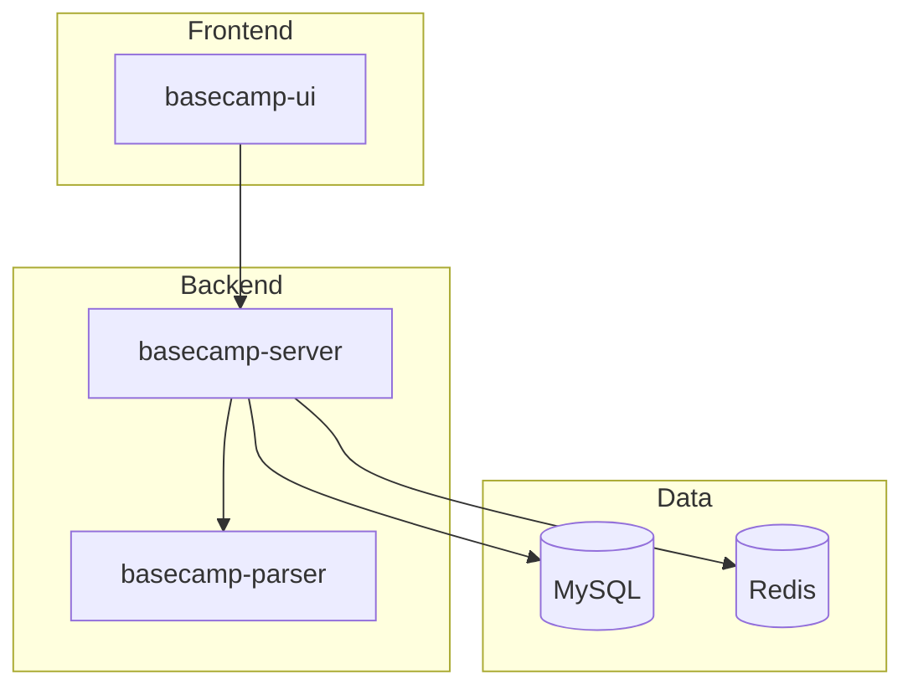
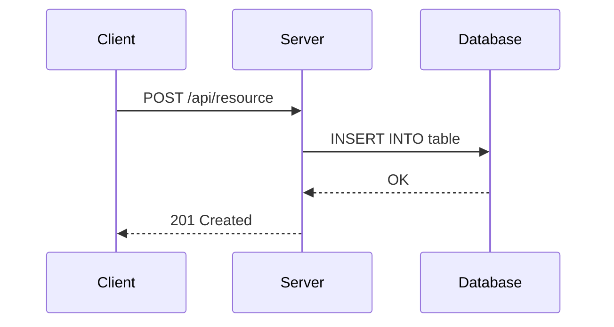
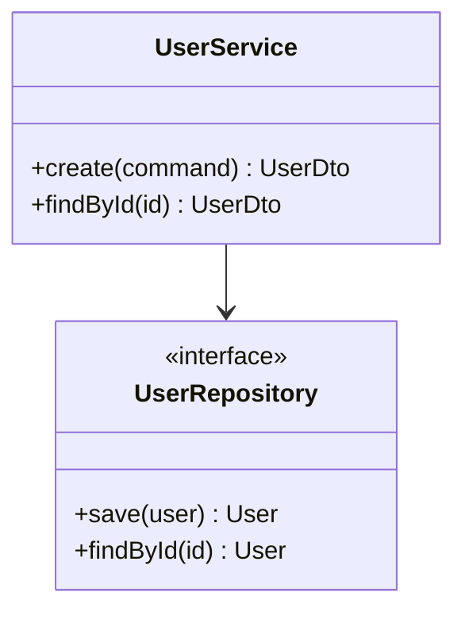

# Documentation

Technical documentation including API docs, comments, READMEs, and changelogs.

## When to Use

- API documentation generation
- Code comments and docstrings
- README creation/updates
- Changelog and release notes
- Architecture Decision Records

## MCP Workflow

```
# 1. Project structure (overview first)
serena.list_dir(relative_path=".", recursive=True, skip_ignored_files=True)

# 2. Module/component overview (signatures only)
serena.get_symbols_overview(relative_path="src/")

# 3. Existing documentation (check what exists)
serena.find_file(file_mask="*.md", relative_path=".")
serena.find_file(file_mask="README*", relative_path=".")

# 4. Symbol details (depth=1 for class methods, no bodies)
serena.find_symbol(name_path="UserService", depth=1, include_body=False)

# 5. Body ONLY when documenting specific method
serena.find_symbol(name_path="UserService/create", include_body=True)

# 6. Check past documentation decisions
claude-mem.search(query="documentation style", project="<project>")
```

## Efficiency Rules

**Do (Token-Efficient):**
- Use `get_symbols_overview` before reading any files
- Use `find_symbol(include_body=False)` for signatures
- Read bodies only for complex methods needing explanation
- Limit `list_dir` depth when possible

**Avoid (Token-Wasteful):**
- Reading entire source files to document
- Fetching all method bodies at once
- Recursive directory scans without `skip_ignored_files`

## Documentation Types

### Code Comments
```
/**
 * Brief summary of function/class.
 *
 * Detailed description if needed.
 *
 * @param paramName Description
 * @returns Description
 * @throws ErrorType When thrown
 *
 * @example
 * result = functionName(input)
 */
```

### API Documentation
```markdown
## Endpoint Name

Brief description.

### Request
**Method:** POST
**Path:** /api/v1/resource

| Field | Type | Required | Description |
|-------|------|----------|-------------|
| name | string | Yes | Resource name |

### Response (200)
{ "id": "string", "name": "string" }

### Errors
| Code | Description |
|------|-------------|
| 400 | Invalid input |
```

### README Structure
```markdown
# Project Name

Brief description.

## Quick Start

### Prerequisites
- Requirement 1

### Installation
[steps]

### Usage
[examples]

## Configuration
[options]

## Contributing
[guidelines]
```

### Changelog (Keep a Changelog)
```markdown
# Changelog

## [Unreleased]

### Added
- New feature (#issue)

### Changed
- Updated behavior

### Fixed
- Bug fix (#issue)

## [1.2.0] - YYYY-MM-DD
...
```

### ADR
```markdown
# ADR-001: [Title]

## Status
Proposed / Accepted / Deprecated

## Context
What issue motivates this decision?

## Decision
What change are we making?

## Consequences
What becomes easier or harder?
```

## Mermaid Diagrams

Use Mermaid for architecture documentation (renders in GitHub/GitLab).

### System Overview


### Sequence Diagram


### Class Diagram (Simplified)


## Output Format

```markdown
## Documentation Updates

| File | Change | Description |
|------|--------|-------------|
| README.md | Updated | Setup instructions |
| UserService | Added | Docstrings |

### Summary
- Added: N items
- Updated: M items
- Coverage: X%
```

## Quality Principles

1. **Clear**: No jargon without explanation
2. **Concise**: What needs to be said, nothing more
3. **Complete**: All important aspects
4. **Current**: Up to date with code
5. **Correct**: Technically accurate

## When to Document

**Always:** Public APIs, complex algorithms, non-obvious code
**Sometimes:** Private methods (when complex), configuration
**Rarely:** Simple getters, obvious code

## Checklist

### Code
- [ ] All public classes have summary
- [ ] All public methods documented
- [ ] Parameters and returns described
- [ ] Examples for complex APIs

### README
- [ ] Clear project description
- [ ] Quick start guide
- [ ] Prerequisites listed

### API
- [ ] All endpoints documented
- [ ] Request/response formats
- [ ] Error codes explained
