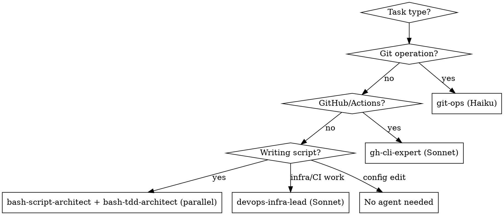

# Dotfiles Development

## Symlink Architecture

```
~/.dotfiles -> <repo>               # Primary anchor (points to repo root)
~/.zshrc                            # Bootstrap file (sources ~/.dotfiles/zshrc)
~/.ssh/config -> ~/.dotfiles/ssh/config
~/.config/nvim -> ~/.dotfiles/nvim
~/.claudescripts -> ~/.dotfiles/claudescripts
```

All paths resolve through `~/.dotfiles`. Scripts find the repo via:
```bash
DOTFILES_DIR="$(readlink -f "$HOME/.dotfiles")"
```

## Agent Selection



| Agent | Model | Use For |
|-------|-------|---------|
| `git-ops` | Haiku | **All git operations** - commits, branches, status. Isolates git context from main conversation. |
| `bash-script-architect` | Haiku | Writing/debugging bash scripts |
| `bash-tdd-architect` | inherit | TDD for bash scripts - runs **IN PARALLEL** with `bash-script-architect` |
| `gh-cli-expert` | Sonnet | GitHub Actions failures, PR management, gh CLI |
| `devops-infra-lead` | Sonnet | Infrastructure, CI/CD, system admin |

**Important:** For committing changes, use the `git-ops` agent (not generic skills). It keeps git output isolated from the main context window.

**TDD for Scripts:** When writing or modifying bash scripts, launch `bash-tdd-architect` **IN PARALLEL** with `bash-script-architect`. The TDD agent designs behavior-driven tests BEFORE seeing implementation, ensuring true test-first development.

## Wrapper Scripts (claudescripts/)

| Script | Model | Purpose |
|--------|-------|---------|
| `push` | Haiku | Quick commit/push with conventional commits |
| `ghcli` | Sonnet | GitHub CLI operations |
| `support` | Opus | Bash debugging with web search |

Accessed via `~/.claudescripts` symlink (in PATH).

## Adding New Configurations

| Step | Action | Script to Update |
|------|--------|------------------|
| 1 | Add file to repo root (no dot prefix) | — |
| 2 | Add chmod line for permissions | **fix-perms** (`bin/dotfiles-fix-perms`) |
| 3 | Add symlink if needed | **install** (`bin/dotfiles-install`) |

**Detailed steps:**

1. **Add file** to repo root (no dot prefix in name)
2. **Update fix-perms** — Add chmod line to `bin/dotfiles-fix-perms`:
   - Scripts/dirs: `chmod 700`
   - Config files: `chmod 600`
3. **Update install** (if needed) — Add symlink to `setup_symlinks()` in `bin/dotfiles-install`

> **Common mistake:** Forgetting the fix-perms step. Every new file needs a chmod line.

## Permission Model

| Type | Permission | Example |
|------|------------|---------|
| Directories | 700 | `nvim/`, `bin/` |
| Scripts | 700 | `bin/dotfiles-install`, `bin/dotfiles-sync` |
| Config files | 600 | `zshrc`, `ssh/config` |

Git hooks auto-fix permissions on pulls via `bin/dotfiles-fix-perms`.

## Testing Changes

```bash
source ~/.zshrc                      # Reload shell config
./bin/dotfiles-install               # Safe to re-run (idempotent)
ls -la                               # Verify permissions
```

## Common Mistakes

| Mistake | Fix |
|---------|-----|
| Adding dot prefix to files | Use `zshrc` not `.zshrc` - symlinks add the dot |
| Forgetting fix-perms | Every new file needs a chmod line in `bin/dotfiles-fix-perms` |
| Wrong permission value | Scripts=700, configs=600 |
| Editing ~/.zshrc directly | Edit `zshrc` at repo root - bootstrap file just sources it |
| Hardcoding paths | Use `$HOME/.dotfiles` or resolve via symlink |

## Key Files

- `bin/dotfiles-install` - Bootstrap, symlinks, dependencies
- `bin/dotfiles-fix-perms` - Permission management
- `bin/dotfiles-sync` - Pull and fix permissions
- `CLAUDE.md` - Repository overview
- `bin/CLAUDE.md` - Scripts documentation
