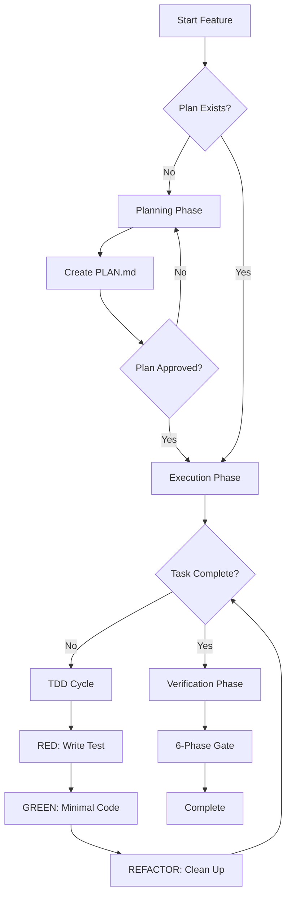

<mission_control>
<objective>Guide software development from planning through verification with TDD discipline and quality gates</objective>
<success_criteria>All phases completed with evidence: plan created, TDD cycle followed, all 6 quality gates pass</success_criteria>
</mission_control>

# Engineering Lifecycle

**Skill Location**: This file

## Workflow

**Plan new feature:** `/plan:create` → Brief → Roadmap → Phases

**Continue existing work:** `/strategy:execute` → Executes STRATEGY.md phases with parallel batching

**Implement with TDD:** RED (write test) → GREEN (minimal code) → REFACTOR (cleanup)

**Verify completion:** `/quality:run-gates` (6-phase) or `/quality:quick` (5-phase)

**Why:** TDD discipline catches bugs early—80%+ coverage target ensures maintainability.

## Batching Strategy

**Redline Protocol**: When implementing multiple features:

1. **Plan all features** → Create single PLAN.md with all features
2. **Execute sequentially** → Each feature RED→GREEN→REFACTOR
3. **Verify after each** → Run quality gates before next
4. **Batch commits** → Single commit for related features

## Navigation

| If you need...           | Read...                                               |
| :----------------------- | :---------------------------------------------------- |
| Plan new feature         | ## Workflow → /plan:create                            |
| Continue existing work   | ## Workflow → /strategy:execute                       |
| Implement with TDD       | ## Workflow → RED→GREEN→REFACTOR                      |
| Verify completion        | ## Workflow → /quality:run-gates                      |
| Quick verification       | ## Workflow → /quality:quick                          |
| Check single phase       | ## Workflow → /quality:check                          |
| Multi-feature batching   | ## Batching Strategy                                  |
| TDD cycle patterns       | ## Implementation Patterns → TDD Cycle                |
| PLAN.md structure        | ## Implementation Patterns → PLAN.md Structure        |
| Execution mode selection | ## Implementation Patterns → Execution Mode Selection |

## System Requirements

- **Plan structure**: 2-3 task chunks, <50% context usage
- **TDD cycle**: RED (test) → GREEN (code) → REFACTOR (cleanup)
- **Coverage target**: 80%+ for new code
- **Quality gates**: BUILD → TYPE → LINT → TEST → SECURITY → DIFF

---

## The Path to High-Quality Engineering

1. **The TDD Discipline** — Test-Driven Development catches bugs early, when they're cheapest to fix. RED→GREEN→REFACTOR creates a rhythm of verification that prevents technical debt.

2. **Plan Discipline** — Focused plans with 2-3 tasks maintain cognitive clarity. Scope creep destroys plans—new ideas go back to planning, not into current execution.

3. **Verification Discipline** — Quality gates prevent debt accumulation. Every skipped gate compounds technical debt. Verification is practice, not a checkpoint.

4. **Coverage Excellence** — 80%+ coverage ensures maintainability and confidence in changes. Tests after = tests that don't catch regression.

---

## Implementation Patterns

### Pattern: TDD Cycle

```typescript
// RED: Write failing test
describe("Calculator", () => {
  it("adds two numbers", () => {
    expect(add(10, 20)).toBe(30);
  });
});
// Result: Fails — add() is not defined

// GREEN: Minimal code to pass
export const add = (a: number, b: number): number => a + b;

// REFACTOR: Clean up while tests stay green
export function add(a: number, b: number): number {
  if (!Number.isFinite(a) || !Number.isFinite(b)) {
    throw new Error("Arguments must be finite numbers");
  }
  return a + b;
}
```

### Pattern: PLAN.md Structure

```markdown
# Feature: User Authentication

## Overview

Brief description of the feature.

## Tasks

### Task 1: Implement auth service

- [ ] Create auth service with login/logout
- [ ] Add unit tests

### Task 2: Add JWT tokens

- [ ] Implement token generation
- [ ] Add token validation

## Verification

- [ ] All tests pass
- [ ] TypeScript compiles without errors
- [ ] ESLint reports no issues
```

### Pattern: Execution Mode Selection

| Mode         | Behavior                                              | Use When                   |
| ------------ | ----------------------------------------------------- | -------------------------- |
| `autonomous` | Plan has no checkpoints → Fresh subagent executes all | Simple, well-defined tasks |
| `segmented`  | Human-verify checkpoints → Subagent for segments      | Medium complexity          |
| `main`       | Decision/action checkpoints → Main context execution  | Complex, requires context  |
| `reviewed`   | Quality gates → Fresh subagent + 2-stage review       | Critical code              |

## Troubleshooting

| Issue            | Symptom                             | Solution                     |
| ---------------- | ----------------------------------- | ---------------------------- |
| Context overflow | PLAN.md too large                   | Split into 2-3 task chunks   |
| Tests failing    | RED phase incomplete                | Write minimal code to pass   |
| Low coverage     | <80% code coverage                  | Add more test cases          |
| Type errors      | TypeScript compilation fails        | Fix type annotations         |
| Gates failing    | BUILD/TYPE/LINT/TEST/SECURITY fails | Fix issues before proceeding |

## Core Loop

PLANNING → IMPLEMENTATION (TDD) → EXECUTION → VERIFICATION

## Workflow Overview



### TDD Loop Detail


## Workflow Patterns

### Planning with Funnel

#### Explore Step

- Investigate codebase, git history, constraints

#### Ask Step

- One focused question with 2-4 recognition-based options

#### Refine Step

- Next question if scope still unclear

#### Write Step

- Generate PLAN.md with checkpoints and verification criteria

#### Confirm Step

- "Plan ready. Invoke /strategy:execute?"

### TDD Implementation

#### Explore Step

- Identify test cases: happy path, edge cases, error scenarios

#### Write Step

1. RED: Write failing test (one behavior, real code)
2. GREEN: Minimal code to pass (no features)
3. REFACTOR: Clean up while tests stay green

#### Confirm Step

- Verify 80%+ coverage achieved

### Execution with Mode Routing

#### Autonomous Mode

Plan has no checkpoints → Fresh subagent executes all tasks

#### Segmented Mode

Plan has human-verify checkpoints → Subagent for segments, main for checkpoints

#### Main Context Mode

Plan has decision/action checkpoints → Sequential main context execution

#### Reviewed Mode

Quality gates requested → Fresh subagent + 2-stage review

## The TDD Pattern

Apply the RED-GREEN-REFACTOR cycle to every behavior:

### 1. RED (The Specification)

```typescript
// tests/calculator.spec.ts
describe("Calculator", () => {
  it("adds two numbers", () => {
    expect(add(10, 20)).toBe(30);
  });
});
// Result: Fails — add() is not defined
```

### 2. GREEN (The Minimum)

```typescript
// src/calculator.ts
export const add = (a: number, b: number): number => a + b;
```

### 3. REFACTOR (The Cleanup)

Add types, edge cases, and polish without changing behavior:

```typescript
// src/calculator.ts
export function add(a: number, b: number): number {
  if (!Number.isFinite(a) || !Number.isFinite(b)) {
    throw new Error("Arguments must be finite numbers");
  }
  return a + b;
}
```

**The invariant**: Tests define behavior. Code implements it. Refactoring improves structure without changing either.

## References

| If You Need...           | Read...                                |
| ------------------------ | -------------------------------------- |
| User interaction pattern | `references/pattern_funnel.md`         |
| Execution mode selection | `references/lookup_execution-modes.md` |
| TDD cycle details        | `references/pattern_tdd.md`            |
| CLI automation limits    | `references/lookup_cli-automation.md`  |
| PLAN.md format           | `references/lookup_plan-format.md`     |
| TDD prompt injection     | `references/pattern_tdd-injection.md`  |
| Quality gate commands    | `/quality:run-gates`, `/quality:quick`, `/quality:check` |
| Strategy execution       | `/strategy:execute`                    |

## YAGNI Principle

**YAGNI ruthlessly** - Prevent scope creep during implementation.

Before adding any feature, ask:

- [ ] Is this in the original plan?
- [ ] Does the spec require this?
- [ ] Can the task complete without this?

If you catch yourself thinking "while we're at it, let's add...", stop. That's scope creep, not quality.

**Scope discipline**: Implement only what's specified. New ideas go back to planning.

---

## Common Rationalizations

| Excuse                                    | Reality                                                   |
| ----------------------------------------- | --------------------------------------------------------- |
| "Tests pass, we're done"                  | Coverage target is 80%+. Missing tests = technical debt.  |
| "Can skip verification this once"         | Every skipped gate is debt accumulated.                   |
| "I'll write tests after this feature"     | Tests after = tests that don't catch regression.          |
| "The build succeeded, types must be fine" | Type checking is separate from building. Run `tsc`.       |
| "Linting is just style, not important"    | Style consistency prevents bugs and improves maintenance. |
| "Let's just push and fix later"           | Technical debt compounds. Fix now or fix never.           |

**If you catch yourself thinking these, STOP. Run the gates.**

---

## Few-Shot PLAN.md Examples

Use `examples/` for reference when creating plans:

| Example File        | Shows...                                       |
| ------------------- | ---------------------------------------------- |
| `user-auth-plan.md` | Feature plan with 3 tasks, TDD verification    |
| `rest-api-plan.md`  | API feature with CRUD tasks, TDD cycle example |

---

## PLAN.md Structure Reference

```markdown
# Feature: [Name]

## Overview

Brief description of what this feature does.

## Tasks

### Task 1: [First atomic unit]

- [ ] Subtask 1
- [ ] Subtask 2

### Task 2: [Second atomic unit]

- [ ] Subtask 1
- [ ] Subtask 2

## Verification

- [ ] Criterion 1
- [ ] Criterion 2
```

**Key principles:**

- 2-3 tasks max (keep context under 50%)
- Each task is atomic and independently verifiable
- Tasks follow RED→GREEN→REFACTOR cycle

---

## Operational Patterns

This skill follows these behavioral patterns:

- **Planning**: Switch to planning mode for architectural phases
- **Tracking**: Maintain a visible task list throughout execution
- **Delegation**: Delegate implementation to specialized workers
- **Verification**: Verify quality metrics before claiming completion

Use native tools to fulfill these patterns. Trust the System Prompt to select the correct implementation.

---

## The Iron Law

**NO COMPLETION CLAIMS WITHOUT FRESH VERIFICATION EVIDENCE**

If you haven't passed all 6 quality gates, completion cannot be claimed.

### The 6-Phase Gate System

| Phase | Gate     | What It Checks              | Typical Command |
| ----- | -------- | --------------------------- | --------------- |
| 1     | BUILD    | Compilation succeeds        | `npm run build` |
| 2     | TYPE     | Type safety                 | `tsc --noEmit`  |
| 3     | LINT     | Code style                  | `eslint .`      |
| 4     | TEST     | Tests pass                  | `npm test`      |
| 5     | SECURITY | No secrets, vulnerabilities | `npm audit`     |
| 6     | DIFF     | Intentional changes         | `git diff`      |

**Violating the letter of this process is violating the spirit of quality.**

---

## Common Mistakes to Avoid

### Mistake 1: Skipping the Test Phase

❌ **Wrong:**
```typescript
// Write production code first
export function add(a, b) { return a + b; }
```

✅ **Correct:**
```typescript
// RED: Write failing test first
describe("Calculator", () => {
  it("adds two numbers", () => {
    expect(add(10, 20)).toBe(30);
  });
});
// Then implement production code
```

### Mistake 2: Writing Too Much Code in GREEN

❌ **Wrong:**
```typescript
// GREEN: Adding validation, edge cases, features
export function add(a, b) {
  if (!Number.isFinite(a) || !Number.isFinite(b)) {
    throw new Error("Arguments must be finite numbers");
  }
  if (a < 0 || b < 0) { /* more logic */ }
  return a + b;
}
```

✅ **Correct:**
```typescript
// GREEN: Minimal code to pass the test
export const add = (a, b) => a + b;

// REFACTOR: Add validation afterward
export function add(a, b) {
  if (!Number.isFinite(a) || !Number.isFinite(b)) {
    throw new Error("Arguments must be finite numbers");
  }
  return a + b;
}
```

### Mistake 3: Skipping Quality Gates

❌ **Wrong:**
"Tests pass, we're done" → Skip BUILD, TYPE, LINT, SECURITY, DIFF

✅ **Correct:**
Run all 6 phases: BUILD → TYPE → LINT → TEST → SECURITY → DIFF

### Mistake 4: Large Plans (>3 tasks)

❌ **Wrong:**
"Plan has 10 tasks covering 5 features" → Context overflow, confusion

✅ **Correct:**
"Plan has 2-3 tasks for one feature" → Clear scope, focused execution

---

## Validation Checklist

Before claiming feature completion:

**Plan Quality:**
- [ ] Plan has 2-3 tasks max
- [ ] Tasks are atomic and independently verifiable
- [ ] Each task has verification criteria

**TDD Discipline:**
- [ ] RED phase: Failing test written first
- [ ] GREEN phase: Minimal code to pass
- [ ] REFACTOR phase: Cleanup without changing behavior
- [ ] Coverage target: 80%+ achieved

**Quality Gates:**
- [ ] BUILD: Compilation succeeds
- [ ] TYPE: TypeScript compiles without errors
- [ ] LINT: ESLint reports no issues
- [ ] TEST: All tests pass
- [ ] SECURITY: No vulnerabilities
- [ ] DIFF: Changes are intentional

---

## Best Practices Summary

✅ **DO:**
- Write failing tests before production code (RED)
- Implement minimal code to pass tests (GREEN)
- Refactor after tests pass
- Keep plans to 2-3 tasks
- Run all 6 quality gates
- Aim for 80%+ test coverage
- Verify evidence before claiming completion

❌ **DON'T:**
- Write production code before tests
- Add features in GREEN phase
- Skip quality gates
- Create plans with >3 tasks
- Skip TypeScript compilation check
- Trust "build succeeded" for type safety
- Push code without running gates

---

This component carries essential Seed System principles for context fork isolation:

<critical_constraint>
**System Physics:**

1. Zero external dependencies (portability invariant)
2. 80-95% autonomy target
3. What-When-Not-Includes format
4. Progressive disclosure structure
</critical_constraint>

**Delta Standard**: Good Component = Expert Knowledge − What Claude Already Knows

## Recognition Questions

| Question | Recognition |
| :------- | :---------- |
| Would Claude know this without being told? | Delete (zero delta) |
| Can this work standalone? | Fix if no (non-self-sufficient) |
| Did I read the actual file, or just see it in grep? | Verify before claiming |

---

## Validation Checklist

Before claiming engineering lifecycle complete:

- [ ] TDD phases followed (RED → GREEN → REFACTOR)
- [ ] Execution routing applied
- [ ] Verification strategy executed
- [ ] Quality gates passed

---

<critical_constraint>