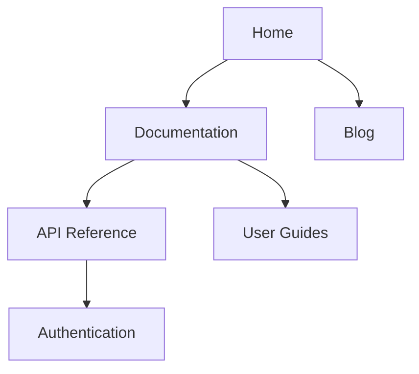

# Generate Sitemap Skill

Generate a hierarchical representation of the site structure and navigation maps. This skill visualizes the information architecture to support user experience design and content organization.

## Inputs

- `PATH` - The root directory of the project or site (e.g., "/project")
- `HIERARCHICAL` - (Optional) Boolean, whether to strictly follow directory hierarchy (default: true)
- `CROSS_REFERENCES` - (Optional) Boolean, whether to include cross-links between pages (default: false)
- `EXPORT_FORMAT` - (Optional) Output format: "markdown", "xml", "svg", "mermaid" (default: "mermaid")

## Workflow

### Step 1: Structure Traversal

Traverse the `PATH` to understand the directory and file structure.
- Build a tree representation of folders and files.
- Identify "index" or "home" pages for each section.

### Step 2: Relationship Mapping

If `CROSS_REFERENCES` is true, analyze links within content to identify non-hierarchical connections.
- Map internal links between nodes.
- Identify "See Also" or related content sections.

### Step 3: Visualization Generation

Convert the structural tree into the requested `EXPORT_FORMAT`.

**For Mermaid (Diagram):**
- Generate a graph TD or Mindmap definition.
- Nodes represent pages/sections.
- Edges represent hierarchy (parent-child) or links.

**For XML (Standard Sitemap):**
- Generate compliant sitemap.xml format.

### Step 4: Output Rendering

Return the generated sitemap code or file.

## Required Outputs

A `SITEMAP_OUTPUT` string containing the sitemap representation in the specified `OUTPUT_FORMAT`.

**Example (Mermaid):**

## Quick Reference

- **Purpose**: Visualize and plan information architecture and navigation.
- **Tools**: Compatible with Mermaid.js for visualization.
