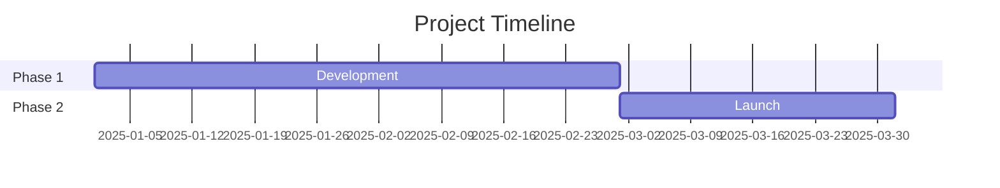
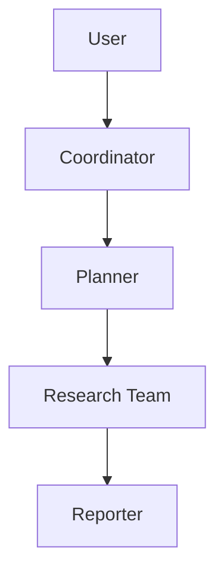
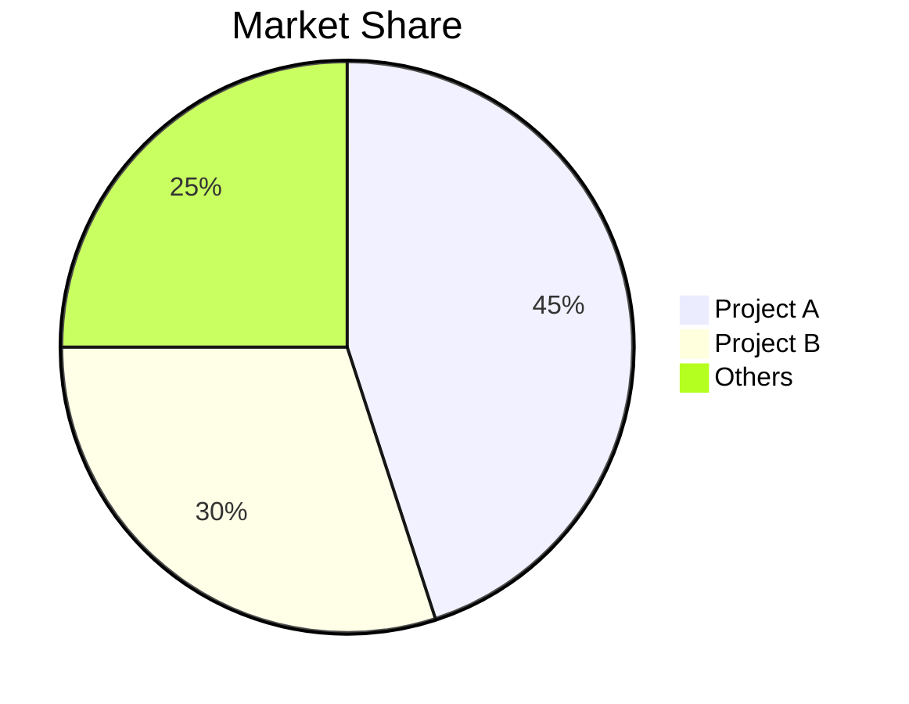

# GitHub Deep Research Skill

Multi-round research combining GitHub API, web_search, web_fetch to produce comprehensive markdown reports.

## Research Workflow

- Round 1: GitHub API
- Round 2: Discovery
- Round 3: Deep Investigation
- Round 4: Deep Dive

## Core Methodology

### Query Strategy

**Broad to Narrow**: Start with GitHub API, then general queries, refine based on findings.

```
Round 1: GitHub API
Round 2: "{topic} overview"
Round 3: "{topic} architecture", "{topic} vs alternatives"
Round 4: "{topic} issues", "{topic} roadmap", "site:github.com {topic}"
```

**Source Prioritization**:
1. Official docs/repos (highest weight)
2. Technical blogs (Medium, Dev.to)
3. News articles (verified outlets)
4. Community discussions (Reddit, HN)
5. Social media (lowest weight, for sentiment)

### Research Rounds

**Round 1 - GitHub API**
Directly execute `scripts/github_api.py` without `read_file()`:
```bash
python /path/to/skill/scripts/github_api.py <owner> <repo> summary
python /path/to/skill/scripts/github_api.py <owner> <repo> readme
python /path/to/skill/scripts/github_api.py <owner> <repo> tree
```

**Available commands (the last argument of `github_api.py`):**
- summary
- info
- readme
- tree
- languages
- contributors
- commits
- issues
- prs
- releases

**Round 2 - Discovery (3-5 web_search)**
- Get overview and identify key terms
- Find official website/repo
- Identify main players/competitors

**Round 3 - Deep Investigation (5-10 web_search + web_fetch)**
- Technical architecture details
- Timeline of key events
- Community sentiment
- Use web_fetch on valuable URLs for full content

**Round 4 - Deep Dive**
- Analyze commit history for timeline
- Review issues/PRs for feature evolution
- Check contributor activity

## Report Structure

Follow template in `assets/report_template.md`:

1. **Metadata Block** - Date, confidence level, subject
2. **Executive Summary** - 2-3 sentence overview with key metrics
3. **Chronological Timeline** - Phased breakdown with dates
4. **Key Analysis Sections** - Topic-specific deep dives
5. **Metrics & Comparisons** - Tables, growth charts
6. **Strengths & Weaknesses** - Balanced assessment
7. **Sources** - Categorized references
8. **Confidence Assessment** - Claims by confidence level
9. **Methodology** - Research approach used

### Mermaid Diagrams

Include diagrams where helpful:

**Timeline (Gantt)**:


**Architecture (Flowchart)**:


**Comparison (Pie/Bar)**:


## Confidence Scoring

Assign confidence based on source quality:

| Confidence | Criteria |
|------------|----------|
| High (90%+) | Official docs, GitHub data, multiple corroborating sources |
| Medium (70-89%) | Single reliable source, recent articles |
| Low (50-69%) | Social media, unverified claims, outdated info |

## Output

Save report as: `research_{topic}_{YYYYMMDD}.md`

### Formatting Rules

- Chinese content: Use full-width punctuation（，。：；！？）
- Technical terms: Provide Wiki/doc URL on first mention
- Tables: Use for metrics, comparisons
- Code blocks: For technical examples
- Mermaid: For architecture, timelines, flows

## Best Practices

1. **Start with official sources** - Repo, docs, company blog
2. **Verify dates from commits/PRs** - More reliable than articles
3. **Triangulate claims** - 2+ independent sources
4. **Note conflicting info** - Don't hide contradictions
5. **Distinguish fact vs opinion** - Label speculation clearly
6. **Reference sources** - Add source references near claims where applicable
7. **Update as you go** - Don't wait until end to synthesize
