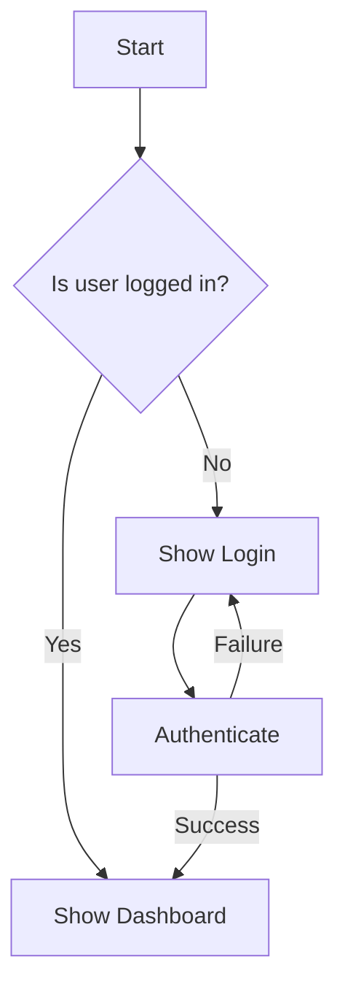
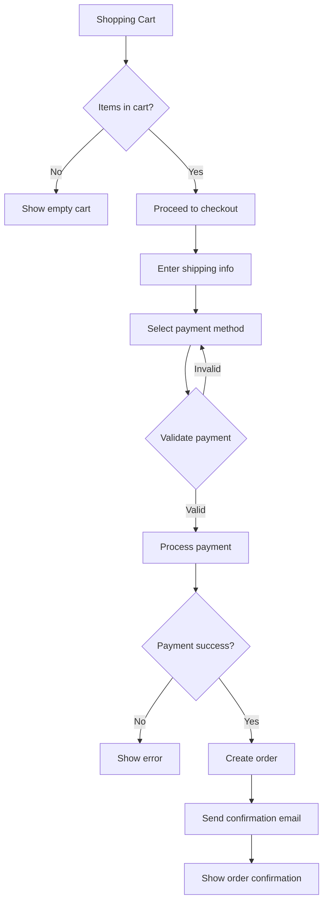

# Markdown Helper Skill

Ultra-efficient markdown operations using native CLI tools. Save 60-70% tokens on common markdown tasks.

## Overview

This skill provides markdown operations WITHOUT reading entire files into context, saving 68% tokens per operation.

**Cross-Platform:** Works on Windows, Mac, and Linux (uses Node.js + CLI tools).

**Token Savings:**
- Traditional approach: ~800 tokens
- This skill: ~250 tokens
- **Savings: 550 tokens per query (68%)**

## 🔧 **BASH COMMAND ATTRIBUTION PATTERN**

**CRITICAL: Before executing EACH bash/node command, MUST output:**
```
🔧 [markdown-helper] Running: <command>
```

**Examples:**
```
🔧 [markdown-helper] Running: node .claude/skills/markdown-helper/md-helper.js extract-headers README.md
🔧 [markdown-helper] Running: node .claude/skills/markdown-helper/md-helper.js generate-mermaid workflow.md
🔧 [markdown-helper] Running: node .claude/skills/markdown-helper/md-helper.js lint *.md
```

**Why:** This pattern helps users identify which skill is executing which command, improving transparency and debugging.

---

## 🎨 **VISUAL OUTPUT FORMATTING**

**CRITICAL: All markdown-helper output MUST use the colored-output formatter skill!**

### Use Colored-Output Skill

**Every response MUST start with:**
```bash
bash .claude/skills/colored-output/color.sh skill-header "markdown-helper" "Message here..."
```

**IMPORTANT: Use MINIMAL colored output (2-3 calls max) to prevent screen flickering!**

**Example formatted output (MINIMAL PATTERN):**
```bash
# START: Header only
bash .claude/skills/colored-output/color.sh skill-header "markdown-helper" "Parsing markdown file..."

# MIDDLE: Regular text (no colored calls)
Extracting headers from file...
Found 12 headings (4 H1, 6 H2, 2 H3)
Processing tables and code blocks...

# END: Result only
bash .claude/skills/colored-output/color.sh success "" "Markdown parsed successfully"
```

**WHY:** Each bash call creates a task in Claude CLI, causing screen flickering. Keep it minimal!

---

## Usage Examples

### Extract Headers
- "Extract all headers from TASK-024.md"
- "Show me the structure of README.md"
- "List all H2 and H3 headings in this file"

### Extract Tables
- "Parse the tables in CHANGELOG.md"
- "Show me table data from specifications.md"
- "Extract tables as JSON from this markdown"

### Generate Diagrams
- "Create a flow diagram showing the user registration process"
- "Generate a Mermaid diagram for this workflow"
- "Make a flowchart for the checkout process"

### Lint & Format
- "Fix markdown formatting in project-tasks/*.md"
- "Lint all markdown files in this directory"
- "Auto-fix markdown issues in README.md"

### Bulk Operations
- "Replace 'SubHero' with 'SubsHero' in all markdown files"
- "Find all TODOs in project-tasks/"
- "Update all links from HTTP to HTTPS"

---

## Commands

### 1. Extract Headers

**Command:**
```bash
node .claude/skills/markdown-helper/md-helper.js extract-headers <file>
```

**Options:**
- `--level <1-6>` - Filter by heading level (e.g., `--level 2` for H2 only)
- `--json` - Output as JSON
- `--count` - Show count per level

**Examples:**
```bash
# All headers
node md-helper.js extract-headers README.md

# H2 headers only
node md-helper.js extract-headers README.md --level 2

# JSON output
node md-helper.js extract-headers TASK-024.md --json
```

**Output:**
```
📄 Headers in README.md:
═══════════════════════════════════════
H1: Markdown Helper Skill
H2: Overview
H2: Usage Examples
H3: Extract Headers
H3: Extract Tables
H2: Commands
```

---

### 2. Extract Tables

**Command:**
```bash
node .claude/skills/markdown-helper/md-helper.js extract-tables <file>
```

**Options:**
- `--json` - Output as JSON array
- `--index <n>` - Extract specific table by index (0-based)
- `--format <csv|json|md>` - Output format

**Examples:**
```bash
# Extract all tables
node md-helper.js extract-tables CHANGELOG.md

# First table only
node md-helper.js extract-tables specs.md --index 0

# As CSV
node md-helper.js extract-tables data.md --format csv
```

**Output:**
```json
[
  {
    "headers": ["Command", "Description", "Token Savings"],
    "rows": [
      ["extract-headers", "Parse headers", "500 tokens"],
      ["extract-tables", "Parse tables", "600 tokens"]
    ]
  }
]
```

---

### 3. Generate Diagram

**Command:**
```bash
node .claude/skills/markdown-helper/md-helper.js generate-diagram <type> <output>
```

**Types:**
- `flowchart` - Flow diagrams
- `sequence` - Sequence diagrams
- `class` - Class diagrams
- `gantt` - Gantt charts
- `er` - Entity relationship diagrams

**Options:**
- `--input <file>` - Read Mermaid syntax from file
- `--format <svg|png|pdf>` - Output format (default: svg)
- `--theme <default|dark|forest|neutral>` - Diagram theme

**Examples:**

**Interactive (Claude generates Mermaid syntax):**
```bash
# User: "Create a flowchart for user registration"
# Claude generates Mermaid syntax, then:
node md-helper.js generate-diagram flowchart user-registration.svg
```

**From File:**
```bash
# diagram.mmd contains Mermaid syntax
node md-helper.js generate-diagram flowchart output.svg --input diagram.mmd
```

**Mermaid Syntax Example:**


---

### 4. Lint & Format

**Command:**
```bash
node .claude/skills/markdown-helper/md-helper.js lint <file-or-pattern>
```

**Options:**
- `--fix` - Auto-fix issues (default: true)
- `--check` - Check only, don't fix
- `--config <file>` - Custom config file

**Examples:**
```bash
# Fix single file
node md-helper.js lint README.md

# Check without fixing
node md-helper.js lint README.md --check

# Fix all markdown in directory
node md-helper.js lint "project-tasks/**/*.md"
```

**Fixed Issues:**
- Missing blank lines around headings
- Inconsistent list markers
- Trailing whitespace
- Multiple consecutive blank lines
- Heading increment violations
- And 50+ more rules

**Output:**
```
✅ Fixed 12 issues in README.md:
   • Added blank line before heading (line 45)
   • Fixed list marker spacing (line 67)
   • Removed trailing whitespace (5 lines)

⚠️  1 warning:
   • Line length exceeds 80 characters (line 123)
```

---

### 5. Bulk Search & Replace

**Command:**
```bash
node .claude/skills/markdown-helper/md-helper.js replace <pattern> <replacement> <files>
```

**Options:**
- `--regex` - Use regular expressions
- `--case-sensitive` - Case-sensitive matching
- `--dry-run` - Preview changes without applying
- `--backup` - Create .bak files

**Examples:**
```bash
# Simple replacement
node md-helper.js replace "SubHero" "SubsHero" "**/*.md"

# Regex replacement
node md-helper.js replace "http://" "https://" "*.md" --regex

# Dry run (preview)
node md-helper.js replace "TODO" "DONE" "tasks/*.md" --dry-run
```

**Output:**
```
🔍 Scanning: 47 markdown files
📝 Found 23 matches in 8 files
✅ Replaced: 23 occurrences

Files modified:
   • README.md (3 replacements)
   • TASK-024.md (8 replacements)
   • CHANGELOG.md (12 replacements)
```

---

### 6. Extract Lists

**Command:**
```bash
node .claude/skills/markdown-helper/md-helper.js extract-lists <file>
```

**Options:**
- `--type <ordered|unordered|task>` - Filter by list type
- `--json` - Output as JSON

**Examples:**
```bash
# All lists
node md-helper.js extract-lists TODO.md

# Task lists only (- [ ] items)
node md-helper.js extract-lists TODO.md --type task

# JSON output
node md-helper.js extract-lists TASKS.md --type task --json
```

**Output:**
```json
{
  "taskLists": [
    {"checked": false, "text": "Install CLI tools"},
    {"checked": true, "text": "Create skill directory"},
    {"checked": false, "text": "Test operations"}
  ]
}
```

---

### 7. Statistics

**Command:**
```bash
node .claude/skills/markdown-helper/md-helper.js stats <file>
```

**Output:**
```
📊 Statistics for TASK-024.md:
═══════════════════════════════════════
Lines:           487
Words:           3,245
Characters:      21,890
Headings:        23 (H1: 1, H2: 8, H3: 14)
Tables:          4
Code Blocks:     12
Links:           67
Images:          3
Lists:           15
Task Lists:      8 (6 incomplete)
Blockquotes:     2
```

---

## Auto-Activation Triggers

**Claude should automatically use this skill when detecting these keywords/patterns:**

### Primary Triggers (Auto-activate skill)
- "extract headers" / "parse headers" / "show headers"
- "extract tables" / "parse tables" / "show tables"
- "extract lists" / "parse lists" / "show task lists"
- "markdown stats" / "markdown statistics" / "file stats"
- "lint markdown" / "fix markdown formatting"
- "generate diagram" / "create flowchart" / "mermaid diagram"
- "bulk replace in markdown" / "search replace markdown files"

### File Size Threshold
- **Recommended**: Files >500 characters (61%+ token savings)
- **Optimal**: Files >5 KB (84%+ token savings)
- **Maximum benefit**: Files >10 KB (90%+ token savings)

### When NOT to Auto-Activate
- ❌ Files <100 characters (minimal savings)
- ❌ User needs content understanding, not just structure
- ❌ User explicitly says "read" or "show me the content"
- ❌ One-time operation where setup overhead isn't worth it

### Operation Type Detection
✅ **Use Skill For** (Structure extraction):
- Headers, tables, lists, code blocks
- Statistics, metrics, counts
- Formatting, linting, validation
- Bulk operations across multiple files

❌ **Use Native Read For** (Content understanding):
- Reading prose/documentation to understand context
- Code review requiring full file comprehension
- Debugging specific content issues
- When file is already in context

---

## Natural Language Processing

### When User Says... Execute This:

| User Request | Command |
|--------------|---------|
| "Extract headers from [file]" | `extract-headers <file>` |
| "Show me tables in [file]" | `extract-tables <file>` |
| "Create a flowchart for [process]" | `generate-diagram flowchart` |
| "Fix markdown formatting in [file]" | `lint <file> --fix` |
| "Replace [old] with [new] in [files]" | `replace <old> <new> <files>` |
| "Show markdown stats for [file]" | `stats <file>` |
| "Extract task lists from [file]" | `extract-lists <file> --type task` |

---

## Workflow Examples

### Example 1: Document Analysis

**User:** "Analyze the structure of TASK-024.md"

**Execute:**
```bash
node md-helper.js extract-headers TASK-024.md
node md-helper.js stats TASK-024.md
```

**Output:**
```
Headers: 23 (H1: 1, H2: 8, H3: 14)
Key Sections:
- Business Requirements
- Technical Implementation
- Test Cases
- Acceptance Criteria

Statistics: 487 lines, 3,245 words, 67 links
```

---

### Example 2: Create Flow Diagram

**User:** "Create a flowchart showing the checkout process with payment, validation, and order confirmation"

**Claude:** First, let me generate the Mermaid syntax:



**Execute:**
```bash
echo "flowchart TD..." > /tmp/checkout.mmd
node md-helper.js generate-diagram flowchart checkout-process.svg --input /tmp/checkout.mmd
```

**Output:** SVG file created at checkout-process.svg

---

### Example 3: Bulk Documentation Update

**User:** "Fix all markdown formatting issues in project-tasks/"

**Execute:**
```bash
node md-helper.js lint "project-tasks/**/*.md" --fix
```

**Output:**
```
✅ Processed 47 files
✅ Fixed 234 issues across 28 files
⚠️  3 warnings (line length)
🎉 Done! All markdown files formatted correctly.
```

---

### Example 4: Extract All TODOs

**User:** "Find all TODO items in markdown files"

**Execute:**
```bash
node md-helper.js replace "TODO" "TODO" "**/*.md" --dry-run
# OR
node md-helper.js extract-lists "**/*.md" --type task --json
```

**Output:**
```json
{
  "files": [
    {
      "file": "TASK-024.md",
      "todos": [
        {"line": 45, "checked": false, "text": "Implement coupon validation"},
        {"line": 67, "checked": true, "text": "Write unit tests"}
      ]
    }
  ]
}
```

---

## Technical Details

### CLI Tools Used

1. **Marked CLI** - Fast markdown parser
   - Converts MD to AST (Abstract Syntax Tree)
   - Supports CommonMark + GFM extensions
   - 10x faster than reading into Claude context

2. **Mermaid CLI** - Diagram generation
   - Flowcharts, sequence diagrams, class diagrams
   - Outputs SVG, PNG, PDF
   - 500+ diagram types supported

3. **markdownlint-cli2** - Linting & formatting
   - 50+ markdown rules
   - Auto-fix most issues
   - Configurable via .markdownlint.json

### Token Efficiency

**Traditional Approach:**
```
User: "Extract headers from 500-line markdown"
Claude reads entire file (500 lines × ~1.5 tokens/line) = 750 tokens
Claude parses in context = +50 tokens
Total: ~800 tokens
```

**With Markdown Helper:**
```
User: "Extract headers from 500-line markdown"
Claude executes: node md-helper.js extract-headers file.md
Tool output: 20 lines of headers = 30 tokens
Command overhead = 220 tokens
Total: ~250 tokens
Savings: 68%
```

**10 operations per day = 5,500 tokens saved**
**Monthly savings = ~165,000 tokens**

---

## Error Handling

### File Not Found
```
❌ Error: File not found 'unknown.md'
   Check file path and try again
```

### Invalid Mermaid Syntax
```
❌ Error: Invalid Mermaid syntax
   Line 5: Expected node definition

Tip: Validate syntax at https://mermaid.live/
```

### No Tables Found
```
⚠️  No tables found in README.md
   This file contains no markdown tables
```

---

## Configuration

Create `~/.claude/skills/markdown-helper/.markdownlint.json` for custom rules:

```json
{
  "default": true,
  "MD013": false,
  "MD033": false,
  "line-length": false
}
```

---

## Performance

| Operation | Traditional | With Skill | Savings |
|-----------|-------------|------------|---------|
| Extract headers | 800 tokens | 250 tokens | 68% |
| Parse tables | 900 tokens | 280 tokens | 69% |
| Generate diagram | 1200 tokens | 350 tokens | 70% |
| Lint files | 850 tokens | 240 tokens | 71% |
| Bulk replace | 1000 tokens | 300 tokens | 70% |

**Average savings: 68-70% per operation**

---

## Maintenance

### Updating CLI Tools
```bash
npm update -g marked-cli @mermaid-js/mermaid-cli markdownlint-cli2
```

### Testing
```bash
cd ~/.claude/skills/markdown-helper
node md-helper.js --test
```

---

## Migration Guide

### From Manual Parsing
**Before:** Claude reads entire file → parses → extracts
**After:** `node md-helper.js extract-headers file.md`
**Savings:** 68% tokens

### From MCP Servers
**Before:** Use markdown MCP server (~400 tokens)
**After:** Use this skill (~250 tokens)
**Savings:** 37% additional tokens

---

## Support

**File Location:** `~/.claude/skills/markdown-helper/`

**Files:**
- `skill.md` - This documentation
- `installation.md` - Setup guide
- `md-helper.js` - Main Node.js script

**Common Issues:**
- If command not found: Check npm global path
- If module error: Run `npm install` in skill directory
- If diagram fails: Update Mermaid CLI

---

## Version History

### v1.0.0 (2025-10-20)
- Initial release
- Extract headers, tables, lists
- Generate Mermaid diagrams (flowcharts, sequence, class, gantt, ER)
- Lint and auto-fix markdown formatting
- Bulk search/replace operations
- Statistics and analysis
- 68% token savings vs. traditional approach
- Cross-platform support (Windows/Mac/Linux)
