# Mermaid Diagrams

Create diagrams and visualizations using Mermaid's text-based syntax.

## Quick Reference

### Diagram Types

| Type | Syntax | Use Case |
|------|--------|----------|
| **Flowchart** | `flowchart` | Process flows, decisions |
| **Sequence** | `sequenceDiagram` | API calls, interactions |
| **Class** | `classDiagram` | OOP relationships |
| **ERD** | `erDiagram` | Database schemas |
| **State** | `stateDiagram-v2` | State machines |
| **Gantt** | `gantt` | Project timelines |
| **Pie** | `pie` | Proportions |
| **Journey** | `journey` | User experience |

## Flowcharts

### Basic Flowchart

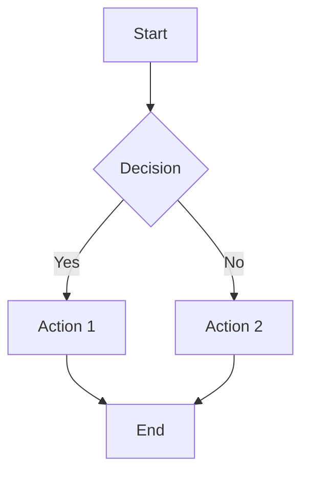

### Node Shapes

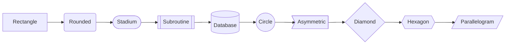

### Direction Options

```
TD - Top to Down
TB - Top to Bottom
BT - Bottom to Top
LR - Left to Right
RL - Right to Left
```

### Arrow Types

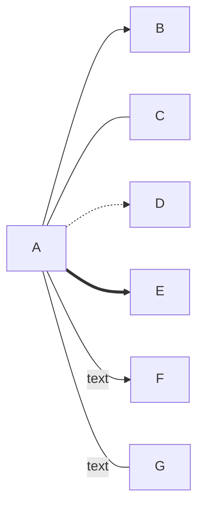

### Subgraphs

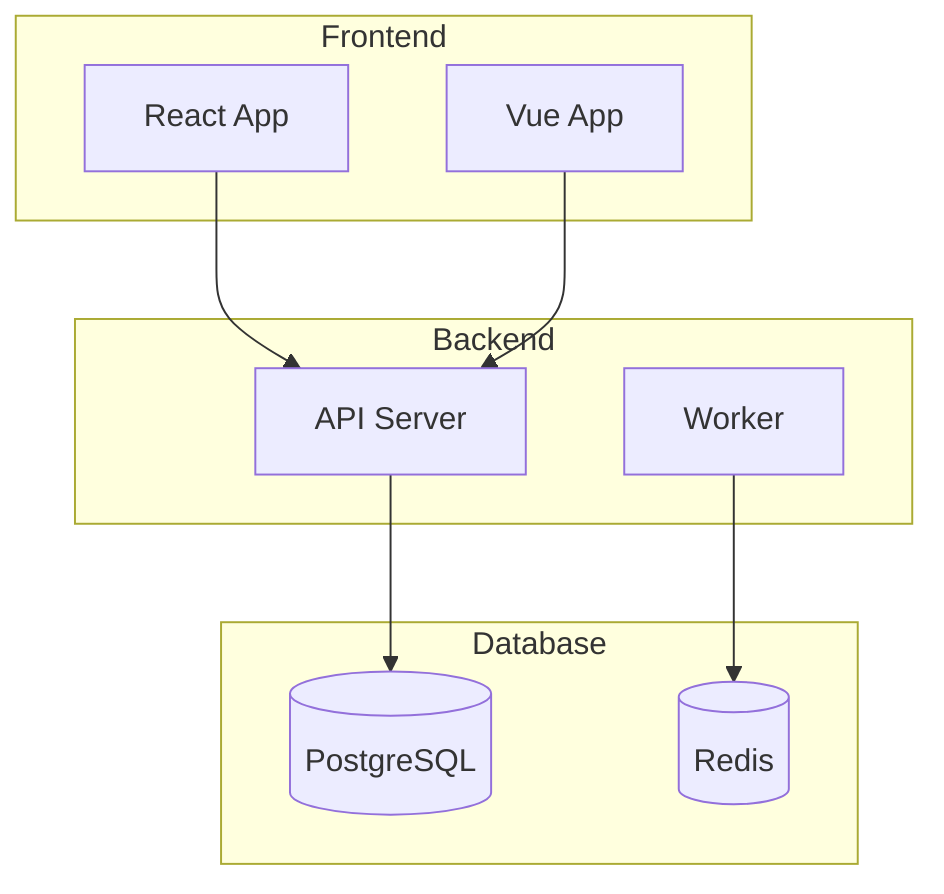

## Sequence Diagrams

### Basic Sequence

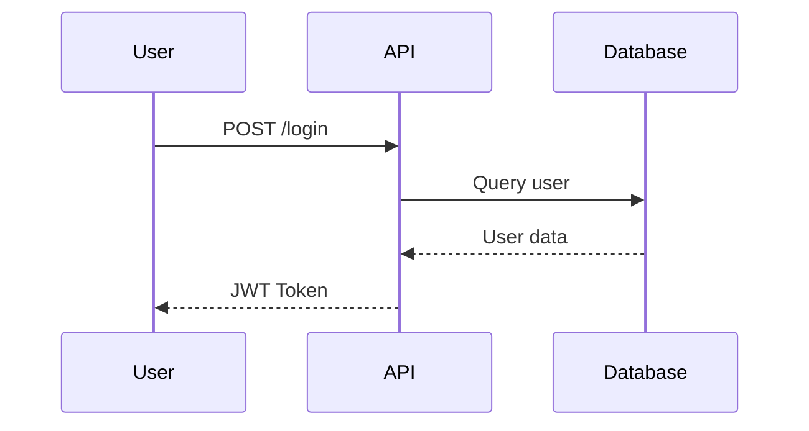

### Arrow Types

```
->>   Solid line with arrowhead
-->>  Dotted line with arrowhead
-)    Solid line with open arrow
--)   Dotted line with open arrow
-x    Solid line with cross
--x   Dotted line with cross
```

### Activations and Notes

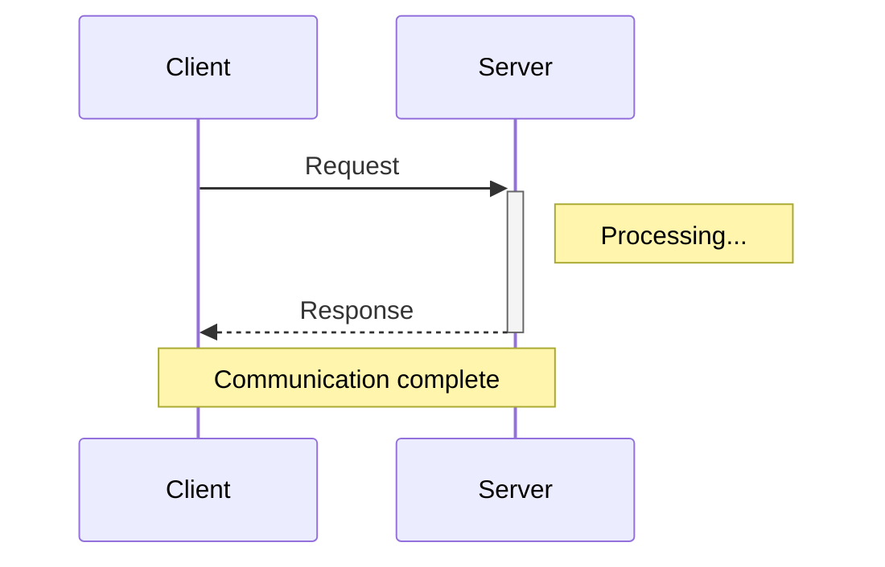

### Loops and Conditionals

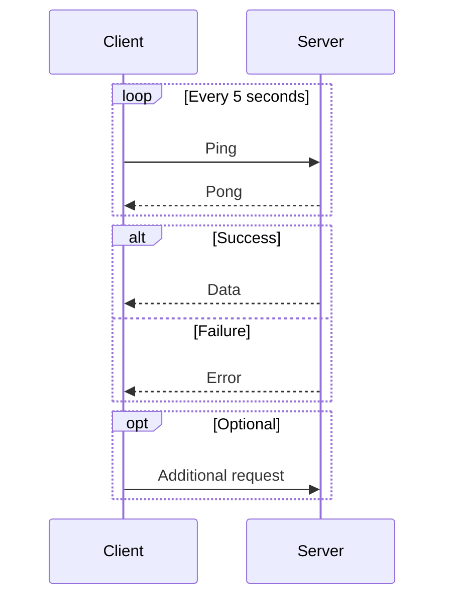

## Class Diagrams

### Basic Class

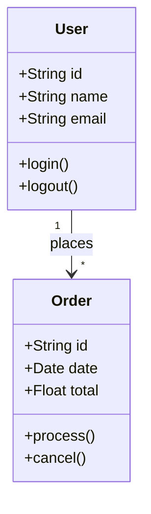

### Relationships

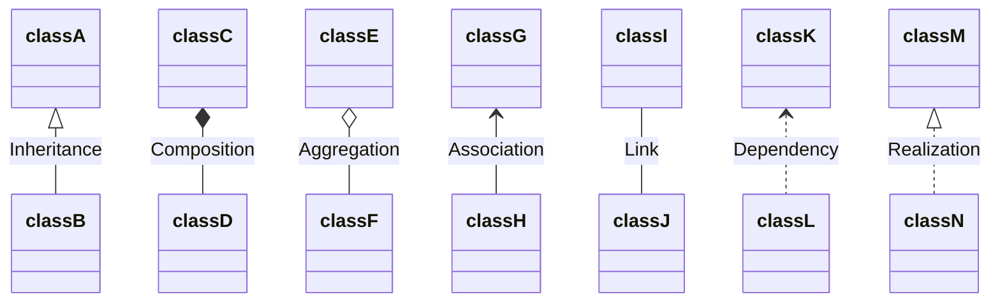

### Visibility

```
+ Public
- Private
# Protected
~ Package/Internal
```

## Entity Relationship Diagrams

### Basic ERD

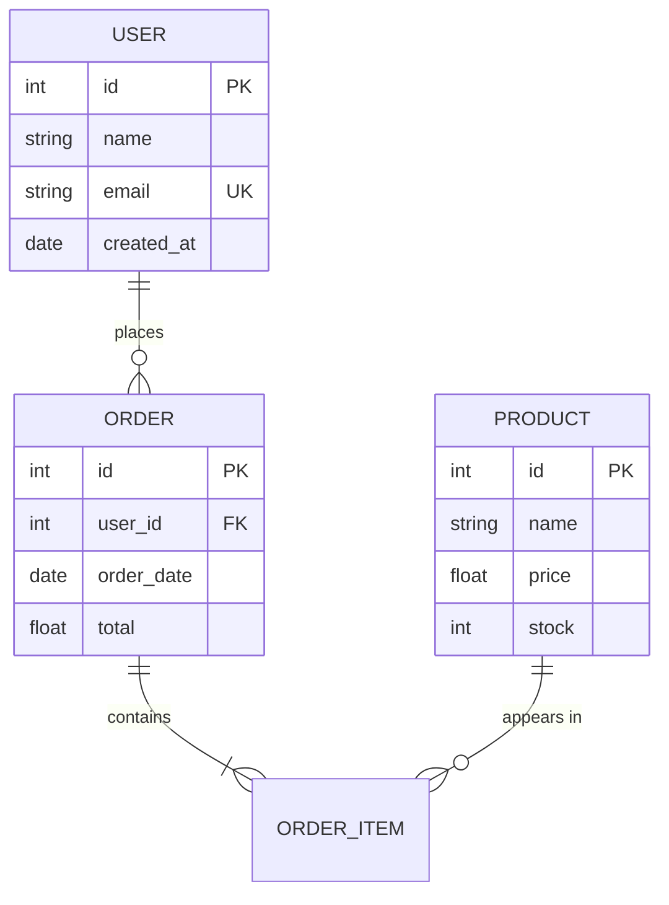

### Relationship Types

```
||--|| : One to One
||--o{ : One to Zero or More
||--|{ : One to One or More
}o--o{ : Zero or More to Zero or More
```

## State Diagrams

### Basic State Machine

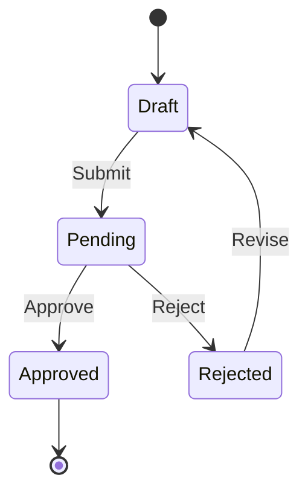

### Composite States

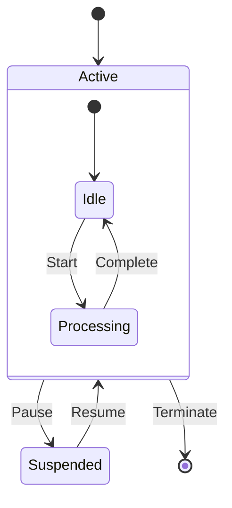

## Gantt Charts

### Project Timeline

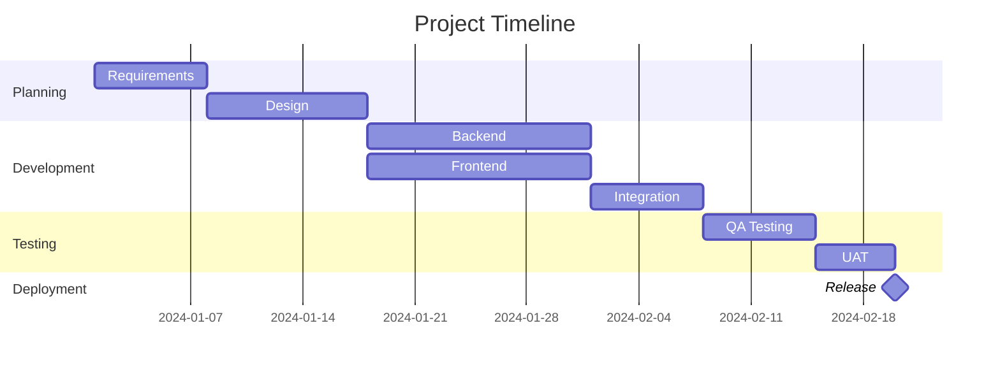

## Pie Charts

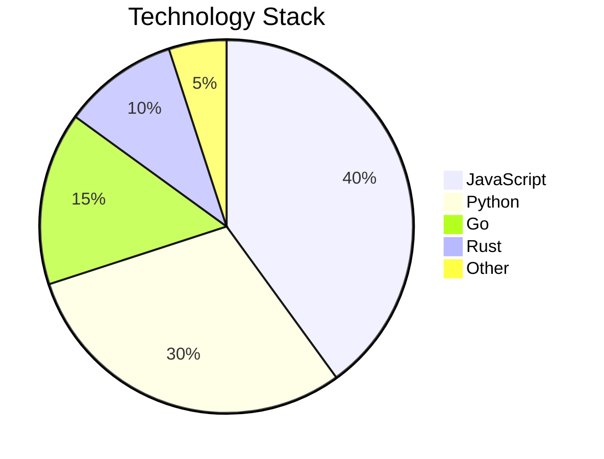

## User Journey

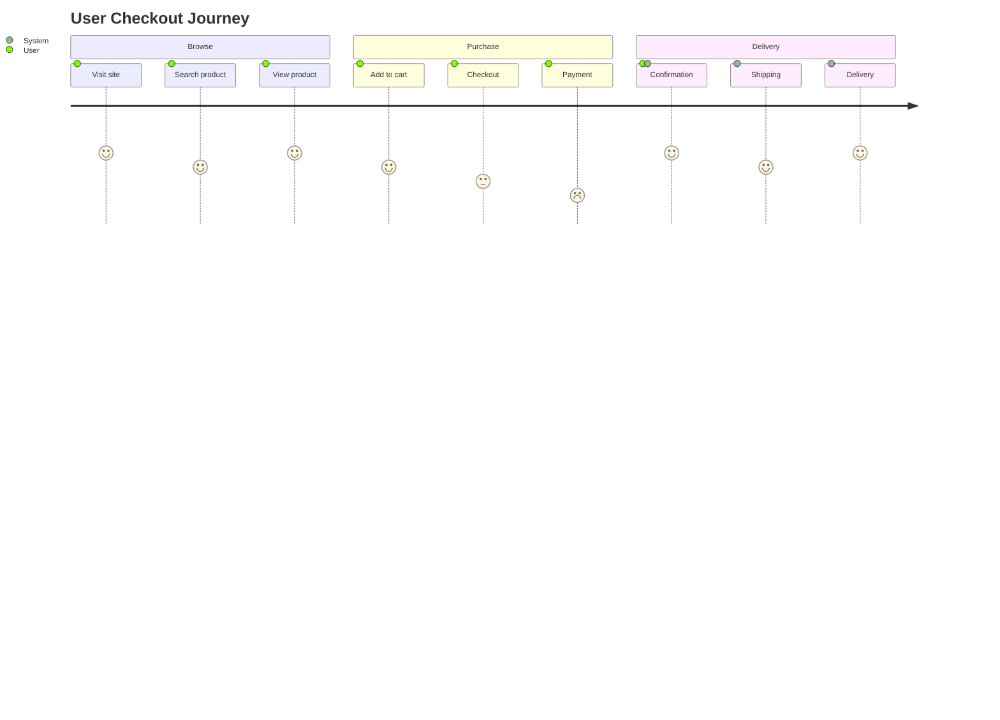

## Git Graphs

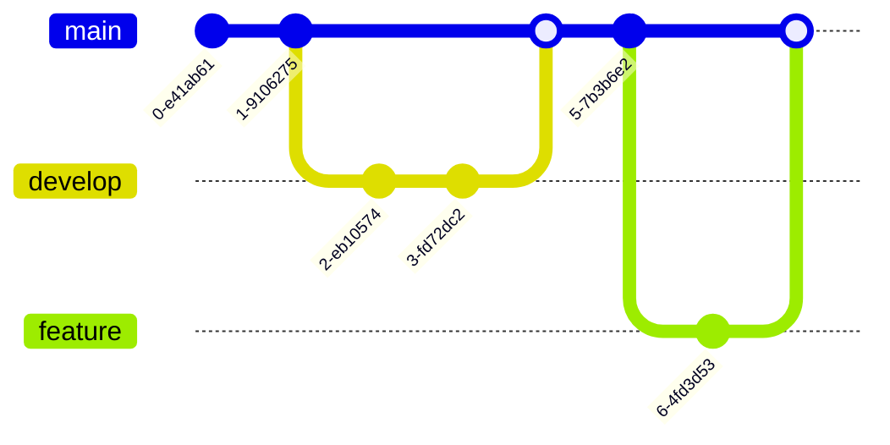

## Mindmaps

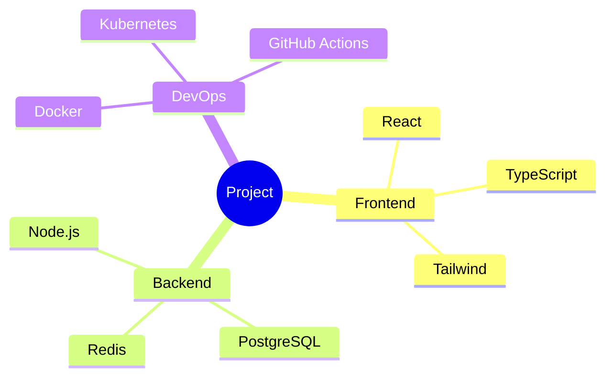

## Styling

### Custom Styles

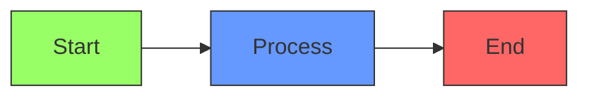

### Theme Configuration

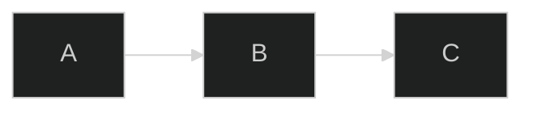

## Markdown Integration

### In Markdown Files

````markdown
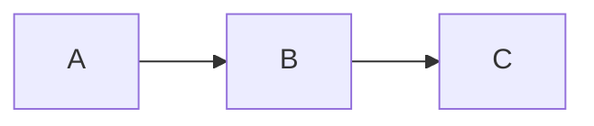
````

### GitHub Support

GitHub natively renders Mermaid in markdown files, issues, and pull requests.

### VS Code Extensions

- Markdown Preview Mermaid Support
- Mermaid Editor

## Best Practices

1. **Use subgraphs** - Group related elements
2. **Direction matters** - Choose LR for processes, TD for hierarchies
3. **Label edges** - Add text to clarify relationships
4. **Keep it simple** - Avoid too many nodes in one diagram
5. **Use consistent styling** - Apply class definitions
6. **Add titles** - Include descriptive titles
7. **Break up complexity** - Multiple diagrams over one complex one
8. **Use proper diagram type** - Match diagram type to data
9. **Test rendering** - Verify in target platform
10. **Document with diagrams** - Embed in README and docs

## When to Use This Skill

- Creating flowcharts for documentation
- Designing sequence diagrams for APIs
- Modeling database schemas with ERDs
- Visualizing class relationships
- Planning project timelines
- Documenting state machines
- Creating architecture diagrams
